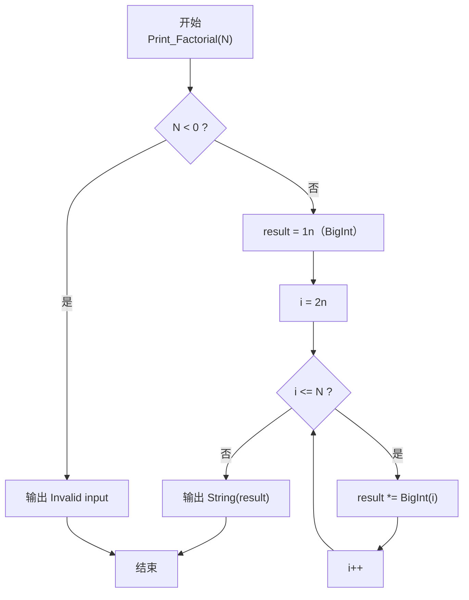
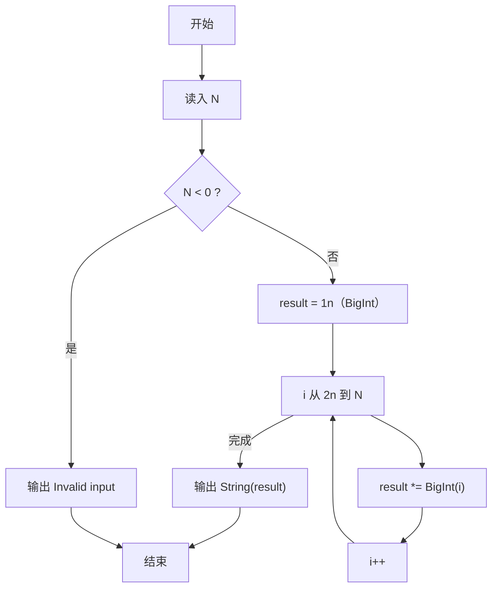

# PTA基础编程题目集 6-10阶乘计算升级版（JavaScript实现）

## 题目描述

本题要求实现一个打印非负整数阶乘的函数。

### 函数接口定义

```js
function Print_Factorial(N) { /* ... */ }
```

其中`N`是用户传入的参数，其值不超过1000。如果`N`是非负整数，则该函数必须在一行中打印出`N`!的值，否则打印“Invalid input”。

### 裁判测试程序样例

```js
const readline = require('readline'); // 引入 readline 模块
const rl = readline.createInterface({
    input: process.stdin,
    output: process.stdout
}); // 创建输入输出接口

function Print_Factorial(N) { /* 你的代码将被嵌在这里 */ }

rl.on('line', (line) => {
    const N = parseInt(line.trim(), 10); // 读取 N
    Print_Factorial(N); // 打印 N! 或 Invalid input
    rl.close(); // 关闭接口
});
```

### 输入样例

```in
15
```

### 输出样例

```out
1307674368000
```

### 函数部分

```text
函数 Print_Factorial(N):
    如果 N < 0：
        输出 Invalid input
        返回
    result ← 1n
    对 i 从 2 到 N：
        result ← result × BigInt(i)
    输出 result 的十进制表示
```

## 解题思路

这道题的核心是**大整数阶乘**：N 可高达 1000，1000! 约 2568 位，远超普通数值类型的精确表示范围。
JS 内置的 BigInt 类型可以精确表示任意大的整数（1000! 约 2568 位，BigInt 完全支持），因此直接使用 BigInt 连乘即可得到精确结果，无需手工模拟竖式乘法。

### 核心问题分析

1. **数据范围**：1000! ≈ 4 × 10²⁵⁶⁷，约 2568 位十进制。JS 的 BigInt 可以精确表示任意大的整数，无需担心溢出。
2. **存储方式**：BigInt 内部自动按任意精度存储，无需像 C 语言那样用数组按位存放结果。
3. **BigInt 连乘**：把当前结果（BigInt）依次乘以 i（从 2 到 N），`result *= i` 即可完成大数乘法。
4. **输出方式**：用 `String(result)` 把 BigInt 转成十进制字符串打印。

### 算法原理说明

1. 初始化：result = 1n（BigInt 类型的 1，字面量以 n 结尾）。
2. 若 N < 0：输出 "Invalid input"。
3. 对 i = 2n 到 N：result *= i（BigInt 乘法自动处理进位与位数扩展）。
4. 完成后，用 String(result) 转成十进制字符串打印，即得到 N! 的精确值。

### 具体计算步骤

1. 校验输入：N<0 → console.log('Invalid input'); 返回。
2. result = 1n（BigInt 类型的 1）。
3. for i = 2n 到 N：result *= i（BigInt 连乘，自动处理进位）。
4. console.log(String(result)) 输出十进制字符串。

## 完整代码

```javascript
// 题目：6-10 阶乘计算升级版
// 题目描述：
//   实现函数 Print_Factorial(N)，打印 N!（N≤1000），N<0 输出 Invalid input。
// 实现原理：
//   大整数阶乘。用 BigInt 精确表示任意大整数，初值 result=1n，
//   循环 i=2..N 执行 result*=BigInt(i)，最后 String(result) 输出。
//   BigInt 内部自动处理进位与位数扩展，无需手工数组模拟。
// 参数说明：
//   N — 非负整数（≤1000）
// 时间复杂度：O(N·M) — N 次大数乘法，M 为位数
// 空间复杂度：O(M) — 存储结果位数

const readline = require('readline'); // 引入 readline 模块
const rl = readline.createInterface({
    input: process.stdin,
    output: process.stdout
}); // 创建输入输出接口

// 函数：Print_Factorial
// 功能：打印 N! 或 Invalid input
// 参数：
//   N — 整数
// 返回值：无（直接打印）
function Print_Factorial(N) {
    if (N < 0) {
        console.log("Invalid input"); // 非法输入
        return;
    }
    let result = 1n; // BigInt 类型的 1
    for (let i = 2; i <= N; i++) {
        result *= BigInt(i); // BigInt 连乘
    }
    console.log(String(result)); // 转十进制字符串输出
}

rl.on('line', (line) => {
    const N = parseInt(line.trim(), 10); // 读取 N
    Print_Factorial(N); // 打印 N! 或 Invalid input
    rl.close(); // 关闭接口
});
```

## 代码流程说明

### 1. 输入校验 & 初始化

- N < 0 → console.log('Invalid input')
- N ≥ 0 → result = 1n（BigInt 类型，字面量以 n 结尾）

### 2. 外层 i = 2n..N：BigInt 连乘

- result *= i（BigInt 乘法自动处理进位与位数扩展，无需手工按位计算）

### 3. 打印结果

- console.log(String(result)) 输出十进制字符串

## 代码流程图



### 复杂度分析

设最终结果有 `M` 位十进制数字：

- 时间复杂度：`O(N × M)` 的大整数运算量；每次乘法的实际成本随结果位数增长。
- 空间复杂度：`O(M)`，需要保存不断增长的阶乘结果。

### 常见易错点

1. 1000! 远超 JavaScript Number 的安全整数范围，必须使用 `BigInt`，不能使用普通数字连乘。
2. `BigInt` 只能与 `BigInt` 运算，循环因子应转换为 `BigInt(i)`。
3. N<0 时应输出 `Invalid input` 并结束函数；N=0 时应输出 1。
4. BigInt 输出时应转换为字符串，不能依赖普通 Number 的格式化方式。

## 解题流程图


