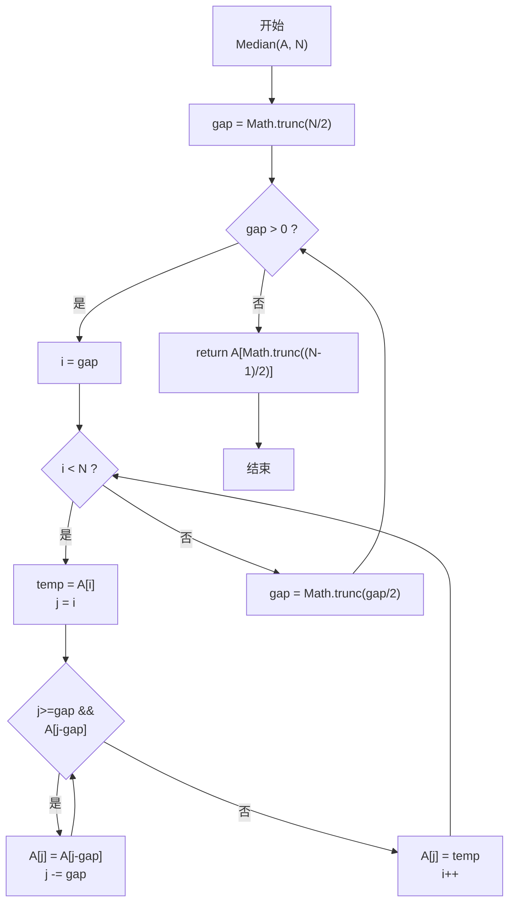
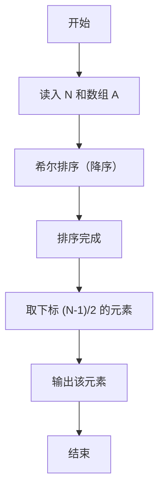

# PTA基础编程题目集 6-11求自定类型元素序列的中位数（JavaScript实现）

## 题目描述

本题要求实现一个函数，求N个集合元素A[]的中位数，即序列中第⌊(N+1)/2⌋大的元素。其中集合元素的类型为自定义的ElementType。

### 函数接口定义

```js
function Median(A, N) { /* ... */ }
```

其中给定集合元素存放在数组A[]中，正整数N是数组元素个数。该函数须返回N个A[]元素的中位数，其值也必须是ElementType类型。

### 裁判测试程序样例

```js
const readline = require('readline'); // 引入 readline 模块
const rl = readline.createInterface({ input: process.stdin, output: process.stdout }); // 创建输入输出接口

function Median(A, N) { /* 你的代码将被嵌在这里 */ }

let N = -1; // 元素个数

rl.on('line', (line) => {
    if (N === -1) {
        N = parseInt(line.trim(), 10);                      // 读取元素个数
    } else {
        const A = line.trim().split(/\s+/).map(Number);     // 读取 N 个元素（浮点数）
        console.log(Median(A, N).toFixed(2));               // 输出中位数，保留两位小数
        rl.close(); // 关闭接口
    }
});
```

### 输入样例

```in
3
12.3 34 -5
```

### 输出样例

```out
12.30
```

## 解题思路

这道题的核心是**求 N 个元素的中位数**。题目定义的中位数是"第 ⌊(N+1)/2⌋ 大的元素"，等价于把数组降序排列后，取下标为 (N-1)/2（整数除法向下取整）的元素。

### 核心问题分析

1. **排序选择**：中位数的最直接求法是"先排序再取中间"。由于 PTA 函数题往往对时间复杂度有要求（N 可能较大），选择 O(N^1.3) 左右的希尔排序比简单插入/冒泡 O(N²) 更稳妥。
2. **降序 or 升序**：题目要求的是"第 k 大"，用降序排序后 A[(N-1)/2] 正好对应第 ⌊(N+1)/2⌋ 大的元素。若用升序则需要计算转换下标。
3. **希尔排序增量**：采用经典的"折半增量序列"gap = Math.trunc(N/2) → gap = Math.trunc(gap/2) → ... → gap=1。gap=1 时退化为普通插入排序，但此时数组已基本有序。

### 算法原理说明

希尔排序（Shell Sort，降序）+ 取中间位：
1. 初始 gap = Math.trunc(N / 2)。
2. 对每个 gap，把数组分成 gap 组（按下标 mod gap 分组），对每组做"降序插入排序"：
   - i 从 gap 到 N-1：temp = A[i] 暂存
   - j = i，当 j ≥ gap 且 A[j-gap] < temp 时：A[j] = A[j-gap]，j -= gap
   - A[j] = temp
3. gap = Math.trunc(gap / 2)，重复直到 gap = 0 退出。
4. 排序结束后 return A[Math.trunc((N-1)/2)]（降序下第 ⌊(N+1)/2⌋ 大）。

### 具体计算步骤

1. gap = Math.trunc(N / 2)
2. while gap > 0：
   - i 从 gap 到 N-1：
     - temp = A[i]
     - j 从 i 开始，while j ≥ gap && A[j-gap] < temp → A[j] = A[j-gap]; j -= gap
     - A[j] = temp
   - gap = Math.trunc(gap / 2)
3. return A[Math.trunc((N-1)/2)]

## 完整代码

```javascript
// 题目：6-11 求自定类型元素序列的中位数
// 题目描述：
//   实现函数 Median(A, N)，返回 N 个元素的第 ⌊(N+1)/2⌋ 大元素（中位数）。
// 实现原理：
//   希尔排序降序 + 取中位。用增量 gap=N/2 起每次折半，对每组做降序插入排序，
//   排完后 A[(N-1)/2] 即为所求中位数。
// 参数说明：
//   A — 元素数组
//   N — 元素个数
// 时间复杂度：约 O(N^1.3) — 希尔排序经验界
// 空间复杂度：O(1) — 原地排序

const readline = require('readline'); // 引入 readline 模块
const rl = readline.createInterface({ input: process.stdin, output: process.stdout }); // 创建输入输出接口

// 函数：Median
// 功能：求中位数
// 参数：
//   A — 数组
//   N — 个数
// 返回值：中位数
function Median(A, N) {
    for (let gap = Math.trunc(N / 2); gap > 0; gap = Math.trunc(gap / 2)) {
        for (let i = gap; i < N; i++) {
            const temp = A[i]; // 暂存当前元素
            let j = i;
            while (j >= gap && A[j - gap] < temp) {
                A[j] = A[j - gap]; // 后移
                j -= gap;
            }
            A[j] = temp; // 放入正确位置
        }
    }
    return A[Math.trunc((N - 1) / 2)]; // 降序下中位数
}

let N = -1; // 元素个数

rl.on('line', (line) => {
    if (N === -1) {
        N = parseInt(line.trim(), 10);                      // 读取元素个数
    } else {
        const A = line.trim().split(/\s+/).map(Number);     // 读取 N 个元素（浮点数）
        console.log(Median(A, N).toFixed(2));               // 输出中位数，保留两位小数
        rl.close(); // 关闭接口
    }
});
```


## 代码流程说明

### 1. 主函数：读数据
- 用 readline 读入 N，再读入 N 个浮点数存入数组 A（Number 解析）
- 调用 Median 后保留两位小数输出（toFixed(2)）

### 2. Median 函数：希尔排序（降序）
- gap = Math.trunc(N/2)；当 gap > 0 时：
  - 外层 i = gap..N-1：每个待插入元素
    - temp = A[i]
    - j 从 i 向前走 gap 步：若 A[j-gap] < temp（更小，降序不合法）则后移，直到 j<gap 或找到更大/相等元素
    - A[j] = temp
  - gap = Math.trunc(gap/2)

### 3. 取中位数
- return A[Math.trunc((N-1)/2)]

## 代码流程图



## 解题流程图


