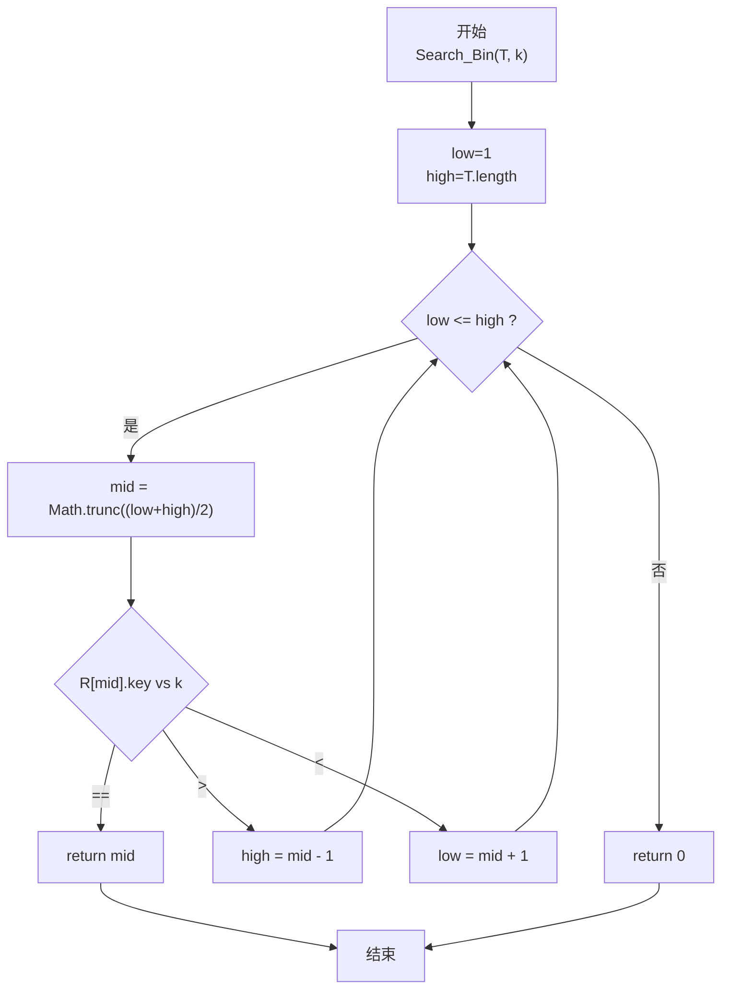
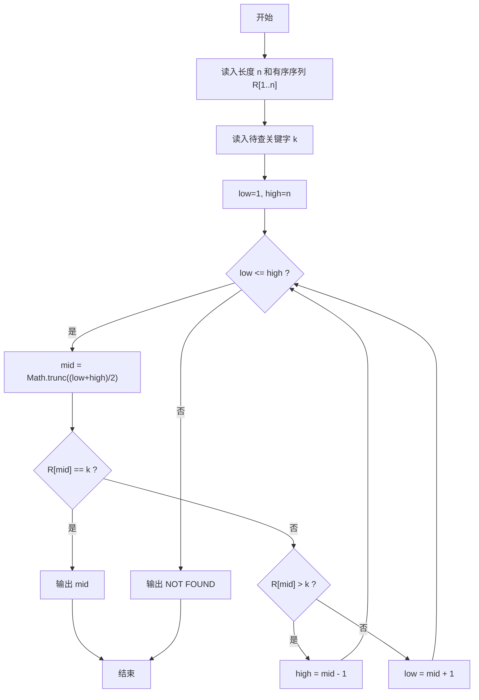

# PTA基础编程题目集 6-13折半查找（JavaScript实现）

## 题目描述

给一个严格递增数列，函数int Search_Bin(SSTable T, KeyType k)用来二分地查找k在数列中的位置。

### 函数接口定义

```js
function Search_Bin(T, k) { /* ... */ }
```

其中T是有序表，k是查找的值。

### 裁判测试程序样例

```js
const readline = require('readline'); // 引入 readline 模块
const rl = readline.createInterface({ input: process.stdin, output: process.stdout }); // 创建输入输出接口

/* 顺序表：用 JS 对象模拟 { R, length }，R[1..length] 存放元素（1 起下标，R[0] 不用） */
function Search_Bin(T, k) { /* 请在这里填写答案 */ }

let lines = []; // 暂存输入行

rl.on('line', (line) => {
    lines.push(line.trim());
    if (lines.length >= 3) {           /* 共三行输入：长度、序列、待查值 */
        const T = { R: [], length: parseInt(lines[0], 10) }; // 建表
        const values = lines[1].split(/\s+/).map(Number);   // 读入表内元素
        T.R[0] = null;                                       // 下标 0 不用
        for (let i = 1; i <= T.length; i++)
            T.R[i] = { key: values[i - 1] };                 // 元素从 1 起存放
        const k = parseInt(lines[2], 10);                    // 待查关键字
        const pos = Search_Bin(T, k);
        if (pos === 0) console.log('NOT FOUND');             // 未找到
        else console.log(pos);                               // 输出位置
        rl.close(); // 关闭接口
    }
});
```

### 输入格式

第一行输入一个整数n，表示有序表的元素个数，接下来一行n个数字，依次为表内元素值。 然后输入一个要查找的值。

### 输出格式

输出这个值在表内的位置，如果没有找到，输出"NOT FOUND"。

### 输入样例

```in
5
1 3 5 7 9
7
```

### 输出样例

```out
4
```

### 输入样例2

```in
5
1 3 5 7 9
10
```

### 输出样例2

```out
NOT FOUND
```

## 解题思路

这道题的核心是**有序顺序表上的二分查找（折半查找）**。前提是表已按关键字升序排列（严格递增），每次取中点比较，可把搜索区间减半。

### 核心问题分析

1. **下标约定**：题目样例中存储从下标 1 开始（Create 函数 for i=1..length，输入 1 3 5 7 9 查找 7 得到位置 4，即 1 起下标），因此 low 应初始为 1，high 为 T.length。
2. **中点计算**：mid = Math.trunc((low + high) / 2)（向下取整）。也可以写成 low + Math.trunc((high - low) / 2) 防止溢出，此处题目数据量小，前者足够。
3. **三种分支**：
   - R[mid].key == k → 命中，return mid
   - R[mid].key >  k → 目标在左半区，high = mid - 1
   - R[mid].key <  k → 目标在右半区，low = mid + 1
4. **终止条件**：当 low > high 说明区间为空，未找到，return 0（主程序按 0 判 NOT FOUND）。

### 算法原理说明

循环迭代式二分查找：
- 初始化 low = 1, high = T.length
- while (low <= high)：
  - mid = Math.trunc((low + high) / 2)
  - 根据 T.R[mid].key 与 k 的大小关系走上面三个分支
- 循环结束 return 0

### 具体计算步骤

1. low = 1, high = T.length
2. while low <= high：
   - mid = Math.trunc((low + high) / 2)
   - if T.R[mid].key === k → return mid
   - else if T.R[mid].key > k → high = mid - 1
   - else → low = mid + 1
3. return 0

## 完整代码

```javascript
// 题目：6-13 折半查找
// 题目描述：
//   在严格递增的顺序表 T 上二分查找 k，找到返回 1 起下标，否则返回 0。
// 实现原理：
//   二分查找。low=1、high=T.length，循环取 mid=Math.trunc((low+high)/2)，
//   比较 T.R[mid].key 与 k：相等返回 mid，偏大则 high=mid-1，偏小则 low=mid+1，
//   区间空仍未找到返回 0。
// 参数说明：
//   T — 顺序表对象 { R, length }，R[1..length] 存放元素
//   k — 待查关键字
// 时间复杂度：O(log N) — 每次区间减半
// 空间复杂度：O(1) — 仅使用常数个辅助变量

const readline = require('readline'); // 引入 readline 模块
const rl = readline.createInterface({ input: process.stdin, output: process.stdout }); // 创建输入输出接口

// 函数：Search_Bin
// 功能：在有序顺序表上二分查找
// 参数：
//   T — 顺序表
//   k — 查找值
// 返回值：1 起下标或 0（NOT FOUND）
function Search_Bin(T, k) {
    let low = 1, high = T.length; // 1 起下标闭区间
    while (low <= high) {
        const mid = Math.trunc((low + high) / 2); // 取中点
        if (T.R[mid].key === k) return mid; // 命中
        else if (T.R[mid].key > k) high = mid - 1; // 左半区
        else low = mid + 1; // 右半区
    }
    return 0; // 未找到
}

let lines = []; // 暂存输入行

rl.on('line', (line) => {
    lines.push(line.trim());
    if (lines.length >= 3) {           // 共三行输入：长度、序列、待查值
        const T = { R: [], length: parseInt(lines[0], 10) }; // 建表
        const values = lines[1].split(/\s+/).map(Number);   // 读入表内元素
        T.R[0] = null;                                       // 下标 0 不用
        for (let i = 1; i <= T.length; i++)
            T.R[i] = { key: values[i - 1] };                 // 元素从 1 起存放
        const k = parseInt(lines[2], 10);                    // 待查关键字
        const pos = Search_Bin(T, k);
        if (pos === 0) console.log('NOT FOUND');             // 未找到
        else console.log(pos);                               // 输出位置
        rl.close(); // 关闭接口
    }
});
```


## 代码流程说明

### 1. 主函数 & 建表
- 建表：用 readline 读 length → 依次读入 R[1..length].key（用对象模拟顺序表，1 起下标）
- 再读 k，调用 Search_Bin(T, k)
- pos === 0 → 打印 NOT FOUND；否则打印 pos

### 2. Search_Bin 初始化
- low = 1，high = T.length（1 起下标闭区间）

### 3. while (low <= high) 主循环
- mid = Math.trunc((low + high) / 2)：取中点（向下取整）
- 三路分支：
  - 命中 → return mid
  - 中点值太大 → high = mid - 1
  - 中点值太小 → low = mid + 1

### 4. 循环退出
- low > high 表示区间已空 → return 0

## 代码流程图



## 解题流程图


