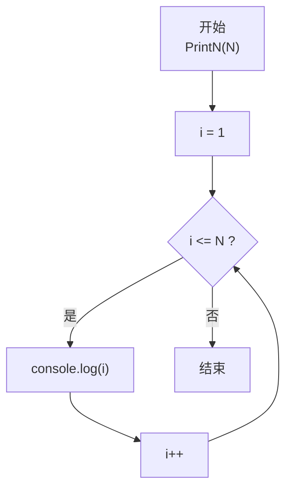
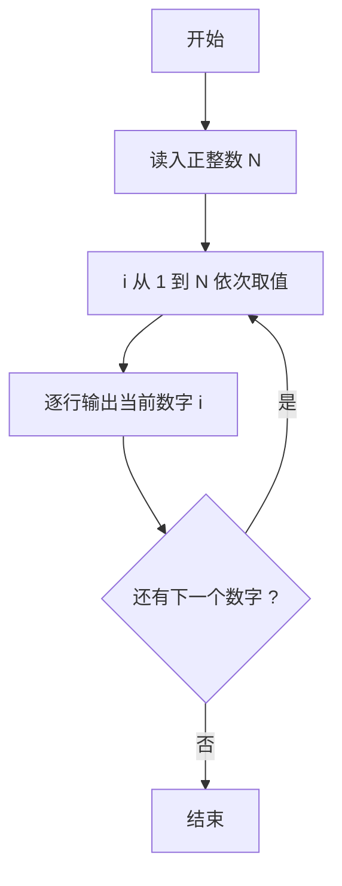

# PTA基础编程题目集 6-1简单输出整数（JavaScript实现）

## 题目描述

本题要求实现一个函数，对给定的正整数`N`，打印从1到`N`的全部正整数。

### 函数接口定义

```js
function PrintN(N) { /* 打印 1 到 N */ }
```

其中`N`是用户传入的参数。该函数必须将从1到`N`的全部正整数顺序打印出来，每个数字占1行。

### 裁判测试程序样例

```js
const readline = require('readline'); // 引入 readline 模块
const rl = readline.createInterface({
    input: process.stdin,
    output: process.stdout
}); // 创建输入输出接口

rl.on('line', (line) => { // 监听一行输入
    const N = parseInt(line.trim(), 10); // 读取正整数 N
    PrintN(N); // 调用函数打印 1 到 N
    rl.close(); // 关闭接口
});

/* 你的代码将被嵌在这里 */
```

### 输入样例

```in
3
```

### 输出样例

```out
1
2
3
```

### 函数部分

```text
函数 PrintN(N):
    对 i 从 1 到 N：
        输出 i
```

## 解题思路

这道题的核心是**顺序输出整数序列**：函数收到参数 N 后，把 1 到 N 的每个整数按行打印出来，不需要返回值。

### 核心问题分析

1. **输出范围**：从 1 到 N 共 N 个正整数，逐行输出。
2. **输出格式**：每个数字占 1 行，即每次打印后换行。

### 算法原理说明

使用 for 循环让循环变量 i 从 1 递增到 N，循环体内调用 `console.log(i)` 输出当前数字并换行。循环结束即完成全部输出。

### 具体计算步骤

1. 循环变量初始化：i = 1。
2. 判断 i <= N 是否成立：成立则进入循环体，不成立则函数结束。
3. 循环体：`console.log(i)` 输出 i 并换行。
4. 执行 i++ 自增，回到第 2 步继续判断。

## 完整代码

```javascript
// 题目：6-1 简单输出整数
// 题目描述：
//   实现函数 PrintN(N)，打印从 1 到 N 的全部正整数，每个数字占 1 行。
// 实现原理：
//   线性遍历。用 for 循环让 i 从 1 递增到 N，每次 console.log(i) 输出当前数字并换行。
// 参数说明：
//   N — 要打印的上界（正整数）
// 时间复杂度：O(N) — 需输出 N 行
// 空间复杂度：O(1) — 仅使用循环变量

const readline = require('readline'); // 引入 readline 模块
const rl = readline.createInterface({
    input: process.stdin,
    output: process.stdout
}); // 创建输入输出接口

// 函数：PrintN
// 功能：顺序打印 1 到 N 的每个整数，各占一行
// 参数：
//   N — 上界（正整数）
// 返回值：无（直接打印）
function PrintN(N) {
    for (let i = 1; i <= N; i++) {
        console.log(i); // 输出当前数字并换行
    }
}

rl.on('line', (line) => { // 监听一行输入
    const N = parseInt(line.trim(), 10); // 读取正整数 N
    PrintN(N); // 调用函数打印 1 到 N
    rl.close(); // 关闭接口
});
```

## 代码流程说明

### 1. 主程序

- 用 readline 读取正整数 N，调用 PrintN(N) 输出 1 到 N。

### 2. PrintN 函数

- for 循环：初始化 i = 1；判断 i <= N；循环体 console.log(i) 输出 i 并换行；i++。
- 循环结束后函数返回，完成输出。

## 代码流程图



### 复杂度分析

- 时间复杂度：`O(N)`，需要输出从 1 到 N 的 N 个整数。
- 空间复杂度：`O(1)`，只使用循环变量 `i`。

### 常见易错点

1. 循环应从 1 开始，并且包含 N，即判断条件使用 `i <= N`。
2. 每个整数都要单独占一行，不能只输出空格分隔的一行。
3. 题目要求实现的是打印函数，不需要在函数中重复读取输入或编写主程序。

## 解题流程图


