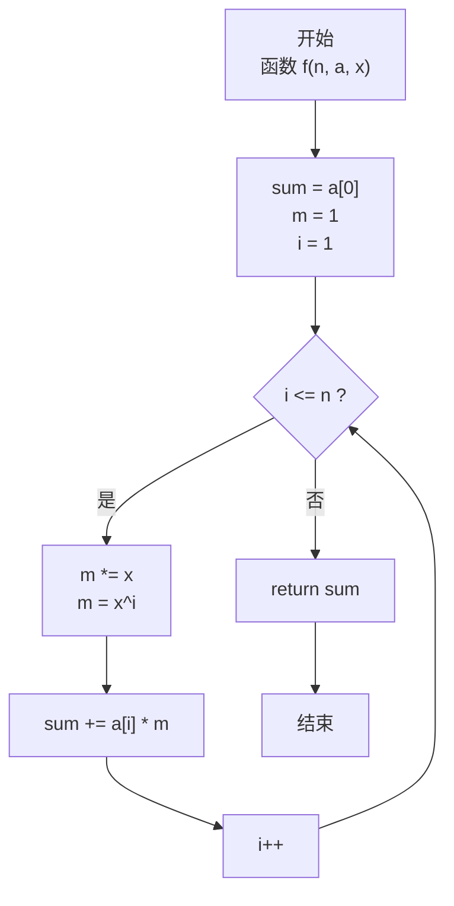
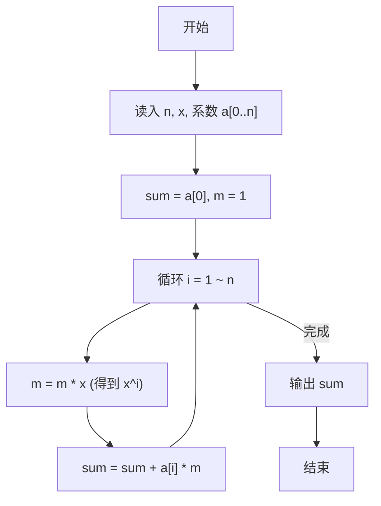

# PTA基础编程题目集 6-2多项式求值（JavaScript实现）

## 题目描述

本题要求实现一个函数，计算阶数为`n`、系数为`a[0]` ... `a[n]`的多项式 `f(x) = ∑(i=0..n) a[i] × x^i` 在`x`点的值。

### 函数接口定义

```js
function f(n, a, x) { /* 计算多项式 f(x) 的值 */ }
```

其中`n`是多项式的阶数，`a[]`中存储系数，`x`是给定点。函数须返回多项式`f(x)`的值。

### 裁判测试程序样例

```js
const readline = require('readline'); // 引入 readline 模块
const rl = readline.createInterface({
    input: process.stdin,
    output: process.stdout
}); // 创建输入输出接口

let lines = []; // 保存所有输入行
rl.on('line', (line) => { // 监听每一行输入
    lines.push(line.trim()); // 记录当前行
    if (lines.length === 2) { // 读入 n、x 与系数两行后开始处理
        const [n, x] = lines[0].split(/\s+/).map(Number); // 解析 n 和 x
        const a = lines[1].split(/\s+/).map(Number); // 解析系数数组 a[0..n]
        console.log(f(n, a, x).toFixed(1)); // 输出结果，保留 1 位小数
        rl.close(); // 关闭接口
    }
});

/* 你的代码将被嵌在这里 */
```

### 输入样例

```in
2 1.1
1 2.5 -38.7
```

### 输出样例

```out
-43.1
```

### 函数部分

```text
函数 f(n, a, x):
    sum ← a[0]
    power ← 1
    对 i 从 1 到 n：
        power ← power × x
        sum ← sum + a[i] × power
    返回 sum
```

## 解题思路

这道题的核心是**多项式求值算法**。给定 n 阶多项式 f(x) = a₀ + a₁x + a₂x² + ... + aₙxⁿ，在给定点 x 处计算函数值。

### 核心问题分析

多项式中每一项都是 a[i] × x^i，需要把所有项加起来。
关键在于如何高效计算 x 的各次幂而不重复计算：若每轮都单独算 Math.pow(x, i) 会造成 O(n²) 的冗余乘法，
而用一个变量 m 保存上一次的 x^(i-1)，本轮只需要 m *= x 即可得到 x^i，这样整体是 O(n) 的时间。

### 算法原理说明

采用逐项累加法（增量维护 x 的幂次）：

- 初始化 sum = a[0]（常数项，x⁰=1）
- 引入变量 m 保存 x 的当前幂次，初始 m=1（对应 x⁰）
- 循环 i 从 1 到 n：
  1. m *= x → 得到 x^i
  2. sum += a[i] * m → 累加当前项
- 最终返回 sum

### 具体计算步骤

1. 初始化 `sum = a[0]`，`m = 1`（x⁰）
2. 循环 `i = 1` 到 `n`：
   - `m *= x`（得到 x^i）
   - `sum += a[i] * m`
3. 循环结束，返回 `sum`

## 完整代码

```javascript
// 题目：6-2 多项式求值
// 题目描述：
//   实现函数 f(n, a, x)，计算 n 阶多项式 f(x)=∑a[i]*x^i 在 x 点的值。
// 实现原理：
//   逐项累加并增量维护幂次。用 sum 存累加结果，m 存当前 x^i，
//   初始化 sum=a[0]、m=1，循环 i=1..n：m*=x 得到 x^i，sum+=a[i]*m。
// 参数说明：
//   n — 多项式阶数
//   a — 系数数组 a[0..n]
//   x — 求值点
// 时间复杂度：O(n) — 需遍历 n 个系数
// 空间复杂度：O(1) — 仅使用常数个辅助变量

const readline = require('readline'); // 引入 readline 模块
const rl = readline.createInterface({
    input: process.stdin,
    output: process.stdout
}); // 创建输入输出接口

// 函数：f
// 功能：计算多项式在 x 点的值
// 参数：
//   n — 阶数
//   a — 系数数组
//   x — 求值点
// 返回值：多项式的值
function f(n, a, x) {
    let sum = a[0]; // 常数项，x^0 = 1
    let m = 1;      // 当前幂次 x^i，初值 x^0 = 1
    for (let i = 1; i <= n; i++) {
        m *= x;           // m 从 x^(i-1) 变为 x^i
        sum += a[i] * m;  // 累加 a[i]*x^i
    }
    return sum;
}

let lines = []; // 保存所有输入行
rl.on('line', (line) => { // 监听每一行输入
    lines.push(line.trim()); // 记录当前行
    if (lines.length === 2) { // 读入 n、x 与系数两行后开始处理
        const [n, x] = lines[0].split(/\s+/).map(Number); // 解析 n 和 x
        const a = lines[1].split(/\s+/).map(Number); // 解析系数数组 a[0..n]
        console.log(f(n, a, x).toFixed(1)); // 输出结果，保留 1 位小数
        rl.close(); // 关闭接口
    }
});
```

## 代码流程说明

### 1. 变量初始化（函数 f 内）

- `sum = a[0]`：直接把常数项（x⁰系数）作为累加初值
- `m = 1`：保存当前 x 的幂次，初值对应 x⁰
- `i`：循环控制变量

### 2. 逐项累加循环（i = 1 ~ n）

- 每轮先 `m *= x`：m 从 x^(i-1) → x^i
- 再 `sum += a[i] * m`：把 a[i]·x^i 累加到总和

### 3. 返回结果

- 循环结束后 sum 就是完整的 f(x)，return sum

## 代码流程图



### 复杂度分析

- 时间复杂度：`O(n)`，系数和幂次都只需线性遍历一次。
- 空间复杂度：`O(1)`，仅维护累加值和当前幂次；输入系数数组不计入辅助空间。

### 常见易错点

1. `a[0]` 是常数项，初始化时应使用 `x⁰ = 1`。
2. 每轮应先更新幂次，再累加 `a[i] × x^i`，避免幂次错位。
3. 系数数组下标范围是 `0` 到 `n`，共有 `n+1` 个系数。
4. 输出由裁判程序统一保留 1 位小数，函数只需返回数值结果。

## 解题流程图


