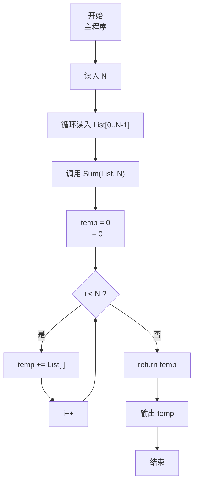
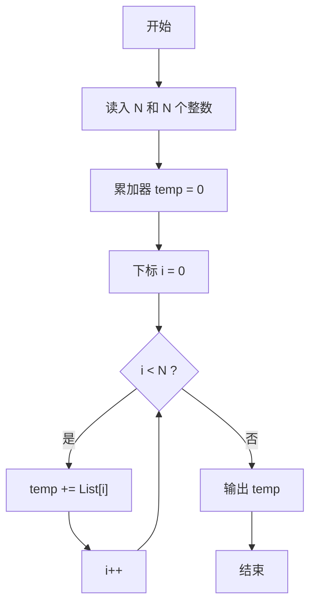

# PTA基础编程题目集 6-3简单求和（JavaScript实现）

## 题目描述

本题要求实现一个函数，求给定的`N`个整数的和。

### 函数接口定义

```js
function Sum(List, N) { /* 求 N 个整数的和 */ }
```

其中给定整数存放在数组`List[]`中，正整数`N`是数组元素个数。该函数须返回`N`个`List[]`元素的和。

### 裁判测试程序样例

```js
const readline = require('readline'); // 引入 readline 模块
const rl = readline.createInterface({ input: process.stdin, output: process.stdout }); // 创建输入输出接口

let lines = []; // 保存所有输入行
rl.on('line', (line) => { // 监听每一行输入
    lines.push(line.trim()); // 记录当前行
    if (lines.length === 2) { // 读入 N 与整数两行后开始处理
        const N = parseInt(lines[0], 10); // 读取数组长度 N
        const List = lines[1].split(' ').map(Number); // 读取 N 个整数
        console.log(Sum(List, N)); // 调用 Sum 函数求和并输出
        rl.close(); // 关闭接口
    }
});

/* 你的代码将被嵌在这里 */
```

### 输入样例

```in
3
12 34 -5
```

### 输出样例

```out
41
```

## 解题思路

这道题的核心是**数组线性累加求和**。给定 N 个整数组成的数组，求其所有元素之和。

### 核心问题分析

这是最经典的遍历+累加问题。由于没有任何结构性质可以利用（如前缀和预处理），只能逐个元素读取并加入累加器。必须访问所有 N 个元素各一次，因此时间复杂度下限即为 Ω(N)。

### 算法原理说明

设置累加器 temp 初始为 0，用 for 循环按数组下标从 0 到 N-1 依次访问每个元素 List[i]，执行 temp += List[i]。整个过程只需要常数级别的辅助空间（仅 temp 和循环变量 i）。

### 具体计算步骤

1. 声明累加器 `temp = 0`，循环变量 `i`
2. 循环 `i = 0` 到 `N-1`：`temp = temp + List[i]`（或 `temp += List[i]`）
3. 循环结束后 return `temp`

## 完整代码

```javascript
// 题目：6-3 简单求和
// 题目描述：
//   实现函数 Sum(List, N)，返回 N 个整数的累加和。
// 实现原理：
//   线性累加。用 temp 作为累加器，for 循环遍历数组，
//   每次把当前元素累加到 temp 上，最后返回 temp。
// 参数说明：
//   List — 待求和的整数数组
//   N    — 数组中元素的个数
// 时间复杂度：O(N) — 需遍历 N 个元素各一次
// 空间复杂度：O(1) — 只使用了常数个辅助变量

const readline = require('readline'); // 引入 readline 模块
const rl = readline.createInterface({ input: process.stdin, output: process.stdout }); // 创建输入输出接口

// 函数：Sum
// 功能：遍历数组，求所有元素之和
// 参数：
//   List — 整数数组（输入）
//   N    — 数组元素个数
// 返回值：所有元素的总和
function Sum(List, N) {
    let temp = 0; // 累加器，初始化为 0
    for (let i = 0; i < N; i++) {
        temp += List[i]; // 逐个累加
    }
    return temp; // 返回累加结果
}

let lines = []; // 保存所有输入行
rl.on('line', (line) => { // 监听每一行输入
    lines.push(line.trim()); // 记录当前行
    if (lines.length === 2) { // 读入 N 与整数两行后开始处理
        const N = parseInt(lines[0], 10); // 读取数组长度 N
        const List = lines[1].split(' ').map(Number); // 读取 N 个整数
        console.log(Sum(List, N)); // 调用 Sum 函数求和并输出
        rl.close(); // 关闭接口
    }
});
```


## 代码流程说明

### 1. 主程序：输入准备
- 用 readline 读取数组长度 N
- 依次读入 N 个整数存入数组 List

### 2. 调用 Sum 函数
- console.log 输出返回值

### 3. Sum 函数内部
- `let temp = 0`：初始化累加器为 0
- for 循环 i 从 0 到 N-1：
  - `temp += List[i]`：把当前元素加入累加器
- 循环结束返回 temp

## 代码流程图



## 解题流程图


