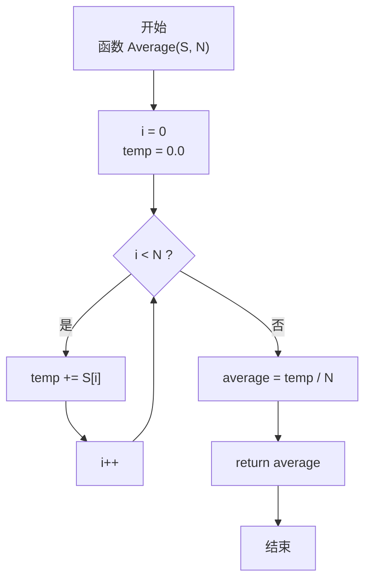
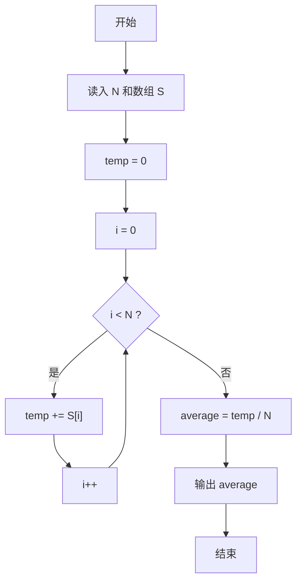

# PTA基础编程题目集 6-4求自定类型元素的平均（JavaScript实现）

## 题目描述

本题要求实现一个函数，求`N`个集合元素`S[]`的平均值，其中集合元素的类型为自定义的`ElementType`。

### 函数接口定义

```js
function Average(S, N) { /* 求 N 个元素的平均值 */ }
```

其中给定集合元素存放在数组`S[]`中，正整数`N`是数组元素个数。该函数须返回`N`个`S[]`元素的平均值，其值也必须是`ElementType`类型。

### 裁判测试程序样例

```js
const readline = require('readline'); // 引入 readline 模块
const rl = readline.createInterface({ input: process.stdin, output: process.stdout }); // 创建输入输出接口

let lines = []; // 保存所有输入行
rl.on('line', (line) => { // 监听每一行输入
    lines.push(line.trim()); // 记录当前行
    if (lines.length === 2) { // 读入 N 与元素两行后开始处理
        const N = parseInt(lines[0], 10); // 读取数组长度 N
        const S = lines[1].split(' ').map(Number); // 读取 N 个元素
        console.log(Average(S, N).toFixed(2)); // 输出平均值，保留 2 位小数
        rl.close(); // 关闭接口
    }
});

/* 你的代码将被嵌在这里 */
```

### 输入样例

```in
3
12.3 34 -5
```

### 输出样例

```out
13.77
```

## 解题思路

这道题的核心是**求数组元素的算术平均值**，即总和除以元素个数。

### 核心问题分析

平均值 = (S[0] + S[1] + ... + S[N-1]) / N。实现时有两个关键细节：
1. **求和精度**：在 C 中若用 float 累加，N 较大时容易累积误差，因此通常用更高精度的 double 做累加器；在 JavaScript 中所有数字统一为 IEEE 754 双精度浮点（Number），累加时天然保持 double 精度。
2. **除法类型**：必须是浮点除法而非整数除法——JS 中 `temp / N` 总是浮点除法，不会像 C 那样发生整数截断。

### 算法原理说明

线性累加 + 最后除 N：
- 声明累加器 temp = 0
- 遍历数组逐个 temp += S[i]（JS 数字统一为 Number 类型，无需类型提升）
- average = temp / N
- 返回 average

### 具体计算步骤

1. 循环变量 i = 0，累加器 temp = 0
2. 循环 i 从 0 到 N-1：temp += S[i]
3. 计算 average = temp / N（浮点除法）
4. 返回 average

## 完整代码

```javascript
// 题目：6-4 求自定类型元素的平均
// 题目描述：
//   实现函数 Average(S, N)，返回 N 个集合元素 S[] 的平均值。
// 实现原理：
//   线性累加求和再除以 N。用 temp 累加所有元素，average = temp / N 得均值。
//   JS 中 Number 为双精度浮点，除法天然为浮点除法，无需类型转换。
// 参数说明：
//   S — 元素数组（Number）
//   N — 元素个数
// 时间复杂度：O(N) — 遍历 N 个元素
// 空间复杂度：O(1) — 仅使用常数个辅助变量

const readline = require('readline'); // 引入 readline 模块
const rl = readline.createInterface({ input: process.stdin, output: process.stdout }); // 创建输入输出接口

// 函数：Average
// 功能：求 N 个元素的平均值
// 参数：
//   S — 元素数组
//   N — 元素个数
// 返回值：平均值（Number）
function Average(S, N) {
    let temp = 0; // 累加器
    for (let i = 0; i < N; i++) {
        temp += S[i]; // 逐个累加
    }
    const average = temp / N; // 浮点除法求平均
    return average;
}

let lines = []; // 保存所有输入行
rl.on('line', (line) => { // 监听每一行输入
    lines.push(line.trim()); // 记录当前行
    if (lines.length === 2) { // 读入 N 与元素两行后开始处理
        const N = parseInt(lines[0], 10); // 读取数组长度 N
        const S = lines[1].split(' ').map(Number); // 读取 N 个元素
        console.log(Average(S, N).toFixed(2)); // 输出平均值，保留 2 位小数
        rl.close(); // 关闭接口
    }
});
```


## 代码流程说明

### 1. 主程序：读取数据
- 用 readline 读入 N
- 循环读入 N 个元素存入数组 S
- console.log 配合 toFixed(2) 保留两位小数输出

### 2. Average 函数：求和阶段
- `let temp = 0`：累加器初始化
- for 循环 i = 0 ~ N-1：temp += S[i]（JS 数字统一为 Number 类型）

### 3. Average 函数：求平均
- `average = temp / N`：浮点除法，得到平均值
- return average

## 代码流程图



## 解题流程图


