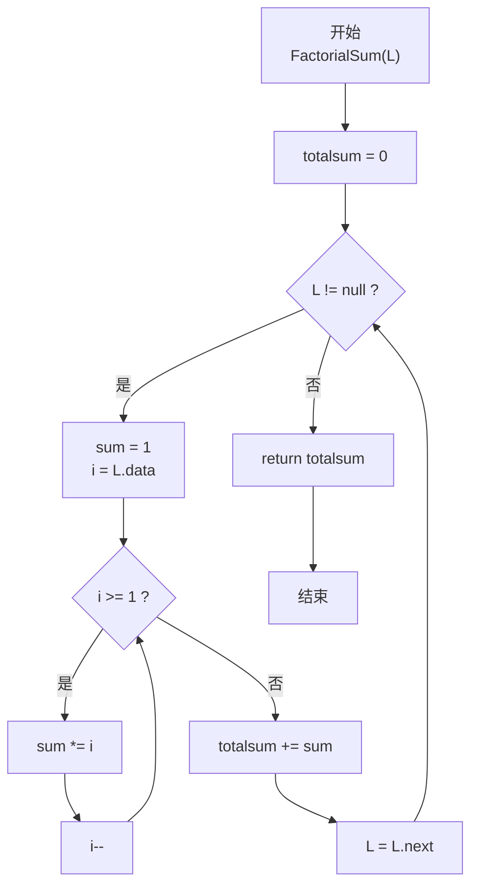
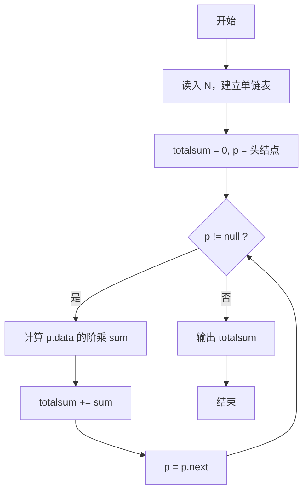

# PTA基础编程题目集 6-6求单链表结点的阶乘和（JavaScript实现）

## 题目描述

本题要求实现一个函数，求单链表`L`结点的阶乘和。这里默认所有结点的值非负，且题目保证结果在`int`范围内。

### 函数接口定义

```js
/* 单链表结点：用 JS 对象模拟 { data, next } */
function Node(data) {
    this.data = data; /* 存储结点数据 */
    this.next = null; /* 指向下一个结点的引用 */
}

function FactorialSum(L) { /* ... */ }
```

其中单链表`List`的定义如下：

```js
/* 用 JS 对象模拟单链表结点 */
const node = { data: 结点数据, next: 指向下一个结点的引用 };
```

### 裁判测试程序样例

```js
const readline = require('readline'); // 引入 readline 模块
const rl = readline.createInterface({
    input: process.stdin,
    output: process.stdout
}); // 创建输入输出接口

/* 用 JS 对象模拟单链表结点 */
function Node(data) {
    this.data = data; /* 存储结点数据 */
    this.next = null; /* 指向下一个结点的引用 */
}

function FactorialSum(L) { /* 你的代码将被嵌在这里 */ }

let N = -1;   /* 结点个数 */
let L = null; /* 链表头 */

rl.on('line', (line) => {
    if (N === -1) {
        N = parseInt(line.trim(), 10);               /* 读取结点个数 */
    } else {
        const values = line.trim().split(/\s+/).map(Number); /* 读取各结点数据 */
        for (let i = 0; i < N; i++) {
            const p = new Node(values[i]);           /* 创建新结点 */
            p.next = L;                              /* 头插法：新结点指向原头 */
            L = p;                                   /* 更新头指针 */
        }
        console.log(FactorialSum(L));                /* 输出阶乘和 */
        rl.close();                                  /* 关闭接口 */
    }
});
```

### 输入样例

```in
3
5 3 6
```

### 输出样例

```out
846
```

### 函数部分

```text
函数 FactorialSum(L):
    total ← 0
    当 L 不为空时：
        factorial ← 1
        对 i 从 L.data 递减到 1：
            factorial ← factorial × i
        total ← total + factorial
        L ← L.next
    返回 total
```

## 解题思路

这道题的核心是**单链表遍历 + 各结点数据的阶乘求和**：先沿 next 指针走完整个链表，对每个结点的 data 值计算其阶乘，再把所有阶乘加起来。

### 核心问题分析

1. **链表遍历**：不能像数组那样按下标访问，必须从表头 L 开始，每次 `L = L.next` 走向下一个结点，直到 `L === null` 表示链表结束。
2. **阶乘计算**：每个结点的 data 值是独立的，对每个 data 单独做一次连乘即可（注意 0! = 1 的定义）。
3. **结果累加**：用 totalsum 保存所有阶乘之和。

### 算法原理说明

外层 while 循环走完整条链表：

- 内层 for 循环计算当前结点 data 的阶乘：从 data 连乘到 1
- 每个结点的阶乘 sum 累加到 totalsum

### 具体计算步骤

1. 初始化 totalsum = 0
2. 当 L !== null 时：
   - sum = 1（阶乘初值）
   - 对 i 从 data 到 1：sum *= i（计算 data!）
   - totalsum += sum
   - L = L.next（前进到下一结点）
3. 返回 totalsum

## 完整代码

```javascript
// 题目：6-6 求单链表结点的阶乘和
// 题目描述：
//   给定单链表 L，每个结点含整数 Data，求所有结点 Data 的阶乘之和（0! = 1）。
// 实现原理：
//   遍历链表。用 while 沿 next 指针走完链表，对每个结点的 Data 用循环计算阶乘 sum，
//   再累加到 totalsum，最后返回 totalsum。
// 参数说明：
//   L — 单链表头指针（Node 对象或 null）
// 时间复杂度：O(∑Data) — 每个结点需 Data 次乘法
// 空间复杂度：O(1) — 仅使用常数个辅助变量

const readline = require('readline'); // 引入 readline 模块
const rl = readline.createInterface({
    input: process.stdin,
    output: process.stdout
}); // 创建输入输出接口

// 用 JS 对象模拟单链表结点
function Node(data) {
    this.data = data; // 存储结点数据
    this.next = null; // 指向下一个结点的引用
}

// 函数：FactorialSum
// 功能：遍历链表，逐点计算阶乘并求和
// 参数：
//   L — 链表头
// 返回值：所有结点阶乘之和
function FactorialSum(L) {
    let totalsum = 0; // 总和初始化为 0
    while (L !== null) {
        let sum = 1; // 当前结点阶乘初值（0! = 1）
        for (let i = L.data; i >= 1; i--) {
            sum *= i; // 计算 L.data 的阶乘
        }
        totalsum += sum; // 累加到总和
        L = L.next;      // 移动到下一个结点
    }
    return totalsum;
}

let N = -1;   // 结点个数
let L = null; // 链表头

rl.on('line', (line) => {
    if (N === -1) {
        N = parseInt(line.trim(), 10);               // 读取结点个数
    } else {
        const values = line.trim().split(/\s+/).map(Number); // 读取各结点数据
        for (let i = 0; i < N; i++) {
            const p = new Node(values[i]);           // 创建新结点
            p.next = L;                              // 头插法：新结点指向原头
            L = p;                                   // 更新头指针
        }
        console.log(FactorialSum(L));                // 输出阶乘和
        rl.close();                                  // 关闭接口
    }
});
```

## 代码流程说明

### 1. 主函数：建立链表

- 用 readline 读入结点数 N（parseInt 解析）
- 循环 N 次：new Node() 创建新结点 → 读 data → 头插法插入（p.next = L; L = p），形成倒序链表（但求和与顺序无关，结果正确）

### 2. FactorialSum 函数：遍历 + 阶乘

- `totalsum = 0` 初始化总和
- while (L !== null)：
  - `sum = 1` 重置阶乘初值
  - for (i = L.data; i >= 1; i--) sum *= i：计算当前结点的阶乘
  - `totalsum += sum` 累加
  - `L = L.next` 前进指针

### 3. 返回 totalsum

## 代码流程图



### 复杂度分析

设链表有 `m` 个结点，第 `j` 个结点的值为 `dⱼ`：

- 时间复杂度：`O(m + ∑dⱼ)`，既要遍历链表，也要完成每个结点的阶乘连乘。
- 空间复杂度：`O(1)`，不创建新的链表，只使用固定数量的辅助变量。

### 常见易错点

1. 遍历结束条件是结点指针为空，即 `L === null`，不能按数组下标访问链表。
2. 每处理完一个结点都要执行 `L = L.next`，否则会重复处理同一结点。
3. `0! = 1`，所以当前阶乘的累加器必须从 1 开始。
4. 头插法建立的链表顺序与输入顺序相反，但阶乘求和与访问顺序无关。

## 解题流程图


