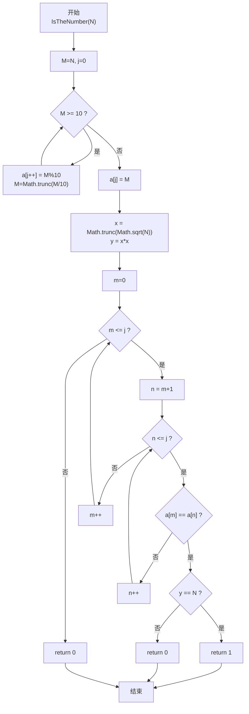
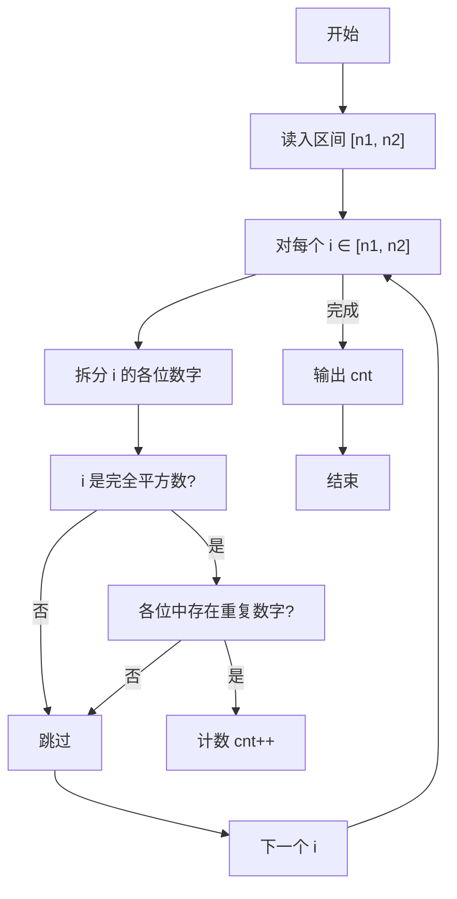

# PTA基础编程题目集 6-7统计某类完全平方数（JavaScript实现）

## 题目描述

本题要求实现一个函数，判断任一给定整数`N`是否满足条件：它是完全平方数，又至少有两位数字相同，如144、676等。

### 函数接口定义

```js
function IsTheNumber(N) { /* ... */ }
```

其中`N`是用户传入的参数。如果`N`满足条件，则该函数必须返回1，否则返回0。

### 裁判测试程序样例

```js
const readline = require('readline'); // 引入 readline 模块
const rl = readline.createInterface({
    input: process.stdin,
    output: process.stdout
}); // 创建输入输出接口

function IsTheNumber(N) { /* 你的代码将被嵌在这里 */ }

rl.on('line', (line) => {
    const [n1, n2] = line.trim().split(/\s+/).map(Number); // 读取区间端点
    let cnt = 0;
    for (let i = n1; i <= n2; i++) {
        if (IsTheNumber(i))
            cnt++;
    }
    console.log(`cnt = ${cnt}`); // 输出计数
    rl.close(); // 关闭接口
});
```

### 输入样例

```in
105 500
```

### 输出样例

```out
cnt = 6
```

### 函数部分

```text
函数 IsTheNumber(N):
    digits ← 拆出 N 的所有十进制数字
    root ← floor(sqrt(N))
    如果 root × root 不等于 N：
        返回 0
    如果 digits 中存在相同的两个数字：
        返回 1
    返回 0
```

## 解题思路

这道题的核心是对单个整数 `N` 同时做两个判断：**是否为完全平方数**，以及**各位数字中是否至少有两位相同**。两者都满足时返回 1，否则返回 0。

### 核心问题分析

1. **完全平方数判定**：对 N 开平方取整得 x = Math.trunc(Math.sqrt(N))，若 x*x === N，则是完全平方数。
   需要注意浮点数精度，但 PTA 数据范围下直接使用 Math.sqrt 即可。
2. **重复数字检测**：把 N 的每一位数字拆出存入数组 a[]，再用双重循环两两比较 a[i] 和 a[j]（i<j），只要有一对相等就说明存在重复数字。

### 算法原理说明

步骤拆分：

1. 用"除 10 取余"法拆分 N 的每一位到数组 a[]（低位在前），j 记录最高位的下标。
2. x = Math.trunc(Math.sqrt(N))，y = x * x，y === N 即判定为完全平方数。
3. 双重 for (m=0..j, n=m+1..j) 检查 a[m] === a[n]，若找到一对且 y === N 则立刻 return 1；
   遍历完未找到 return 0。

### 具体计算步骤

1. 复制 M = N，while (M >= 10)：a[j++] = M%10; M = Math.trunc(M/10)；最后 a[j] = M。
2. x = Math.trunc(Math.sqrt(N)); y = x*x。
3. 两层循环 m=0..j、n=m+1..j：
   - 若 a[m] === a[n] 且 y === N → return 1
   - 若有重复但 y !== N → return 0（优化：已经有重复了还不是平方数就直接排除）
4. 循环完仍没 return → return 0。

## 完整代码

```javascript
// 题目：6-7 统计某类完全平方数
// 题目描述：
//   实现函数 IsTheNumber(N)，判断 N 是否同时满足：是完全平方数且至少有两位数字相同。
// 实现原理：
//   1) 把 N 的每一位拆出存入数组 a[]（低位在前）；
//   2) 用 Math.sqrt 取整后平方判断完全平方数；
//   3) 双重循环检查 a[] 中是否存在重复数字，找到重复时结合平方判断返回 1/0。
// 参数说明：
//   N — 待判断的整数
// 时间复杂度：O(k·d²) — 区间扫描，每个数拆位 O(d)+判重 O(d²)
// 空间复杂度：O(1) — 仅使用固定大小数组

const readline = require('readline'); // 引入 readline 模块
const rl = readline.createInterface({
    input: process.stdin,
    output: process.stdout
}); // 创建输入输出接口

// 函数：IsTheNumber
// 功能：判断 N 是否为完全平方数且至少含两位相同数字
// 参数：
//   N — 整数
// 返回值：1 满足条件，0 不满足
function IsTheNumber(N) {
    let M = N; // 副本，避免修改原参数
    let j = 0;
    const a = []; // 存放各位数字
    while (M >= 10) {
        a[j++] = M % 10; // 取个位
        M = Math.trunc(M / 10); // 去个位
    }
    a[j] = M; // 最高位
    const x = Math.trunc(Math.sqrt(N)); // 开方取整
    const y = x * x; // 最接近的平方数
    for (let m = 0; m <= j; m++) {
        for (let n = m + 1; n <= j; n++) {
            if (a[m] === a[n]) {
                if (y === N) return 1; // 有重复且是平方数
                else return 0; // 有重复但不是平方数
            }
        }
    }
    return 0; // 无重复数字
}

rl.on('line', (line) => {
    const [n1, n2] = line.trim().split(/\s+/).map(Number); // 读取区间端点
    let cnt = 0;
    for (let i = n1; i <= n2; i++) {
        if (IsTheNumber(i))
            cnt++;
    }
    console.log(`cnt = ${cnt}`); // 输出计数
    rl.close(); // 关闭接口
});
```

## 代码流程说明

### 1. 主函数：区间遍历

- 用 readline 读入 n1, n2（parseInt 解析）
- cnt = 0；循环 i 从 n1 到 n2：IsTheNumber(i) 为真 cnt++
- 输出 cnt（console.log）

### 2. IsTheNumber 函数：拆位

- M = N（保护原参数不被修改）
- while (M >= 10)：每次 M%10 取个位 → a[j++]，M = Math.trunc(M/10) 去个位
- 循环结束后把剩余的最高位也放入 a[j]

### 3. 完全平方数判定

- x = Math.trunc(Math.sqrt(N)); y = x*x;
- y === N 则是完全平方数

### 4. 重复数字检测

- 两层循环：m 固定，n 从 m+1 到 j 依次对比 a[m] 和 a[n]
- 发现相等立刻：若 y === N return 1，否则 return 0
- 循环结束没找到 return 0

## 代码流程图



### 复杂度分析

设待判断数有 `d` 位，区间中有 `k` 个整数：

- 时间复杂度：单个整数为 `O(d²)`；扫描区间总计为 `O(kd²)`。其中开平方和拆位为 `O(d)`，两两比较是主要开销。
- 空间复杂度：`O(d)`，需要数组保存当前整数的各位数字；在固定整型范围下可视为 `O(1)`。

### 常见易错点

1. 必须同时满足“完全平方数”和“至少两位数字相同”两个条件，不能只判断其中一个。
2. 拆位结束后不要漏掉最高位；除 10 循环只处理低位，剩余值还需放入数组。
3. 发现重复数字后仍要检查平方条件，不能仅凭重复数字返回 1。
4. 完全平方数判定应比较 `floor(sqrt(N))²` 与 N，而不是只判断开平方结果是否为整数。

## 解题流程图


