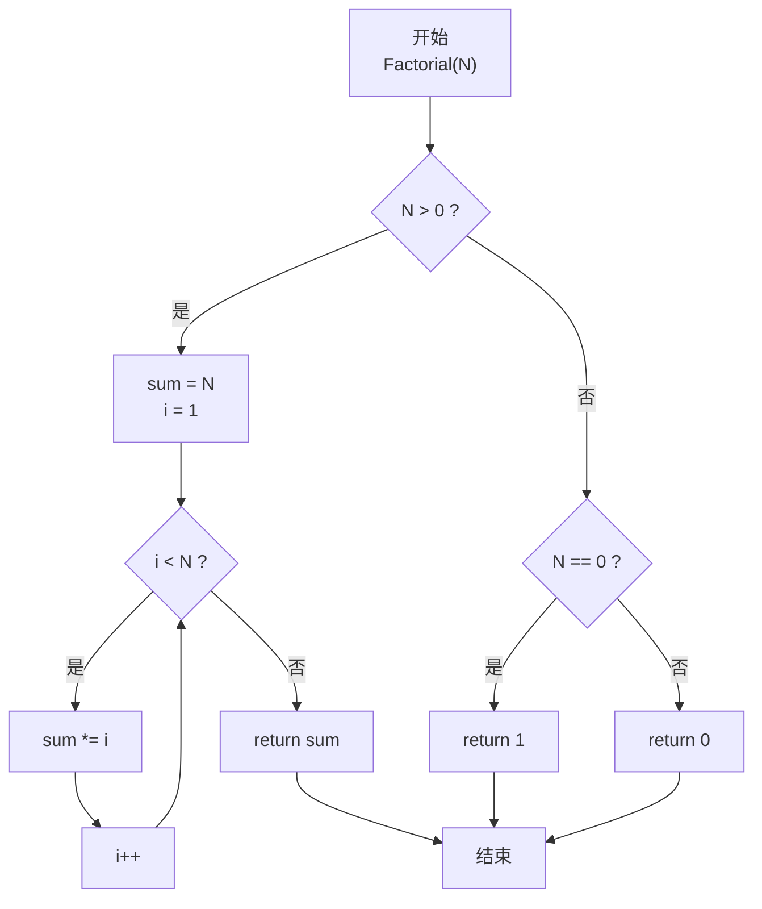
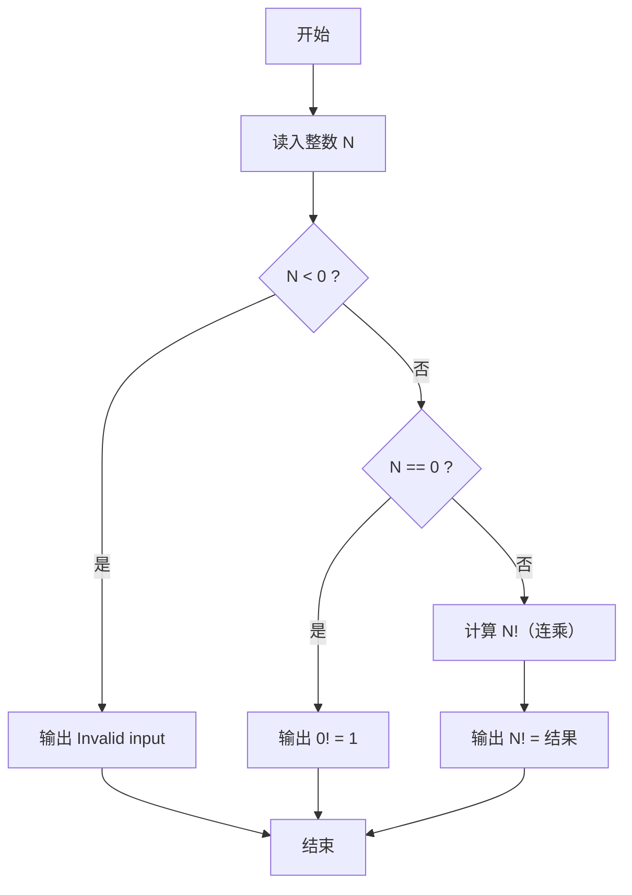

# PTA基础编程题目集 6-8简单阶乘计算（JavaScript实现）

## 题目描述

本题要求实现一个计算非负整数阶乘的简单函数。

### 函数接口定义

```js
function Factorial(N) { /* ... */ }
```

其中`N`是用户传入的参数，其值不超过12。如果`N`是非负整数，则该函数必须返回`N`的阶乘，否则返回0。

### 裁判测试程序样例

```js
const readline = require('readline'); // 引入 readline 模块
const rl = readline.createInterface({
    input: process.stdin,
    output: process.stdout
}); // 创建输入输出接口

function Factorial(N) { /* 你的代码将被嵌在这里 */ }

rl.on('line', (line) => {
    const N = parseInt(line.trim(), 10); // 读取 N
    const NF = Factorial(N);
    if (NF)  console.log(`${N}! = ${NF}`); // 输出阶乘
    else console.log('Invalid input');     // 非法输入
    rl.close(); // 关闭接口
});
```

### 输入样例

```in
5
```

### 输出样例

```out
5! = 120
```

### 函数部分

```text
函数 Factorial(N):
    如果 N < 0：
        返回 0
    result ← 1
    对 i 从 2 到 N：
        result ← result × i
    返回 result
```

## 解题思路

这道题的核心是**正整数阶乘的连乘计算**，并正确处理 0! = 1 和负数返回 0 的边界条件。

### 核心问题分析

阶乘定义：N! = N × (N-1) × ... × 1；特殊规定 0! = 1。

- N ≥ 1：连乘
- N = 0：直接返回 1
- N < 0：非法，返回 0

### 算法原理说明

分支处理 + 连乘循环：

1. 先判断 N 正负：N<0 → return 0；N==0 → return 1。
2. N>0 时，sum 初值赋 N（或赋 1 再从 N 乘到 1 也可以），再乘上 1..N-1 或 N..1。
3. 注意 N ≤ 12 的题设保证结果在 JS 数值类型的精确范围内（12! = 479001600，约 4.8 亿，远小于 2⁵³ 安全整数上限）。

### 具体计算步骤

1. 若 N > 0：
   - sum = N
   - for i=1 到 N-1：sum *= i
   - return sum
2. else if N == 0：return 1
3. else：return 0

## 完整代码

```javascript
// 题目：6-8 简单阶乘计算
// 题目描述：
//   实现函数 Factorial(N)，计算 N!；0! = 1，N<0 返回 0。
// 实现原理：
//   分支处理 + 连乘。N>0 时令 sum=N 再乘 1..N-1；N==0 返回 1；N<0 返回 0。
// 参数说明：
//   N — 整数（N≤12）
// 时间复杂度：O(N) — 连乘 N-1 次
// 空间复杂度：O(1) — 仅使用常数个辅助变量

const readline = require('readline'); // 引入 readline 模块
const rl = readline.createInterface({
    input: process.stdin,
    output: process.stdout
}); // 创建输入输出接口

// 函数：Factorial
// 功能：计算 N!，处理 0 和负数边界
// 参数：
//   N — 整数
// 返回值：阶乘结果，非法返回 0
function Factorial(N) {
    if (N > 0) {
        let sum = N; // 初值设为 N
        for (let i = 1; i < N; i++) {
            sum *= i; // 依次乘上 1..N-1
        }
        return sum;
    } else if (N === 0) {
        return 1; // 0! = 1
    } else {
        return 0; // 负数非法
    }
}

rl.on('line', (line) => {
    const N = parseInt(line.trim(), 10); // 读取 N
    const NF = Factorial(N);
    if (NF)  console.log(`${N}! = ${NF}`); // 输出阶乘
    else console.log('Invalid input');     // 非法输入
    rl.close(); // 关闭接口
});
```

## 代码流程说明

### 1. 主函数

- 用 readline 读入 N（parseInt 解析）
- NF = Factorial(N)
- 若 NF != 0：按 "N! = NF" 格式输出（console.log）；否则输出 "Invalid input"

### 2. Factorial 函数：分支一 N > 0

- sum = N（先乘上最大的因子）
- i 从 1 到 N-1：sum *= i → 累积 N!
- return sum

### 3. Factorial 函数：分支二 N == 0

- return 1（0! = 1 的数学规定）

### 4. Factorial 函数：分支三 N < 0

- return 0（主函数据此判断为非法输入）

## 代码流程图



### 复杂度分析

- 时间复杂度：`O(N)`，最多执行 N-1 次乘法。
- 空间复杂度：`O(1)`，只使用阶乘累加器和循环变量。

### 常见易错点

1. `0!` 的结果是 1，不能把 0 直接作为阶乘结果返回。
2. 负数是非法输入，应返回 0；主程序再将其转换为 `Invalid input`。
3. 阶乘循环的乘法初值应为 1，并覆盖从 2 到 N 的所有因子。
4. 题目保证 N 不超过 12，普通 JavaScript Number 可以精确表示结果。

## 解题流程图


