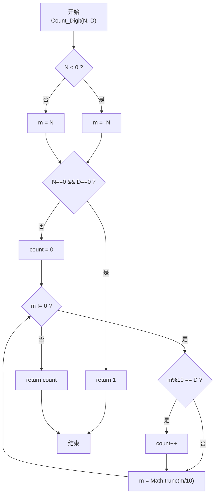
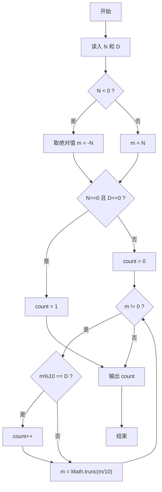

# PTA基础编程题目集 6-9统计个位数字（JavaScript实现）

## 题目描述

本题要求实现一个函数，可统计任一整数中某个位数出现的次数。例如-21252中，2出现了3次，则该函数应该返回3。

### 函数接口定义

```js
function Count_Digit(N, D) { /* ... */ }
```

其中`N`和`D`都是用户传入的参数。`N`的值不超过`int`的范围；`D`是[0, 9]区间内的个位数。函数须返回`N`中`D`出现的次数。

### 裁判测试程序样例

```js
const readline = require('readline'); // 引入 readline 模块
const rl = readline.createInterface({ input: process.stdin, output: process.stdout }); // 创建输入输出接口

function Count_Digit(N, D) { /* 你的代码将被嵌在这里 */ }

rl.on('line', (line) => {
    const [N, D] = line.trim().split(/\s+/).map(Number); // 读取 N 和 D
    console.log(Count_Digit(N, D)); // 输出 D 出现的次数
    rl.close(); // 关闭接口
});
```

### 输入样例

```in
-21252 2
```

### 输出样例

```out
3
```

## 解题思路

这道题的核心是**逐位拆解整数并统计目标数字 D 的出现次数**。由于 N 可能是负数，需要先取绝对值，且特别处理 N=0 且 D=0 的特殊情形（因为 while(0) 不会进入循环，统计会得到 0）。

### 核心问题分析

1. **负数处理**：数字的各位与符号无关，-21252 的数字就是 2,1,2,5,2，因此取绝对值 m = |N| 后再处理。
2. **逐位取数**：每次 m%10 得到最低位数字，m = Math.trunc(m/10) 去掉最低位，循环直到 m=0。
3. **特殊情形**：当 N=0 且 D=0 时，m=0 会直接跳过循环，但实际数字 0 中含有一个数字 0，因此需要先单独判断返回 1。

### 算法原理说明

1. 先处理 N 负数→取绝对值；
2. 若 N==0 且 D==0：return 1；
3. count = 0；
4. while (m)：
   - m%10 == D → count++
   - m = Math.trunc(m/10)
5. return count

### 具体计算步骤

1. m = (N<0) ? -N : N
2. if (N==0 && D==0) return 1
3. count = 0
4. while (m != 0) {
   - 若 m%10 == D → count++
   - m = Math.trunc(m/10)
   }
5. return count

## 完整代码

```javascript
// 题目：6-9 统计个位数字
// 题目描述：
//   实现函数 Count_Digit(N, D)，统计整数 N 的十进制表示中数字 D 出现的次数。
// 实现原理：
//   取绝对值后用除 10 取余法逐位检查。每轮 m%10 取最低位，若等于 D 则计数加一，
//   再 m=Math.trunc(m/10) 去掉最低位，直到 m 为 0；特例 N==0&&D==0 返回 1。
// 参数说明：
//   N — 整数（可为负）
//   D — 目标数字 0..9
// 时间复杂度：O(位数) — 循环次数等于十进制位数
// 空间复杂度：O(1) — 仅使用常数个辅助变量

const readline = require('readline'); // 引入 readline 模块
const rl = readline.createInterface({ input: process.stdin, output: process.stdout }); // 创建输入输出接口

// 函数：Count_Digit
// 功能：统计 N 中数字 D 的出现次数
// 参数：
//   N — 整数
//   D — 目标数字
// 返回值：出现次数
function Count_Digit(N, D) {
    let m;
    if (N < 0) m = -N; // 负数取绝对值
    else m = N;
    if (N === 0 && D === 0) return 1; // 0 中含一个 0
    let count = 0;
    while (m) {
        if (m % 10 === D) count++; // 当前最低位等于 D
        m = Math.trunc(m / 10); // 去掉最低位
    }
    return count;
}

rl.on('line', (line) => {
    const [N, D] = line.trim().split(/\s+/).map(Number); // 读取 N 和 D
    console.log(Count_Digit(N, D)); // 输出 D 出现的次数
    rl.close(); // 关闭接口
});
```


## 代码流程说明

### 1. 主函数
- 用 readline 读入 N 和 D（parseInt 解析）
- 调用 Count_Digit(N, D) 输出返回值（console.log）

### 2. Count_Digit：符号处理
- 若 N < 0：m = -N；否则 m = N（保留 N 原值以便 0 的特判）

### 3. Count_Digit：0 的特判
- 若 N === 0 && D === 0：直接 return 1，避免 while(0) 跳过计数

### 4. Count_Digit：循环统计
- count = 0
- while (m !== 0)：
  - 当前位 m%10 === D → count++
  - m = Math.trunc(m/10)：去掉最低位

### 5. 返回 count

## 代码流程图



## 解题流程图


