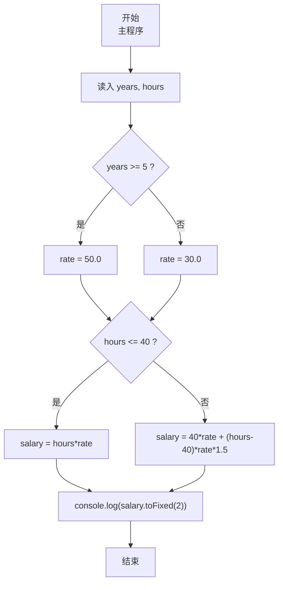
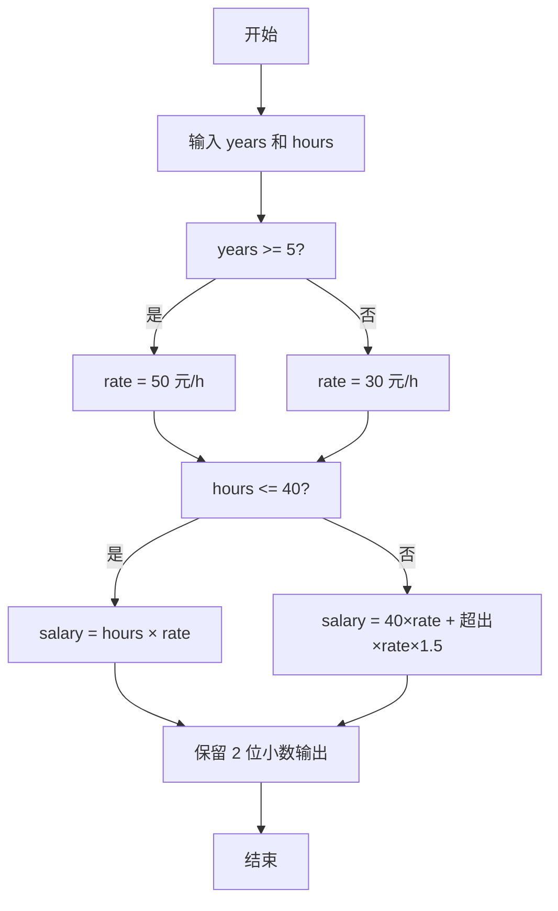

# 7-10 计算工资（JavaScript实现）

## 前言

本文是 PTA 编程题“7-10 计算工资”的题解，涵盖题目描述、输入输出格式及 JavaScript 实现，展示按"新/老职工"确定时薪，再按"是否超时"计加班工资 1.5 倍的分段计费思路。

本题（7-10 计算工资）的主要考点是：准确理解题意、规范处理输入输出格式，并正确处理边界与精度。下面先给出题目描述与格式要求，再通过清晰的思路与可直接运行的javascript实现代码进行讲解。

## 题目描述

某公司员工的工资计算方法如下：一周内工作时间不超过40小时，按正常工作时间计酬；超出40小时的工作时间部分，按正常工作时间报酬的1.5倍计酬。员工按进公司时间分为新职工和老职工，进公司不少于5年的员工为老职工，5年以下的为新职工。新职工的正常工资为30元/小时，老职工的正常工资为50元/小时。请按该计酬方式计算员工的工资。

## 输入格式

输入在一行中给出2个正整数，分别为某员工入职年数和周工作时间，其间以空格分隔。

## 输出格式

在一行输出该员工的周薪，精确到小数点后2位。

## 输入样例1

```in
5 40
```

## 输入样例2

```in
3 50
```

## 输出样例1

```out
2000.00
```

## 输出样例2

```out
1650.00
```

## 解题思路

这道题的核心是**两级分段计费**：先按入职年数分"新/老职工"定正常时薪，再按是否超过 40 小时分"正常工时/加班工时"计工资。

### 核心问题分析

1. **职工类型判据**：years ≥ 5 → 老职工 rate = 50；否则 rate = 30。
2. **工时分段**：
   - hours ≤ 40 → salary = hours × rate
   - hours > 40 → salary = 40×rate + (hours-40)×rate×1.5
3. **输出精度**：toFixed(2) 强制两位小数。

### 算法原理说明

两级 if-else 嵌套 + 算术运算：
1. 读 years, hours
2. if (years≥5) rate=50 else rate=30
3. if (hours≤40) salary=hours*rate else 40*rate+(hours-40)*rate*1.5
4. console.log(salary.toFixed(2))

### 具体计算步骤

1. 用 readline 读取一行、按空格分割、parseInt 解析 years、hours
2. 确定 rate（50 或 30）
3. 根据 hours ≤ 40 选择公式计算 salary
4. salary.toFixed(2) 输出

## 完整代码

```javascript
// 题目：7-10 计算工资
// 要求：实现「计算工资」（题目 7-10）的输入处理与结果输出。
// 实现原理：
//   1. 职工类型判据：years ≥ 5 → 老职工 rate = 50；否则 rate = 30。
//   2. 工时分段：
//   3. 输出精度：toFixed(2) 强制两位小数。

const readline = require('readline'); // 引入 readline 模块
const rl = readline.createInterface({ input: process.stdin, output: process.stdout }); // 创建输入输出接口

rl.on('line', (line) => { // 监听一行输入
    const [yearsStr, hoursStr] = line.trim().split(/\s+/); // 按空格分割入职年数和周工作时间
    const years = parseInt(yearsStr, 10); // 入职年数
    const hours = parseInt(hoursStr, 10); // 周工作时间

    let rate, salary; // 定义工资率和工资变量

    if (years >= 5) { // 判断是否为老职工（入职不少于5年）
        rate = 50.0; // 老职工正常工资为50元/小时
    } else { // 否则为新职工
        rate = 30.0; // 新职工正常工资为30元/小时
    }

    if (hours <= 40) { // 判断工作时间是否不超过40小时
        salary = hours * rate; // 正常计酬：工资 = 工时 × 工资率
    } else { // 超过40小时
        salary = 40 * rate + (hours - 40) * rate * 1.5; // 正常工时+加班工时（1.5倍计酬）
    }

    console.log(salary.toFixed(2)); // 输出工资，保留两位小数
    rl.close(); // 关闭接口
});
```

## 代码流程说明

### 1. 变量与输入
- years, hours：入职年数、周工作小时数（readline 读取、parseInt 解析）
- rate, salary：时薪（由职工类型决定）、最终工资

### 2. 确定时薪 rate
- years ≥ 5 → 老职工 rate = 50.0
- 否则 → 新职工 rate = 30.0

### 3. 分段计算 salary
- hours ≤ 40：salary = hours × rate
- hours > 40：salary = 40×rate + (hours-40)×rate×1.5（加班部分 1.5 倍）

### 4. 输出
- console.log(salary.toFixed(2))：保留两位小数

## 代码流程图



## 解题流程图



## 代码解析

### 变量与输入

```javascript
const readline = require('readline'); // 引入 readline 模块
const rl = readline.createInterface({ input: process.stdin, output: process.stdout }); // 创建输入输出接口
```

变量与输入

### 确定时薪 rate

```javascript
rl.on('line', (line) => { // 监听一行输入
    const [yearsStr, hoursStr] = line.trim().split(/\s+/); // 按空格分割入职年数和周工作时间
    const years = parseInt(yearsStr, 10); // 入职年数
    const hours = parseInt(hoursStr, 10); // 周工作时间
```

确定时薪 rate

### 分段计算 salary

```javascript
let rate, salary; // 定义工资率和工资变量
```

分段计算 salary

### 输出

```javascript
if (years >= 5) { // 判断是否为老职工（入职不少于5年）
        rate = 50.0; // 老职工正常工资为50元/小时
    } else { // 否则为新职工
        rate = 30.0; // 新职工正常工资为30元/小时
    }
```

输出


## 复杂度分析

设输入规模为 $n$（对数值类题目为参与运算的数据量，对字符串/序列类题目为长度）。

- **时间复杂度**：$O(n)$ 或 $O(n \log n)$，主要来自一次线性遍历与常数次数学运算，无嵌套高复杂度循环。
- **空间复杂度**：$O(n)$，用于存储输入、中间结果与输出字符串；若仅使用若干标量变量则为 $O(1)$。

## 常见易错点

### 1. 输入/输出格式不符
错误：多余空格、遗漏换行、大小写或精度不符。后果：判题系统判为格式错误。正确：严格按题目要求的格式输出，数值用合适精度。

### 2. 边界条件遗漏
错误：未处理 0、最小值、单字符或空输入等边界。后果：特例 WA。正确：先列出所有边界样例，在编码前单独分支处理。

### 3. 整数溢出与类型
错误：使用过小的整数类型或忽略负号。后果：大数计算溢出。正确：按数据范围选择合适类型，必要时用更大整数类型或字符串处理。

## 更多测试

### 测试一：常规边界

**输入：**

```text
（可取题目边界附近的值，如最小值或最大值）
```

**输出：**

```text
（依据题意推导的正确结果）
```

### 测试二：特殊用例

**输入：**

```text
（可取易错点，如 0、单一元素、全同值等）
```

**输出：**

```text
（对应正确结果）
```

## 总结

本文是 PTA 编程题“7-10 计算工资”的题解，涵盖题目描述、输入输出格式及 JavaScript 实现，展示按"新/老职工"确定时薪，再按"是否超时"计加班工资 1.5 倍的分段计费思路。

本题的核心在于理清「计算工资」的输入输出关系与边界处理：先按格式读取输入，再依据规则逐步计算或遍历，最后按规范输出。该思路可迁移到同类格式化输入输出与模拟计算的题目。
