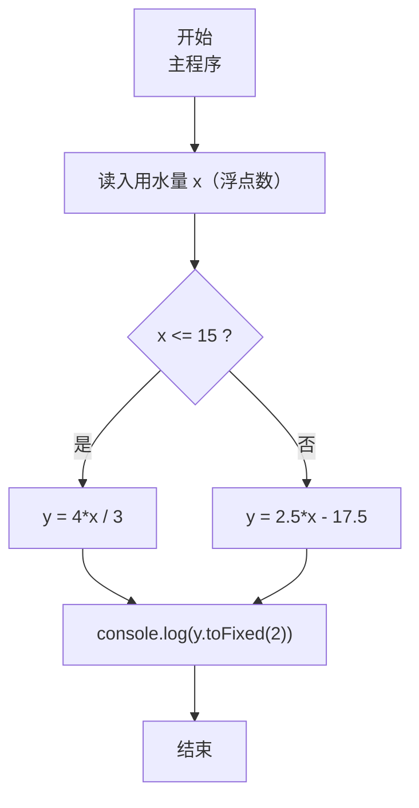
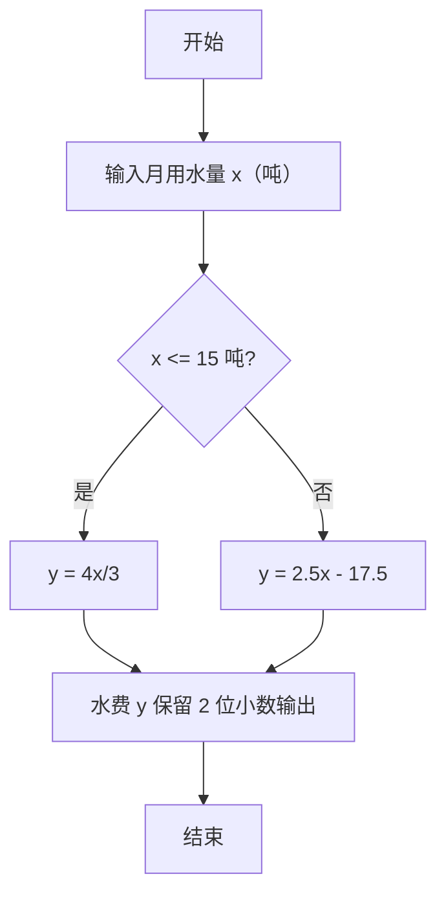

# 7-11 分段计算居民水费（JavaScript实现）

## 前言

本文是 PTA 编程题“7-11 分段计算居民水费”的题解，涵盖题目描述、输入输出格式及 JavaScript 实现，展示两段式阶梯水价的条件分支计算与两位小数格式化输出。

本题（7-11 分段计算居民水费）的主要考点是：准确理解题意、规范处理输入输出格式，并正确处理边界与精度。下面先给出题目描述与格式要求，再通过清晰的思路与可直接运行的javascript实现代码进行讲解。

## 题目描述

为鼓励居民节约用水，自来水公司采取按用水量阶梯式计价的办法，居民应交水费y（元）与月用水量x（吨）相关：当x不超过15吨时，y=4x/3；超过后，y=2.5x−17.5。请编写程序实现水费的计算。

## 输入格式

输入在一行中给出非负实数x。

## 输出格式

在一行输出应交的水费，精确到小数点后2位。

## 输入样例1

```in
12
```

## 输入样例2

```in
16
```

## 输出样例1

```out
16.00
```

## 输出样例2

```out
22.50
```

## 解题思路

这道题的核心是**两段阶梯水价的分段函数**：x ≤ 15 用 4x/3；x > 15 用 2.5x − 17.5。

### 核心问题分析

1. **分界点 x = 15**：两段公式在 x=15 处都给出 y=20，因此等号放哪一边都可以；代码里写成 x ≤ 15。
2. **浮点精度**：输入 x 是实数，需用浮点数存储；输出用 `toFixed(2)` 保留两位小数。

### 算法原理说明

简单 if-else 分支：
- if (x ≤ 15) → y = 4*x/3
- else → y = 2.5*x - 17.5

### 具体计算步骤

1. 用 readline 读取输入，parseFloat 解析为浮点数 x
2. if (x ≤ 15) y = 4*x/3；否则 y = 2.5*x - 17.5
3. console.log(y.toFixed(2))

## 完整代码

```javascript
// 题目：7-11 分段计算居民水费
// 要求：实现「分段计算居民水费」（题目 7-11）的输入处理与结果输出。
// 实现原理：
//   1. 分界点 x = 15：两段公式在 x=15 处都给出 y=20，因此等号放哪一边都可以；代码里写成 x ≤ 15。
//   2. 浮点精度：输入 x 是实数，需用浮点数存储；输出用 `toFixed(2)` 保留两位小数。
//   3. 用 readline 读取输入，parseFloat 解析为浮点数 x

const readline = require('readline'); // 引入 readline 模块
const rl = readline.createInterface({ input: process.stdin, output: process.stdout }); // 创建输入输出接口

rl.on('line', (line) => { // 监听一行输入
    const x = parseFloat(line.trim()); // 读取月用水量
    let y;  // 定义应交水费

    if (x <= 15) {  // 判断用水量是否不超过15吨
        y = 4 * x / 3;  // 不超过15吨时：水费 = 4x/3
    } else {  // 超过15吨
        y = 2.5 * x - 17.5;  // 超过15吨时：水费 = 2.5x - 17.5
    }

    console.log(y.toFixed(2));  // 输出水费，保留两位小数
    rl.close();  // 关闭接口
});
```

## 代码流程说明

### 1. 变量与输入
- x（用水量）、y（水费）均为浮点数
- 用 readline 读取输入，parseFloat 解析为实数 x

### 2. 两段分支
- x ≤ 15 → y = 4*x/3（约 1.333 元/吨）
- x > 15 → y = 2.5*x - 17.5（超过部分按 2.5 元/吨，并在分界处与前式衔接）

### 3. 输出
- console.log(y.toFixed(2))：保留两位小数

## 代码流程图



## 解题流程图



## 代码解析

### 变量与输入

```javascript
const readline = require('readline'); // 引入 readline 模块
const rl = readline.createInterface({ input: process.stdin, output: process.stdout }); // 创建输入输出接口
```

变量与输入

### 两段分支

```javascript
rl.on('line', (line) => { // 监听一行输入
    const x = parseFloat(line.trim()); // 读取月用水量
    let y;  // 定义应交水费
```

两段分支

### 输出

```javascript
if (x <= 15) {  // 判断用水量是否不超过15吨
        y = 4 * x / 3;  // 不超过15吨时：水费 = 4x/3
    } else {  // 超过15吨
        y = 2.5 * x - 17.5;  // 超过15吨时：水费 = 2.5x - 17.5
    }
```

输出


## 复杂度分析

设输入规模为 $n$（对数值类题目为参与运算的数据量，对字符串/序列类题目为长度）。

- **时间复杂度**：$O(n)$ 或 $O(n \log n)$，主要来自一次线性遍历与常数次数学运算，无嵌套高复杂度循环。
- **空间复杂度**：$O(n)$，用于存储输入、中间结果与输出字符串；若仅使用若干标量变量则为 $O(1)$。

## 常见易错点

### 1. 输入/输出格式不符
错误：多余空格、遗漏换行、大小写或精度不符。后果：判题系统判为格式错误。正确：严格按题目要求的格式输出，数值用合适精度。

### 2. 边界条件遗漏
错误：未处理 0、最小值、单字符或空输入等边界。后果：特例 WA。正确：先列出所有边界样例，在编码前单独分支处理。

### 3. 整数溢出与类型
错误：使用过小的整数类型或忽略负号。后果：大数计算溢出。正确：按数据范围选择合适类型，必要时用更大整数类型或字符串处理。

## 更多测试

### 测试一：常规边界

**输入：**

```text
（可取题目边界附近的值，如最小值或最大值）
```

**输出：**

```text
（依据题意推导的正确结果）
```

### 测试二：特殊用例

**输入：**

```text
（可取易错点，如 0、单一元素、全同值等）
```

**输出：**

```text
（对应正确结果）
```

## 总结

本文是 PTA 编程题“7-11 分段计算居民水费”的题解，涵盖题目描述、输入输出格式及 JavaScript 实现，展示两段式阶梯水价的条件分支计算与两位小数格式化输出。

本题的核心在于理清「分段计算居民水费」的输入输出关系与边界处理：先按格式读取输入，再依据规则逐步计算或遍历，最后按规范输出。该思路可迁移到同类格式化输入输出与模拟计算的题目。
