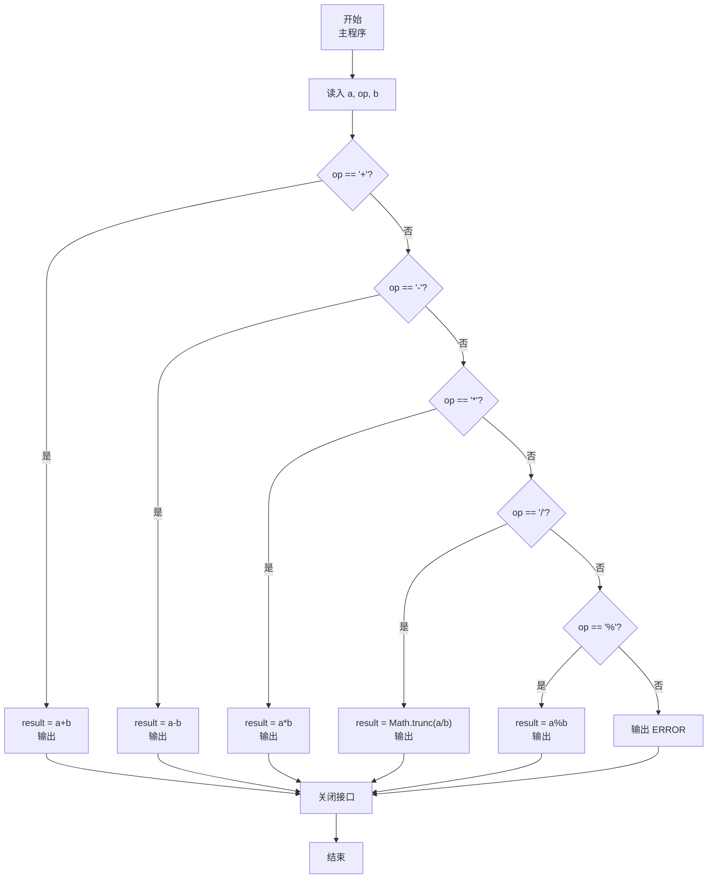
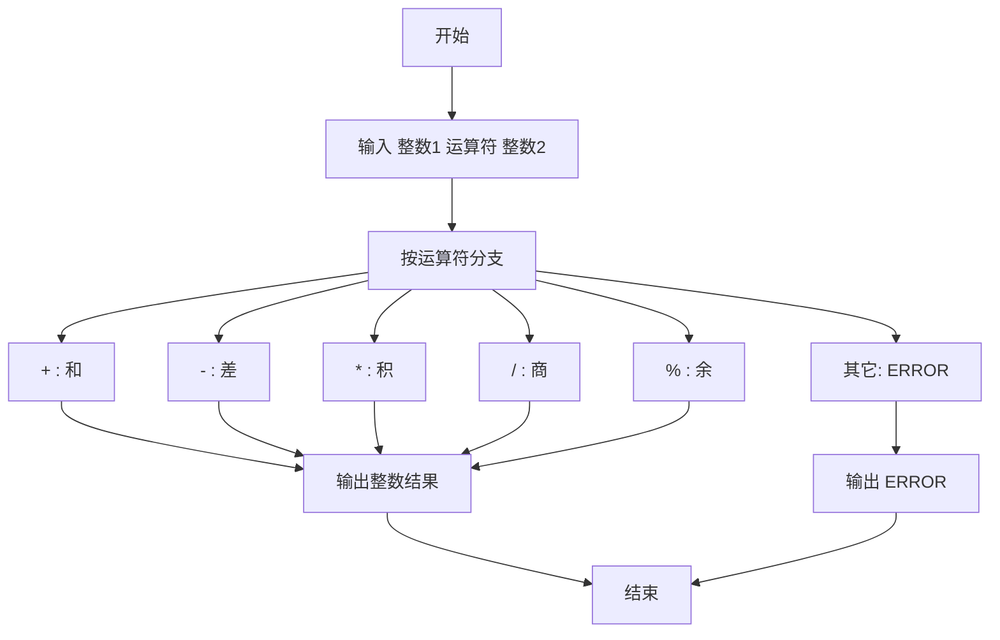

# 7-12 两个数的简单计算器（JavaScript实现）

## 前言

本文是 PTA 编程题“7-12 两个数的简单计算器”的题解，涵盖题目描述、输入输出格式及 JavaScript 实现，展示用多分支 if-else 链识别运算符并执行对应运算、非法符号报错的处理。

本题（7-12 两个数的简单计算器）的主要考点是：准确理解题意、规范处理输入输出格式，并正确处理边界与精度。下面先给出题目描述与格式要求，再通过清晰的思路与可直接运行的javascript实现代码进行讲解。

## 题目描述

本题要求编写一个简单计算器程序，可根据输入的运算符，对2个整数进行加、减、乘、除或求余运算。题目保证输入和输出均不超过整型范围。

## 输入格式

输入在一行中依次输入操作数1、运算符、操作数2，其间以1个空格分隔。操作数的数据类型为整型，且保证除法和求余的分母非零。

## 输出格式

当运算符为+、-、*、/、%时，在一行输出相应的运算结果。若输入是非法符号（即除了加、减、乘、除和求余五种运算符以外的其他符号）则输出ERROR。

## 输入样例1

```in
-7 / 2
```

## 输入样例2

```in
3 & 6
```

## 输出样例1

```out
-3
```

## 输出样例2

```out
ERROR
```

## 解题思路

这道题的核心是**按运算符分 6 支执行：5 种合法运算 + 1 种非法报错**。

### 核心问题分析

1. **运算类型**：`+ - * / %` 五种。其中 `/` 和 `%` 题目保证分母非零，无需判除零。
2. **整数除法**：JavaScript 的 `/` 是浮点除法，需用 `Math.trunc(a / b)` 对结果朝零截断取整，如 -7/2 = -3，符合样例。
3. **非法符号**：若 op 不属于上述 5 个，统一输出 ERROR。

### 算法原理说明

用 if-else if-else 链依次匹配运算符：
- op == '+' → a+b；op == '-' → a-b；op == '*' → a*b；op == '/' → a/b；op == '%' → a%b；
- 其它 → ERROR。

### 具体计算步骤

1. 用 readline 读取一行输入，按空格分割出 a、op、b，parseInt 解析两个操作数
2. 依次匹配 5 个合法算符 → 算 result 并打印
3. 否则 → console.log("ERROR")

## 完整代码

```javascript
// 题目：7-12 两个数的简单计算器
// 要求：实现「两个数的简单计算器」（题目 7-12）的输入处理与结果输出。
// 实现原理：
//   1. 运算类型：`+ - * / %` 五种。其中 `/` 和 `%` 题目保证分母非零，无需判除零。
//   2. 整数除法：JavaScript 的 `/` 是浮点除法，需用 `Math.trunc(a / b)` 对结果朝零截断取整，如 -7/2 = -3，符合样例。
//   3. 非法符号：若 op 不属于上述 5 个，统一输出 ERROR。

const readline = require('readline'); // 引入 readline 模块
const rl = readline.createInterface({ input: process.stdin, output: process.stdout }); // 创建输入输出接口

rl.on('line', (line) => { // 监听一行输入
    const parts = line.trim().split(/\s+/); // 按空格分割输入
    const a = parseInt(parts[0], 10);  // 读取操作数1
    const op = parts[1];  // 读取运算符
    const b = parseInt(parts[2], 10);  // 读取操作数2
    let result;  // 定义结果变量

    if (op === '+') {  // 加法运算
        result = a + b;  // 计算两数之和
        console.log(result);  // 输出结果
    } else if (op === '-') {  // 减法运算
        result = a - b;  // 计算两数之差
        console.log(result);  // 输出结果
    } else if (op === '*') {  // 乘法运算
        result = a * b;  // 计算两数之积
        console.log(result);  // 输出结果
    } else if (op === '/') {  // 除法运算
        result = Math.trunc(a / b);  // 计算两数之商（整型除法朝零截断）
        console.log(result);  // 输出结果
    } else if (op === '%') {  // 求余运算
        result = a % b;  // 计算两数之余
        console.log(result);  // 输出结果
    } else {  // 非法运算符
        console.log('ERROR');  // 输出错误提示
    }

    rl.close();  // 关闭接口
});
```

## 代码流程说明

### 1. 变量与输入
- a、b 用 parseInt 解析为整数，op 为运算符字符串
- 用 readline 读取一行输入，`line.trim().split(/\s+/)` 按空格分割出三个部分。

### 2. 分支运算
- 依次匹配 `+ - * / %` 五个合法算符 → 计算 result 并 `console.log(result)`（其中 `/` 用 `Math.trunc(a / b)` 取整）
- 以上都不匹配 → `console.log('ERROR')`

## 代码流程图



## 解题流程图



## 代码解析

### 变量与输入

```javascript
const readline = require('readline'); // 引入 readline 模块
const rl = readline.createInterface({ input: process.stdin, output: process.stdout }); // 创建输入输出接口
```

变量与输入

### 分支运算

```javascript
rl.on('line', (line) => { // 监听一行输入
    const parts = line.trim().split(/\s+/); // 按空格分割输入
    const a = parseInt(parts[0], 10);  // 读取操作数1
    const op = parts[1];  // 读取运算符
    const b = parseInt(parts[2], 10);  // 读取操作数2
    let result;  // 定义结果变量
```

分支运算


## 复杂度分析

设输入规模为 $n$（对数值类题目为参与运算的数据量，对字符串/序列类题目为长度）。

- **时间复杂度**：$O(n)$ 或 $O(n \log n)$，主要来自一次线性遍历与常数次数学运算，无嵌套高复杂度循环。
- **空间复杂度**：$O(n)$，用于存储输入、中间结果与输出字符串；若仅使用若干标量变量则为 $O(1)$。

## 常见易错点

### 1. 输入/输出格式不符
错误：多余空格、遗漏换行、大小写或精度不符。后果：判题系统判为格式错误。正确：严格按题目要求的格式输出，数值用合适精度。

### 2. 边界条件遗漏
错误：未处理 0、最小值、单字符或空输入等边界。后果：特例 WA。正确：先列出所有边界样例，在编码前单独分支处理。

### 3. 整数溢出与类型
错误：使用过小的整数类型或忽略负号。后果：大数计算溢出。正确：按数据范围选择合适类型，必要时用更大整数类型或字符串处理。

## 更多测试

### 测试一：常规边界

**输入：**

```text
（可取题目边界附近的值，如最小值或最大值）
```

**输出：**

```text
（依据题意推导的正确结果）
```

### 测试二：特殊用例

**输入：**

```text
（可取易错点，如 0、单一元素、全同值等）
```

**输出：**

```text
（对应正确结果）
```

## 总结

本文是 PTA 编程题“7-12 两个数的简单计算器”的题解，涵盖题目描述、输入输出格式及 JavaScript 实现，展示用多分支 if-else 链识别运算符并执行对应运算、非法符号报错的处理。

本题的核心在于理清「两个数的简单计算器」的输入输出关系与边界处理：先按格式读取输入，再依据规则逐步计算或遍历，最后按规范输出。该思路可迁移到同类格式化输入输出与模拟计算的题目。
