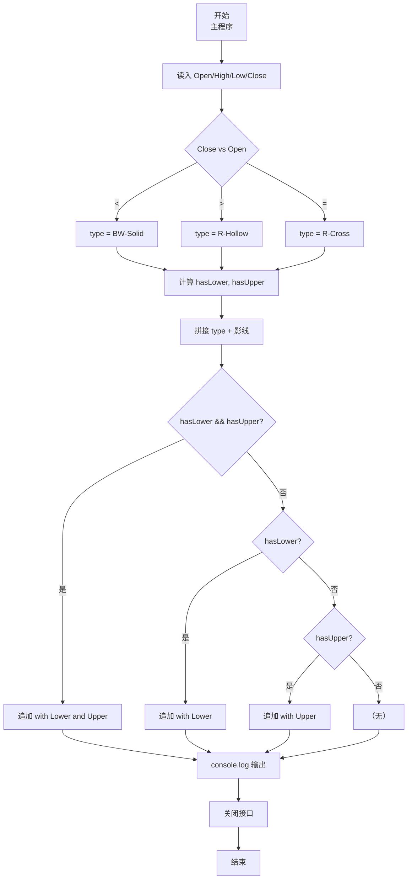
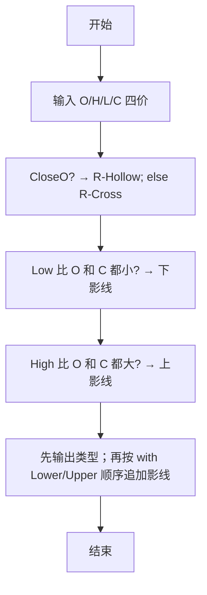

# 7-13 日K蜡烛图（JavaScript实现）

## 前言

本文是 PTA 编程题“7-13 日K蜡烛图”的题解，涵盖题目描述、输入输出格式及 JavaScript 实现，展示基于 Open/High/Low/Close 四个价格判断蜡烛颜色类型及上下影线有无的多重比较方法。

本题（7-13 日K蜡烛图）的主要考点是：准确理解题意、规范处理输入输出格式，并正确处理边界与精度。下面先给出题目描述与格式要求，再通过清晰的思路与可直接运行的javascript实现代码进行讲解。

## 题目描述

股票价格涨跌趋势，常用蜡烛图技术中的K线图来表示，分为按日的日K线、按周的周K线、按月的月K线等。以日K线为例，每天股票价格从开盘到收盘走完一天，对应一根蜡烛小图，要表示四个价格：开盘价格Open（早上刚刚开始开盘买卖成交的第1笔价格）、收盘价格Close（下午收盘时最后一笔成交的价格）、中间的最高价High和最低价Low。

如果Close&lt;Open，表示为“BW-Solid”（即“实心蓝白蜡烛”）；如果Close&gt;Open，表示为“R-Hollow”（即“空心红蜡烛”）；如果Open等于Close，则为“R-Cross”（即“十字红蜡烛”）。如果Low比Open和Close低，称为“Lower Shadow”（即“有下影线”），如果High比Open和Close高，称为“Upper Shadow”（即“有上影线”）。请编程序，根据给定的四个价格组合，判断当日的蜡烛是一根什么样的蜡烛。

## 输入格式

输入在一行中给出4个正实数，分别对应Open、High、Low、Close，其间以空格分隔。

## 输出格式

在一行中输出日K蜡烛的类型。如果有上、下影线，则在类型后加上with 影线类型。如果两种影线都有，则输出with Lower Shadow and Upper Shadow。

## 输入样例1

```in
5.110 5.250 5.100 5.105
```

## 输入样例2

```in
5.110 5.110 5.110 5.110
```

## 输入样例3

```in
5.110 5.125 5.112 5.126
```

## 输出样例1

```out
BW-Solid with Lower Shadow and Upper Shadow
```

## 输出样例2

```out
R-Cross
```

## 输出样例3

```out
R-Hollow
```

## 解题思路

这道题的核心是**两组独立判断**：蜡烛类型（Close vs Open）、上下影线（Low/High vs Open 和 Close），然后按固定顺序拼接输出。

### 核心问题分析

1. **蜡烛类型（三者必居其一）**：
   - Close < Open → BW-Solid（收阴实心）
   - Close > Open → R-Hollow（收阳空心）
   - Close = Open → R-Cross（十字线）
2. **影线独立于类型判断**：
   - hasLower = Low < Open && Low < Close
   - hasUpper = High > Open && High > Close
3. **拼接顺序**：先打类型，再按"先下影线后上影线"的顺序带 "with ... and ..." 连接。

### 算法原理说明

- 根据 Close 与 Open 的关系选定 type 字符串
- 用两个布尔标志 hasLower, hasUpper 分别判断两方向影线
- 以 type 为基础字符串，按 (hasLower&&hasUpper) → (hasLower) → (hasUpper) → 无 的顺序追加影线，最后用 console.log 一次性输出

### 具体计算步骤

1. 用 readline 读取一行输入，按空格分割后 parseFloat 解析 Open、High、Low、Close 四个价格
2. 三选一确定 type
3. hasLower = Low < Open && Low < Close
4. hasUpper = High > Open && High > Close
5. 拼接 type + with 影线，console.log 输出

## 完整代码

```javascript
// 题目：7-13 日K蜡烛图
// 要求：实现「日K蜡烛图」（题目 7-13）的输入处理与结果输出。
// 实现原理：
//   1. 蜡烛类型（三者必居其一）：
//   2. 影线独立于类型判断：
//   3. 拼接顺序：先打类型，再按"先下影线后上影线"的顺序带 "with ... and ..." 连接。

const readline = require('readline'); // 引入 readline 模块
const rl = readline.createInterface({ input: process.stdin, output: process.stdout }); // 创建输入输出接口

rl.on('line', (line) => { // 监听一行输入
    const parts = line.trim().split(/\s+/); // 按空格分割四个价格
    const Open = parseFloat(parts[0]);  // 读取开盘价
    const High = parseFloat(parts[1]);  // 读取最高价
    const Low = parseFloat(parts[2]);  // 读取最低价
    const Close = parseFloat(parts[3]);  // 读取收盘价
    let type;  // 定义蜡烛类型字符串
    let hasLower, hasUpper;  // 定义下影线和上影线标志

    if (Close < Open) {  // 收盘价低于开盘价
        type = 'BW-Solid';  // 实心蓝白蜡烛
    } else if (Close > Open) {  // 收盘价高于开盘价
        type = 'R-Hollow';  // 空心红蜡烛
    } else {  // 收盘价等于开盘价
        type = 'R-Cross';  // 十字红蜡烛
    }

    hasLower = Low < Open && Low < Close;  // 判断最低价是否低于开盘价和收盘价（有下影线）
    hasUpper = High > Open && High > Close;  // 判断最高价是否高于开盘价和收盘价（有上影线）

    let output = type;  // 输出内容以蜡烛类型开头
    if (hasLower && hasUpper) {  // 同时有上影线和下影线
        output += ' with Lower Shadow and Upper Shadow';  // 追加双影线
    } else if (hasLower) {  // 仅有下影线
        output += ' with Lower Shadow';  // 追加下影线
    } else if (hasUpper) {  // 仅有上影线
        output += ' with Upper Shadow';  // 追加上影线
    }
    console.log(output);  // 输出蜡烛类型和影线

    rl.close();  // 关闭接口
});
```

## 代码流程说明

### 1. 变量与输入
- Open, High, Low, Close：四个浮点数价格
- hasLower、hasUpper：布尔标志
- type：蜡烛类型字符串
- 用 readline 读取一行输入，split 分割后 parseFloat 依次解析 4 个实数

### 2. 判定蜡烛类型 type
- Close < Open → BW-Solid
- Close > Open → R-Hollow
- Close = Open → R-Cross

### 3. 判定上下影线标志
- hasLower = (Low < Open && Low < Close)
- hasUpper = (High > Open && High > Close)

### 4. 顺序输出
- 输出字符串以 `type` 开头
- 再按优先级追加影线：双影线 → 下影线 → 上影线 → 无
- 最后 `console.log(output)` 输出

## 代码流程图



## 解题流程图



## 代码解析

### 变量与输入

```javascript
const readline = require('readline'); // 引入 readline 模块
const rl = readline.createInterface({ input: process.stdin, output: process.stdout }); // 创建输入输出接口
```

变量与输入

### 判定蜡烛类型 type

```javascript
rl.on('line', (line) => { // 监听一行输入
    const parts = line.trim().split(/\s+/); // 按空格分割四个价格
    const Open = parseFloat(parts[0]);  // 读取开盘价
    const High = parseFloat(parts[1]);  // 读取最高价
    const Low = parseFloat(parts[2]);  // 读取最低价
    const Close = parseFloat(parts[3]);  // 读取收盘价
    let type;  // 定义蜡烛类型字符串
    let hasLower, hasUpper;  // 定义下影线和上影线标志
```

判定蜡烛类型 type

### 判定上下影线标志

```javascript
if (Close < Open) {  // 收盘价低于开盘价
        type = 'BW-Solid';  // 实心蓝白蜡烛
    } else if (Close > Open) {  // 收盘价高于开盘价
        type = 'R-Hollow';  // 空心红蜡烛
    } else {  // 收盘价等于开盘价
        type = 'R-Cross';  // 十字红蜡烛
    }
```

判定上下影线标志

### 顺序输出

```javascript
hasLower = Low < Open && Low < Close;  // 判断最低价是否低于开盘价和收盘价（有下影线）
    hasUpper = High > Open && High > Close;  // 判断最高价是否高于开盘价和收盘价（有上影线）
```

顺序输出


## 复杂度分析

设输入规模为 $n$（对数值类题目为参与运算的数据量，对字符串/序列类题目为长度）。

- **时间复杂度**：$O(n)$ 或 $O(n \log n)$，主要来自一次线性遍历与常数次数学运算，无嵌套高复杂度循环。
- **空间复杂度**：$O(n)$，用于存储输入、中间结果与输出字符串；若仅使用若干标量变量则为 $O(1)$。

## 常见易错点

### 1. 输入/输出格式不符
错误：多余空格、遗漏换行、大小写或精度不符。后果：判题系统判为格式错误。正确：严格按题目要求的格式输出，数值用合适精度。

### 2. 边界条件遗漏
错误：未处理 0、最小值、单字符或空输入等边界。后果：特例 WA。正确：先列出所有边界样例，在编码前单独分支处理。

### 3. 整数溢出与类型
错误：使用过小的整数类型或忽略负号。后果：大数计算溢出。正确：按数据范围选择合适类型，必要时用更大整数类型或字符串处理。

## 更多测试

### 测试一：常规边界

**输入：**

```text
（可取题目边界附近的值，如最小值或最大值）
```

**输出：**

```text
（依据题意推导的正确结果）
```

### 测试二：特殊用例

**输入：**

```text
（可取易错点，如 0、单一元素、全同值等）
```

**输出：**

```text
（对应正确结果）
```

## 总结

本文是 PTA 编程题“7-13 日K蜡烛图”的题解，涵盖题目描述、输入输出格式及 JavaScript 实现，展示基于 Open/High/Low/Close 四个价格判断蜡烛颜色类型及上下影线有无的多重比较方法。

本题的核心在于理清「日K蜡烛图」的输入输出关系与边界处理：先按格式读取输入，再依据规则逐步计算或遍历，最后按规范输出。该思路可迁移到同类格式化输入输出与模拟计算的题目。
