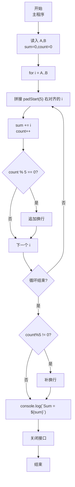
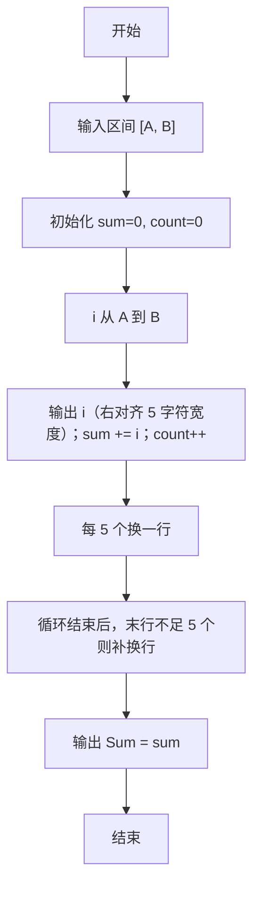

# 7-14 求整数段和（JavaScript实现）

## 前言

本文是 PTA 编程题“7-14 求整数段和”的题解，涵盖题目描述、输入输出格式及 JavaScript 实现，展示整数段循环遍历、按 5 个一行右对齐格式化输出及累加求和的完整流程。

本题（7-14 求整数段和）的主要考点是：准确理解题意、规范处理输入输出格式，并正确处理边界与精度。下面先给出题目描述与格式要求，再通过清晰的思路与可直接运行的javascript实现代码进行讲解。

## 题目描述

给定两个整数A和B，输出从A到B的所有整数以及这些数的和。

## 输入格式

输入在一行中给出2个整数A和B，其中−100≤A≤B≤100，其间以空格分隔。

## 输出格式

首先顺序输出从A到B的所有整数，每5个数字占一行，每个数字占5个字符宽度，向右对齐。最后在一行中按Sum = X的格式输出全部数字的和X。

## 输入样例

```in
-3 8
```

## 输出样例

```out
   -3   -2   -1    0    1
    2    3    4    5    6
    7    8
Sum = 30
```

## 解题思路

这道题的核心是**区间整数输出 + 格式化 + 累加求和**三个任务在一个循环里同步完成。

### 核心问题分析

1. **区间边界**：A ≤ B，循环 i 从 A 到 B（含）。
2. **格式化**：用 `String(i).padStart(5)` 固定 5 字符宽度右对齐。
3. **换行控制**：每 5 个换一行（count 计数自增后取模 5 === 0 时换行）。
4. **末行补换行**：如果最后一行不足 5 个（count%5 !== 0），也要补一个换行，确保 Sum 行独立。
5. **求和**：每次打印后 sum += i，最后输出 `Sum = ${sum}`。

### 算法原理说明

单 for 循环内并行处理三件事：
1. 用 String(i).padStart(5) 右对齐拼接输出；
2. sum += i：求和；
3. count++，判断 count%5 是否为 0 决定换行。
循环结束后若 count%5 !== 0 补换行，最后打印 Sum。

### 具体计算步骤

1. 用 readline 读取一行输入，parseInt 解析 A、B
2. sum=0, count=0
3. for (i=A; i<=B; i++)：
   - 用 String(i).padStart(5) 右对齐拼接
   - sum += i
   - count++
   - if (count%5===0) 添加换行
4. if (count%5 !== 0) 补一个换行
5. console.log(`Sum = ${sum}`)

## 完整代码

```javascript
// 题目：7-14 求整数段和
// 要求：实现「求整数段和」（题目 7-14）的输入处理与结果输出。
// 实现原理：
//   1. 区间边界：A ≤ B，循环 i 从 A 到 B（含）。
//   2. 格式化：用 `String(i).padStart(5)` 固定 5 字符宽度右对齐。
//   3. 换行控制：每 5 个换一行（count 计数自增后取模 5 === 0 时换行）。

const readline = require('readline'); // 引入 readline 模块
const rl = readline.createInterface({ input: process.stdin, output: process.stdout }); // 创建输入输出接口

rl.on('line', (line) => { // 监听一行输入
    const parts = line.trim().split(/\s+/); // 按空格分割输入
    const A = parseInt(parts[0], 10); // 读取起始整数A
    const B = parseInt(parts[1], 10); // 读取结束整数B
    let sum = 0, count = 0; // 定义总和和计数
    let output = ''; // 收集输出的字符串

    for (let i = A; i <= B; i++) { // 从A到B遍历每个整数
        output += String(i).padStart(5); // 以5个字符宽度右对齐拼接当前整数
        sum += i; // 累加到总和
        count++; // 计数加1
        if (count % 5 === 0) { // 每5个数换一行
            output += '\n'; // 添加换行
        }
    }

    if (count % 5 !== 0) { // 如果最后一行不足5个数
        output += '\n'; // 补一个换行
    }

    console.log(output + `Sum = ${sum}`); // 输出所有整数和总和
    rl.close(); // 关闭接口
});
```

## 代码流程说明

### 1. 变量与输入
- A、B：区间端点（parseInt 解析）
- sum = 0：累加器
- count = 0：每行计数
- 用 readline 读取一行输入，split 分割后 parseInt 解析 A、B

### 2. 单循环三重任务
- **输出**：String(i).padStart(5)，固定 5 字符宽度右对齐（负数会自动显示负号并占一位）
- **累加**：sum += i
- **换行**：count++ 后如果 count % 5 === 0 → 追加换行

### 3. 末行补换行
- 若 count % 5 !== 0（最后一行不足 5 个）→ 补一个换行，确保 Sum 行独立

### 4. 输出 Sum
- console.log(`Sum = ${sum}`)

## 代码流程图



## 解题流程图



## 代码解析

### 变量与输入

```javascript
const readline = require('readline'); // 引入 readline 模块
const rl = readline.createInterface({ input: process.stdin, output: process.stdout }); // 创建输入输出接口
```

变量与输入

### 单循环三重任务

```javascript
rl.on('line', (line) => { // 监听一行输入
    const parts = line.trim().split(/\s+/); // 按空格分割输入
    const A = parseInt(parts[0], 10); // 读取起始整数A
    const B = parseInt(parts[1], 10); // 读取结束整数B
    let sum = 0, count = 0; // 定义总和和计数
    let output = ''; // 收集输出的字符串
```

单循环三重任务

### 末行补换行

```javascript
for (let i = A; i <= B; i++) { // 从A到B遍历每个整数
        output += String(i).padStart(5); // 以5个字符宽度右对齐拼接当前整数
        sum += i; // 累加到总和
        count++; // 计数加1
        if (count % 5 === 0) { // 每5个数换一行
            output += '\n'; // 添加换行
        }
    }
```

末行补换行

### 输出 Sum

```javascript
if (count % 5 !== 0) { // 如果最后一行不足5个数
        output += '\n'; // 补一个换行
    }
```

输出 Sum


## 复杂度分析

设输入规模为 $n$（对数值类题目为参与运算的数据量，对字符串/序列类题目为长度）。

- **时间复杂度**：$O(n)$ 或 $O(n \log n)$，主要来自一次线性遍历与常数次数学运算，无嵌套高复杂度循环。
- **空间复杂度**：$O(n)$，用于存储输入、中间结果与输出字符串；若仅使用若干标量变量则为 $O(1)$。

## 常见易错点

### 1. 输入/输出格式不符
错误：多余空格、遗漏换行、大小写或精度不符。后果：判题系统判为格式错误。正确：严格按题目要求的格式输出，数值用合适精度。

### 2. 边界条件遗漏
错误：未处理 0、最小值、单字符或空输入等边界。后果：特例 WA。正确：先列出所有边界样例，在编码前单独分支处理。

### 3. 整数溢出与类型
错误：使用过小的整数类型或忽略负号。后果：大数计算溢出。正确：按数据范围选择合适类型，必要时用更大整数类型或字符串处理。

## 更多测试

### 测试一：常规边界

**输入：**

```text
（可取题目边界附近的值，如最小值或最大值）
```

**输出：**

```text
（依据题意推导的正确结果）
```

### 测试二：特殊用例

**输入：**

```text
（可取易错点，如 0、单一元素、全同值等）
```

**输出：**

```text
（对应正确结果）
```

## 总结

本文是 PTA 编程题“7-14 求整数段和”的题解，涵盖题目描述、输入输出格式及 JavaScript 实现，展示整数段循环遍历、按 5 个一行右对齐格式化输出及累加求和的完整流程。

本题的核心在于理清「求整数段和」的输入输出关系与边界处理：先按格式读取输入，再依据规则逐步计算或遍历，最后按规范输出。该思路可迁移到同类格式化输入输出与模拟计算的题目。
