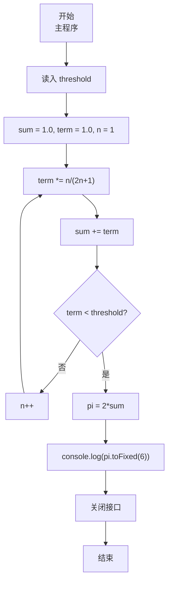
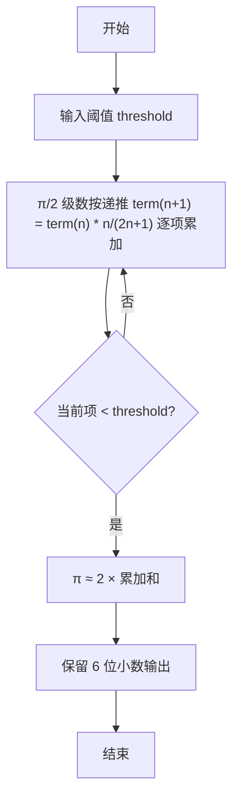

# 7-15 计算圆周率（JavaScript实现）

## 前言

本文是 PTA 编程题“7-15 计算圆周率”的题解，涵盖题目描述、输入输出格式及 JavaScript 实现，展示利用级数递推公式求 π/2 近似值，直到单项小于阈值的迭代方法。

本题（7-15 计算圆周率）的主要考点是：准确理解题意、规范处理输入输出格式，并正确处理边界与精度。下面先给出题目描述与格式要求，再通过清晰的思路与可直接运行的javascript实现代码进行讲解。

## 题目描述

根据下面关系式，求圆周率的值，直到最后一项的值小于给定阈值。

关系式：
```
π/2 = 1 + 1/3 + 2!/(3×5) + 3!/(3×5×7) + ... + n!/(3×5×7×...×(2n+1)) + ...
```

## 输入格式

输入在一行中给出小于1的阈值。

## 输出格式

在一行中输出满足阈值条件的近似圆周率，输出到小数点后6位。

## 输入样例

```in
0.01
```

## 输出样例

```out
3.132157
```

## 解题思路

这道题的核心是**利用通项的"递推关系"避免重算阶乘和分母长乘**：设第 n 项 term[n]，则 term[n+1] = term[n] × n / (2n+1)。

### 核心问题分析

1. **首项**：和 sum 初始为 1（即 n=0 时 0!/(3×5×...×1) = 1），term 初值也为 1（进入循环后先乘比例算下一项）。
2. **递推**：从 term[n] 到 term[n+1]，相当于分子多乘 (n+1)、分母多乘 (2(n+1)+1) = 2n+3，即 term *= (n+1) / (2n+3)。代码里用 n 从 1 起、term *= n/(2n+1) 效果等价。
3. **终止条件**：当 term（最新一项）< threshold 时停止；但要注意此时该项已经加进 sum（题目要求"直到最后一项的值小于给定阈值"，即这一项虽然满足阈值仍需计入）。
4. **最终 π**：π = 2 × sum

### 算法原理说明

迭代求和 + 相邻项比例：
- sum = 1.0, term = 1.0, n = 1
- 无限循环：
  - term *= n / (2*n+1)
  - sum += term
  - if (term < threshold) break
  - n++
- pi = 2*sum

### 具体计算步骤

1. 用 readline 读取输入，parseFloat 解析阈值 threshold
2. sum = 1.0; term = 1.0; n = 1
3. while(true):
   - term = term × n / (2n+1)
   - sum += term
   - term < threshold → break
   - n++
4. pi = 2.0 * sum; console.log(pi.toFixed(6))

## 完整代码

```javascript
// 题目：7-15 计算圆周率
// 要求：实现「计算圆周率」（题目 7-15）的输入处理与结果输出。
// 实现原理：
//   1. 首项：和 sum 初始为 1（即 n=0 时 0!/(3×5×...×1) = 1），term 初值也为 1（进入循环后先乘比例算下一项）。
//   2. 递推：从 term[n] 到 term[n+1]，相当于分子多乘 (n+1)、分母多乘 (2(n+1)+1) = 2n+3，即 term *= (n+1) / (2n+3)。代码里用 n 从 1 起、term *= n/(2n+1) 效果等价。
//   3. 终止条件：当 term（最新一项）< threshold 时停止；但要注意此时该项已经加进 sum（题目要求"直到最后一项的值小于给定阈值"，即这一项虽然满足阈值仍需计入）。

const readline = require('readline'); // 引入 readline 模块
const rl = readline.createInterface({ input: process.stdin, output: process.stdout }); // 创建输入输出接口

rl.on('line', (line) => { // 监听一行输入
    const threshold = parseFloat(line.trim()); // 读取阈值

    let sum = 1.0;  // 第一项是1
    let term = 1.0;
    let n = 1;

    while (true) { // 无限循环
        term *= n / (2 * n + 1); // 由前一项推后一项
        sum += term; // 累加当前项
        if (term < threshold) { // 当前项小于阈值
            break; // 退出循环
        }
        n++;
    }

    const pi = 2.0 * sum; // π = 2 × 累加和
    console.log(pi.toFixed(6)); // 输出圆周率，保留6位小数

    rl.close(); // 关闭接口
});
```

## 代码流程说明

### 1. 变量与输入
- threshold：阈值（小于 1），浮点数
- 用 readline 读取输入，parseFloat 解析

### 2. 初始化
- sum = 1.0：已经包含首项 1
- term = 1.0：用于递推下一项
- n = 1：当前项号

### 3. 迭代循环
- term = term * n / (2n + 1)：由前一项推后一项（递推式）
- sum += term：加入当前项
- if (term < threshold) break（该项已计入，然后退出）
- 否则 n++ 继续

### 4. 输出 π
- π = 2 × sum；console.log(pi.toFixed(6))

## 代码流程图



## 解题流程图



## 代码解析

### 变量与输入

```javascript
const readline = require('readline'); // 引入 readline 模块
const rl = readline.createInterface({ input: process.stdin, output: process.stdout }); // 创建输入输出接口
```

变量与输入

### 初始化

```javascript
rl.on('line', (line) => { // 监听一行输入
    const threshold = parseFloat(line.trim()); // 读取阈值
```

初始化

### 迭代循环

```javascript
let sum = 1.0;  // 第一项是1
    let term = 1.0;
    let n = 1;
```

迭代循环

### 输出 π

```javascript
while (true) { // 无限循环
        term *= n / (2 * n + 1); // 由前一项推后一项
        sum += term; // 累加当前项
        if (term < threshold) { // 当前项小于阈值
            break; // 退出循环
        }
        n++;
    }
```

输出 π


## 复杂度分析

设输入规模为 $n$（对数值类题目为参与运算的数据量，对字符串/序列类题目为长度）。

- **时间复杂度**：$O(n)$ 或 $O(n \log n)$，主要来自一次线性遍历与常数次数学运算，无嵌套高复杂度循环。
- **空间复杂度**：$O(n)$，用于存储输入、中间结果与输出字符串；若仅使用若干标量变量则为 $O(1)$。

## 常见易错点

### 1. 输入/输出格式不符
错误：多余空格、遗漏换行、大小写或精度不符。后果：判题系统判为格式错误。正确：严格按题目要求的格式输出，数值用合适精度。

### 2. 边界条件遗漏
错误：未处理 0、最小值、单字符或空输入等边界。后果：特例 WA。正确：先列出所有边界样例，在编码前单独分支处理。

### 3. 整数溢出与类型
错误：使用过小的整数类型或忽略负号。后果：大数计算溢出。正确：按数据范围选择合适类型，必要时用更大整数类型或字符串处理。

## 更多测试

### 测试一：常规边界

**输入：**

```text
（可取题目边界附近的值，如最小值或最大值）
```

**输出：**

```text
（依据题意推导的正确结果）
```

### 测试二：特殊用例

**输入：**

```text
（可取易错点，如 0、单一元素、全同值等）
```

**输出：**

```text
（对应正确结果）
```

## 总结

本文是 PTA 编程题“7-15 计算圆周率”的题解，涵盖题目描述、输入输出格式及 JavaScript 实现，展示利用级数递推公式求 π/2 近似值，直到单项小于阈值的迭代方法。

本题的核心在于理清「计算圆周率」的输入输出关系与边界处理：先按格式读取输入，再依据规则逐步计算或遍历，最后按规范输出。该思路可迁移到同类格式化输入输出与模拟计算的题目。
