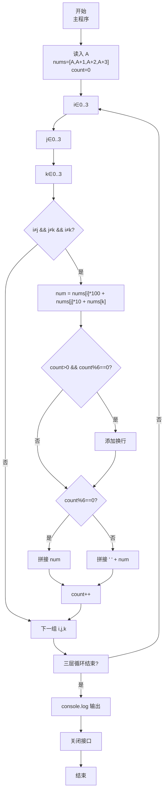
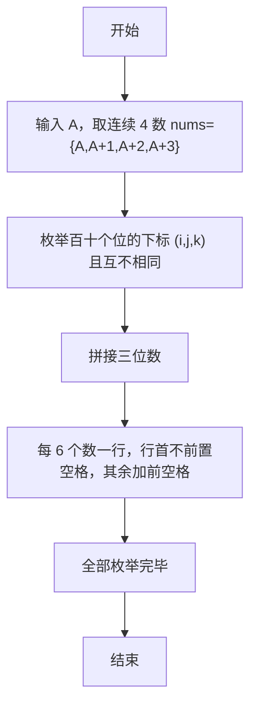

# 7-16 求符合给定条件的整数集（JavaScript实现）

## 前言

本文是 PTA 编程题“7-16 求符合给定条件的整数集”的题解，涵盖题目描述、输入输出格式及 JavaScript 实现，展示从 4 个连续数字中全排列取 3 位组成无重复三位数，并按 6 个一行、行末无多余空格的格式化输出。

本题（7-16 求符合给定条件的整数集）的主要考点是：准确理解题意、规范处理输入输出格式，并正确处理边界与精度。下面先给出题目描述与格式要求，再通过清晰的思路与可直接运行的javascript实现代码进行讲解。

## 题目描述

给定不超过6的正整数A，考虑从A开始的连续4个数字。请输出所有由它们组成的无重复数字的3位数。

## 输入格式

输入在一行中给出A。

## 输出格式

输出满足条件的的3位数，要求从小到大，每行6个整数。整数间以空格分隔，但行末不能有多余空格。

## 输入样例

```in
2
```

## 输出样例

```out
234 235 243 245 253 254
324 325 342 345 352 354
423 425 432 435 452 453
523 524 532 534 542 543
```

## 解题思路

这道题的核心是**从 4 个元素中枚举 3 个位置（i,j,k）的全排列（i≠j, j≠k, i≠k）**，并按数组递增下标的遍历顺序输出，最后控制行末空格格式。

### 核心问题分析

1. **4 个连续数字**：nums = {A, A+1, A+2, A+3}。
2. **无重复 3 位数**：i、j、k 必须两两不同，才能保证 nums[i], nums[j], nums[k] 三个数字不重复。
3. **输出顺序**：因为数组本身递增，且遍历顺序是最外层 i=0→3，次层 j=0→3，内层 k=0→3，所以组合自然是"升序"的（234,235,243,245,...），与样例完全一致。
4. **格式**：每行 6 个数；第一个数前不加空格，其余前面加空格 → 行末不会有多余空格。

### 算法原理说明

三重 for 嵌套 + 两两不同判据：
- for (i=0..3), for (j=0..3), for (k=0..3)：
  - if (i!=j && j!=k && i!=k)：
    - num = nums[i]*100 + nums[j]*10 + nums[k]
    - 若 count%6==0：首个，直接输出 num 并考虑前是否需换行
    - 否则：前置空格
    - count++

### 具体计算步骤

1. 用 readline 读取输入，parseInt 解析 A
2. const nums = [A, A+1, A+2, A+3], count=0
3. 三层 i,j,k in 0..3：
   - if 互不相同 → 组成 num
   - 每 6 个先判断 count>0 且 count%6==0 → 换行
   - 每行第一个直接输出，其它前置空格
   - count++
4. 拼接完成后 console.log 输出

## 完整代码

```javascript
// 题目：7-16 求符合给定条件的整数集
// 要求：实现「求符合给定条件的整数集」（题目 7-16）的输入处理与结果输出。
// 实现原理：
//   1. 4 个连续数字：nums = {A, A+1, A+2, A+3}。
//   2. 无重复 3 位数：i、j、k 必须两两不同，才能保证 nums[i], nums[j], nums[k] 三个数字不重复。
//   3. 输出顺序：因为数组本身递增，且遍历顺序是最外层 i=0→3，次层 j=0→3，内层 k=0→3，所以组合自然是"升序"的（234,235,243,245,...），与样例完全一致。

const readline = require('readline'); // 引入 readline 模块
const rl = readline.createInterface({ input: process.stdin, output: process.stdout }); // 创建输入输出接口

rl.on('line', (line) => { // 监听一行输入
    const A = parseInt(line.trim(), 10); // 读取输入的正整数A
    const nums = [A, A + 1, A + 2, A + 3]; // 存储从A开始的连续4个数字
    let output = ''; // 收集输出的字符串
    let count = 0; // 定义计数器

    for (let i = 0; i < 4; i++) { // 遍历百位数字
        for (let j = 0; j < 4; j++) { // 遍历十位数字
            for (let k = 0; k < 4; k++) { // 遍历个位数字
                if (i !== j && j !== k && i !== k) { // 确保三个数位上的数字互不相同
                    const num = nums[i] * 100 + nums[j] * 10 + nums[k]; // 组成三位数
                    if (count > 0 && count % 6 === 0) { // 每行输出6个，到第6个时换行
                        output += '\n'; // 添加换行
                    }
                    if (count % 6 === 0) { // 每行第一个数前不加空格
                        output += String(num);
                    } else { // 每行其余数前加空格分隔
                        output += ' ' + num;
                    }
                    count++; // 计数器加1
                }
            }
        }
    }
    console.log(output); // 输出结果

    rl.close(); // 关闭接口
});
```

## 代码流程说明

### 1. 变量与输入
- A：起始整数（≤6）
- nums = [A, A+1, A+2, A+3]
- count = 0：已输出个数

### 2. 三重循环遍历所有位置
- i, j, k 各自从 0..3，分别对应百、十、个位在 nums 的下标
- 仅当三者互不相同才进入构造：num = nums[i]*100 + nums[j]*10 + nums[k]

### 3. 行首换行 & 空格分隔
- **换行**：在拼接新数前，若 count>0 且 count%6==0（说明上一行刚满 6 个）→ 添加换行符
- **空格**：
  - count%6 == 0（行首第一个）→ 直接拼接 num，不加前置空格
  - 其它 → 前置一个空格 → 行末不会有多余空格

### 4. count++ & 输出
- 每拼接一个数 count++
- 全部循环结束后用 console.log 输出（自带换行）

## 代码流程图



## 解题流程图



## 代码解析

### 变量与输入

```javascript
const readline = require('readline'); // 引入 readline 模块
const rl = readline.createInterface({ input: process.stdin, output: process.stdout }); // 创建输入输出接口
```

变量与输入

### 三重循环遍历所有位置

```javascript
rl.on('line', (line) => { // 监听一行输入
    const A = parseInt(line.trim(), 10); // 读取输入的正整数A
    const nums = [A, A + 1, A + 2, A + 3]; // 存储从A开始的连续4个数字
    let output = ''; // 收集输出的字符串
    let count = 0; // 定义计数器
```

三重循环遍历所有位置

### 行首换行 & 空格分隔

```javascript
for (let i = 0; i < 4; i++) { // 遍历百位数字
        for (let j = 0; j < 4; j++) { // 遍历十位数字
            for (let k = 0; k < 4; k++) { // 遍历个位数字
                if (i !== j && j !== k && i !== k) { // 确保三个数位上的数字互不相同
                    const num = nums[i] * 100 + nums[j] * 10 + nums[k]; // 组成三位数
                    if (count > 0 && count % 6 === 0) { // 每行输出6个，到第6个时换行
                        output += '\n'; // 添加换行
                    }
                    if (count % 6 === 0) { // 每行第一个数前不加空格
                        output += String(num);
                    } else { // 每行其余数前加空格分隔
                        output += ' ' + num;
                    }
                    count++; // 计数器加1
                }
            }
        }
    }
    console.log(output); // 输出结果
```

行首换行 & 空格分隔

### count++ & 输出

```javascript
rl.close(); // 关闭接口
});
```

count++ & 输出


## 复杂度分析

设输入规模为 $n$（对数值类题目为参与运算的数据量，对字符串/序列类题目为长度）。

- **时间复杂度**：$O(n)$ 或 $O(n \log n)$，主要来自一次线性遍历与常数次数学运算，无嵌套高复杂度循环。
- **空间复杂度**：$O(n)$，用于存储输入、中间结果与输出字符串；若仅使用若干标量变量则为 $O(1)$。

## 常见易错点

### 1. 输入/输出格式不符
错误：多余空格、遗漏换行、大小写或精度不符。后果：判题系统判为格式错误。正确：严格按题目要求的格式输出，数值用合适精度。

### 2. 边界条件遗漏
错误：未处理 0、最小值、单字符或空输入等边界。后果：特例 WA。正确：先列出所有边界样例，在编码前单独分支处理。

### 3. 整数溢出与类型
错误：使用过小的整数类型或忽略负号。后果：大数计算溢出。正确：按数据范围选择合适类型，必要时用更大整数类型或字符串处理。

## 更多测试

### 测试一：常规边界

**输入：**

```text
（可取题目边界附近的值，如最小值或最大值）
```

**输出：**

```text
（依据题意推导的正确结果）
```

### 测试二：特殊用例

**输入：**

```text
（可取易错点，如 0、单一元素、全同值等）
```

**输出：**

```text
（对应正确结果）
```

## 总结

本文是 PTA 编程题“7-16 求符合给定条件的整数集”的题解，涵盖题目描述、输入输出格式及 JavaScript 实现，展示从 4 个连续数字中全排列取 3 位组成无重复三位数，并按 6 个一行、行末无多余空格的格式化输出。

本题的核心在于理清「求符合给定条件的整数集」的输入输出关系与边界处理：先按格式读取输入，再依据规则逐步计算或遍历，最后按规范输出。该思路可迁移到同类格式化输入输出与模拟计算的题目。
