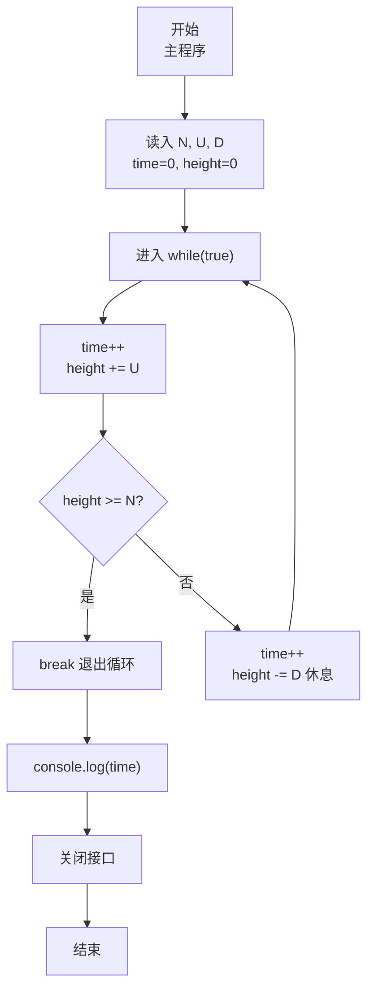
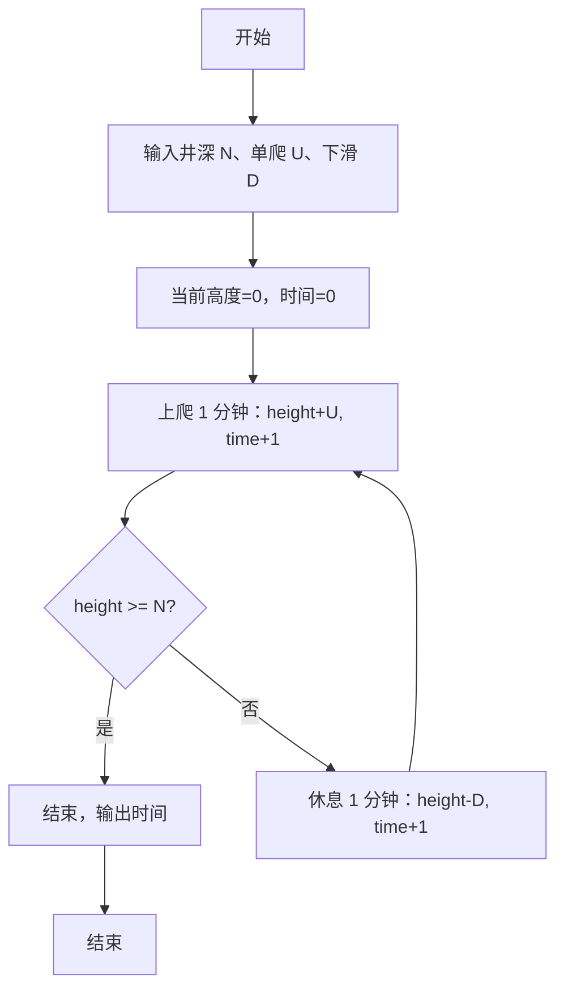

# 7-17 爬动的蠕虫（JavaScript实现）

## 前言

本文是 PTA 编程题“7-17 爬动的蠕虫”的题解，涵盖题目描述、输入输出格式及 JavaScript 实现，展示模拟"上爬 U 寸 → 未出则休息下滑 D 寸 → 时间累加"循环直到蠕虫爬出井口的过程。

本题（7-17 爬动的蠕虫）的主要考点是：准确理解题意、规范处理输入输出格式，并正确处理边界与精度。下面先给出题目描述与格式要求，再通过清晰的思路与可直接运行的javascript实现代码进行讲解。

## 题目描述

一条蠕虫长1寸，在一口深为N寸的井的底部。已知蠕虫每1分钟可以向上爬U寸，但必须休息1分钟才能接着往上爬。在休息的过程中，蠕虫又下滑了D寸。就这样，上爬和下滑重复进行。请问，蠕虫需要多长时间才能爬出井？

这里要求不足1分钟按1分钟计，并且假定只要在某次上爬过程中蠕虫的头部到达了井的顶部，那么蠕虫就完成任务了。初始时，蠕虫是趴在井底的（即高度为0）。

## 输入格式

输入在一行中顺序给出3个正整数N、U、D，其中D<U，N不超过100。

## 输出格式

在一行中输出蠕虫爬出井的时间，以分钟为单位。

## 输入样例

```in
12 3 1
```

## 输出样例

```out
11
```

## 解题思路

这道题的核心是**模拟 2 分钟一个周期（爬 1 分钟 + 若未出井则休息 1 分钟下滑）**，直到某次上爬后高度 ≥ N（上爬这 1 分钟已经计入）。

### 核心问题分析

1. **爬 1 分钟**：height += U，time++。
2. **判定是否到顶**：如果 height ≥ N，立刻 break（不需要再休息）。
3. **否则**：休息 1 分钟 → time++，height -= D。
4. **循环条件**：用 while(true) 无限循环，每次爬完都可能跳出。

### 算法原理说明

直接按题意模拟：
- time=0, height=0
- 循环：
  - time++; height += U → 若 height ≥ N，break
  - time++; height -= D
- 最后 console.log(time)

### 具体计算步骤

1. 用 readline 读取一行输入，parseInt 解析 N、U、D
2. time = 0, height = 0
3. while(true):
   - time++; height += U
   - if (height >= N) break
   - time++; height -= D
4. console.log(time)

## 完整代码

```javascript
// 题目：7-17 爬动的蠕虫
// 要求：实现「爬动的蠕虫」（题目 7-17）的输入处理与结果输出。
// 实现原理：
//   1. 爬 1 分钟：height += U，time++。
//   2. 判定是否到顶：如果 height ≥ N，立刻 break（不需要再休息）。
//   3. 否则：休息 1 分钟 → time++，height -= D。

const readline = require('readline'); // 引入 readline 模块
const rl = readline.createInterface({ input: process.stdin, output: process.stdout }); // 创建输入输出接口

rl.on('line', (line) => { // 监听一行输入
    const parts = line.trim().split(/\s+/); // 按空格分割输入
    const N = parseInt(parts[0], 10); // 井深N
    const U = parseInt(parts[1], 10); // 上爬距离U
    const D = parseInt(parts[2], 10); // 下滑距离D
    let time = 0, height = 0; // time为时间，height为当前高度

    while (true) { // 无限循环，直到蠕虫爬出井
        time++; // 时间加1分钟
        height += U; // 蠕虫上爬U寸
        if (height >= N) { // 判断是否到达或超过井口
            break; // 爬出井，退出循环
        }

        time++; // 休息1分钟，时间加1
        height -= D; // 休息期间下滑D寸
    }

    console.log(time); // 输出爬出井的总时间
    rl.close(); // 关闭接口
});
```

## 代码流程说明

### 1. 变量与输入
- N, U, D：井深、一次上爬距离、休息下滑距离（parseInt 解析）
- time = 0, height = 0：累计分钟数、当前高度（从 0 起）
- 用 readline 读取一行输入，split 分割后 parseInt 解析

### 2. while(true) 模拟
1. **上爬阶段**：time++；height += U；
   - 若此时 height ≥ N → 已爬出，立刻 break（不经历休息）
2. **休息阶段**（仅在未出井时执行）：time++；height -= D

### 3. 输出 time

## 代码流程图



## 解题流程图



## 代码解析

### 变量与输入

```javascript
const readline = require('readline'); // 引入 readline 模块
const rl = readline.createInterface({ input: process.stdin, output: process.stdout }); // 创建输入输出接口
```

变量与输入

### while(true) 模拟

```javascript
rl.on('line', (line) => { // 监听一行输入
    const parts = line.trim().split(/\s+/); // 按空格分割输入
    const N = parseInt(parts[0], 10); // 井深N
    const U = parseInt(parts[1], 10); // 上爬距离U
    const D = parseInt(parts[2], 10); // 下滑距离D
    let time = 0, height = 0; // time为时间，height为当前高度
```

while(true) 模拟

### 上爬阶段

```javascript
while (true) { // 无限循环，直到蠕虫爬出井
        time++; // 时间加1分钟
        height += U; // 蠕虫上爬U寸
        if (height >= N) { // 判断是否到达或超过井口
            break; // 爬出井，退出循环
        }
```

上爬阶段

### 休息阶段

```javascript
time++; // 休息1分钟，时间加1
        height -= D; // 休息期间下滑D寸
    }
```

休息阶段

### 输出 time

```javascript
console.log(time); // 输出爬出井的总时间
    rl.close(); // 关闭接口
});
```

输出 time


## 复杂度分析

设输入规模为 $n$（对数值类题目为参与运算的数据量，对字符串/序列类题目为长度）。

- **时间复杂度**：$O(n)$ 或 $O(n \log n)$，主要来自一次线性遍历与常数次数学运算，无嵌套高复杂度循环。
- **空间复杂度**：$O(n)$，用于存储输入、中间结果与输出字符串；若仅使用若干标量变量则为 $O(1)$。

## 常见易错点

### 1. 输入/输出格式不符
错误：多余空格、遗漏换行、大小写或精度不符。后果：判题系统判为格式错误。正确：严格按题目要求的格式输出，数值用合适精度。

### 2. 边界条件遗漏
错误：未处理 0、最小值、单字符或空输入等边界。后果：特例 WA。正确：先列出所有边界样例，在编码前单独分支处理。

### 3. 整数溢出与类型
错误：使用过小的整数类型或忽略负号。后果：大数计算溢出。正确：按数据范围选择合适类型，必要时用更大整数类型或字符串处理。

## 更多测试

### 测试一：常规边界

**输入：**

```text
（可取题目边界附近的值，如最小值或最大值）
```

**输出：**

```text
（依据题意推导的正确结果）
```

### 测试二：特殊用例

**输入：**

```text
（可取易错点，如 0、单一元素、全同值等）
```

**输出：**

```text
（对应正确结果）
```

## 总结

本文是 PTA 编程题“7-17 爬动的蠕虫”的题解，涵盖题目描述、输入输出格式及 JavaScript 实现，展示模拟"上爬 U 寸 → 未出则休息下滑 D 寸 → 时间累加"循环直到蠕虫爬出井口的过程。

本题的核心在于理清「爬动的蠕虫」的输入输出关系与边界处理：先按格式读取输入，再依据规则逐步计算或遍历，最后按规范输出。该思路可迁移到同类格式化输入输出与模拟计算的题目。
