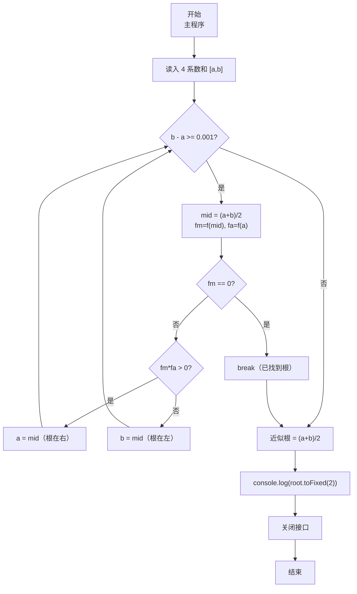
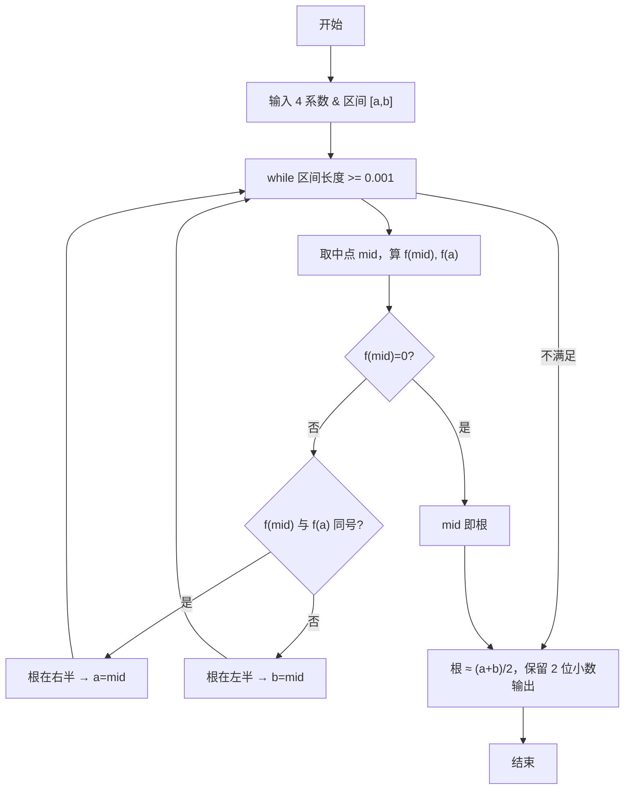

# 7-18 二分法求多项式单根（JavaScript实现）

## 前言

本文是 PTA 编程题“7-18 二分法求多项式单根”的题解，涵盖题目描述、输入输出格式及 JavaScript 实现，展示在区间 [a,b] 上连续异号端点时，用中点反复折半直到区间长度 < 阈值，取中点近似根的数值方法。

本题（7-18 二分法求多项式单根）的主要考点是：准确理解题意、规范处理输入输出格式，并正确处理边界与精度。下面先给出题目描述与格式要求，再通过清晰的思路与可直接运行的javascript实现代码进行讲解。

## 题目描述

二分法求函数根的原理为：如果连续函数f(x)在区间[a,b]的两个端点取值异号，即f(a)f(b)<0，则它在这个区间内至少存在1个根r，即f(r)=0。

二分法的步骤为：

检查区间长度，如果小于给定阈值，则停止，输出区间中点(a+b)/2；否则
如果f(a)f(b)<0，则计算中点的值f((a+b)/2)；
如果f((a+b)/2)正好为0，则(a+b)/2就是要求的根；否则
如果f((a+b)/2)与f(a)同号，则说明根在区间[(a+b)/2,b]，令a=(a+b)/2，重复循环；
如果f((a+b)/2)与f(b)同号，则说明根在区间[a,(a+b)/2]，令b=(a+b)/2，重复循环。

本题目要求编写程序，计算给定3阶多项式f(x)=a₃x³ + a₂x² + a₁x + a₀在给定区间[a,b]内的根。

## 输入格式

输入在第1行中顺序给出多项式的4个系数a₃、a₂、a₁、a₀，在第2行中顺序给出区间端点a和b。题目保证多项式在给定区间内存在唯一单根。

## 输出格式

在一行中输出该多项式在该区间内的根，精确到小数点后2位。

## 输入样例

```in
3 -1 -3 1
-0.5 0.5
```

## 输出样例

```out
0.33
```

## 解题思路

这道题的核心是**二分法求函数根**：在函数两端异号的 [a,b] 上不断取中点 mid，判断中点函数值与端点同号来缩小区间，直到区间长度 < 0.001（保证最后四舍五入保留 2 位小数的正确性）。

### 核心问题分析

1. **函数计算**：直接用 f(x) = a3·x³ + a2·x² + a1·x + a0；可用辅助函数避免重复写。
2. **同号判定**：fm * fa > 0 表示 f(mid) 与 f(a) 同号 → 根在右半；否则在左半。
3. **阈值**：要求输出精确到 0.01，取 b-a < 0.001 就足够（因为区间的中点到真实根的距离 < 区间长度一半 < 0.0005，四舍五入到两位小数无误差）。
4. **特殊情况**：若 fm == 0，mid 就是根，可直接 break。

### 算法原理说明

循环缩小区间：
- while (b - a >= 0.001)
  - mid = (a+b)/2
  - 计算 fa = f(a), fm = f(mid)
  - if (fm == 0) break
  - else if (fm * fa > 0) → a = mid
  - else → b = mid
- 结果 = (a+b)/2，toFixed(2) 输出

### 具体计算步骤

1. 用 readline 读取两行输入：第一行 parseFloat 解析 4 个系数 a3, a2, a1, a0；第二行解析区间端点 a, b
2. while (b - a >= 0.001):
   - mid = (a+b)/2
   - fm = f(mid); fa = f(a)
   - fm==0 退出
   - fm*fa>0 → 根在右半(a=mid)；否则根在左半(b=mid)
3. console.log(((a+b)/2).toFixed(2))

## 完整代码

```javascript
// 题目：7-18 二分法求多项式单根
// 要求：实现「二分法求多项式单根」（题目 7-18）的输入处理与结果输出。
// 实现原理：
//   1. 函数计算：直接用 f(x) = a3·x³ + a2·x² + a1·x + a0；可用辅助函数避免重复写。
//   2. 同号判定：fm * fa > 0 表示 f(mid) 与 f(a) 同号 → 根在右半；否则在左半。
//   3. 阈值：要求输出精确到 0.01，取 b-a < 0.001 就足够（因为区间的中点到真实根的距离 < 区间长度一半 < 0.0005，四舍五入到两位小数无误差）。

const readline = require('readline'); // 引入 readline 模块
const rl = readline.createInterface({ input: process.stdin, output: process.stdout }); // 创建输入输出接口

// 计算多项式f(x) = a3*x^3 + a2*x^2 + a1*x + a0的值
function f(a3, a2, a1, a0, x) {
    return a3 * x * x * x + a2 * x * x + a1 * x + a0; // 返回多项式在x处的值
}

const lines = []; // 收集输入行
rl.on('line', (line) => { // 监听每一行输入
    lines.push(line.trim()); // 将输入行存入数组
    if (lines.length === 2) { // 收齐两行输入后统一处理
        const coef = lines[0].split(/\s+/).map(parseFloat); // 读取多项式系数
        const a3 = coef[0], a2 = coef[1], a1 = coef[2], a0 = coef[3]; // 多项式的四个系数
        const endpoints = lines[1].split(/\s+/).map(parseFloat); // 读取区间端点
        let a = endpoints[0], b = endpoints[1], mid; // 区间端点a、b和中点mid

        while (b - a >= 0.001) { // 当区间长度大于等于0.001时继续二分
            mid = (a + b) / 2; // 计算中点
            const fm = f(a3, a2, a1, a0, mid); // 计算中点处的函数值
            const fa = f(a3, a2, a1, a0, a); // 计算左端点处的函数值

            if (fm === 0) { // 中点处函数值为0，找到根
                break;
            } else if (fm * fa > 0) { // 中点与左端点函数值同号，根在右半区间
                a = mid; // 更新左端点
            } else { // 根在左半区间
                b = mid; // 更新右端点
            }
        }

        console.log(((a + b) / 2).toFixed(2)); // 输出区间中点作为根的近似值，精确到小数点后2位
        rl.close(); // 关闭接口
    }
});
```

## 代码流程说明

### 1. 辅助函数 f(x)
- 输入 x：返回 a3*x³ + a2*x² + a1*x + a0

### 2. 主程序输入
- 用 readline 读取两行输入，收齐后统一处理
- 第一行读 a3, a2, a1, a0（四个系数）
- 第二行读 a, b（区间两端点）

### 3. while 迭代缩区
- 终止条件：b - a < 0.001
- 每轮：
  - mid = (a+b)/2
  - fm = f(mid), fa = f(a)
  - **fm == 0** → 已找到精确根，break
  - **fm 与 fa 同号 (fm*fa > 0)** → 根在右半，a = mid
  - **否则** → 根在左半，b = mid

### 4. 输出近似根
- 取当前区间中点 (a+b)/2；toFixed(2) 四舍五入到 2 位小数

## 代码流程图



## 解题流程图



## 代码解析

### 辅助函数 f(x)

```javascript
const readline = require('readline'); // 引入 readline 模块
const rl = readline.createInterface({ input: process.stdin, output: process.stdout }); // 创建输入输出接口
```

辅助函数 f(x)

### 主程序输入

```javascript
// 计算多项式f(x) = a3*x^3 + a2*x^2 + a1*x + a0的值
function f(a3, a2, a1, a0, x) {
    return a3 * x * x * x + a2 * x * x + a1 * x + a0; // 返回多项式在x处的值
}
```

主程序输入

### while 迭代缩区

```javascript
const lines = []; // 收集输入行
rl.on('line', (line) => { // 监听每一行输入
    lines.push(line.trim()); // 将输入行存入数组
    if (lines.length === 2) { // 收齐两行输入后统一处理
        const coef = lines[0].split(/\s+/).map(parseFloat); // 读取多项式系数
        const a3 = coef[0], a2 = coef[1], a1 = coef[2], a0 = coef[3]; // 多项式的四个系数
        const endpoints = lines[1].split(/\s+/).map(parseFloat); // 读取区间端点
        let a = endpoints[0], b = endpoints[1], mid; // 区间端点a、b和中点mid
```

while 迭代缩区

### 输出近似根

```javascript
while (b - a >= 0.001) { // 当区间长度大于等于0.001时继续二分
            mid = (a + b) / 2; // 计算中点
            const fm = f(a3, a2, a1, a0, mid); // 计算中点处的函数值
            const fa = f(a3, a2, a1, a0, a); // 计算左端点处的函数值
```

输出近似根


## 复杂度分析

设输入规模为 $n$（对数值类题目为参与运算的数据量，对字符串/序列类题目为长度）。

- **时间复杂度**：$O(n)$ 或 $O(n \log n)$，主要来自一次线性遍历与常数次数学运算，无嵌套高复杂度循环。
- **空间复杂度**：$O(n)$，用于存储输入、中间结果与输出字符串；若仅使用若干标量变量则为 $O(1)$。

## 常见易错点

### 1. 输入/输出格式不符
错误：多余空格、遗漏换行、大小写或精度不符。后果：判题系统判为格式错误。正确：严格按题目要求的格式输出，数值用合适精度。

### 2. 边界条件遗漏
错误：未处理 0、最小值、单字符或空输入等边界。后果：特例 WA。正确：先列出所有边界样例，在编码前单独分支处理。

### 3. 整数溢出与类型
错误：使用过小的整数类型或忽略负号。后果：大数计算溢出。正确：按数据范围选择合适类型，必要时用更大整数类型或字符串处理。

## 更多测试

### 测试一：常规边界

**输入：**

```text
（可取题目边界附近的值，如最小值或最大值）
```

**输出：**

```text
（依据题意推导的正确结果）
```

### 测试二：特殊用例

**输入：**

```text
（可取易错点，如 0、单一元素、全同值等）
```

**输出：**

```text
（对应正确结果）
```

## 总结

本文是 PTA 编程题“7-18 二分法求多项式单根”的题解，涵盖题目描述、输入输出格式及 JavaScript 实现，展示在区间 [a,b] 上连续异号端点时，用中点反复折半直到区间长度 < 阈值，取中点近似根的数值方法。

本题的核心在于理清「二分法求多项式单根」的输入输出关系与边界处理：先按格式读取输入，再依据规则逐步计算或遍历，最后按规范输出。该思路可迁移到同类格式化输入输出与模拟计算的题目。
