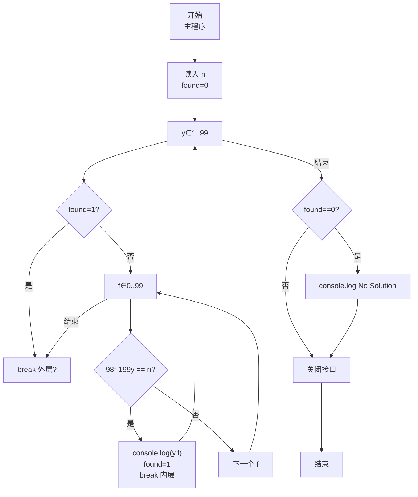
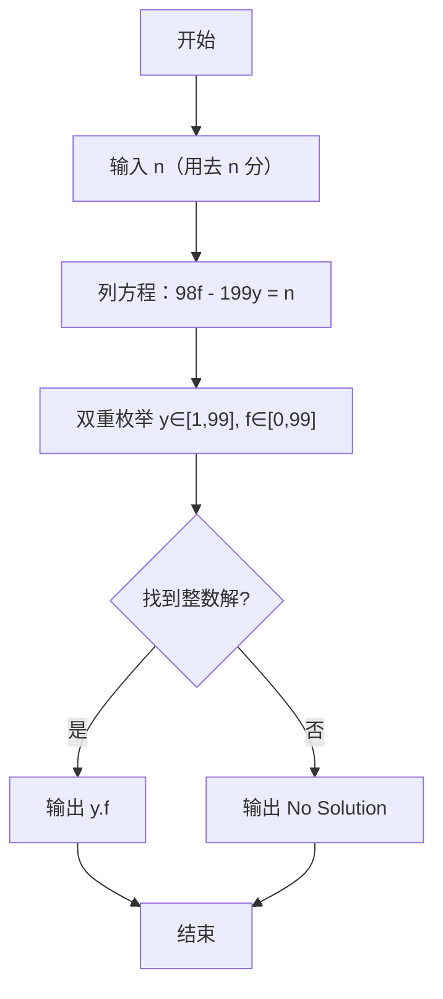

# 7-19 支票面额（JavaScript实现）

## 前言

本文是 PTA 编程题“7-19 支票面额”的题解，涵盖题目描述、输入输出格式及 JavaScript 实现，展示根据题意列不定方程 98f − 199y = n 并通过枚举 y,f ∈ [0,99] 求整数解的穷举法。

本题（7-19 支票面额）的主要考点是：准确理解题意、规范处理输入输出格式，并正确处理边界与精度。下面先给出题目描述与格式要求，再通过清晰的思路与可直接运行的javascript实现代码进行讲解。

## 题目描述

一个采购员去银行兑换一张y元f分的支票，结果出纳员错给了f元y分。采购员用去了n分之后才发觉有错，于是清点了余额尚有2y元2f分，问该支票面额是多少？

## 输入格式

输入在一行中给出小于100的正整数n。

## 输出格式

在一行中按格式y.f输出该支票的原始面额。如果无解，则输出No Solution。

## 输入样例1

```in
23
```

## 输入样例2

```in
22
```

## 输出样例1

```out
25.51
```

## 输出样例2

```out
No Solution
```

## 解题思路

这道题的核心是**建立数学方程后枚举求解**：原始面额 y 元 f 分 = 100y+f 分；错兑为 f 元 y 分 = 100f+y 分；用去 n 分后剩余 = 2y 元 2f 分 = 100·2y + 2f = 200y+2f。列方程后化简为线性丢番图方程：98·f − 199·y = n。

### 核心问题分析

1. **建模**：
   - 支票面额（分）：100y + f
   - 实际收到（分）：100f + y
   - 用去 n 分后余（分）：(100f + y) − n = 200y + 2f
   - 移项：98f − 199y = n
2. **范围**：
   - 题目未直接给 y 范围，但 f 是分，因此 0 ≤ f ≤ 99；y 为元，支票至少有 1 元，因此 1 ≤ y ≤ 99。代码直接把 y 枚举 1 到 99、f 枚举 0 到 99 即可。
3. **判无解**：双层循环都跑完 found=0 → No Solution。

### 算法原理说明

两重 for 枚举 y ∈ [1,99]、f ∈ [0,99]，一旦 98f-199y==n，立即按 y.f 格式打印（f 需零填充两位：`String(f).padStart(2,'0')`），置 found 并退出循环；全没找到输出 No Solution。

### 具体计算步骤

1. 用 readline 读取输入，parseInt 解析 n；found=0
2. for (y=1..99):
   - for (f=0..99):
      - if (98*f - 199*y === n):
        - console.log(`${y}.${String(f).padStart(2,'0')}`); found=1; break;
   - if (found) break;
3. if (!found) console.log('No Solution')

## 完整代码

```javascript
// 题目：7-19 支票面额
// 要求：实现「支票面额」（题目 7-19）的输入处理与结果输出。
// 实现原理：
//   1. 建模：
//   2. 范围：
//   3. 判无解：双层循环都跑完 found=0 → No Solution。

const readline = require('readline'); // 引入 readline 模块
const rl = readline.createInterface({ input: process.stdin, output: process.stdout }); // 创建输入输出接口

rl.on('line', (line) => { // 监听一行输入
    const n = parseInt(line.trim(), 10); // 读取用去的分数
    let found = 0; // found标记是否找到解

    // 枚举所有可能的元数y和分数f
    for (let y = 1; y <= 99; y++) { // 枚举元数y（1-99）
        for (let f = 0; f < 100; f++) { // 枚举分数f（0-99）
            // 根据题意列方程：98*f - 199*y = n
            // 原始支票为y元f分，错兑为f元y分，用去n分后剩余2y元2f分
            if (98 * f - 199 * y === n) {
                console.log(`${y}.${String(f).padStart(2,'0')}`); // 输出支票面额（f 零填充两位）
                found = 1; // 标记已找到解
                break; // 跳出内层循环
            }
        }
        if (found) break; // 找到解后跳出外层循环
    }

    if (!found) { // 未找到解
        console.log('No Solution'); // 输出无解提示
    }

    rl.close(); // 关闭接口
});
```

## 代码流程说明

### 1. 变量与输入
- n：用去的 n 分；y, f：支票面额的元和分
- found = 0：是否找到解的标志
- 用 readline 读取输入，parseInt 解析 n

### 2. 双重穷举
- 外层 y 从 1 到 99
- 内层 f 从 0 到 99
- 若 98·f - 199·y === n：
  - 立即 console.log(`${y}.${String(f).padStart(2,'0')}`)（f 零填充两位）
  - found = 1，break 内层
- 外层每轮结束若 found=1，break 外层

### 3. 判无解
- 若 found 仍为 0 → console.log('No Solution')

## 代码流程图



## 解题流程图



## 代码解析

### 变量与输入

```javascript
const readline = require('readline'); // 引入 readline 模块
const rl = readline.createInterface({ input: process.stdin, output: process.stdout }); // 创建输入输出接口
```

变量与输入

### 双重穷举

```javascript
rl.on('line', (line) => { // 监听一行输入
    const n = parseInt(line.trim(), 10); // 读取用去的分数
    let found = 0; // found标记是否找到解
```

双重穷举

### 判无解

```javascript
// 枚举所有可能的元数y和分数f
    for (let y = 1; y <= 99; y++) { // 枚举元数y（1-99）
        for (let f = 0; f < 100; f++) { // 枚举分数f（0-99）
            // 根据题意列方程：98*f - 199*y = n
            // 原始支票为y元f分，错兑为f元y分，用去n分后剩余2y元2f分
            if (98 * f - 199 * y === n) {
                console.log(`${y}.${String(f).padStart(2,'0')}`); // 输出支票面额（f 零填充两位）
                found = 1; // 标记已找到解
                break; // 跳出内层循环
            }
        }
        if (found) break; // 找到解后跳出外层循环
    }
```

判无解


## 复杂度分析

设输入规模为 $n$（对数值类题目为参与运算的数据量，对字符串/序列类题目为长度）。

- **时间复杂度**：$O(n)$ 或 $O(n \log n)$，主要来自一次线性遍历与常数次数学运算，无嵌套高复杂度循环。
- **空间复杂度**：$O(n)$，用于存储输入、中间结果与输出字符串；若仅使用若干标量变量则为 $O(1)$。

## 常见易错点

### 1. 输入/输出格式不符
错误：多余空格、遗漏换行、大小写或精度不符。后果：判题系统判为格式错误。正确：严格按题目要求的格式输出，数值用合适精度。

### 2. 边界条件遗漏
错误：未处理 0、最小值、单字符或空输入等边界。后果：特例 WA。正确：先列出所有边界样例，在编码前单独分支处理。

### 3. 整数溢出与类型
错误：使用过小的整数类型或忽略负号。后果：大数计算溢出。正确：按数据范围选择合适类型，必要时用更大整数类型或字符串处理。

## 更多测试

### 测试一：常规边界

**输入：**

```text
23
```

**输出：**

```text
25.51
```

### 测试二：特殊用例

**输入：**

```text
22
```

**输出：**

```text
No Solution
```

## 总结

本文是 PTA 编程题“7-19 支票面额”的题解，涵盖题目描述、输入输出格式及 JavaScript 实现，展示根据题意列不定方程 98f − 199y = n 并通过枚举 y,f ∈ [0,99] 求整数解的穷举法。

本题的核心在于理清「支票面额」的输入输出关系与边界处理：先按格式读取输入，再依据规则逐步计算或遍历，最后按规范输出。该思路可迁移到同类格式化输入输出与模拟计算的题目。
