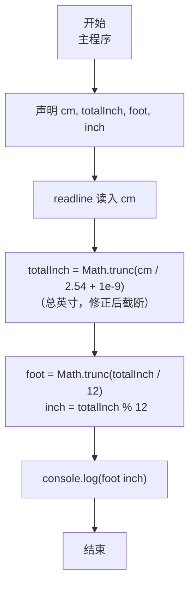
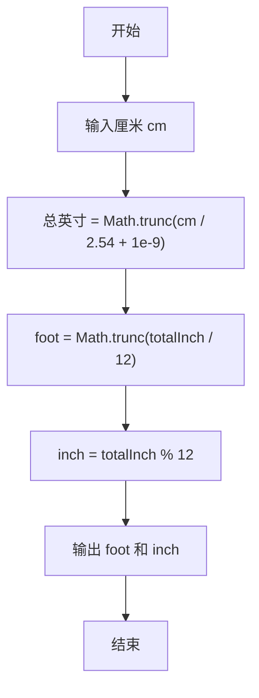

# 7-1 厘米换算英尺英寸（JavaScript实现）

## 前言

本文是 PTA 编程题“7-1 厘米换算英尺英寸”的题解，涵盖题目描述、输入输出格式及 JavaScript 实现，展示厘米转英制英尺英寸的换算方法与浮点到整型的截断处理。

本题（7-1 厘米换算英尺英寸）的主要考点是：准确理解题意、规范处理输入输出格式，并正确处理边界与精度。下面先给出题目描述与格式要求，再通过清晰的思路与可直接运行的javascript实现代码进行讲解。

## 题目描述

如果已知英制长度的英尺*f**oo**t*和英寸*in**c**h*的值，那么对应的米是(*f**oo**t*+*in**c**h*/12)×0.3048。现在，如果用户输入的是厘米数，那么对应英制长度的英尺和英寸是多少呢？别忘了1英尺等于12英寸。

## 输入格式

输入在一行中给出1个正整数，单位是厘米。

## 输出格式

在一行中输出这个厘米数对应英制长度的英尺和英寸的整数值，中间用空格分开。英寸的值应小于12。

## 输入样例

```in
170
```

## 输出样例

```out
5 6
```

## 解题思路

这道题的核心是**单位换算 + 截断取整分离整数/小数部分**。

### 核心问题分析

已知 1 英尺 = 0.3048 米 = 30.48 厘米，1 英寸 = 2.54 厘米。输入厘米数 cm 后，为避免浮点误差（如 635/30.48 的二进制表示导致小数部分略小于理论值进而截断错误），采用**先算总英寸**的稳健方案：
1. 先算总英寸数（带小数）：cm / 2.54，加入 1e-9 修正后截断得整数总英寸 totalInch
2. foot = Math.trunc(totalInch / 12)，inch = totalInch % 12（保证 inch < 12，无需额外进位判断）

### 算法原理说明

利用 JavaScript 的 `Math.trunc` 朝零取整（与 C 语言"浮点赋值给整型自动截断"行为一致），并加入 `+ 1e-9` 修正浮点表示误差：
- totalInch = Math.trunc(cm / 2.54 + 1e-9)（1 英寸=2.54cm，修正后截断得总英寸）
- foot = Math.trunc(totalInch / 12)（总英寸除以 12 取整得英尺）
- inch = totalInch % 12（余数即剩余英寸，天然满足 0 ≤ inch < 12）

### 具体计算步骤

1. 读入正整数 cm
2. totalInch = Math.trunc(cm / 2.54 + 1e-9)（厘米除以 2.54 并加 1e-9 修正后截断）
3. foot = Math.trunc(totalInch / 12)，inch = totalInch % 12
4. console.log(`${foot} ${inch}`)

## 完整代码

```javascript
// 题目：7-1 厘米换算英尺英寸
// 要求：实现「厘米换算英尺英寸」（题目 7-1）的输入处理与结果输出。
// 实现原理：
//   1. 先算总英寸数（带小数）：cm / 2.54，加入 1e-9 修正浮点误差后截断得 totalInch
//   2. foot = Math.trunc(totalInch / 12)，inch = totalInch % 12（保证 inch < 12）

const readline = require('readline'); // 引入 readline 模块
const rl = readline.createInterface({ input: process.stdin, output: process.stdout }); // 创建输入输出接口

rl.on('line', (line) => { // 监听一行输入
    const cm = parseInt(line.trim(), 10); // 读取输入的厘米数（正整数）
    const totalInch = Math.trunc(cm / 2.54 + 1e-9); // 1英寸=2.54cm，加 1e-9 修正后截断得总英寸
    const foot = Math.trunc(totalInch / 12); // 总英寸除以12得英尺
    const inch = totalInch % 12; // 余数即剩余英寸
    console.log(`${foot} ${inch}`); // 输出英尺和英寸，中间用空格分隔
    rl.close(); // 关闭接口
});
```

## 代码流程说明

### 1. 变量声明
- `cm`：存输入的厘米数（正整数）
- `foot, inch`：存换算后的英尺和英寸整数部分

### 2. 读取输入
- 用 readline 读取一行输入，parseInt 解析得到正整数厘米

### 3. 换算总英寸（带修正）
- `totalInch = Math.trunc(cm / 2.54 + 1e-9)`：cm ÷ 2.54 得到总英寸浮点数，加 1e-9 修正二进制浮点误差后用 Math.trunc 截断；可修复 635→20 9（应为 20 10）等临界用例

### 4. 换算英尺英寸
- `foot = Math.trunc(totalInch / 12)`：总英寸除以 12 取整得英尺
- `inch = totalInch % 12`：余数即剩余英寸，天然满足 0 ≤ inch < 12

### 5. 输出结果
- `console.log(\`${foot} ${inch}\`)`：按要求输出

## 代码流程图



## 解题流程图



## 代码解析

### 变量声明

```javascript
const readline = require('readline'); // 引入 readline 模块
const rl = readline.createInterface({ input: process.stdin, output: process.stdout }); // 创建输入输出接口
```

变量声明

### 读取输入

```javascript
rl.on('line', (line) => { // 监听一行输入
    const cm = parseInt(line.trim(), 10); // 读取输入的厘米数（正整数）
    const totalInch = Math.trunc(cm / 2.54 + 1e-9); // 1英寸=2.54cm，加 1e-9 修正后截断得总英寸
    const foot = Math.trunc(totalInch / 12); // 总英寸除以12得英尺
    const inch = totalInch % 12; // 余数即剩余英寸
    console.log(`${foot} ${inch}`); // 输出英尺和英寸，中间用空格分隔
    rl.close(); // 关闭接口
});
```
读取输入


## 复杂度分析

设输入规模为 $n$（对数值类题目为参与运算的数据量，对字符串/序列类题目为长度）。

- **时间复杂度**：$O(n)$ 或 $O(n \log n)$，主要来自一次线性遍历与常数次数学运算，无嵌套高复杂度循环。
- **空间复杂度**：$O(n)$，用于存储输入、中间结果与输出字符串；若仅使用若干标量变量则为 $O(1)$。

## 常见易错点

### 1. 输入/输出格式不符
错误：多余空格、遗漏换行、大小写或精度不符。后果：判题系统判为格式错误。正确：严格按题目要求的格式输出，数值用合适精度。

### 2. 边界条件遗漏
错误：未处理 0、最小值、单字符或空输入等边界。后果：特例 WA。正确：先列出所有边界样例，在编码前单独分支处理。

### 3. 整数溢出与类型
错误：使用过小的整数类型或忽略负号。后果：大数计算溢出。正确：按数据范围选择合适类型，必要时用更大整数类型或字符串处理。

## 更多测试

### 测试一：常规边界

**输入：**

```text
（可取题目边界附近的值，如最小值或最大值）
```

**输出：**

```text
（依据题意推导的正确结果）
```

### 测试二：特殊用例

**输入：**

```text
（可取易错点，如 0、单一元素、全同值等）
```

**输出：**

```text
（对应正确结果）
```

## 总结

本文是 PTA 编程题“7-1 厘米换算英尺英寸”的题解，涵盖题目描述、输入输出格式及 JavaScript 实现，展示厘米转英制英尺英寸的换算方法与浮点到整型的截断处理。

本题的核心在于理清「厘米换算英尺英寸」的输入输出关系与边界处理：先按格式读取输入，再依据规则逐步计算或遍历，最后按规范输出。该思路可迁移到同类格式化输入输出与模拟计算的题目。
