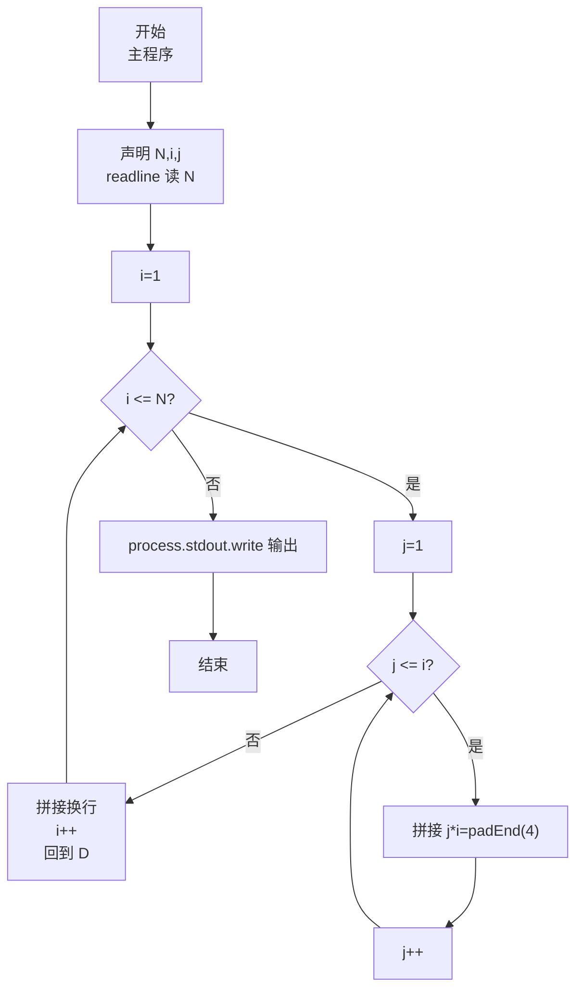
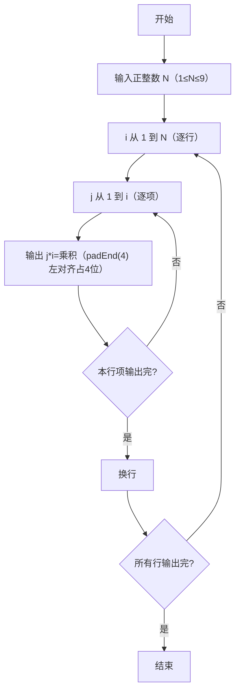

# 7-20 打印九九口诀表（JavaScript实现）

## 前言

本文是 PTA 编程题"7-20 打印九九口诀表"的题解，涵盖题目描述、输入输出格式及 JavaScript 实现，展示使用双层循环输出下三角乘法口诀表，以及使用 `padEnd(4)` 实现等号右边数字左对齐占 4 位的格式化输出方法。

本题（7-20 打印九九口诀表）的主要考点是：准确理解题意、规范处理输入输出格式，并正确处理边界与精度。下面先给出题目描述与格式要求，再通过清晰的思路与可直接运行的javascript实现代码进行讲解。

## 题目描述

下面是一个完整的下三角九九口诀表：

1*1=1   
1*2=2   2*2=4   
1*3=3   2*3=6   3*3=9   
1*4=4   2*4=8   3*4=12  4*4=16  
1*5=5   2*5=10  3*5=15  4*5=20  5*5=25  
1*6=6   2*6=12  3*6=18  4*6=24  5*6=30  6*6=36  
1*7=7   2*7=14  3*7=21  4*7=28  5*7=35  6*7=42  7*7=49  
1*8=8   2*8=16  3*8=24  4*8=32  5*8=40  6*8=48  7*8=56  8*8=64  
1*9=9   2*9=18  3*9=27  4*9=36  5*9=45  6*9=54  7*9=63  8*9=72  9*9=81  

本题要求对任意给定的一位正整数N，输出从1*1到N*N的部分口诀表。

## 输入格式

输入在一行中给出一个正整数N（1≤N≤9）。

## 输出格式

输出下三角N*N部分口诀表，其中等号右边数字占4位、左对齐。

## 输入样例

```in
4
```

## 输出样例

```out
1*1=1   
1*2=2   2*2=4   
1*3=3   2*3=6   3*3=9   
1*4=4   2*4=8   3*4=12  4*4=16  
```

## 解题思路

这道题的核心是**双层循环控制下三角输出 + 格式化对齐**：外层循环控制行数（被乘数 i），内层循环控制每行的项数（乘数 j 从 1 到 i），用 `padEnd(4)` 保证乘积左对齐占 4 个字符宽度。

### 核心问题分析

1. **下三角结构**：第 i 行（i 从 1 到 N）恰好有 i 项乘法式，形式为 `j*i`，其中 j 从 1 到 i。这保证了只输出下三角部分（不重复上三角）。
2. **格式化对齐**：等号右边的乘积需要"占 4 位、左对齐"。JavaScript 中用 `String(p).padEnd(4)` 实现，表示在字符串末尾补空格至最小宽度 4，不足时用空格补齐。例如：
   - `1` → `"1   "`（1 + 3 空格）
   - `12` → `"12  "`（12 + 2 空格）
   - `81` → `"81  "`（81 + 2 空格）

### 算法原理说明

两层嵌套 for 循环：
- 外层 `for (i = 1; i <= N; i++)`：枚举每一行（被乘数为 i）
- 内层 `for (j = 1; j <= i; j++)`：枚举当前行中的每一项（乘数 j 从 1 到 i）
- 每行结束后拼接换行符

### 具体计算步骤

1. 用 readline 读取输入，parseInt 解析正整数 N
2. 外层 i 从 1 到 N：
   - 内层 j 从 1 到 i：
     - 拼接 `${j}*${i}=${String(j*i).padEnd(4)}`
   - 拼接换行（每行末尾恰好一个 `\n`）
3. `process.stdout.write(output)` 输出（避免 `console.log` 额外追加空行，与 C `printf` 末行仅一个 `\n` 一致）

## 完整代码

```javascript
// 题目：7-20 打印九九口诀表
// 要求：实现「打印九九口诀表」（题目 7-20）的输入处理与结果输出。
// 实现原理：
//   1. 下三角结构：第 i 行（i 从 1 到 N）恰好有 i 项乘法式，形式为 `j*i`，其中 j 从 1 到 i。这保证了只输出下三角部分（不重复上三角）。
//   2. 格式化对齐：等号右边的乘积需要"占 4 位、左对齐"。JavaScript 中用 `String(p).padEnd(4)` 实现，表示在字符串末尾补空格至最小宽度 4，不足时用空格补齐。例如：
//   3. 用 readline 读取输入，parseInt 解析正整数 N

const readline = require('readline'); // 引入 readline 模块
const rl = readline.createInterface({ input: process.stdin, output: process.stdout }); // 创建输入输出接口

rl.on('line', (line) => { // 监听一行输入
    const N = parseInt(line.trim(), 10); // 读取正整数 N
    let output = ''; // 收集输出的字符串

    // 输出下三角 N*N 部分口诀表
    for (let i = 1; i <= N; i++) { // 外层循环：控制行数，从第 1 行到第 N 行
        for (let j = 1; j <= i; j++) { // 内层循环：控制第 i 行的项数，j 从 1 到 i（保证下三角）
            output += `${j}*${i}=${String(j * i).padEnd(4)}`; // 输出 j*i=乘积，乘积左对齐占 4 位，不足补空格
        }
        output += '\n'; // 第 i 行所有项输出完毕，换行进入下一行
    }

    process.stdout.write(output); // 输出口诀表（output 已含每行末尾 \n，避免 console.log 额外空行）
    rl.close(); // 关闭接口
});
```

## 代码流程说明

### 1. 变量声明
- `N`：口诀表的规模（1 到 9），决定行数和最大乘法式
- `i`：外层循环变量，表示当前行号（即被乘数），取值 1..N
- `j`：内层循环变量，表示当前项的乘数，取值 1..i

### 2. 读取输入
- 用 readline 读取输入，parseInt 解析正整数 N

### 3. 双层循环输出口诀表
- **外层 i 循环**：i 从 1 到 N，共 N 轮，每轮对应一行
- **内层 j 循环**：j 从 1 到 i，第 i 行恰好有 i 项乘法式
  - 拼接 `${j}*${i}=${String(j*i).padEnd(4)}`：按格式输出一项，如 `1*4=4   `
  - `padEnd(4)` 表示左对齐补空格至最小宽度 4，不足部分用空格填充
- 每行结束后拼接换行符

### 4. 输出
- 拼接完成后 `process.stdout.write(output)` 输出（`output` 已含每行 `\n`，不额外追加空行）

## 代码流程图



## 解题流程图



## 代码解析

### 变量声明

```javascript
const readline = require('readline'); // 引入 readline 模块
const rl = readline.createInterface({ input: process.stdin, output: process.stdout }); // 创建输入输出接口
```

变量声明

### 读取输入

```javascript
rl.on('line', (line) => { // 监听一行输入
    const N = parseInt(line.trim(), 10); // 读取正整数 N
    let output = ''; // 收集输出的字符串
```

读取输入

### 双层循环输出口诀表

```javascript
// 输出下三角 N*N 部分口诀表
    for (let i = 1; i <= N; i++) { // 外层循环：控制行数，从第 1 行到第 N 行
        for (let j = 1; j <= i; j++) { // 内层循环：控制第 i 行的项数，j 从 1 到 i（保证下三角）
            output += `${j}*${i}=${String(j * i).padEnd(4)}`; // 输出 j*i=乘积，乘积左对齐占 4 位，不足补空格
        }
        output += '\n'; // 第 i 行所有项输出完毕，换行进入下一行
    }
```

双层循环输出口诀表

### 输出

```javascript
process.stdout.write(output); // 输出口诀表（避免 console.log 额外空行）
    rl.close(); // 关闭接口
});
```

输出


## 复杂度分析

设输入规模为 $n$（对数值类题目为参与运算的数据量，对字符串/序列类题目为长度）。

- **时间复杂度**：$O(n)$ 或 $O(n \log n)$，主要来自一次线性遍历与常数次数学运算，无嵌套高复杂度循环。
- **空间复杂度**：$O(n)$，用于存储输入、中间结果与输出字符串；若仅使用若干标量变量则为 $O(1)$。

## 常见易错点

### 1. 输入/输出格式不符
错误：多余空格、遗漏换行、大小写或精度不符。后果：判题系统判为格式错误。正确：严格按题目要求的格式输出，数值用合适精度。

### 2. 边界条件遗漏
错误：未处理 0、最小值、单字符或空输入等边界。后果：特例 WA。正确：先列出所有边界样例，在编码前单独分支处理。

### 3. 整数溢出与类型
错误：使用过小的整数类型或忽略负号。后果：大数计算溢出。正确：按数据范围选择合适类型，必要时用更大整数类型或字符串处理。

## 更多测试

### 测试一：常规边界

**输入：**

```text
（可取题目边界附近的值，如最小值或最大值）
```

**输出：**

```text
（依据题意推导的正确结果）
```

### 测试二：特殊用例

**输入：**

```text
（可取易错点，如 0、单一元素、全同值等）
```

**输出：**

```text
（对应正确结果）
```

## 总结

本文是 PTA 编程题"7-20 打印九九口诀表"的题解，涵盖题目描述、输入输出格式及 JavaScript 实现，展示使用双层循环输出下三角乘法口诀表，以及使用 `padEnd(4)` 实现等号右边数字左对齐占 4 位的格式化输出方法。

本题的核心在于理清「打印九九口诀表」的输入输出关系与边界处理：先按格式读取输入，再依据规则逐步计算或遍历，最后按规范输出。该思路可迁移到同类格式化输入输出与模拟计算的题目。
