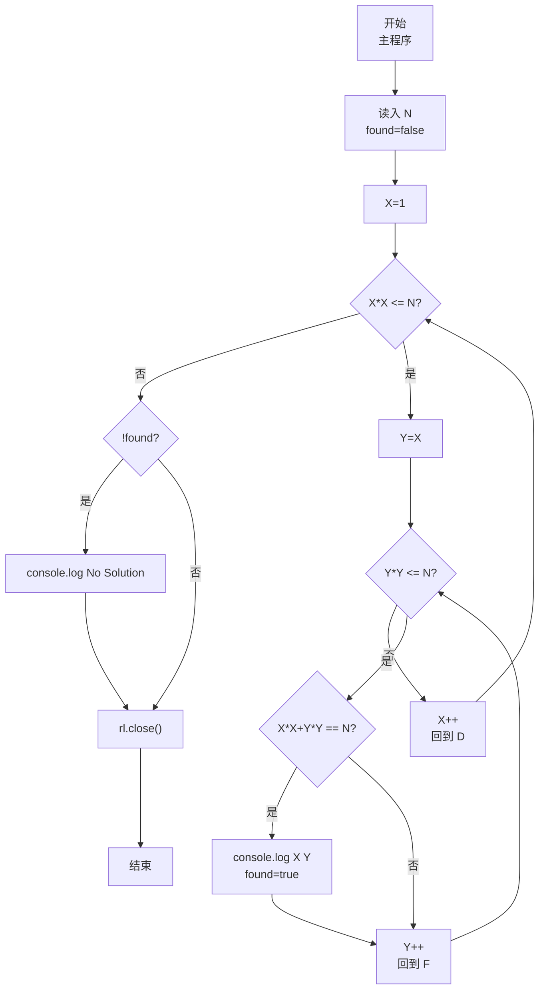
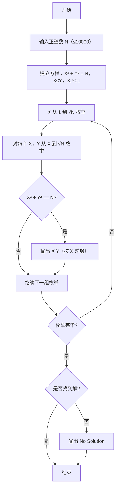

# 7-21 求特殊方程的正整数解（JavaScript实现）

## 前言

本文是 PTA 编程题"7-21 求特殊方程的正整数解"的题解，涵盖题目描述、输入输出格式及 JavaScript 实现，展示通过双重枚举 X、Y（满足 X≤Y 且 X²,Y²≤N）寻找所有满足 X²+Y²=N 的正整数解的穷举法，并处理无解时输出 No Solution。

本题（7-21 求特殊方程的正整数解）的主要考点是：准确理解题意、规范处理输入输出格式，并正确处理边界与精度。下面先给出题目描述与格式要求，再通过清晰的思路与可直接运行的javascript实现代码进行讲解。

## 题目描述

本题要求对任意给定的正整数N，求方程X² + Y² = N的全部正整数解。

## 输入格式

输入在一行中给出正整数N（≤10000）。

## 输出格式

输出方程X² + Y² = N的全部正整数解，其中X≤Y。每组解占1行，两数字间以1空格分隔，按X的递增顺序输出。如果没有解，则输出No Solution。

## 输入样例1

```in
884
```

## 输入样例2

```in
11
```

## 输出样例1

```out
10 28
20 22
```

## 输出样例2

```out
No Solution
```

## 解题思路

这道题的核心是**双重枚举 + 范围约束 + X≤Y 去重**：X 和 Y 都是正整数且 X≤Y，因此 X 的上界是 √N，Y 的下界是 X、上界也是 √N（因为当 Y>√N 时 Y²>N，X²≥1 所以 X²+Y²>N，无解）。枚举范围设为 X,Y ∈ [1, √N]，再判断 X²+Y² 是否等于 N 即可。

### 核心问题分析

1. **枚举上界**：X² ≤ N → X ≤ √N；同理 Y² ≤ N → Y ≤ √N。N 最大 10000，√10000=100，因此循环最多 100×100=10⁴ 次，效率足够。
2. **X≤Y 约束**：令内层循环 Y 从 X 开始（而非从 1 开始），天然满足 X≤Y，避免 (X,Y) 和 (Y,X) 重复输出，同时按 X 递增自然满足输出顺序要求。
3. **正整数**：X、Y 必须 ≥1，因此循环从 1 开始而不是从 0 开始。
4. **判无解**：用标志变量 `found`，若整个双重循环结束仍为 false，则输出 No Solution。

### 算法原理说明

双重 for 枚举 X∈[1, √N]，对每个 X 再枚举 Y∈[X, √N]，若 X²+Y²==N 则立即输出并将 found 置为 true。由于 X 从小到大、Y 从 X 开始，输出天然按 X 递增、X≤Y 的要求。

### 具体计算步骤

1. `const N = parseInt(line.trim(), 10);` 读入 N，初始化 `found=false`
2. `for (X=1; X*X <= N; X++)`：
   - `for (Y=X; Y*Y <= N; Y++)`：
     - 若 `X*X + Y*Y == N` → `console.log(\`${X} ${Y}\`); found = true;`
3. 双重循环结束后：若 `!found` → `console.log('No Solution');`
4. 关闭 readline 接口

## 完整代码

```javascript
// 题目：7-21 求特殊方程的正整数解
// 要求：实现「求特殊方程的正整数解」（题目 7-21）的输入处理与结果输出。
// 实现原理：
//   1. 枚举上界：X² ≤ N → X ≤ √N；同理 Y² ≤ N → Y ≤ √N。N 最大 10000，√10000=100，因此循环最多 100×100=10⁴ 次，效率足够。
//   2. X≤Y 约束：令内层循环 Y 从 X 开始（而非从 1 开始），天然满足 X≤Y，避免 (X,Y) 和 (Y,X) 重复输出，同时按 X 递增自然满足输出顺序要求。
//   3. 正整数：X、Y 必须 ≥1，因此循环从 1 开始而不是从 0 开始。

const readline = require('readline'); // 引入 readline 模块
const rl = readline.createInterface({ input: process.stdin, output: process.stdout }); // 创建输入输出接口

rl.on('line', (line) => { // 监听一行输入
    const N = parseInt(line.trim(), 10); // 从标准输入读取正整数 N
    let found = false; // found 标记是否找到解（true 有 / false 无）

    // 枚举 X、Y 的所有可能取值，寻找满足 X²+Y²=N 且 X≤Y 的正整数解
    for (let X = 1; X * X <= N; X++) { // 外层枚举 X：X²≤N → X≤√N，X 从 1 开始保证正整数
        for (let Y = X; Y * Y <= N; Y++) { // 内层枚举 Y：从 X 开始保证 X≤Y，Y²≤N 限制上界
            if (X * X + Y * Y === N) { // 判断当前 (X,Y) 是否满足方程
                console.log(`${X} ${Y}`); // 按格式输出一组解
                found = true; // 标记至少找到一组解
            }
        }
    }

    if (!found) { // 双重循环结束后 found 仍为 false → 无解
        console.log('No Solution'); // 输出无解提示
    }

    rl.close(); // 关闭接口
});
```

## 代码流程说明

### 1. 变量声明与输入
- `const N`：给定的正整数（≤10000）
- `let X, Y`：方程的两个未知数，要求 1≤X≤Y
- `let found = false`：是否找到解的标志，false 表示暂无解
- `const N = parseInt(line.trim(), 10)` 读取 N

### 2. 双重枚举求正整数解
- **外层 X 循环**：`X=1; X*X<=N; X++`，X 从 1 到 √N
  - **内层 Y 循环**：`Y=X; Y*Y<=N; Y++`，Y 从 X 到 √N，保证 X≤Y 且不重复
  - **判断方程**：`X*X + Y*Y === N` 成立则输出该组解并 `found=true`
- 由于 X 从小到大、Y 从 X 开始，输出自动按 X 递增，且 X≤Y

### 3. 无解判断
- 双重循环结束后，若 `found` 仍为 false，则输出 `No Solution`

### 4. 关闭接口
- `rl.close()`

## 代码流程图



## 解题流程图



## 代码解析

### 变量声明与输入

```javascript
const readline = require('readline'); // 引入 readline 模块
const rl = readline.createInterface({ input: process.stdin, output: process.stdout }); // 创建输入输出接口
```

变量声明与输入

### 双重枚举求正整数解

```javascript
rl.on('line', (line) => { // 监听一行输入
    const N = parseInt(line.trim(), 10); // 从标准输入读取正整数 N
    let found = false; // found 标记是否找到解（true 有 / false 无）
```

双重枚举求正整数解

### 无解判断

```javascript
// 枚举 X、Y 的所有可能取值，寻找满足 X²+Y²=N 且 X≤Y 的正整数解
    for (let X = 1; X * X <= N; X++) { // 外层枚举 X：X²≤N → X≤√N，X 从 1 开始保证正整数
        for (let Y = X; Y * Y <= N; Y++) { // 内层枚举 Y：从 X 开始保证 X≤Y，Y²≤N 限制上界
            if (X * X + Y * Y === N) { // 判断当前 (X,Y) 是否满足方程
                console.log(`${X} ${Y}`); // 按格式输出一组解
                found = true; // 标记至少找到一组解
            }
        }
    }
```

无解判断

### 关闭接口

```javascript
if (!found) { // 双重循环结束后 found 仍为 false → 无解
        console.log('No Solution'); // 输出无解提示
    }
```

关闭接口


## 复杂度分析

设输入规模为 $n$（对数值类题目为参与运算的数据量，对字符串/序列类题目为长度）。

- **时间复杂度**：$O(n)$ 或 $O(n \log n)$，主要来自一次线性遍历与常数次数学运算，无嵌套高复杂度循环。
- **空间复杂度**：$O(n)$，用于存储输入、中间结果与输出字符串；若仅使用若干标量变量则为 $O(1)$。

## 常见易错点

### 1. 输入/输出格式不符
错误：多余空格、遗漏换行、大小写或精度不符。后果：判题系统判为格式错误。正确：严格按题目要求的格式输出，数值用合适精度。

### 2. 边界条件遗漏
错误：未处理 0、最小值、单字符或空输入等边界。后果：特例 WA。正确：先列出所有边界样例，在编码前单独分支处理。

### 3. 整数溢出与类型
错误：使用过小的整数类型或忽略负号。后果：大数计算溢出。正确：按数据范围选择合适类型，必要时用更大整数类型或字符串处理。

## 更多测试

### 测试一：常规边界

**输入：**

```text
25
```

**输出：**

```text
3 4
```

### 测试二：特殊用例

**输入：**

```text
2
```

**输出：**

```text
1 1
```

## 总结

本文是 PTA 编程题"7-21 求特殊方程的正整数解"的题解，涵盖题目描述、输入输出格式及 JavaScript 实现，展示通过双重枚举 X、Y（满足 X≤Y 且 X²,Y²≤N）寻找所有满足 X²+Y²=N 的正整数解的穷举法，并处理无解时输出 No Solution。

本题的核心在于理清「求特殊方程的正整数解」的输入输出关系与边界处理：先按格式读取输入，再依据规则逐步计算或遍历，最后按规范输出。该思路可迁移到同类格式化输入输出与模拟计算的题目。
