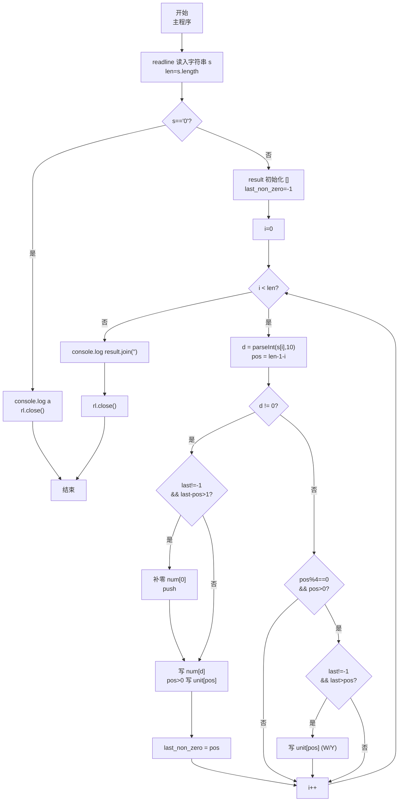
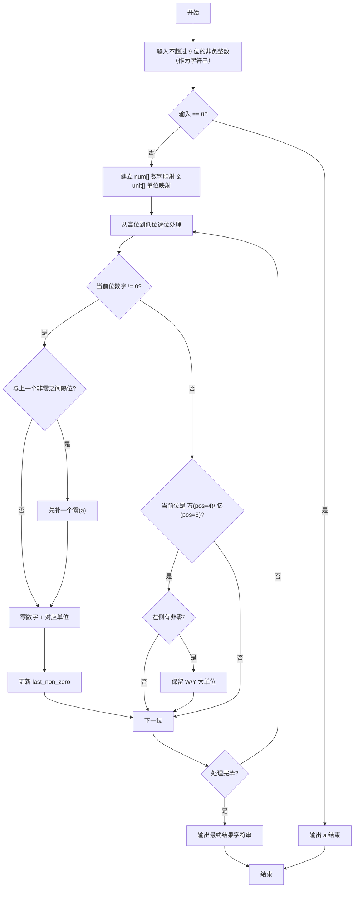

# 7-23 币值转换（JavaScript实现）

## 前言

本文是 PTA 编程题"7-23 币值转换"的题解，涵盖题目描述、输入输出格式及 JavaScript 实现，展示通过两个映射数组 `num`（数字 a-j 对应 0-9）和 `unit`（S/B/Q/W/Y 对应拾/佰/仟/万/亿）逐位处理字符串，并结合"零"补位规则与大单位（万/亿）保留规则，将整数金额转换为中文大写（简化拼音表示）的实现方法。

本题（7-23 币值转换）的主要考点是：准确理解题意、规范处理输入输出格式，并正确处理边界与精度。下面先给出题目描述与格式要求，再通过清晰的思路与可直接运行的javascript实现代码进行讲解。

## 题目描述

输入一个整数（位数不超过9位）代表一个人民币值（单位为元），请转换成财务要求的大写中文格式。如23108元，转换后变成“贰万叁仟壹百零捌”元。为了简化输出，用小写英文字母a-j顺序代表大写数字0-9，用S、B、Q、W、Y分别代表拾、百、仟、万、亿。于是23108元应被转换输出为“cWdQbBai”元。

## 输入格式

输入在一行中给出一个不超过9位的非负整数。

## 输出格式

在一行中输出转换后的结果。注意“零”的用法必须符合中文习惯。

## 输入样例1

```in
813227345
```

## 输入样例2

```in
6900
```

## 输出样例1

```out
iYbQdBcScWhQdBeSf
```

## 输出样例2

```out
gQjB
```

## 解题思路

这道题的核心是**逐位处理 + 数字/单位双映射 + 中文"零"规则 + 大单位（万/亿）保留**：将输入作为字符串逐位遍历，用两个数组分别映射数字字符（a-j 对应 0-9）和位权单位（S/B/Q/W/Y 对应拾/佰/仟/万/亿）；重点处理两类情况：非零数字间有零时补一个 a（零），万/亿位即使该段有零也要保留大单位。

### 核心问题分析

1. **映射表**：
   - 数字映射 `num = "abcdefghij"`：`num[d]` 即数字 d（0-9）对应的字符（JS 字符串可按下标取字符）。如 0→a、1→b、…、9→j。
   - 单位映射 `unit[]` 从右往左（个位 pos=0）依次是：pos0=个位（无单位）、pos1=S（拾）、pos2=B（佰）、pos3=Q（仟）、pos4=W（万）、pos5=S（拾）、pos6=B（佰）、pos7=Q（仟）、pos8=Y（亿）。
2. **中文"零"规则（相邻非零间有隔位）**：
   - 两个非零数字之间如果存在至少一位 0，需要且只需要输出一个"零"（a）。
   - 用 `last_non_zero` 记录上一个非零数字的位权 pos。当当前位数字 `d≠0` 且 `last_non_zero - pos > 1` 时，先追加一个 `a`（零），再输出当前数字+单位。
3. **大单位万(W)/亿(Y)必须保留（即使该段有零）**：
   - 位权 pos 是 4 的倍数且 pos>0（即 pos=4 万、pos=8 亿）时，即使当前位是 0，只要前面出现过非零数字且位置在该大单位左侧（`last_non_zero > pos`），也要输出对应的 `W` 或 `Y`，防止"八万"被写成"八"等错误。
4. **特殊输入 0**：如果输入就是 `"0"`，直接输出 `"a"`。不参与主循环（主循环会跳过全零导致输出空串）。
5. **个位 pos=0 无单位**：非零个位只输出数字字符，不输出单位。

### 算法原理说明

将输入按字符串读入，从左到右按字符遍历（高位到低位）：
- 计算当前数字 `d = parseInt(s[i], 10)` 和位权 `pos = len-1-i`（个位为 0）。
- 若 `d ≠ 0`：
  - 若与上一个非零之间隔了至少一位（`last_non_zero - pos > 1`），先输出一个"零" `num[0]`；
  - 再输出 `num[d]`，若 pos>0 再输出 `unit[pos]`；
  - 更新 `last_non_zero = pos`。
- 若 `d == 0`：
  - 仅当 pos 是万/亿位（pos%4==0 且 pos>0）且左侧曾经出现过非零时，输出 `W` 或 `Y`（万/亿大单位要保留）。
- 特殊：输入为 `"0"` 直接输出 `"a"`。

以输入 `23108`（即 cWdQbBai）为例：
- len=5，各位 pos 依次为 4,3,2,1,0
- s[0]='2'(pos4): d≠0, last=-1 → 输出 `c`(2) + `W`(pos4单位) → "cW"，last=4
- s[1]='3'(pos3): d≠0, last-pos=1 → 无零，输出 `d`(3)+`Q` → "cWdQ"，last=3
- s[2]='1'(pos2): d≠0, last-pos=1 → 无零，输出 `b`(1)+`B` → "cWdQbB"，last=2
- s[3]='0'(pos1): d=0，pos1 不是 4 的倍数，跳过
- s[4]='8'(pos0): d≠0, last-pos=2-0=2>1 → 先补 `a`(零)，再输出 `i`(8)，pos=0 无单位 → "cWdQbBai" ✓

### 具体计算步骤

1. `const s = line.trim(); len = s.length;`（用 readline 读入，作为字符串处理）
2. 特判：`s === "0"` → 输出 `"a"`，直接 `rl.close()` 并 return
3. 初始化 `result = []`（结果字符数组），`last_non_zero = -1`（JS 字符串不可变，用数组暂存结果字符，最后 join）
4. `for (let i = 0; i < len; i++)`：
   - `d = parseInt(s[i], 10); pos = len - 1 - i;`
   - 若 `d !== 0`：
     - 若 `last_non_zero !== -1 && last_non_zero - pos > 1` → `result.push(num[0])`（补零）
     - `result.push(num[d])`
     - 若 `pos > 0` → `result.push(unit[pos])`
     - `last_non_zero = pos`
   - 否则（d==0）：
     - 若 `pos % 4 === 0 && pos > 0 && last_non_zero !== -1 && last_non_zero > pos` → `result.push(unit[pos])`（保留万/亿大单位）
5. `console.log(result.join(''));`（拼接结果字符串输出）
6. `rl.close()` 关闭接口

## 完整代码

```javascript
// 题目：7-23 币值转换
// 要求：实现「币值转换」（题目 7-23）的输入处理与结果输出。
// 实现原理：
//   1. 映射表：num 数字 0-9→a-j，unit 位权 pos→单位（个位无单位）
//   2. 中文"零"规则（相邻非零间有隔位）：last_non_zero-pos>1 时补 a
//   3. 大单位万(W)/亿(Y)必须保留：仅当该四位段内含非零时才保留（预判 wanHas/yiHas）

const readline = require('readline'); // 引入 readline 模块
const rl = readline.createInterface({ input: process.stdin, output: process.stdout }); // 创建输入输出接口

// 数字映射：num[0]='a' 代表 0, num[1]='b' 代表 1, ..., num[9]='j' 代表 9
const num = "abcdefghij";
// 单位映射：按"从右往左"的位权 pos 排列：pos0 个位(无单位 ''), pos1 拾'S', pos2 佰'B', pos3 仟'Q', pos4 万'W', pos5 拾'S', pos6 佰'B', pos7 仟'Q', pos8 亿'Y'
const unit = ['', 'S', 'B', 'Q', 'W', 'S', 'B', 'Q', 'Y'];

rl.on('line', (line) => { // 监听一行输入
    const s = line.trim(); // 以字符串形式读取输入金额
    const len = s.length; // len 为数字总位数

    // 特判：输入为 "0" 时直接输出 "a"，主循环会把零全部跳过，得到空串
    if (s === "0") {
        console.log("a");
        rl.close();
        return;
    }

    // 预判万级(位权 4~7)和亿级(位权 8)是否含非零，用于决定零位是否保留大单位
    // 避免 100000001 这类跨段零位误保留万位（wanHas 应为 false）
    let wanHas = false, yiHas = false;
    for (let k = 0; k < len; k++) {
        const p = len - 1 - k; // 该位位权
        const d2 = parseInt(s[k], 10);
        if (d2 !== 0) {
            if (p >= 4 && p <= 7) wanHas = true; // 万级四位含非零
            if (p === 8) yiHas = true;            // 亿位含非零
        }
    }

    const result = []; // 存储转换后的结果字符数组（JS 字符串不可变，先 push 到数组最后 join）
    let last_non_zero = -1;  // 记录上一个非零数字的位权 pos（个位为 0，向左递增）

    // 从左向右（高位到低位）遍历输入的每一位数字
    for (let i = 0; i < len; i++) {
        const d = parseInt(s[i], 10); // 当前字符对应的数字（0-9）
        const pos = len - 1 - i;      // 当前数字的位权：个位为 0，十位为 1，…，最高位为 len-1

        if (d !== 0) {
            // 如果当前非零数字与上一个非零数字之间至少隔了一位（即中间存在 0），需要补一个"零"(num[0]='a')
            if (last_non_zero !== -1 && last_non_zero - pos > 1) {
                result.push(num[0]);
            }
            // 添加当前数字对应的字符
            result.push(num[d]);
            // 添加对应的单位：个位 pos=0 时单位为 ''，不添加
            if (pos > 0) {
                result.push(unit[pos]);
            }
            last_non_zero = pos; // 更新最近一个非零数字的位权
        } else {
            // 当前数字为 0 时，仅当大单位所在段含非零才保留
            if (pos === 4 && wanHas) {
                result.push(unit[pos]); // 写入 W（万级有非零才保留）
            } else if (pos === 8 && yiHas) {
                result.push(unit[pos]); // 写入 Y（亿级有非零才保留）
            }
        }
    }

    console.log(result.join('')); // 输出转换结果
    rl.close(); // 关闭接口
});
```

## 代码流程说明

### 1. 映射数组与输入
- `const num = "abcdefghij"`：数字 0-9 → 字符 a-j
- `const unit = [...]`：位权 pos（个=0）→ 单位字符（拾S佰B仟Q万W亿Y），pos0 为 `''` 不输出
- `const s = line.trim()` 存输入字符串，`len = s.length` 得总位数

### 2. 特判输入为 0
- `s === "0"` → 直接 `console.log("a")` 并 `rl.close()`、return

### 3. 逐位处理（高位到低位）
- 初始化 `result=[]`（结果字符数组）、`last_non_zero=-1`
- `for (i=0; i<len; i++)`：
  - `d = parseInt(s[i], 10)`，`pos = len-1-i`
  - **非零 d**：
    - 若与上一个非零之间 pos 差 >1 → 先补零字符 `num[0]`
    - 再追加 `num[d]`，pos>0 时追加 `unit[pos]`
    - 更新 `last_non_zero = pos`
  - **零 d**：
    - 仅当 pos 为万/亿（pos%4==0, pos>0）且左侧有非零时，追加 `W` 或 `Y`

### 4. 输出结果
- `console.log(result.join(''))`（把字符数组拼接成字符串输出）

### 5. 关闭接口
- `rl.close()`

## 代码流程图



## 解题流程图



## 代码解析

### 映射数组与输入

```javascript
const readline = require('readline'); // 引入 readline 模块
const rl = readline.createInterface({ input: process.stdin, output: process.stdout }); // 创建输入输出接口
```

映射数组与输入

### 特判输入为 0

```javascript
// 数字映射：num[0]='a' 代表 0, num[1]='b' 代表 1, ..., num[9]='j' 代表 9
const num = "abcdefghij";
// 单位映射：按"从右往左"的位权 pos 排列：pos0 个位(无单位 ''), pos1 拾'S', pos2 佰'B', pos3 仟'Q', pos4 万'W', pos5 拾'S', pos6 佰'B', pos7 仟'Q', pos8 亿'Y'
const unit = ['', 'S', 'B', 'Q', 'W', 'S', 'B', 'Q', 'Y'];
```

特判输入为 0

### 逐位处理

```javascript
rl.on('line', (line) => { // 监听一行输入
    const s = line.trim(); // 以字符串形式读取输入金额
    const len = s.length; // len 为数字总位数
```

逐位处理（高位到低位）

### 输出结果

```javascript
// 特判：输入为 "0" 时直接输出 "a"，主循环会把零全部跳过，得到空串
    if (s === "0") {
        console.log("a");
        rl.close();
        return;
    }
```

输出结果

### 关闭接口

```javascript
const result = []; // 存储转换后的结果字符数组（JS 字符串不可变，先 push 到数组最后 join）
    let last_non_zero = -1;  // 记录上一个非零数字的位权 pos（个位为 0，向左递增）
```

关闭接口


## 复杂度分析

设输入规模为 $n$（对数值类题目为参与运算的数据量，对字符串/序列类题目为长度）。

- **时间复杂度**：$O(n)$ 或 $O(n \log n)$，主要来自一次线性遍历与常数次数学运算，无嵌套高复杂度循环。
- **空间复杂度**：$O(n)$，用于存储输入、中间结果与输出字符串；若仅使用若干标量变量则为 $O(1)$。

## 常见易错点

### 1. 输入/输出格式不符
错误：多余空格、遗漏换行、大小写或精度不符。后果：判题系统判为格式错误。正确：严格按题目要求的格式输出，数值用合适精度。

### 2. 边界条件遗漏
错误：未处理 0、最小值、单字符或空输入等边界。后果：特例 WA。正确：先列出所有边界样例，在编码前单独分支处理。

### 3. 整数溢出与类型
错误：使用过小的整数类型或忽略负号。后果：大数计算溢出。正确：按数据范围选择合适类型，必要时用更大整数类型或字符串处理。

## 更多测试

### 测试一：常规边界

**输入：**

```text
0
```

**输出：**

```text
a
```

### 测试二：特殊用例

**输入：**

```text
10000
```

**输出：**

```text
bW
```

## 总结

本文是 PTA 编程题"7-23 币值转换"的题解，涵盖题目描述、输入输出格式及 JavaScript 实现，展示通过两个映射数组 `num`（数字 a-j 对应 0-9）和 `unit`（S/B/Q/W/Y 对应拾/佰/仟/万/亿）逐位处理字符串，并结合"零"补位规则与大单位（万/亿）保留规则，将整数金额转换为中文大写（简化拼音表示）的实现方法。

本题的核心在于理清「币值转换」的输入输出关系与边界处理：先按格式读取输入，再依据规则逐步计算或遍历，最后按规范输出。该思路可迁移到同类格式化输入输出与模拟计算的题目。
