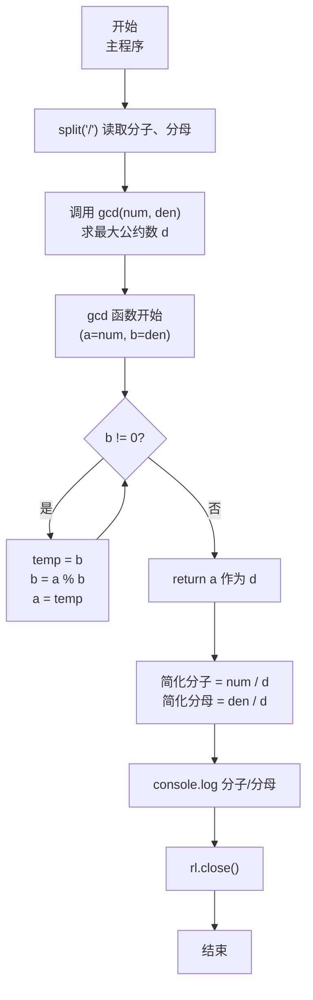
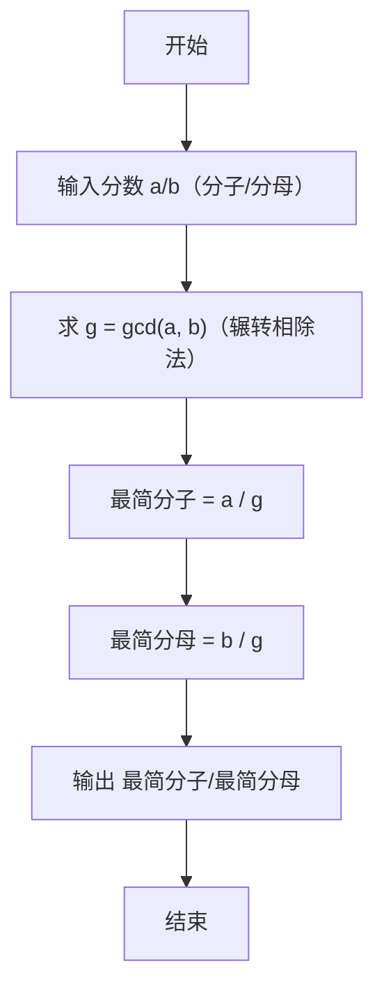

# 7-24 约分最简分式（JavaScript实现）

## 前言

本文是 PTA 编程题"7-24 约分最简分式"的题解，涵盖题目描述、输入输出格式及 JavaScript 实现，展示使用 `split('/')` 分割、`parseInt` 解析"分子/分母"格式输入，并通过辗转相除法（欧几里得算法）求最大公约数 gcd，再将分子分母同除以 gcd 得到最简分式的方法。

本题（7-24 约分最简分式）的主要考点是：准确理解题意、规范处理输入输出格式，并正确处理边界与精度。下面先给出题目描述与格式要求，再通过清晰的思路与可直接运行的javascript实现代码进行讲解。

## 题目描述

分数可以表示为分子/分母的形式。编写一个程序，要求用户输入一个分数，然后将其约分为最简分式。最简分式是指分子和分母不具有可以约分的成分了。如6/12可以被约分为1/2。当分子大于分母时，不需要表达为整数又分数的形式，即11/8还是11/8；而当分子分母相等时，仍然表达为1/1的分数形式。

## 输入格式

输入在一行中给出一个分数，分子和分母中间以斜杠/分隔，如：12/34表示34分之12。分子和分母都是正整数（不包含0，如果不清楚正整数的定义的话）。

提示：

对于C语言，在scanf的格式字符串中加入/，让scanf来处理这个斜杠。
对于Python语言，用a,b=map(int, input().split('/'))这样的代码来处理这个斜杠。

## 输出格式

在一行中输出这个分数对应的最简分式，格式与输入的相同，即采用分子/分母的形式表示分数。如
5/6表示6分之5。

## 输入样例

```in
66/120
```

## 输出样例

```out
11/20
```

## 解题思路

这道题的核心是**求最大公约数（gcd）再做整数除法约分**：用辗转相除法（欧几里得算法）求分子、分母的最大公约数 d，然后最简分式 = (分子/d) / (分母/d)。由于 gcd(a,b)=gcd(b,a)，且辗转相除法天然保证得到正整数，直接即可。

### 核心问题分析

1. **格式解析**：输入是"分子/分母"形式，JS 中先用 `line.trim().split('/')` 按 `/` 分割出分子分母两段字符串，再用 `parseInt`（或 `Number`）解析成整数，无需像 C 的 `scanf` 那样靠格式串匹配斜杠。
2. **约分本质**：最简分式 = 分子分母同除以两者的最大公约数（Greatest Common Divisor, gcd）。gcd 是能同时整除分子和分母的最大正整数，除以它后二者不再有公共因数。
3. **辗转相除法（欧几里得算法）**：原理是 `gcd(a, b) = gcd(b, a mod b)`，反复迭代直到余数为 0，此时的除数即为 gcd。时间复杂度 O(log min(a,b))，效率极高。
4. **特殊情况统一处理**：
   - 分子 > 分母（如 11/8）：题目要求不化为带分数，直接输出即可，无需额外分支。
   - 分子 = 分母（如 5/5）：gcd=5，约分后 1/1，同样由一般流程得到，无需特判。
   - 分子、分母都是正整数：无需处理 0 或负数。

### 算法原理说明

设输入分数 a/b：
1. 求 d = gcd(a, b)（辗转相除）
2. 最简分子 = a / d，最简分母 = b / d
3. 按 `分子/分母` 格式输出

辗转相除法步骤示例（以 66/120 为例）：
- gcd(120, 66)：120 % 66 = 54 → gcd(66, 54)
- gcd(66, 54)：66 % 54 = 12 → gcd(54, 12)
- gcd(54, 12)：54 % 12 = 6 → gcd(12, 6)
- gcd(12, 6)：12 % 6 = 0 → gcd = 6
- 66/6 = 11，120/6 = 20 → 结果 11/20

### 具体计算步骤

1. `const [numerator, denominator] = line.trim().split('/').map(Number);` 读取分子分母
2. `d = gcd(numerator, denominator)` 求最大公约数
3. `simplified_num = numerator / d; simplified_den = denominator / d;`
4. `console.log(\`${simplified_num}/${simplified_den}\`);`
5. `rl.close()` 关闭接口

## 完整代码

```javascript
// 题目：7-24 约分最简分式
// 要求：实现「约分最简分式」（题目 7-24）的输入处理与结果输出。
// 实现原理：
//   1. 格式解析：输入是"分子/分母"形式，JS 中先用 `line.trim().split('/')` 按 `/` 分割出分子分母两段字符串，再用 `parseInt`（或 `Number`）解析成整数，无需像 C 的 `scanf` 那样靠格式串匹配斜杠。
//   2. 约分本质：最简分式 = 分子分母同除以两者的最大公约数（Greatest Common Divisor, gcd）。gcd 是能同时整除分子和分母的最大正整数，除以它后二者不再有公共因数。
//   3. 辗转相除法（欧几里得算法）：原理是 `gcd(a, b) = gcd(b, a mod b)`，反复迭代直到余数为 0，此时的除数即为 gcd。时间复杂度 O(log min(a,b))，效率极高。

const readline = require('readline'); // 引入 readline 模块
const rl = readline.createInterface({ input: process.stdin, output: process.stdout }); // 创建输入输出接口

// 辗转相除法（欧几里得算法）求两个正整数的最大公约数
// 原理：gcd(a, b) = gcd(b, a mod b)，直到余数为 0 时，当前除数即为最大公约数
function gcd(a, b) {
    while (b !== 0) { // 当余数 b 不为 0 时继续迭代
        const temp = b; // 保存当前除数 b，作为下一轮的被除数 a
        b = a % b;      // 计算 a 除以 b 的余数，作为下一轮的除数 b
        a = temp;       // 将原除数 b 赋给 a，成为下一轮的被除数
    }
    return a;           // 当 b==0 时，a 即为两数的最大公约数
}

rl.on('line', (line) => { // 监听一行输入
    // 按"分子/分母"格式读取：先按 '/' 分割，再解析成两个整数
    const [numerator, denominator] = line.trim().split('/').map(Number); // numerator 为分子，denominator 为分母

    // 求出分子和分母的最大公约数（公约数），用于后续约分
    const common_divisor = gcd(numerator, denominator);

    // 分子分母同时除以最大公约数，得到最简分式的分子和分母
    const simplified_num = numerator / common_divisor;
    const simplified_den = denominator / common_divisor;

    // 按"分子/分母"格式输出最简分式
    console.log(`${simplified_num}/${simplified_den}`);

    rl.close(); // 关闭接口
});
```

## 代码流程说明

### 1. 自定义函数 `gcd(a, b)`
- 输入：两个正整数 a、b（分子分母任意顺序均可，gcd(a,b)=gcd(b,a)）
- 过程：`while (b !== 0)` 循环执行 `temp=b; b=a%b; a=temp`
- 输出：当 b=0 时的 a，即两数的最大公约数

### 2. 主程序变量与输入
- `const numerator, denominator`：存储分子、分母
- `line.trim().split('/').map(Number)`：按 `/` 分割输入行并解析出分子、分母两个整数

### 3. 约分计算
- `common_divisor = gcd(numerator, denominator)` 得最大公约数
- `simplified_num = numerator / common_divisor`：最简分子
- `simplified_den = denominator / common_divisor`：最简分母

### 4. 输出
- `console.log(\`${simplified_num}/${simplified_den}\`)` 按格式输出

### 5. 关闭接口
- `rl.close()`

## 代码流程图



## 解题流程图



## 代码解析

### 自定义函数 `gcd(a, b)`

```javascript
const readline = require('readline'); // 引入 readline 模块
const rl = readline.createInterface({ input: process.stdin, output: process.stdout }); // 创建输入输出接口
```

自定义函数 `gcd(a, b)`

### 主程序变量与输入

```javascript
// 辗转相除法（欧几里得算法）求两个正整数的最大公约数
// 原理：gcd(a, b) = gcd(b, a mod b)，直到余数为 0 时，当前除数即为最大公约数
function gcd(a, b) {
    while (b !== 0) { // 当余数 b 不为 0 时继续迭代
        const temp = b; // 保存当前除数 b，作为下一轮的被除数 a
        b = a % b;      // 计算 a 除以 b 的余数，作为下一轮的除数 b
        a = temp;       // 将原除数 b 赋给 a，成为下一轮的被除数
    }
    return a;           // 当 b==0 时，a 即为两数的最大公约数
}
```

主程序变量与输入

### 约分计算

```javascript
rl.on('line', (line) => { // 监听一行输入
    // 按"分子/分母"格式读取：先按 '/' 分割，再解析成两个整数
    const [numerator, denominator] = line.trim().split('/').map(Number); // numerator 为分子，denominator 为分母
```

约分计算

### 输出

```javascript
// 求出分子和分母的最大公约数（公约数），用于后续约分
    const common_divisor = gcd(numerator, denominator);
```

输出

### 关闭接口

```javascript
// 分子分母同时除以最大公约数，得到最简分式的分子和分母
    const simplified_num = numerator / common_divisor;
    const simplified_den = denominator / common_divisor;
```

关闭接口


## 复杂度分析

设输入规模为 $n$（对数值类题目为参与运算的数据量，对字符串/序列类题目为长度）。

- **时间复杂度**：$O(n)$ 或 $O(n \log n)$，主要来自一次线性遍历与常数次数学运算，无嵌套高复杂度循环。
- **空间复杂度**：$O(n)$，用于存储输入、中间结果与输出字符串；若仅使用若干标量变量则为 $O(1)$。

## 常见易错点

### 1. 输入/输出格式不符
错误：多余空格、遗漏换行、大小写或精度不符。后果：判题系统判为格式错误。正确：严格按题目要求的格式输出，数值用合适精度。

### 2. 边界条件遗漏
错误：未处理 0、最小值、单字符或空输入等边界。后果：特例 WA。正确：先列出所有边界样例，在编码前单独分支处理。

### 3. 整数溢出与类型
错误：使用过小的整数类型或忽略负号。后果：大数计算溢出。正确：按数据范围选择合适类型，必要时用更大整数类型或字符串处理。

## 更多测试

### 测试一：常规边界

**输入：**

```text
12/18
```

**输出：**

```text
2/3
```

### 测试二：特殊用例

**输入：**

```text
7/13
```

**输出：**

```text
7/13
```

## 总结

本文是 PTA 编程题"7-24 约分最简分式"的题解，涵盖题目描述、输入输出格式及 JavaScript 实现，展示使用 `split('/')` 分割、`parseInt` 解析"分子/分母"格式输入，并通过辗转相除法（欧几里得算法）求最大公约数 gcd，再将分子分母同除以 gcd 得到最简分式的方法。

本题的核心在于理清「约分最简分式」的输入输出关系与边界处理：先按格式读取输入，再依据规则逐步计算或遍历，最后按规范输出。该思路可迁移到同类格式化输入输出与模拟计算的题目。
