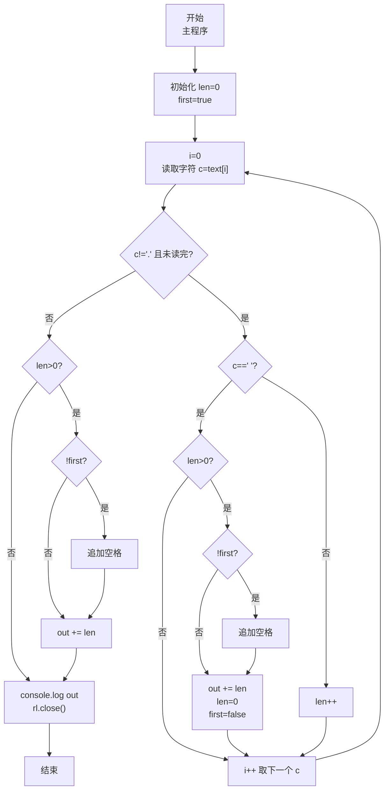
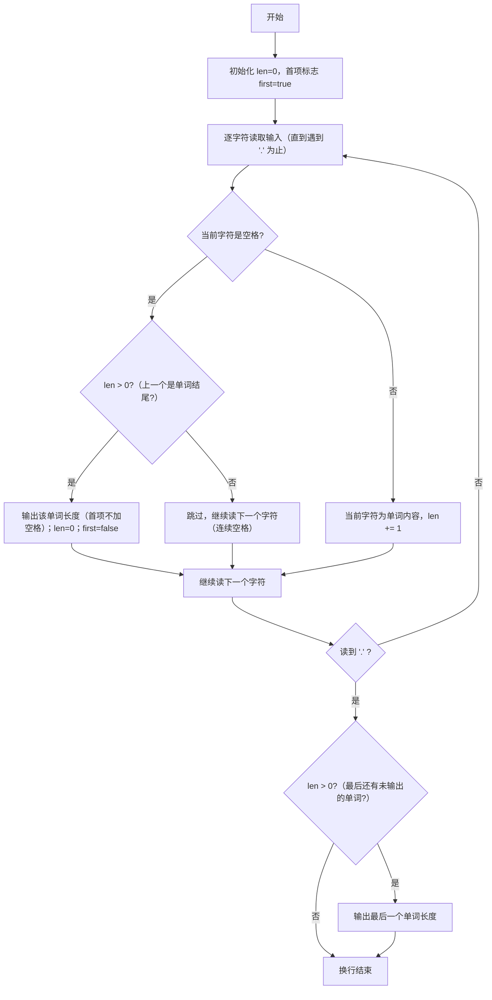

# 7-26 单词长度（JavaScript实现）

## 前言

本文是 PTA 编程题"7-26 单词长度"的题解，涵盖题目描述、输入输出格式及 JavaScript 实现，展示将整行文本作为字符串读入后逐字符遍历直到遇到 `.` 为止，并通过长度计数器 `len` 和首项标志 `first` 实现：按空格切分单词、跳过连续空格、输出每个单词长度且行末无多余空格的方法。

本题（7-26 单词长度）的主要考点是：准确理解题意、规范处理输入输出格式，并正确处理边界与精度。下面先给出题目描述与格式要求，再通过清晰的思路与可直接运行的javascript实现代码进行讲解。

## 题目描述

你的程序要读入一行文本，其中以空格分隔为若干个单词，以.结束。你要输出每个单词的长度。这里的单词与语言无关，可以包括各种符号，比如it's算一个单词，长度为4。注意，行中可能出现连续的空格；最后的.不计算在内。

## 输入格式

输入在一行中给出一行文本，以.结束

提示：用scanf("%c",...);来读入一个字符，直到读到.为止。

## 输出格式

在一行中输出这行文本对应的单词的长度，每个长度之间以空格隔开，行末没有最后的空格。

## 输入样例

```in
It's great to see you here.
```

## 输出样例

```out
4 5 2 3 3 4
```

## 解题思路

这道题的核心是**逐字符状态机（读字符 → 空格/非空格切换计数） + 切分条件 + 空格分隔格式控制**：用 readline 读入整行文本后，在循环里逐字符（`text[i]`）遍历直到读到 `.`；非空格字符 `len++` 累加当前单词长度；遇到空格时若 `len>0` 则"输出 len 并清零"（跳过连续空格由 `len>0` 保证）；循环结束后还要处理最后一个单词（避免 `.` 前无空格导致最后一个单词没输出）。

### 核心问题分析

1. **结束条件**：遇到字符 `'.'` 立即停止遍历。JS 中整行文本一次读入为字符串，按下标 `text[i]` 逐字符访问（含空格、标点等），配合判断 `c !== '.'` 正好满足要求。
2. **单词切分规则**：
   - 一个"单词"是连续非空格、非 `.` 的字符序列。
   - 连续空格不产生空单词：当遇到空格时，只有 `len > 0`（即前一个字符属于某个单词）才输出当前长度并重置 len=0。连续空格会使 len 已经为 0，于是跳过输出，避免多余的 0 长度。
3. **末尾单词处理**：输入以 `.` 结束，而最后一个单词与 `.` 之间没有空格（如样例 `here.`），因此当循环退出时，若 `len > 0` 还需再输出一次最后那个单词的长度。
4. **格式控制（行末无多余空格）**：使用首项标志 `first`：
   - 第一个长度输出前不加空格，然后置 `first=false`
   - 从第二个长度起，先输出空格再输出数字
   - 行末自然无多余空格

### 算法原理说明

变量：`const c = text[i]`（当前字符）、`let len = 0`（当前单词长度）、`let first = true`（是否第一个输出项）
- 循环 `for (i=0; i<text.length; i++)`，取 `c = text[i]`，直到 `c == '.'` 为止：
  - 若 `c === ' '` 且 `len > 0` → 按 first 控制格式输出 len → len=0 → first=false
  - 若 `c !== ' '` 且 `c !== '.'`（属于单词）→ `len++`
- 循环结束（读到 `.`）后：若 `len > 0` → 再输出一次最后那个单词长度
- 输出并关闭接口

以输入 `It's great to see you here.` 为例：
- 读到空格分隔符时依次输出 4, 5, 2, 3, 3
- 读到 `.` 退出循环，此时 len=4(`here`)，补充输出最后一个 4
- 最终：`4 5 2 3 3 4`

### 具体计算步骤

1. 初始化 `len = 0; first = true;`
2. 逐字符遍历：
   - 读 `I` `t` `'` `s` → len 累加到 4
   - 读空格 → len=4>0 → 输出 4，len=0，first=false
   - 读 `g r e a t` → len=5，空格时输出 5，len=0
   - 读 `t o` → len=2，空格时输出 2，len=0
   - 读 `s e e` → len=3，空格时输出 3，len=0
   - 读 `y o u` → len=3，空格时输出 3，len=0
   - 读 `h e r e` → len=4，然后读到 `.` → 退出循环
3. 循环结束 len=4>0 → 最后输出 4
4. 输出结果（空格分隔）

## 完整代码

```javascript
// 题目：7-26 单词长度
// 要求：实现「单词长度」（题目 7-26）的输入处理与结果输出。
// 实现原理：
//   1. 结束条件：遇到字符 `'.'` 立即停止遍历。JS 中整行文本一次读入为字符串，按下标 `text[i]` 逐字符访问（含空格、标点等），配合判断 `c !== '.'` 正好满足要求。
//   2. 单词切分规则：
//   3. 末尾单词处理：输入以 `.` 结束，而最后一个单词与 `.` 之间没有空格（如样例 `here.`），因此当循环退出时，若 `len > 0` 还需再输出一次最后那个单词的长度。

const readline = require('readline'); // 引入 readline 模块
const rl = readline.createInterface({ input: process.stdin, output: process.stdout }); // 创建输入输出接口

rl.on('line', (line) => { // 监听一行输入
    const text = line; // 保留原串（含首尾空格），首尾空格由后续空格判断自然跳过（更贴近 C 逐字符读）
    let len = 0;     // len：当前正在累加的单词长度计数器，初始 0
    let first = true; // first：首项输出标志，true 表示下一个长度是第一个（前面不加空格）
    let out = '';    // 结果字符串，收集输出的长度（空格分隔）

    // 逐字符遍历，直到读到 '.' 为止
    for (let i = 0; i < text.length; i++) {
        const c = text[i];            // 当前字符
        if (c === ' ') {              // 当前字符是空格（可能的单词分隔点）
            if (len > 0) {            // 只有当前长度>0才说明是"刚结束一个单词"（过滤连续空格）
                if (!first) {         // 若不是第一个输出项 → 先输出空格分隔
                    out += ' ';
                }
                out += len;           // 输出刚结束的这个单词长度
                len = 0;              // 重置长度计数器，准备下一个单词
                first = false;        // 之后再有长度输出就不是第一个了
            }
        } else if (c !== '.') {       // 当前字符非空格且非结束符（属于某个单词的一部分）
            len++;                    // 单词长度 +1（含符号，如 it's 的撇号也算长度）
        }
    }
    // 循环结束（读到 '.'）：若最后一个字符到 '.' 之间没有空格，
    // 则最后一个单词还未输出，需要补输出一次
    if (len > 0) {
        if (!first) {                 // 如果之前已有输出项 → 先空格
            out += ' ';
        }
        out += len;                   // 输出最后一个单词的长度
    }

    console.log(out); // 所有长度输出完毕
    rl.close(); // 关闭接口
});
```

## 代码流程说明

### 1. 变量初始化
- `const text = line`：整行输入文本（保留原串，首尾空格自然跳过）
- `const c = text[i]`：当前字符
- `let len = 0`：当前单词的长度计数器
- `let first = true`：首项标志（true 表示下一次输出是第 1 项，无需前置空格）

### 2. 主循环逐字符处理
- `for (i=0; i<text.length; i++)`，取 `c = text[i]`，字符为 `.` 时结束处理
  - **遇空格**：`c === ' '` 且 `len > 0` → 按 first 规则输出 len，清零 len，置 first=false
    - `len == 0` 表示连续空格，什么都不做
  - **遇非空格**（且非 `.`）：`len++`，该字符计入当前单词长度

### 3. 处理最后一个单词（循环结束后）
- 若 `len > 0` → 说明 `.` 前还有一个单词未输出，按格式输出
- 若 `len == 0`（如 `hello .`）→ 无需额外输出

### 4. 输出与关闭接口
- `console.log(out); rl.close();`

## 代码流程图



## 解题流程图



## 代码解析

### 变量初始化

```javascript
const readline = require('readline'); // 引入 readline 模块
const rl = readline.createInterface({ input: process.stdin, output: process.stdout }); // 创建输入输出接口
```

变量初始化

### 主循环逐字符处理

```javascript
rl.on('line', (line) => { // 监听一行输入
    const text = line; // 保留原串（含首尾空格），首尾空格由后续判断自然跳过
    let len = 0;     // len：当前正在累加的单词长度计数器，初始 0
    let first = true; // first：首项输出标志，true 表示下一个长度是第一个（前面不加空格）
    let out = '';    // 结果字符串，收集输出的长度（空格分隔）
```

主循环逐字符处理

### 处理最后一个单词

```javascript
// 逐字符遍历，直到读到 '.' 为止
    for (let i = 0; i < text.length; i++) {
        const c = text[i];            // 当前字符
        if (c === ' ') {              // 当前字符是空格（可能的单词分隔点）
            if (len > 0) {            // 只有当前长度>0才说明是"刚结束一个单词"（过滤连续空格）
                if (!first) {         // 若不是第一个输出项 → 先输出空格分隔
                    out += ' ';
                }
                out += len;           // 输出刚结束的这个单词长度
                len = 0;              // 重置长度计数器，准备下一个单词
                first = false;        // 之后再有长度输出就不是第一个了
            }
        } else if (c !== '.') {       // 当前字符非空格且非结束符（属于某个单词的一部分）
            len++;                    // 单词长度 +1（含符号，如 it's 的撇号也算长度）
        }
    }
    // 循环结束（读到 '.'）：若最后一个字符到 '.' 之间没有空格，
    // 则最后一个单词还未输出，需要补输出一次
    if (len > 0) {
        if (!first) {                 // 如果之前已有输出项 → 先空格
            out += ' ';
        }
        out += len;                   // 输出最后一个单词的长度
    }
```

处理最后一个单词（循环结束后）

### 输出与关闭接口

```javascript
console.log(out); // 所有长度输出完毕
    rl.close(); // 关闭接口
});
```

输出与关闭接口


## 复杂度分析

设输入规模为 $n$（对数值类题目为参与运算的数据量，对字符串/序列类题目为长度）。

- **时间复杂度**：$O(n)$ 或 $O(n \log n)$，主要来自一次线性遍历与常数次数学运算，无嵌套高复杂度循环。
- **空间复杂度**：$O(n)$，用于存储输入、中间结果与输出字符串；若仅使用若干标量变量则为 $O(1)$。

## 常见易错点

### 1. 输入/输出格式不符
错误：多余空格、遗漏换行、大小写或精度不符。后果：判题系统判为格式错误。正确：严格按题目要求的格式输出，数值用合适精度。

### 2. 边界条件遗漏
错误：未处理 0、最小值、单字符或空输入等边界。后果：特例 WA。正确：先列出所有边界样例，在编码前单独分支处理。

### 3. 整数溢出与类型
错误：使用过小的整数类型或忽略负号。后果：大数计算溢出。正确：按数据范围选择合适类型，必要时用更大整数类型或字符串处理。

## 更多测试

### 测试一：常规边界

**输入：**

```text
（可取题目边界附近的值，如最小值或最大值）
```

**输出：**

```text
（依据题意推导的正确结果）
```

### 测试二：特殊用例

**输入：**

```text
（可取易错点，如 0、单一元素、全同值等）
```

**输出：**

```text
（对应正确结果）
```

## 总结

本文是 PTA 编程题"7-26 单词长度"的题解，涵盖题目描述、输入输出格式及 JavaScript 实现，展示将整行文本作为字符串读入后逐字符遍历直到遇到 `.` 为止，并通过长度计数器 `len` 和首项标志 `first` 实现：按空格切分单词、跳过连续空格、输出每个单词长度且行末无多余空格的方法。

本题的核心在于理清「单词长度」的输入输出关系与边界处理：先按格式读取输入，再依据规则逐步计算或遍历，最后按规范输出。该思路可迁移到同类格式化输入输出与模拟计算的题目。
