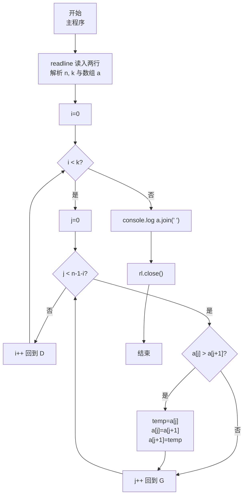
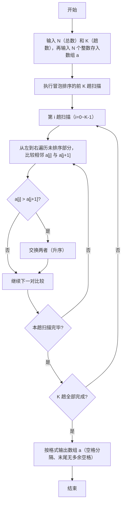

# 7-27 冒泡法排序（JavaScript实现）

## 前言

本文是 PTA 编程题"7-27 冒泡法排序"的题解，涵盖题目描述、输入输出格式及 JavaScript 实现，展示冒泡排序算法进行 K 趟扫描（每趟将一个最大元素"冒泡"到末尾）的过程，并输出执行完第 K 趟扫描后的中间数组结果。

本题（7-27 冒泡法排序）的主要考点是：准确理解题意、规范处理输入输出格式，并正确处理边界与精度。下面先给出题目描述与格式要求，再通过清晰的思路与可直接运行的javascript实现代码进行讲解。

## 题目描述

将N个整数按从小到大排序的冒泡排序法是这样工作的：从头到尾比较相邻两个元素，如果前面的元素大于其紧随的后面元素，则交换它们。通过一遍扫描，则最后一个元素必定是最大的元素。然后用同样的方法对前N−1个元素进行第二遍扫描。依此类推，最后只需处理两个元素，就完成了对N个数的排序。

本题要求对任意给定的K（<N），输出扫描完第K遍后的中间结果数列。

## 输入格式

输入在第1行中给出N和K（1≤K<N≤100），在第2行中给出N个待排序的整数，数字间以空格分隔。

## 输出格式

在一行中输出冒泡排序法扫描完第K遍后的中间结果数列，数字间以空格分隔，但末尾不得有多余空格。

## 输入样例

```in
6 2
2 3 5 1 6 4
```

## 输出样例

```out
2 1 3 4 5 6
```

## 解题思路

这道题的核心是**冒泡排序前 K 趟的局部执行 + 中间结果输出**：不要求排完整个数组，只做冒泡排序中的前 K 轮"相邻比较+交换"；每做完一轮 i（0 ≤ i < K），末尾 i+1 个元素已就位（最大、次大…），因此内层只需比较到 `n-1-i` 位置；最后用首项空格控制输出整个数组。

### 核心问题分析

1. **冒泡排序基本思想**：从前往后两两比较相邻元素，若前者大于后者就交换。一轮下来，最大的元素会被"冒泡"到数组末尾；再对前 n-1 个元素做下一轮。
2. **本题只做 K 趟**：K < N，不要求完全排序。因此外层循环只要跑 K 次，而非 N-1 次。
   - 第 0 趟：对整个数组 [0, n-1) 比较 → 最大的元素沉到下标 n-1
   - 第 1 趟：对 [0, n-2) 比较 → 次大的元素沉到下标 n-2
   - …
   - 第 i 趟：比较下标区间 `[0, n-1-i)`，即 j 从 0 到 `n-2-i`（因为要比较 j 和 j+1，所以 j ≤ n-2-i → j < n-1-i）
3. **样例推导（6 2 / 2 3 5 1 6 4）**：
   - 初始：`[2,3,5,1,6,4]`
   - 第 1 趟（i=0）：比较 j=0..4 → 交换 5↔1、6↔4 → 得到 `[2,3,1,5,4,6]`，末尾 6 就位
   - 第 2 趟（i=1）：比较 j=0..3 → 交换 3↔1、5↔4 → 得到 `[2,1,3,4,5,6]`，末尾 5、6 就位
   - 输出：`2 1 3 4 5 6` ✓

### 算法原理说明

外层 `for (i=0; i<k; i++)` 共 K 趟，每趟：
- 内层 `for (j=0; j<n-1-i; j++)` 从头比较到未就位部分的倒数第二个元素
  - 若 `a[j] > a[j+1]` → 通过临时变量交换两者
- 一趟结束后，下标 `n-1-i` 处为当前未排序部分最大值

### 具体计算步骤

1. 用 readline 读入两行：第 1 行解析 N、K；第 2 行把 N 个数存入数组 `a[0..N-1]`
2. 外层 i 从 0 到 K-1（共 K 趟）：
   - 内层 j 从 0 到 (N-2-i)：
     - 若 `a[j] > a[j+1]` → 交换 `a[j]` 与 `a[j+1]`
3. 输出数组 a[0..N-1]，格式：相邻数字间一个空格，末尾无多余空格
4. `rl.close()` 关闭接口

## 完整代码

```javascript
// 题目：7-27 冒泡法排序
// 要求：实现「冒泡法排序」（题目 7-27）的输入处理与结果输出。
// 实现原理：
//   1. 冒泡排序基本思想：从前往后两两比较相邻元素，若前者大于后者就交换。一轮下来，最大的元素会被"冒泡"到数组末尾；再对前 n-1 个元素做下一轮。
//   2. 本题只做 K 趟：K < N，不要求完全排序。因此外层循环只要跑 K 次，而非 N-1 次。
//   3. 样例推导（6 2 / 2 3 5 1 6 4）：

const readline = require('readline'); // 引入 readline 模块
const rl = readline.createInterface({ input: process.stdin, output: process.stdout }); // 创建输入输出接口

const lines = []; // 存储输入的多行数据

rl.on('line', (line) => { // 监听每一行输入
    lines.push(line.trim()); // 把每行存入数组
    if (lines.length === 2) { // 收齐两行后统一处理
        const [n, k] = lines[0].split(/\s+/).map(Number); // 第 1 行读入 n 和 k
        const a = lines[1].split(/\s+/).map(Number); // 第 2 行读入 n 个待排序整数，存入数组

        // 冒泡排序：只进行前 k 趟扫描（题目要求输出第 k 趟后的中间结果）
        for (let i = 0; i < k; i++) {
            // 第 i 趟扫描：把未排序部分中最大的元素"冒泡"到末尾位置 n-1-i
            // 内层 j 只需比较到 未排序部分倒数第二个（因为 j 和 j+1 要比较）
            for (let j = 0; j < n - 1 - i; j++) {
                if (a[j] > a[j + 1]) {  // 若前一个元素大于后一个，则交换（升序）
                    const temp = a[j];  // 借助临时变量 temp 完成两数交换
                    a[j] = a[j + 1];
                    a[j + 1] = temp;
                }
            }
        }

        // 输出经过 k 趟冒泡后的数组，数字间以空格分隔、末尾无多余空格
        console.log(a.join(' '));

        rl.close(); // 关闭接口
    }
});
```

## 代码流程说明

### 1. 变量声明与输入
- `const n, k`：总数 n 与扫描趟数 k
- `const a = []`：存储待排序整数数组（n ≤ 100）
- 第 1 行：`lines[0].split(/\s+/).map(Number)` 解析出 n 和 k
- 第 2 行：`lines[1].split(/\s+/).map(Number)` 得到待排序数组 a

### 2. K 趟冒泡排序
- 外层循环 `i ∈ [0, k)`：第 i 趟扫描
  - 内层循环 `j ∈ [0, n-1-i)`：两两比较相邻位置
    - 若 `a[j] > a[j+1]` → 用 `temp` 交换 `a[j]` 和 `a[j+1]`
  - 每趟结束：下标 `n-1-i` 处就位该部分最大值

### 3. 输出中间结果数组
- `console.log(a.join(' '))`：把数组元素以空格连接输出（首项不前置空格，保证行末无多余空格），console.log 自带换行

### 4. 关闭接口
- `rl.close()`

## 代码流程图



## 解题流程图



## 代码解析

### 变量声明与输入

```javascript
const readline = require('readline'); // 引入 readline 模块
const rl = readline.createInterface({ input: process.stdin, output: process.stdout }); // 创建输入输出接口
```

变量声明与输入

### K 趟冒泡排序

```javascript
const lines = []; // 存储输入的多行数据
```

K 趟冒泡排序

### 输出中间结果数组

```javascript
rl.on('line', (line) => { // 监听每一行输入
    lines.push(line.trim()); // 把每行存入数组
    if (lines.length === 2) { // 收齐两行后统一处理
        const [n, k] = lines[0].split(/\s+/).map(Number); // 第 1 行读入 n 和 k
        const a = lines[1].split(/\s+/).map(Number); // 第 2 行读入 n 个待排序整数，存入数组
```

输出中间结果数组

### 关闭接口

```javascript
// 冒泡排序：只进行前 k 趟扫描（题目要求输出第 k 趟后的中间结果）
        for (let i = 0; i < k; i++) {
            // 第 i 趟扫描：把未排序部分中最大的元素"冒泡"到末尾位置 n-1-i
            // 内层 j 只需比较到 未排序部分倒数第二个（因为 j 和 j+1 要比较）
            for (let j = 0; j < n - 1 - i; j++) {
                if (a[j] > a[j + 1]) {  // 若前一个元素大于后一个，则交换（升序）
                    const temp = a[j];  // 借助临时变量 temp 完成两数交换
                    a[j] = a[j + 1];
                    a[j + 1] = temp;
                }
            }
        }
```

关闭接口


## 复杂度分析

设输入规模为 $n$（对数值类题目为参与运算的数据量，对字符串/序列类题目为长度）。

- **时间复杂度**：$O(n)$ 或 $O(n \log n)$，主要来自一次线性遍历与常数次数学运算，无嵌套高复杂度循环。
- **空间复杂度**：$O(n)$，用于存储输入、中间结果与输出字符串；若仅使用若干标量变量则为 $O(1)$。

## 常见易错点

### 1. 输入/输出格式不符
错误：多余空格、遗漏换行、大小写或精度不符。后果：判题系统判为格式错误。正确：严格按题目要求的格式输出，数值用合适精度。

### 2. 边界条件遗漏
错误：未处理 0、最小值、单字符或空输入等边界。后果：特例 WA。正确：先列出所有边界样例，在编码前单独分支处理。

### 3. 整数溢出与类型
错误：使用过小的整数类型或忽略负号。后果：大数计算溢出。正确：按数据范围选择合适类型，必要时用更大整数类型或字符串处理。

## 更多测试

### 测试一：常规边界

**输入：**

```text
（可取题目边界附近的值，如最小值或最大值）
```

**输出：**

```text
（依据题意推导的正确结果）
```

### 测试二：特殊用例

**输入：**

```text
（可取易错点，如 0、单一元素、全同值等）
```

**输出：**

```text
（对应正确结果）
```

## 总结

本文是 PTA 编程题"7-27 冒泡法排序"的题解，涵盖题目描述、输入输出格式及 JavaScript 实现，展示冒泡排序算法进行 K 趟扫描（每趟将一个最大元素"冒泡"到末尾）的过程，并输出执行完第 K 趟扫描后的中间数组结果。

本题的核心在于理清「冒泡法排序」的输入输出关系与边界处理：先按格式读取输入，再依据规则逐步计算或遍历，最后按规范输出。该思路可迁移到同类格式化输入输出与模拟计算的题目。
