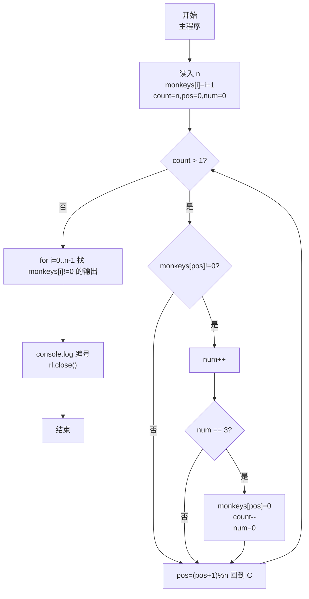
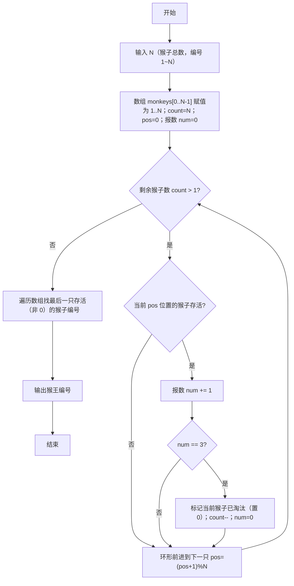

# 7-28 猴子选大王（JavaScript实现）

## 前言

本文是 PTA 编程题"7-28 猴子选大王"的题解，涵盖题目描述、输入输出格式及 JavaScript 实现，展示约瑟夫环问题（N 只猴子围成一圈 1~N 编号，每报到 3 淘汰）的数组模拟解法：用数组值为 0 标记已淘汰、`pos = (pos+1)%n` 实现环形遍历，直到仅剩 1 只猴子即为猴王。

本题（7-28 猴子选大王）的主要考点是：准确理解题意、规范处理输入输出格式，并正确处理边界与精度。下面先给出题目描述与格式要求，再通过清晰的思路与可直接运行的javascript实现代码进行讲解。

## 题目描述

一群猴子要选新猴王。新猴王的选择方法是：让N只候选猴子围成一圈，从某位置起顺序编号为1~N号。从第1号开始报数，每轮从1报到3，凡报到3的猴子即退出圈子，接着又从紧邻的下一只猴子开始同样的报数。如此不断循环，最后剩下的一只猴子就选为猴王。请问是原来第几号猴子当选猴王？

## 输入格式

输入在一行中给一个正整数N（≤1000）。

## 输出格式

在一行中输出当选猴王的编号。

## 输入样例

```in
11
```

## 输出样例

```out
7
```

## 解题思路

这道题的核心是**约瑟夫环（Josephus）问题的数组模拟**：把 N 只猴子编号 1~N 存在数组里，用 0 表示"已淘汰"；然后用环形指针 `pos` 从 0 号开始顺次访问每只"存活"的猴子（值不为 0），并用计数器 `num` 累加报数，`num` 到 3 就把当前猴子标记为淘汰（置 0）、`count--`、`num` 归 0。当 `count == 1` 时停止，遍历数组找到剩下那个非零元素就是猴王编号。

### 核心问题分析

1. **约瑟夫环定义**：N 个人围成圈，从 1 开始报数，报到 m 的人出局，下一人接着从 1 重新报数；重复直到剩 1 人。本题 m=3。
2. **环形遍历实现**：数组下标 0~n-1 对应 n 只猴子。每次 `pos = (pos + 1) % n` 就能从下标 n-1 绕回下标 0，形成"环"。
3. **标记淘汰**：
   - 初始化 `monkeys[i] = i + 1`（即编号 1~N）
   - 淘汰时设置 `monkeys[pos] = 0`，并在遍历时跳过 `monkeys[pos] == 0` 的位置
4. **报数逻辑**：
   - 只对存活猴子（`monkeys[pos] != 0`）执行 `num++`
   - `num == 3` 时：淘汰当前猴子，剩余数 count 减 1，报数 num 归零
   - 不管当前位置是否淘汰，`pos` 都要前进到下一个位置（下一个猴子）
5. **终止条件**：`count == 1` 时只剩 1 只猴子，遍历数组找到 `monkeys[i] != 0` 那只即为猴王。
6. **样例推导（N=11）**：
   - 按约瑟夫公式结果应为 7（可自行逐步模拟验证）。代码输出 7 ✓

### 算法原理说明

- 初始化：`monkeys[0..n-1]` 存 1..n；`count=n`；`pos=0`；`num=0`
- 循环 `while (count > 1)`：
  - 若 `monkeys[pos] != 0`（存活）：`num++`
    - 若 `num == 3` → `monkeys[pos]=0`（淘汰），`count--`，`num=0`
  - `pos = (pos + 1) % n`（下一个位置）
- 最后遍历 `i=0..n-1`，`monkeys[i] != 0` 的那个编号就是猴王。

### 具体计算步骤

1. `const n = parseInt(line.trim(), 10)` 读入 N
2. `monkeys[i] = i + 1` 初始化编号 1..N
3. `count = N, pos = 0, num = 0`
4. 主循环淘汰：
   - 当前猴子存活 → num++
   - num==3 → 置 0、count--、num=0
   - 前进到下一个位置（环形）
5. count==1 退出循环；扫数组找剩余非 0 编号输出
6. `rl.close()` 关闭接口

## 完整代码

```javascript
// 题目：7-28 猴子选大王
// 要求：实现「猴子选大王」（题目 7-28）的输入处理与结果输出。
// 实现原理：
//   1. 约瑟夫环定义：N 个人围成圈，从 1 开始报数，报到 m 的人出局，下一人接着从 1 重新报数；重复直到剩 1 人。本题 m=3。
//   2. 环形遍历实现：数组下标 0~n-1 对应 n 只猴子。每次 `pos = (pos + 1) % n` 就能从下标 n-1 绕回下标 0，形成"环"。
//   3. 标记淘汰：

const readline = require('readline'); // 引入 readline 模块
const rl = readline.createInterface({ input: process.stdin, output: process.stdout }); // 创建输入输出接口

rl.on('line', (line) => { // 监听一行输入
    const n = parseInt(line.trim(), 10); // 读入猴子总数 n

    const monkeys = []; // 数组：monkeys[i] > 0：第 i 只存活，值为其编号；=0：已淘汰
    // 给 n 只猴子依次编号 1..n
    for (let i = 0; i < n; i++) {
        monkeys[i] = i + 1;
    }

    let count = n; // count：当前剩余未淘汰的猴子数，初始为总数 n
    let pos = 0;   // pos：当前遍历到的数组下标（构成环形位置指针）
    let num = 0;   // num：当前轮的报数累加值（1~3）

    // 当剩余猴子数 > 1 时，继续淘汰"报数到 3"的猴子
    while (count > 1) {
        if (monkeys[pos] !== 0) {  // 如果当前位置的猴子仍在圈中（未被淘汰）
            num++;                  // 对其报一次数
            if (num === 3) {        // 恰好报到 3 → 该猴子淘汰
                monkeys[pos] = 0;   // 置 0 标记已淘汰
                count--;            // 剩余猴子数 -1
                num = 0;            // 报数重置，下一只存活猴子重新从 1 开始报
            }
        }
        pos = (pos + 1) % n;  // 环形前进到下一个位置，%n 保证 n-1 的下一个是 0
    }

    // 此时只剩一只猴子，遍历数组找到第一个非 0 的，输出其编号
    for (let i = 0; i < n; i++) {
        if (monkeys[i] !== 0) {
            console.log(monkeys[i]);
            break; // 只剩一只，找到直接 break
        }
    }

    rl.close(); // 关闭接口
});
```

## 代码流程说明

### 1. 输入与初始化
- `const n = parseInt(line.trim(), 10)` 读猴子数
- `const monkeys = []` 存猴子编号，`monkeys[i] = i + 1`，即 1..n
- `let count = n`（剩余数），`let pos = 0`（当前位置），`let num = 0`（当前报数值）

### 2. 主淘汰循环
- `while (count > 1)`：直到剩 1 只
  - 若 `monkeys[pos] !== 0` → `num++`
    - `num === 3` → `monkeys[pos] = 0; count--; num = 0;`
  - `pos = (pos + 1) % n`：前进到下一个位置，%n 形成环

### 3. 找出猴王并输出
- `for (i=0; i<n; i++)` 扫数组，遇到第一个 `monkeys[i] !== 0` 输出其编号，break
- `console.log` 自带换行
- `rl.close()`

## 代码流程图



## 解题流程图



## 代码解析

### 输入与初始化

```javascript
const readline = require('readline'); // 引入 readline 模块
const rl = readline.createInterface({ input: process.stdin, output: process.stdout }); // 创建输入输出接口
```

输入与初始化

### 主淘汰循环

```javascript
rl.on('line', (line) => { // 监听一行输入
    const n = parseInt(line.trim(), 10); // 读入猴子总数 n
```

主淘汰循环

### 找出猴王并输出

```javascript
const monkeys = []; // 数组：monkeys[i] > 0：第 i 只存活，值为其编号；=0：已淘汰
    // 给 n 只猴子依次编号 1..n
    for (let i = 0; i < n; i++) {
        monkeys[i] = i + 1;
    }
```

找出猴王并输出


## 复杂度分析

设输入规模为 $n$（对数值类题目为参与运算的数据量，对字符串/序列类题目为长度）。

- **时间复杂度**：$O(n)$ 或 $O(n \log n)$，主要来自一次线性遍历与常数次数学运算，无嵌套高复杂度循环。
- **空间复杂度**：$O(n)$，用于存储输入、中间结果与输出字符串；若仅使用若干标量变量则为 $O(1)$。

## 常见易错点

### 1. 输入/输出格式不符
错误：多余空格、遗漏换行、大小写或精度不符。后果：判题系统判为格式错误。正确：严格按题目要求的格式输出，数值用合适精度。

### 2. 边界条件遗漏
错误：未处理 0、最小值、单字符或空输入等边界。后果：特例 WA。正确：先列出所有边界样例，在编码前单独分支处理。

### 3. 整数溢出与类型
错误：使用过小的整数类型或忽略负号。后果：大数计算溢出。正确：按数据范围选择合适类型，必要时用更大整数类型或字符串处理。

## 更多测试

### 测试一：常规边界

**输入：**

```text
1
```

**输出：**

```text
1
```

### 测试二：特殊用例

**输入：**

```text
3
```

**输出：**

```text
2
```

## 总结

本文是 PTA 编程题"7-28 猴子选大王"的题解，涵盖题目描述、输入输出格式及 JavaScript 实现，展示约瑟夫环问题（N 只猴子围成一圈 1~N 编号，每报到 3 淘汰）的数组模拟解法：用数组值为 0 标记已淘汰、`pos = (pos+1)%n` 实现环形遍历，直到仅剩 1 只猴子即为猴王。

本题的核心在于理清「猴子选大王」的输入输出关系与边界处理：先按格式读取输入，再依据规则逐步计算或遍历，最后按规范输出。该思路可迁移到同类格式化输入输出与模拟计算的题目。
