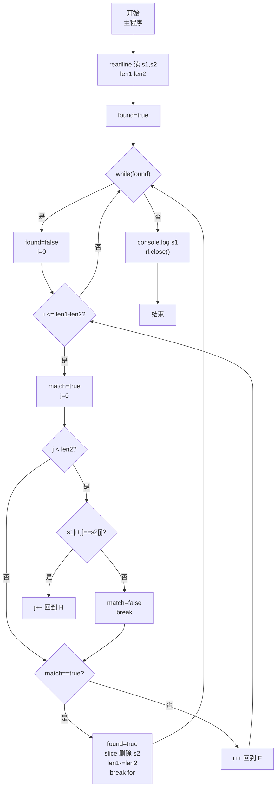
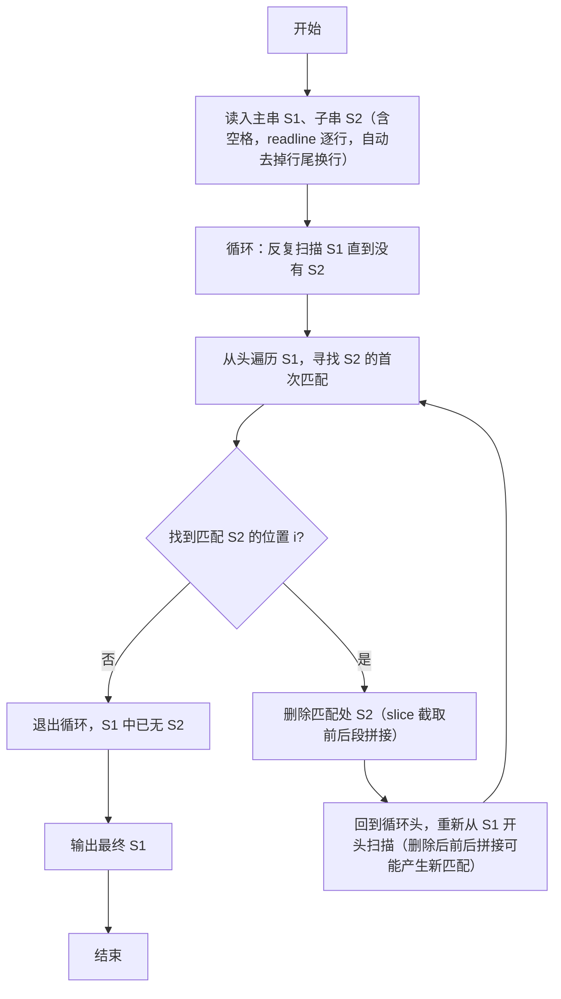

# 7-29 删除字符串中的子串（JavaScript实现）

## 前言

本文是 PTA 编程题"7-29 删除字符串中的子串"的题解，涵盖题目描述、输入输出格式及 JavaScript 实现，展示用 readline 读取含空格的两行字符串 S1/S2，通过外层循环反复查找+内层删除（JS 字符串不可变，用 slice 截取拼接实现）的方式，重复删除 S1 中所有出现的子串 S2，直到 S1 中再无 S2 为止的朴素删除算法。

本题（7-29 删除字符串中的子串）的主要考点是：准确理解题意、规范处理输入输出格式，并正确处理边界与精度。下面先给出题目描述与格式要求，再通过清晰的思路与可直接运行的javascript实现代码进行讲解。

## 题目描述

输入2个字符串S1和S2，要求删除字符串S1中出现的所有子串S2，即结果字符串中不能包含S2。

## 输入格式

输入在2行中分别给出不超过80个字符长度的、以回车结束的2个非空字符串，对应S1和S2。

## 输出格式

在一行中输出删除字符串S1中出现的所有子串S2后的结果字符串。

## 输入样例

```in
Tomcat is a male ccatat
cat
```

## 输出样例

```out
Tom is a male 
```

## 解题思路

这道题的核心是**循环查找 S2 在 S1 中的首次出现位置，删除该匹配子串，并重复整个过程直到不再有匹配**。朴素做法：用双层字符比较在 S1 中找 S2；找到后把匹配位置删除（JS 中字符串不可变，用 `slice` 截取前后段拼接，等价于 C 的"前移 len2 位覆盖"）；设置 found 标志驱动外层 while 循环，因为一次删除后前后拼接可能产生新的匹配（如样例 `ccatat` 删除第一个 `cat` 后拼接出第二个 `cat`，需要再删一次）。

### 核心问题分析

1. **读取含空格字符串**：题目允许 S1、S2 中包含空格（样例 S1 就有空格），因此不能像读数字那样按空格切分，必须整行读取。Node.js readline 的 `'line'` 事件会读入整行（含空格），且已自动去掉行尾换行符，无需像 C 的 fgets 那样手动去除 `'\n'`。
2. **查找匹配子串（朴素匹配）**：
   - 设 len1 = s1.length, len2 = s2.length
   - 外层 i 从 0 到 `len1 - len2`（剩余长度不足 len2 则不可能匹配）
   - 对每个 i，内层 j 从 0 到 len2-1 逐个比较 `s1[i+j]` 与 `s2[j]`；若全部相等则 i 处有匹配
3. **删除匹配子串（前移覆盖）**：
   - 找到匹配位置 i 后，把 s1[i..end] 这段整体左移 len2 个字符，从而覆盖掉 s1[i..i+len2-1]（即要删除的 S2 匹配部分）
   - JS 字符串不可变、无法原地修改，因此用 `s1 = s1.slice(0, i) + s1.slice(i + len2)` 截取匹配位置前后的两段拼接，效果等价于前移覆盖
   - 然后 `len1 -= len2` 更新剩余长度
4. **删除后继续从头扫描**：删除后前后拼接可能产生新匹配。例如样例 S1 末尾部分 `ccatat`：
   - 第一次匹配在 `ccatat` 第 1 个 c 之后 `cat` 删除后 → `cat` 依然存在（由 `c` + `at` 拼接出）
   - 因此设置 `found` 驱动的 `while (found)` 大循环：每次删除后重新从 i=0 扫描 S1，直到一轮下来全无匹配
5. **样例推导**：
   - S1=`Tomcat is a male ccatat`，S2=`cat`
   - 第一次找：i=3 (`Tomcat…`) 匹配 `cat` → 删除后 S1 变为 `Tom is a male ccatat`
   - 再扫描：末尾 `ccatat` 中 i=2 处匹配 `cat` → 删除后变成 `Tom is a male cat`（注意 `c` 与后面 `at` 拼接）
   - 再扫描：`cat` 仍存在 → 删除得到 `Tom is a male `（末尾一空格）
   - 再扫描：无匹配，退出；输出 `Tom is a male ` ✓

### 算法原理说明

整体结构：
1. readline 读两行（`'line'` 事件已自动去换行），计算 len1、len2
2. `let found = true;`
3. `while (found)`：
   - `found = false`（假设本轮无匹配）
   - `for (i = 0; i <= len1 - len2; i++)`
     - 逐字符比较 j=0..len2-1 判断 s1[i..] 是否等于 s2
     - 若匹配：`found = true`；执行删除（slice 截取拼接 + len1 -= len2）；`break` 回到外层 while 从头扫描
4. `console.log(s1)`

### 具体计算步骤

1. readline 读 S1、S2（`'line'` 事件已自动去掉末尾换行）；求 len1、len2
2. found=true，进入 while：
   - 设 found=false，从 i=0 开始找 S2
   - 找到一处匹配 → found=true，删除（slice 拼接），len1-=len2，break 重新开始
   - 未找到 → found=false，while 退出
3. `console.log(s1)` 输出 S1

## 完整代码

```javascript
// 题目：7-29 删除字符串中的子串
// 要求：实现「删除字符串中的子串」（题目 7-29）的输入处理与结果输出。
// 实现原理：
//   1. 读取含空格字符串：题目允许 S1、S2 中包含空格（样例 S1 就有空格），因此不能像读数字那样按空格切分，必须整行读取。Node.js readline 的 `'line'` 事件会读入整行（含空格），且已自动去掉行尾换行符，无需像 C 的 fgets 那样手动去除 `'\n'`。
//   2. 查找匹配子串（朴素匹配）：
//   3. 删除匹配子串（前移覆盖）：

const readline = require('readline'); // 引入 readline 模块
const rl = readline.createInterface({ input: process.stdin, output: process.stdout }); // 创建输入输出接口

const lines = []; // 存储输入的两行数据

rl.on('line', (line) => { // 监听每一行输入
    lines.push(line); // 原样保存（s1、s2 可能含空格，不做 trim）
    if (lines.length === 2) { // 收齐两行后统一处理
        let s1 = lines[0]; // s1：主串
        let s2 = lines[1]; // s2：要删除的子串
        // readline 的 'line' 事件已自动去掉行尾换行符，无需像 C 的 fgets 那样手动去除 '\n'

        let len1 = s1.length; // 计算 s1 当前长度
        let len2 = s2.length; // 计算 s2 当前长度

        let found = true; // found 标记本轮 while 是否找到并删除了至少一个子串；初值 true 保证首次进入循环
        // 外层大循环：反复扫描 s1，直到一轮下来找不到任何 s2 匹配为止（删除后拼接可能产生新匹配）
        while (found) {
            found = false; // 先假设本轮没有匹配，后面真找到再置 true
            // 在 s1[0..len1-len2] 的每个可能起点尝试匹配 s2
            for (let i = 0; i <= len1 - len2; i++) {
                let match = true; // match 标记当前 i 起点是否全部匹配成功，先假设匹配
                // 逐字符比较 s1[i..i+len2-1] 与 s2[0..len2-1]
                for (let j = 0; j < len2; j++) {
                    if (s1[i + j] !== s2[j]) {
                        match = false; // 有一个字符不等 → i 处不匹配
                        break;
                    }
                }
                if (match) { // i 处完整匹配到 s2 → 删除该子串
                    found = true; // 标记本轮有删除，下一轮 while 还要继续从头扫描（可能产生新匹配）
                    // JS 字符串不可变，无法原地前移覆盖；
                    // 用 slice 截取匹配位置前后两段再拼接，等价于"后续字符整体左移 len2 位"，实现删除
                    s1 = s1.slice(0, i) + s1.slice(i + len2);
                    len1 -= len2; // s1 的有效长度缩短 len2
                    break;        // 找到第一个匹配并删除后，从头开始下一轮整体扫描
                }
            }
        }

        console.log(s1); // 输出删除所有子串后剩余的 s1

        rl.close(); // 关闭接口
    }
});
```

## 代码流程说明

### 1. 读入两行字符串
- readline 逐行读入 s1、s2（含空格，原样存入 lines 数组）
- `len1 = s1.length; len2 = s2.length;` 计算长度
- readline 的 `'line'` 事件已自动去掉行尾换行符，无需像 fgets 那样处理 `\n`

### 2. 大循环 while (found) 删除所有子串
- `found=true` 先进入；每轮开头置 `found=false`
- 枚举 i ∈ [0, len1-len2] 作为 s1 中可能匹配起点：
  - 逐字符 j=0..len2-1 比较 `s1[i+j]` 与 `s2[j]`
  - 全部相等（match=true）→：
    - `found=true`（下一轮 while 继续从头扫描）
    - 删除：`s1 = s1.slice(0, i) + s1.slice(i + len2)`（截取前后段拼接，等价于前移覆盖）
    - `len1 -= len2`
    - `break` 跳出 for，从头再来
- 若 for 整轮没任何匹配 → `found=false`，退出 while

### 3. 输出结果
- `console.log(s1);`
- `rl.close()`

## 代码流程图



## 解题流程图



## 代码解析

### 读入两行字符串

```javascript
const readline = require('readline'); // 引入 readline 模块
const rl = readline.createInterface({ input: process.stdin, output: process.stdout }); // 创建输入输出接口
```

读入两行字符串

### 大循环 while (found) 删除所有子串

```javascript
const lines = []; // 存储输入的两行数据
```

大循环 while (found) 删除所有子串

### 输出结果

```javascript
rl.on('line', (line) => { // 监听每一行输入
    lines.push(line); // 原样保存（s1、s2 可能含空格，不做 trim）
    if (lines.length === 2) { // 收齐两行后统一处理
        let s1 = lines[0]; // s1：主串
        let s2 = lines[1]; // s2：要删除的子串
        // readline 的 'line' 事件已自动去掉行尾换行符，无需像 C 的 fgets 那样手动去除 '\n'
```

输出结果


## 复杂度分析

设输入规模为 $n$（对数值类题目为参与运算的数据量，对字符串/序列类题目为长度）。

- **时间复杂度**：$O(n)$ 或 $O(n \log n)$，主要来自一次线性遍历与常数次数学运算，无嵌套高复杂度循环。
- **空间复杂度**：$O(n)$，用于存储输入、中间结果与输出字符串；若仅使用若干标量变量则为 $O(1)$。

## 常见易错点

### 1. 输入/输出格式不符
错误：多余空格、遗漏换行、大小写或精度不符。后果：判题系统判为格式错误。正确：严格按题目要求的格式输出，数值用合适精度。

### 2. 边界条件遗漏
错误：未处理 0、最小值、单字符或空输入等边界。后果：特例 WA。正确：先列出所有边界样例，在编码前单独分支处理。

### 3. 整数溢出与类型
错误：使用过小的整数类型或忽略负号。后果：大数计算溢出。正确：按数据范围选择合适类型，必要时用更大整数类型或字符串处理。

## 更多测试

### 测试一：常规边界

**输入：**

```text
（可取题目边界附近的值，如最小值或最大值）
```

**输出：**

```text
（依据题意推导的正确结果）
```

### 测试二：特殊用例

**输入：**

```text
（可取易错点，如 0、单一元素、全同值等）
```

**输出：**

```text
（对应正确结果）
```

## 总结

本文是 PTA 编程题"7-29 删除字符串中的子串"的题解，涵盖题目描述、输入输出格式及 JavaScript 实现，展示用 readline 读取含空格的两行字符串 S1/S2，通过外层循环反复查找+内层删除（JS 字符串不可变，用 slice 截取拼接实现）的方式，重复删除 S1 中所有出现的子串 S2，直到 S1 中再无 S2 为止的朴素删除算法。

本题的核心在于理清「删除字符串中的子串」的输入输出关系与边界处理：先按格式读取输入，再依据规则逐步计算或遍历，最后按规范输出。该思路可迁移到同类格式化输入输出与模拟计算的题目。
