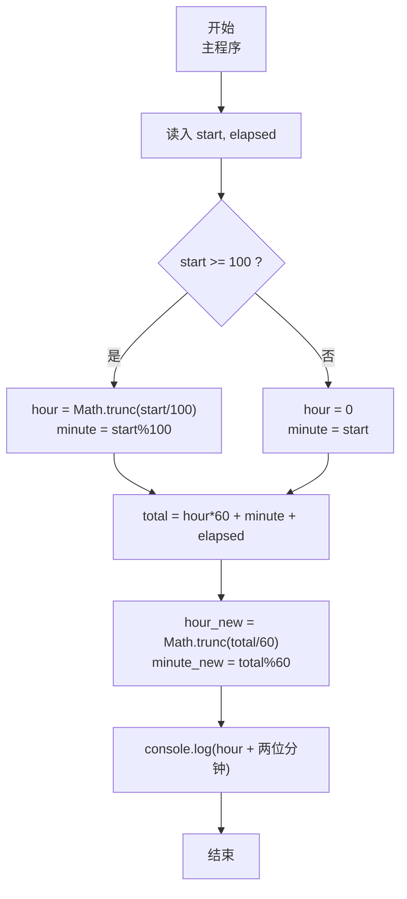
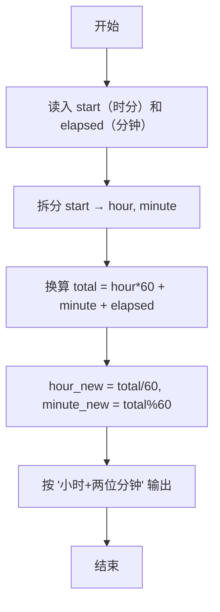

# 7-2 然后是几点（JavaScript实现）

## 前言

本文是 PTA 编程题“7-2 然后是几点”的题解，涵盖题目描述、输入输出格式及 JavaScript 实现，展示 4 位整数时分格式的拆解与"加/减分钟数"的统一处理方法。

本题（7-2 然后是几点）的主要考点是：准确理解题意、规范处理输入输出格式，并正确处理边界与精度。下面先给出题目描述与格式要求，再通过清晰的思路与可直接运行的javascript实现代码进行讲解。

## 题目描述

有时候人们用四位数字表示一个时间，比如 `1106` 表示 11 点零 6 分。现在，你的程序要根据起始时间和流逝的时间计算出终止时间。

读入两个数字，第一个数字以这样的四位数字表示当前时间，第二个数字表示分钟数，计算当前时间经过那么多分钟后是几点，结果也表示为四位数字。当小时为个位数时，没有前导的零，例如 5 点 30 分表示为 `530`；0 点 30 分表示为 `030`。注意，第二个数字表示的分钟数可能超过 60，也可能是负数。

## 输入格式

输入在一行中给出 2 个整数，分别是四位数字表示的起始时间、以及流逝的分钟数，其间以空格分隔。注意：在起始时间中，当小时为个位数时，没有前导的零，即 5 点 30 分表示为 `530`；0 点 30 分表示为 `030`。流逝的分钟数可能超过 60，也可能是负数。

## 输出格式

输出不多于四位数字表示的终止时间，当小时为个位数时，没有前导的零。题目保证起始时间和终止时间在同一天内。

## 输入样例

```in
1120 110
```

## 输出样例

```out
1310
```

## 解题思路

这道题的核心是**把"带时/分含义的 4 位整数"统一换算成"从 0 点开始的总分钟数"**，然后做加减，最后再还原成"小时+分钟"并按要求格式化输出。

### 核心问题分析

1. **位数不固定**：输入 start 可能是 2 位（如 0:30 → 30）、3 位（如 5:30 → 530）、4 位（如 11:06 → 1106）。统一规则：
   - start >= 100：hour = Math.trunc(start/100)，minute = start%100
   - start < 100：hour = 0，minute = start
2. **流逝时间可正可负**：把所有单位统一成"分钟"后，只需做 total = hour×60 + minute + elapsed，正数加、负数减全部自动处理。
3. **输出格式**：小时正常输出，分钟强制两位补零（用 padStart(2, '0')），这样可以正确输出 100（1:00）、30（0:30）等形式。

### 算法原理说明

统一为总分钟数 + 反解析 + 格式化：
1. 解析 start → hour, minute
2. total = hour × 60 + minute + elapsed
3. hour_new = Math.trunc(total / 60), minute_new = total % 60
4. 按 "小时 + 两位补零的分钟" 输出

### 具体计算步骤

1. 读入 start, elapsed
2. 按 start 是否 ≥ 100 拆成 hour, minute
3. total = hour*60 + minute + elapsed
4. hour = Math.trunc(total/60), minute = total%60
5. console.log(`${hour}${String(minute).padStart(2, '0')}`)

## 完整代码

```javascript
// 题目：7-2 然后是几点
// 要求：实现「然后是几点」（题目 7-2）的输入处理与结果输出。
// 实现原理：
//   1. 位数不固定：输入 start 可能是 2 位（如 0:30 → 30）、3 位（如 5:30 → 530）、4 位（如 11:06 → 1106）。统一规则：
//   2. 流逝时间可正可负：把所有单位统一成"分钟"后，只需做 total = hour×60 + minute + elapsed，正数加、负数减全部自动处理。
//   3. 输出格式：小时正常输出，分钟强制两位补零（用 padStart(2, '0')），这样可以正确输出 100（1:00）、30（0:30）等形式。

const readline = require('readline'); // 引入 readline 模块
const rl = readline.createInterface({ input: process.stdin, output: process.stdout }); // 创建输入输出接口

rl.on('line', (line) => { // 监听一行输入
    const [startStr, elapsedStr] = line.trim().split(/\s+/); // 按空格分割起始时间和流逝分钟数
    const start = parseInt(startStr, 10); // 起始时间（2~4位整数）
    const elapsed = parseInt(elapsedStr, 10); // 流逝分钟数（可正可负）

    let hour, minute; // 定义小时和分钟变量
    if (start >= 100) { // 如果起始时间不少于三位数
        hour = Math.trunc(start / 100); // 提取小时部分
        minute = start % 100; // 提取分钟部分
    } else { // 起始时间为两位数（小时为个位数）
        hour = 0; // 小时为0
        minute = start; // 整个数就是分钟数
    }

    const total_minutes = hour * 60 + minute + elapsed; // 计算总分钟数

    hour = Math.trunc(total_minutes / 60); // 计算终止小时
    minute = total_minutes % 60; // 计算终止分钟

    console.log(`${hour}${String(minute).padStart(2, '0')}`); // 输出终止时间，分钟不足两位补零

    rl.close(); // 关闭接口
});
```

## 代码流程说明

### 1. 变量声明 & 输入读取
- `start, elapsed`：起始时间（2~4位整数）、流逝分钟数（可正可负）
- 用 readline 读取一行，按空格分割后 parseInt 解析

### 2. 拆分时、分
- start ≥ 100 → hour = Math.trunc(start/100)，minute = start%100
- start < 100 → hour = 0，minute = start

### 3. 统一到"总分钟数"再加/减
- total_minutes = hour×60 + minute + elapsed（elapsed 为负自然是减）

### 4. 还原成时+分
- hour_new = Math.trunc(total_minutes / 60)
- minute_new = total_minutes % 60

### 5. 格式化输出
- `console.log(\`${hour}${String(minute).padStart(2, '0')}\`)`：小时不加前导 0、分钟强制两位补零

## 代码流程图



## 解题流程图



## 代码解析

### 变量声明 & 输入读取

```javascript
const readline = require('readline'); // 引入 readline 模块
const rl = readline.createInterface({ input: process.stdin, output: process.stdout }); // 创建输入输出接口
```

变量声明 & 输入读取

### 拆分时、分

```javascript
rl.on('line', (line) => { // 监听一行输入
    const [startStr, elapsedStr] = line.trim().split(/\s+/); // 按空格分割起始时间和流逝分钟数
    const start = parseInt(startStr, 10); // 起始时间（2~4位整数）
    const elapsed = parseInt(elapsedStr, 10); // 流逝分钟数（可正可负）
```

拆分时、分

### 统一到"总分钟数"再加/减

```javascript
let hour, minute; // 定义小时和分钟变量
    if (start >= 100) { // 如果起始时间不少于三位数
        hour = Math.trunc(start / 100); // 提取小时部分
        minute = start % 100; // 提取分钟部分
    } else { // 起始时间为两位数（小时为个位数）
        hour = 0; // 小时为0
        minute = start; // 整个数就是分钟数
    }
```

统一到"总分钟数"再加/减

### 还原成时+分

```javascript
const total_minutes = hour * 60 + minute + elapsed; // 计算总分钟数
```

还原成时+分

### 格式化输出

```javascript
hour = Math.trunc(total_minutes / 60); // 计算终止小时
    minute = total_minutes % 60; // 计算终止分钟
```

格式化输出


## 复杂度分析

设输入规模为 $n$（对数值类题目为参与运算的数据量，对字符串/序列类题目为长度）。

- **时间复杂度**：$O(n)$ 或 $O(n \log n)$，主要来自一次线性遍历与常数次数学运算，无嵌套高复杂度循环。
- **空间复杂度**：$O(n)$，用于存储输入、中间结果与输出字符串；若仅使用若干标量变量则为 $O(1)$。

## 常见易错点

### 1. 输入/输出格式不符
错误：多余空格、遗漏换行、大小写或精度不符。后果：判题系统判为格式错误。正确：严格按题目要求的格式输出，数值用合适精度。

### 2. 边界条件遗漏
错误：未处理 0、最小值、单字符或空输入等边界。后果：特例 WA。正确：先列出所有边界样例，在编码前单独分支处理。

### 3. 整数溢出与类型
错误：使用过小的整数类型或忽略负号。后果：大数计算溢出。正确：按数据范围选择合适类型，必要时用更大整数类型或字符串处理。

## 更多测试

### 测试一：常规边界

**输入：**

```text
2350 -20
```

**输出：**

```text
2330
```

### 测试二：特殊用例

**输入：**

```text
530 -40
```

**输出：**

```text
450
```

## 总结

本文是 PTA 编程题“7-2 然后是几点”的题解，涵盖题目描述、输入输出格式及 JavaScript 实现，展示 4 位整数时分格式的拆解与"加/减分钟数"的统一处理方法。

本题的核心在于理清「然后是几点」的输入输出关系与边界处理：先按格式读取输入，再依据规则逐步计算或遍历，最后按规范输出。该思路可迁移到同类格式化输入输出与模拟计算的题目。
