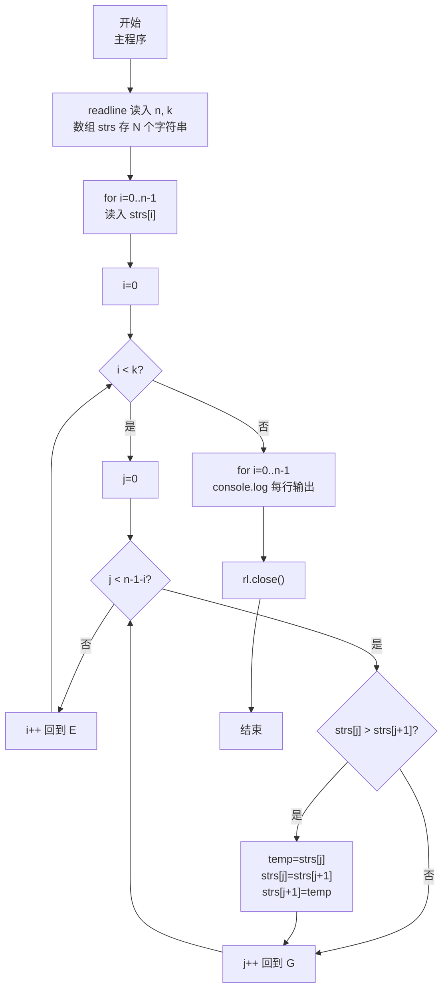
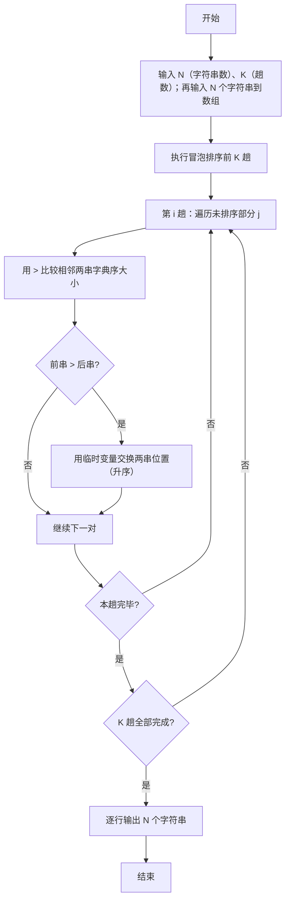

# 7-30 字符串的冒泡排序（JavaScript实现）

## 前言

本文是 PTA 编程题"7-30 字符串的冒泡排序"的题解，涵盖题目描述、输入输出格式及 JavaScript 实现，展示将冒泡排序从整数扩展到字符串：使用数组存储 N 个字符串，用关系运算符 `>` 比较相邻字符串大小（字符串比较运算符按字典序比较）、用直接赋值完成字符串交换，并在执行 K 趟扫描后按行输出中间排序结果。

本题（7-30 字符串的冒泡排序）的主要考点是：准确理解题意、规范处理输入输出格式，并正确处理边界与精度。下面先给出题目描述与格式要求，再通过清晰的思路与可直接运行的javascript实现代码进行讲解。

## 题目描述

我们已经知道了将N个整数按从小到大排序的冒泡排序法。本题要求将此方法用于字符串序列，并对任意给定的K（<N），输出扫描完第K遍后的中间结果序列。

## 输入格式

输入在第1行中给出N和K（1≤K<N≤100），此后N行，每行包含一个长度不超过10的、仅由小写英文字母组成的非空字符串。

## 输出格式

输出冒泡排序法扫描完第K遍后的中间结果序列，每行包含一个字符串。

## 输入样例

```in
6 2
best
cat
east
a
free
day
```

## 输出样例

```out
best
a
cat
day
east
free
```

## 解题思路

这道题的核心是**冒泡排序算法从整数推广到字符串 + 只做前 K 趟输出中间结果**：N 个字符串用 JS 数组 `strs` 存储（最多 100 个字符串，每个长度不超过 10）；比较大小直接使用关系运算符 `>`（JS 中字符串比较运算符按字典序比较，前一个更大则为 true，需要交换）；交换两串直接用临时变量 `temp` 完成赋值交换；外层跑 K 趟后逐行 `console.log` 输出。

### 核心问题分析

1. **字符串的存储**：每个字符串长度 ≤10，用 JS 数组 `strs` 存 N 个字符串（`strs[i]` 即第 i 个串）。读取时用 `readline` 逐行读入，每行 `trim()` 后存入数组（由于输入仅含小写字母，无空格，整行读取即可）。
2. **字符串比较**：JS 中可以直接用关系运算符 `>` 比较两个字符串（按字典序比较）：
   - 若 `s1 < s2`：s1 字典序小于 s2
   - 若 `s1 === s2`：两串相等
   - 若 `s1 > s2`：s1 字典序大于 s2（升序情况下就需要交换）
3. **字符串交换**：JS 中字符串是基本类型，可以直接用 `=` 赋值完成交换，交换形式：
   - `temp = a; a = b; b = temp;`
4. **冒泡排序趟数**：外层 `i` 从 0 到 k-1（共 K 趟）；第 i 趟内层 j 从 0 到 `n-2-i`，比较 `strs[j]` 与 `strs[j+1]`，若 `strs[j] > strs[j+1]` 则交换；每趟结束后下标 `n-1-i` 位置就位"当前未排序部分字典序最大"的字符串。
5. **样例推导（6 2）**：
   - 初始顺序：best cat east a free day
   - 第 1 趟后：best cat a east day free（free最大就位）
   - 第 2 趟后：best a cat day east free（east次大就位）
   - 逐行输出即为样例输出 ✓

### 算法原理说明

冒泡排序字符串版：
- 外层 `for (i=0; i<k; i++)` 共 K 趟
  - 内层 `for (j=0; j<n-1-i; j++)` 两两相邻比较
    - `if (strs[j] > strs[j+1])` → 用 temp 直接赋值交换
- 最终 `for (i=0; i<n; i++) console.log(strs[i]);`

### 具体计算步骤

1. 用 readline 读取第 1 行，`parseInt` 解析出 N、K
2. for i=0..N-1 读入 N 个字符串到 strs[i]
3. 外层 i 从 0 到 K-1：
   - 内层 j 从 0 到 (N-2-i)：
     - 若 `strs[j] > strs[j+1]` → 两串交换
4. 逐行打印 strs[0] 到 strs[N-1]，每行一个字符串

## 完整代码

```javascript
// 题目：7-30 字符串的冒泡排序
// 要求：实现「字符串的冒泡排序」（题目 7-30）的输入处理与结果输出。
// 实现原理：
//   1. 字符串的存储：每个字符串长度 ≤10，用 JS 数组 `strs` 存 N 个字符串（`strs[i]` 即第 i 个串）。读取时用 `readline` 逐行读入，每行 `trim()` 后存入数组（由于输入仅含小写字母，无空格，整行读取即可）。
//   2. 字符串比较：JS 中可以直接用关系运算符 `>` 比较两个字符串（按字典序比较）：
//   3. 字符串交换：JS 中字符串是基本类型，可以直接用 `=` 赋值完成交换，交换形式：

const readline = require('readline'); // 引入 readline 模块
const rl = readline.createInterface({ input: process.stdin, output: process.stdout }); // 创建输入输出接口

const lines = []; // 存放输入的所有行
rl.on('line', (line) => {
    lines.push(line.trim()); // 每行去除首尾空白后存入数组
    // 总行数 = 1（n、k 行）+ n（字符串行），收齐后统一处理
    if (lines.length >= 2 && lines.length === 1 + parseInt(lines[0].split(/\s+/)[0], 10)) {
        const first = lines[0].split(/\s+/);   // 第 1 行：n（字符串总数）与 k（趟数）
        const n = parseInt(first[0], 10);
        const k = parseInt(first[1], 10);

        const strs = []; // 数组存储 N 个字符串
        // 接下来 n 行，每行读入一个字符串（仅小写字母，无空格，整行读取即可）
        for (let i = 0; i < n; i++) {
            strs.push(lines[1 + i]);
        }

        // 冒泡排序：仅进行前 k 趟扫描，输出第 k 趟后的中间结果
        for (let i = 0; i < k; i++) {
            // 第 i 趟：把未排序部分字典序最大的字符串冒泡到下标 n-1-i 处
            // j 从 0 到 n-2-i，每次比较 j 与 j+1
            for (let j = 0; j < n - 1 - i; j++) {
                // 字符串比较运算符按字典序比较，strs[j] > strs[j+1] 升序下需交换
                if (strs[j] > strs[j + 1]) {
                    const temp = strs[j];         // 临时变量，作为交换的第三变量
                    strs[j] = strs[j + 1];        // strs[j] = strs[j+1]
                    strs[j + 1] = temp;           // strs[j+1] = temp
                }
            }
        }

        // 逐行输出经过 k 趟排序后的字符串序列
        for (let i = 0; i < n; i++) {
            console.log(strs[i]);
        }
        rl.close(); // 关闭接口
    }
});
```

## 代码流程说明

### 1. 变量与输入
- `n, k`：总数与趟数，用 readline 读取第 1 行后 `parseInt` 解析
- `strs`：JS 数组，每项存一个字符串
- 收齐 `1 + n` 行后，从第 2 行起依次读入 n 个字符串 push 进 `strs`

### 2. 前 K 趟冒泡排序
- 外层 `i ∈ [0, k)`：共 K 趟
  - 内层 `j ∈ [0, n-1-i)`：两两相邻比较
    - `if (strs[j] > strs[j+1])` → 用 temp 赋值交换
  - 每趟结束后位置 `n-1-i` 就位"当前最大字典序"串

### 3. 输出
- `for (i=0; i<n; i++) console.log(strs[i]);` 每行一个字符串

### 4. 结束
- `rl.close()` 关闭输入接口

## 代码流程图



## 解题流程图



## 代码解析

### 变量与输入

```javascript
const readline = require('readline'); // 引入 readline 模块
const rl = readline.createInterface({ input: process.stdin, output: process.stdout }); // 创建输入输出接口
```

变量与输入

### 前 K 趟冒泡排序

```javascript
const lines = []; // 存放输入的所有行
rl.on('line', (line) => {
    lines.push(line.trim()); // 每行去除首尾空白后存入数组
    // 总行数 = 1（n、k 行）+ n（字符串行），收齐后统一处理
    if (lines.length >= 2 && lines.length === 1 + parseInt(lines[0].split(/\s+/)[0], 10)) {
        const first = lines[0].split(/\s+/);   // 第 1 行：n（字符串总数）与 k（趟数）
        const n = parseInt(first[0], 10);
        const k = parseInt(first[1], 10);
```

前 K 趟冒泡排序

### 输出

```javascript
const strs = []; // 数组存储 N 个字符串
        // 接下来 n 行，每行读入一个字符串（仅小写字母，无空格，整行读取即可）
        for (let i = 0; i < n; i++) {
            strs.push(lines[1 + i]);
        }
```

输出

### 结束

```javascript
// 冒泡排序：仅进行前 k 趟扫描，输出第 k 趟后的中间结果
        for (let i = 0; i < k; i++) {
            // 第 i 趟：把未排序部分字典序最大的字符串冒泡到下标 n-1-i 处
            // j 从 0 到 n-2-i，每次比较 j 与 j+1
            for (let j = 0; j < n - 1 - i; j++) {
                // 字符串比较运算符按字典序比较，strs[j] > strs[j+1] 升序下需交换
                if (strs[j] > strs[j + 1]) {
                    const temp = strs[j];         // 临时变量，作为交换的第三变量
                    strs[j] = strs[j + 1];        // strs[j] = strs[j+1]
                    strs[j + 1] = temp;           // strs[j+1] = temp
                }
            }
        }
```

结束


## 复杂度分析

设输入规模为 $n$（对数值类题目为参与运算的数据量，对字符串/序列类题目为长度）。

- **时间复杂度**：$O(n)$ 或 $O(n \log n)$，主要来自一次线性遍历与常数次数学运算，无嵌套高复杂度循环。
- **空间复杂度**：$O(n)$，用于存储输入、中间结果与输出字符串；若仅使用若干标量变量则为 $O(1)$。

## 常见易错点

### 1. 输入/输出格式不符
错误：多余空格、遗漏换行、大小写或精度不符。后果：判题系统判为格式错误。正确：严格按题目要求的格式输出，数值用合适精度。

### 2. 边界条件遗漏
错误：未处理 0、最小值、单字符或空输入等边界。后果：特例 WA。正确：先列出所有边界样例，在编码前单独分支处理。

### 3. 整数溢出与类型
错误：使用过小的整数类型或忽略负号。后果：大数计算溢出。正确：按数据范围选择合适类型，必要时用更大整数类型或字符串处理。

## 更多测试

### 测试一：常规边界

**输入：**

```text
3 1
c
b
a
```

**输出：**

```text
b
a
c
```

### 测试二：特殊用例

**输入：**

```text
3 2
c
b
a
```

**输出：**

```text
a
b
c
```

## 总结

本文是 PTA 编程题"7-30 字符串的冒泡排序"的题解，涵盖题目描述、输入输出格式及 JavaScript 实现，展示将冒泡排序从整数扩展到字符串：使用数组存储 N 个字符串，用关系运算符 `>` 比较相邻字符串大小（字符串比较运算符按字典序比较）、用直接赋值完成字符串交换，并在执行 K 趟扫描后按行输出中间排序结果。

本题的核心在于理清「字符串的冒泡排序」的输入输出关系与边界处理：先按格式读取输入，再依据规则逐步计算或遍历，最后按规范输出。该思路可迁移到同类格式化输入输出与模拟计算的题目。
