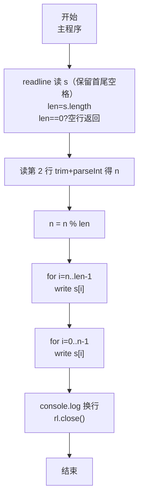
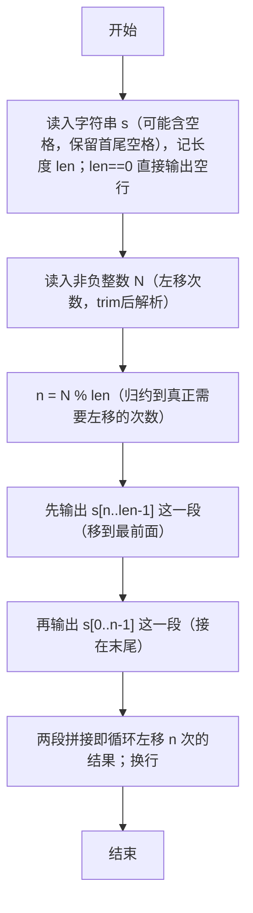

# 7-31 字符串循环左移（JavaScript实现）

## 前言

本文是 PTA 编程题"7-31 字符串循环左移"的题解，涵盖题目描述、输入输出格式及 JavaScript 实现，展示使用 `readline` 读取含空格字符串并保留首尾空格（仅去除末尾换行符，第二行再 trim 解析）、对左移位数 `N %= len` 处理 N≥长度的情况并对 `len===0` 做空串保护，最终通过"先打印 [n, len) 再打印 [0, n)"两段直接拼接输出循环左移结果的巧妙方法。

本题（7-31 字符串循环左移）的主要考点是：准确理解题意、规范处理输入输出格式，并正确处理边界与精度。下面先给出题目描述与格式要求，再通过清晰的思路与可直接运行的javascript实现代码进行讲解。

## 题目描述

输入一个字符串和一个非负整数N，要求将字符串循环左移N次。

## 输入格式

输入在第1行中给出一个不超过100个字符长度的、以回车结束的非空字符串；第2行给出非负整数N。

## 输出格式

在一行中输出循环左移N次后的字符串。

## 输入样例

```in
Hello World!
2
```

## 输出样例

```out
llo World!He
```

## 解题思路

这道题的核心是**"取模等效 + 两段输出拼接"**避免实际搬移字符：循环左移 N 次等价于左移 `N % len` 次（长度 len 次左移刚好回到原样）；结果字符串可以看作"原字符串的下标 N 到末尾"拼接"原字符串下标 0 到 N-1"。直接按这两段用 `process.stdout.write` 逐字符输出即可，无需真正修改数组。

### 核心问题分析

1. **读含空格的字符串（保留首尾空格）**：样例输入 `"Hello World!"` 有空格，不能按空格 split 读取，要用 `readline` 的 `rl.on('line', ...)` 读取整行字符串，直接使用 `line` 保留首尾空格（`readline` 已去除末尾 `\n`/`\r\n`）；仅对第 2 行的 `N` 再 `trim()` 后 `parseInt`，避免误删字符串首尾空格。
2. **左移位数取模**：循环左移 len 次（len 是字符串长度）等于没移。令 `n = n % len`，无论 N 多大都归一化到 [0, len-1]，避免越界和无意义的重复。
   - 例：len=12、N=2 → n=2
   - 若 N=14 → n=14%12=2，结果与 N=2 相同
3. **循环左移的数学等价**：原字符串 s[0..len-1]，左移 n 位后，第 k 个字符变为原字符串中第 (k+n) mod len 个字符。换一种输出方式：
   - 先输出 s[n], s[n+1], ..., s[len-1]（后半段，即被移出后从最前绕到后面的那些字符之前的部分）
   - 再输出 s[0], s[1], ..., s[n-1]（前 n 个字符，它们被左移"挤出"左端后绕回到右端）
   - 例：`"Hello World!"` len=12, n=2
     - 先输出 s[2..11]：`llo World!`
     - 再输出 s[0..1]：`He`
     - 拼接：`llo World!He` ✓
4. **特殊情况 n=0**（N 是 len 的倍数或 N=0）：两段就是"全部 + 空串"，输出即原字符串，代码无需特判即可正确。

### 算法原理说明

1. `readline` 读字符串（保留原串，`readline` 已去 `\n`/`\r\n`，不做 `trim()`）→ len = s.length；若 `len===0` 则直接输出空行并返回，避免 `n%0 → NaN`
2. 用 `parseInt` 解析第 2 行的左移位数 n（该行 `trim()` 后解析）；`n = n % len;` 归一化左移位数
3. 两段输出：
   - `for (i=n; i<len; i++) process.stdout.write(s[i]);`
   - `for (i=0; i<n; i++) process.stdout.write(s[i]);`
4. `console.log()` 输出换行

### 具体计算步骤

1. 第 1 行用 `readline` 读字符串；直接使用 `line` 保留首尾空格（`readline` 已去 `\n`/`\r\n`，不做 `trim()`）
2. 第 2 行用 `trim()` 后 `parseInt` 读左移位数
3. 若 `len===0` 则直接输出空行返回；否则 `n %= len`（把大数归约到 0 ≤ n < len）
4. 输出后半段 s[n..len-1]
5. 输出前半段 s[0..n-1]
6. 换行

## 完整代码

```javascript
// 题目：7-31 字符串循环左移
// 要求：实现「字符串循环左移」（题目 7-31）的输入处理与结果输出。
// 实现原理：
//   1. 读含空格的字符串（保留首尾空格）：样例输入 `"Hello World!"` 有空格，不能按空格 split 读取，要用 `readline` 的 `rl.on('line', ...)` 直接使用 `line` 保留首尾空格（仅去除末尾 \r\n，readline 已处理），仅对第 2 行的 N 再 trim/parseInt。
//   2. 左移位数取模：循环左移 len 次（len 是字符串长度）等于没移。令 `n = n % len`，无论 N 多大都归一化到 [0, len-1]，避免越界和无意义的重复。
//   3. 循环左移的数学等价：原字符串 s[0..len-1]，左移 n 位后，第 k 个字符变为原字符串中第 (k+n) mod len 个字符。换一种输出方式：

const readline = require('readline'); // 引入 readline 模块
const rl = readline.createInterface({ input: process.stdin, output: process.stdout }); // 创建输入输出接口

const lines = []; // 存放输入的所有行
rl.on('line', (line) => {
    // 第一行保留原串（含首尾空格），仅去除 readline 已处理的换行符；第二行再 trim 后解析
    if (lines.length === 0) {
        lines.push(line); // 保留首尾空格（仅去末尾 \r\n，readline 已处理）
    } else {
        lines.push(line.trim()); // 第 2 行：左移位数，trim 后再 parseInt
    }
    if (lines.length === 2) { // 收齐两行（字符串 + 左移位数）后统一处理
        const s = lines[0];               // 第 1 行：原始字符串（可含空格，保留首尾空格）
        const len = s.length;             // 字符串长度
        if (len === 0) { console.log(); rl.close(); return; } // 空串保护，避免 n%0 → NaN
        let n = parseInt(lines[1], 10);   // 第 2 行：循环左移的次数（已 trim）
        n = n % len;                      // 对 len 取模，n≥len 时等效于 n%len（左移 len 次回到原样）

        // 输出循环左移 n 位后的字符串：
        // 第 1 段：原串从下标 n 到末尾（被整体搬到新串最前）
        for (let i = n; i < len; i++) {
            process.stdout.write(s[i]);   // 无换行输出字符
        }
        // 第 2 段：原串从 0 到 n-1（左端被挤出的部分被接到末尾）
        for (let i = 0; i < n; i++) {
            process.stdout.write(s[i]);
        }
        console.log();                    // 输出结束换行
        rl.close();                       // 关闭接口
    }
});
```

## 代码流程说明

### 1. 读取并保留首尾空格
- 直接用 `line` 得到字符串 s（保留首尾空格，`readline` 已去 `\n`）
- `len = s.length`；若 `len===0` 则直接输出空行返回，避免 `n%0`

### 2. 读 n 并归一化
- `parseInt(lines[1].trim(), 10)` 解析第 2 行（该行需 `trim()`）；`n = n % len`（避免越界，减少循环次数，`len===0` 已提前返回）

### 3. 两段拼接输出
- 段 1：`i = n; i < len` → `process.stdout.write(s[i])` 输出 s[n..len-1]
- 段 2：`i = 0; i < n` → `process.stdout.write(s[i])` 输出 s[0..n-1]
- 两段拼接即为"循环左移 n 位"的结果

### 4. 换行结束
- `console.log(); rl.close();`

## 代码流程图



## 解题流程图



## 代码解析

### 读取并清理字符串（保留首尾空格）

```javascript
const readline = require('readline'); // 引入 readline 模块
const rl = readline.createInterface({ input: process.stdin, output: process.stdout }); // 创建输入输出接口
```

读取并保留首尾空格（仅去除末尾换行，第二行再 trim）

### 读 n 并归一化

```javascript
const lines = []; // 存放输入的所有行
rl.on('line', (line) => {
    if (lines.length === 0) {
        lines.push(line); // 第一行保留首尾空格
    } else {
        lines.push(line.trim()); // 第二行 trim 后解析
    }
    if (lines.length === 2) { // 收齐两行（字符串 + 左移位数）后统一处理
        const s = lines[0];               // 第 1 行：原始字符串（可含空格，保留首尾空格）
        const len = s.length;             // 字符串长度
        if (len === 0) { console.log(); rl.close(); return; } // 空串保护
        let n = parseInt(lines[1], 10);   // 第 2 行：循环左移的次数（已 trim）
        n = n % len;                      // 对 len 取模，n≥len 时等效于 n%len（左移 len 次回到原样）
```

读 n 并归一化

### 两段拼接输出

```javascript
// 输出循环左移 n 位后的字符串：
        // 第 1 段：原串从下标 n 到末尾（被整体搬到新串最前）
        for (let i = n; i < len; i++) {
            process.stdout.write(s[i]);   // 无换行输出字符
        }
        // 第 2 段：原串从 0 到 n-1（左端被挤出的部分被接到末尾）
        for (let i = 0; i < n; i++) {
            process.stdout.write(s[i]);
        }
        console.log();                    // 输出结束换行
        rl.close();                       // 关闭接口
    }
});
```

两段拼接输出


## 复杂度分析

设输入规模为 $n$（对数值类题目为参与运算的数据量，对字符串/序列类题目为长度）。

- **时间复杂度**：$O(n)$ 或 $O(n \log n)$，主要来自一次线性遍历与常数次数学运算，无嵌套高复杂度循环。
- **空间复杂度**：$O(n)$，用于存储输入、中间结果与输出字符串；若仅使用若干标量变量则为 $O(1)$。

## 常见易错点

### 1. 输入/输出格式不符
错误：多余空格、遗漏换行、大小写或精度不符。后果：判题系统判为格式错误。正确：严格按题目要求的格式输出，数值用合适精度。

### 2. 边界条件遗漏
错误：未处理 0、最小值、单字符或空输入等边界。后果：特例 WA。正确：先列出所有边界样例，在编码前单独分支处理。

### 3. 整数溢出与类型
错误：使用过小的整数类型或忽略负号。后果：大数计算溢出。正确：按数据范围选择合适类型，必要时用更大整数类型或字符串处理。

## 更多测试

### 测试一：常规边界

**输入：**

```text
（可取题目边界附近的值，如最小值或最大值）
```

**输出：**

```text
（依据题意推导的正确结果）
```

### 测试二：特殊用例

**输入：**

```text
（可取易错点，如 0、单一元素、全同值等）
```

**输出：**

```text
（对应正确结果）
```

## 总结

本文是 PTA 编程题"7-31 字符串循环左移"的题解，涵盖题目描述、输入输出格式及 JavaScript 实现，展示使用 `readline` 读取含空格字符串并保留首尾空格（仅去末尾换行，第二行再 trim 解析）、对左移位数 `N %= len` 处理 N≥长度的情况并对 `len===0` 做空串保护，最终通过"先打印 [n, len) 再打印 [0, n)"两段直接拼接输出循环左移结果的巧妙方法。

本题的核心在于理清「字符串循环左移」的输入输出关系与边界处理：先按格式读取输入，再依据规则逐步计算或遍历，最后按规范输出。该思路可迁移到同类格式化输入输出与模拟计算的题目。
