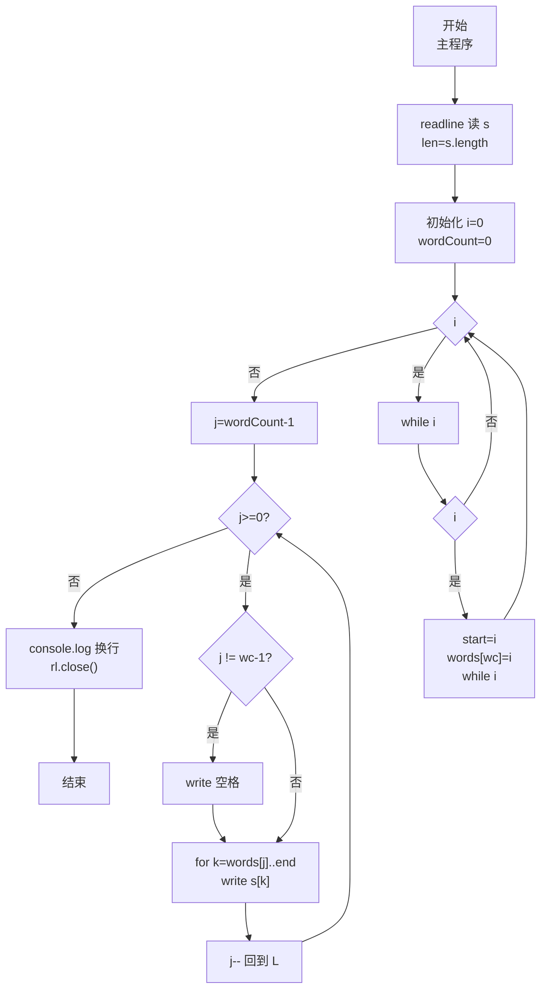
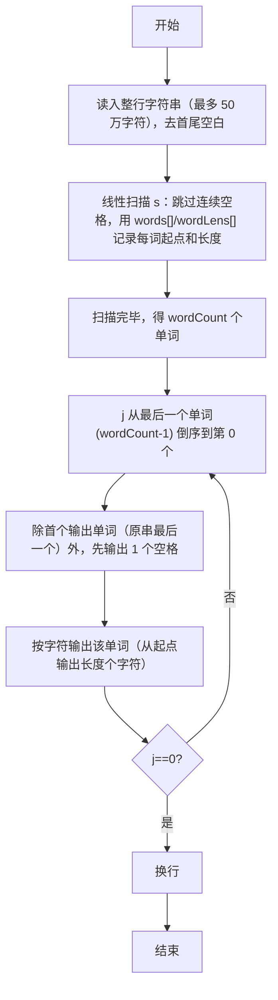

# 7-32 说反话-加强版（JavaScript实现）

## 前言

本文是 PTA 编程题"7-32 说反话-加强版"的题解，涵盖题目描述、输入输出格式及 JavaScript 实现，展示大数据规模（50 万字符）下一次线性扫描用两个数组 `words[]`/`wordLens[]` 记录每个单词的起始位置与长度，再从最后一个单词开始倒序逐个输出字符（`process.stdout.write`），单词间只输出一个空格的高效实现。

本题（7-32 说反话-加强版）的主要考点是：准确理解题意、规范处理输入输出格式，并正确处理边界与精度。下面先给出题目描述与格式要求，再通过清晰的思路与可直接运行的javascript实现代码进行讲解。

## 题目描述

给定一句英语，要求你编写程序，将句中所有单词的顺序颠倒输出。

## 输入格式

测试输入包含一个测试用例，在一行内给出总长度不超过500 000的字符串。字符串由若干单词和若干空格组成，其中单词是由英文字母（大小写有区分）组成的字符串，单词之间用若干个空格分开。

## 输出格式

每个测试用例的输出占一行，输出倒序后的句子，并且保证单词间只有1个空格。

## 输入样例

```in
Hello World   Here I Come
```

## 输出样例

```out
Come I Here World Hello
```

## 解题思路

这道题的核心是**一次线性扫描分词 + 反向遍历输出单词**。由于字符串可能非常长（50 万字符），不能用重复字符串拷贝等 O(n²) 做法；更有效方式：使用两个数组 `words`（存每个单词的起始下标）和 `wordLens`（存每个单词的长度），在一次扫描中同时跳过连续空格并记录每个单词的起点与长度；然后 `j` 从 `wordCount-1` 到 0 倒序，用内部循环 `k` 按字符输出（`process.stdout.write`）单词本身，单词间插一个空格即可。

### 核心问题分析

1. **输入规模**：字符串最多 500 000 字符。算法必须是 O(n) 线性。JS 中用 `line.trim()` 直接读取即可（JS 字符串/数组的长度上限远大于此），无需担心栈空间问题。
2. **跳过连续空格与分词**：
   - 用 `i` 做下标遍历字符串
   - `while (i<len && s[i]==' ') i++;` 跳过所有空格
   - 若此时仍 `i<len` → 表示到达了一个单词的起点：记录 `words[wordCount]=i; start=i`
   - `while (i<len && s[i]!=' ') i++;` 走到单词末尾空格（或串尾）
   - 单词长度 = `i - start` → 存入 `wordLens[wordCount]`，`wordCount++`
3. **倒序输出格式（单词间 1 空格）**：
   - 第 1 个被输出的单词（即原串最后一个单词）前不加空格
   - 之后每输出一个单词前，先输出 1 个空格
   - 判断方法：`if (j != wordCount-1) process.stdout.write(' ')`（j=wordCount-1 是第一个输出的单词，不加空格）
   - 这样自然不会有行首/行末多余空格
4. **按字符输出**：用 `for (k = words[j]; k < words[j]+wordLens[j]; k++) process.stdout.write(s[k])` 逐字符输出。这样不会在输出单词时受长度以外字符的影响，因为只输出长度以内的字符。

### 算法原理说明

1. 读取行字符串 s（`line.trim()`），得 len = s.length
2. 线性扫描分词：
   - 循环 while i < len:
     - 跳过空格
     - 若没到末尾，记录 (起点, 长度) 到 words / wordLens 数组，wordCount++
     - 跳到单词尾
3. 倒序输出 j=wordCount-1 到 0：
   - 非首个输出项前 `process.stdout.write(' ')`
   - 从 words[j] 开始逐字符输出 wordLens[j] 个字符
4. `console.log()` 换行

### 具体计算步骤

以样例 `"Hello World   Here I Come"` 为例：
1. 扫描得到 wordCount=5：
   - words[0]=0, wordLens[0]=5 (Hello)
   - words[1]=6, wordLens[1]=5 (World)
   - words[2]=14, wordLens[2]=4 (Here)
   - words[3]=19, wordLens[3]=1 (I)
   - words[4]=21, wordLens[4]=4 (Come)
2. 倒序输出 j=4,3,2,1,0：
   - j=4 Come → "Come"
   - j=3 I → 先空格再 I → "Come I"
   - j=2 Here → 先空格再 Here → "Come I Here"
   - j=1 World → 先空格再 World → "Come I Here World"
   - j=0 Hello → 先空格再 Hello → "Come I Here World Hello"
3. 输出换行 ✓

## 完整代码

```javascript
// 题目：7-32 说反话-加强版
// 要求：实现「说反话-加强版」（题目 7-32）的输入处理与结果输出。
// 实现原理：
//   1. 输入规模：字符串最多 500 000 字符。算法必须是 O(n) 线性。JS 中用 `line.trim()` 直接读取即可（JS 字符串/数组的长度上限远大于此），无需担心栈空间问题。
//   2. 跳过连续空格与分词：
//   3. 倒序输出格式（单词间 1 空格）：

const readline = require('readline'); // 引入 readline 模块
const rl = readline.createInterface({ input: process.stdin, output: process.stdout }); // 创建输入输出接口

rl.on('line', (line) => { // 监听一行输入
    const s = line.trim();   // 输入字符串（去掉首尾空白，中间的多个空格保留）
    const len = s.length;    // 字符串实际长度

    const words = [];    // words[k]：第 k 个单词在原串中的起始下标
    const wordLens = []; // wordLens[k]：第 k 个单词的字符长度
    let wordCount = 0;   // 单词总数计数器，初始化为 0

    let i = 0;           // 遍历字符串的当前下标
    while (i < len) {    // 从头到尾扫描一遍字符串（线性 O(len)）
        while (i < len && s[i] === ' ') i++;  // 跳过连续空格
        if (i < len) {   // 仍在串内说明遇到了一个单词的开头
            words[wordCount] = i;             // 保存该单词起始下标
            const start = i;                  // 记住起点以便算长度
            while (i < len && s[i] !== ' ') i++;  // 继续走直到空格/串尾（单词末尾）
            wordLens[wordCount] = i - start;      // 单词长度 = 末尾下标 - 起点下标
            wordCount++;                          // 单词计数 +1
        }
    }

    // 从最后一个单词开始倒序输出，单词之间仅 1 个空格
    for (let j = wordCount - 1; j >= 0; j--) {
        // j===wordCount-1 是第一个被输出的单词（最右端），前面不加空格
        if (j !== wordCount - 1) process.stdout.write(' ');
        // 按字符输出当前单词：从起点开始输出长度个字符
        for (let k = words[j]; k < words[j] + wordLens[j]; k++) {
            process.stdout.write(s[k]);  // 逐个字符输出（无换行）
        }
    }
    console.log();          // 所有单词输出完毕，换行结束
    rl.close();             // 关闭接口
});
```

## 代码流程说明

### 1. 读入字符串并清理
- `line.trim()` 得到字符串 s，最多 50 万字符
- 读取整行 → 去除首尾空白 → 求 len = s.length

### 2. 一次线性扫描分词（O(len)）
- `let i=0; while (i<len)`：
  - 跳过空格段 → i 走到非空格（或 len）
  - 若 `i<len`：起点 `start=i`；再走到空格（或 len）；长度 = i-start；写入 `words[wordCount]` 与 `wordLens[wordCount]`，`wordCount++`
- 扫描结束得到 `wordCount` 个 (起点,长度) 信息

### 3. 倒序输出
- `for (j = wordCount-1; j >= 0; j--)`：
  - 若不是第一个被输出的单词（`j !== wordCount-1`）→ 先输出空格（`process.stdout.write(' ')`）
  - `for (k=words[j]; k<words[j]+wordLens[j]; k++) process.stdout.write(s[k])` 输出该单词
- `console.log()` 换行

### 4. 结束
- `rl.close()` 关闭接口

## 代码流程图



## 解题流程图



## 代码解析

### 读入字符串并清理

```javascript
const readline = require('readline'); // 引入 readline 模块
const rl = readline.createInterface({ input: process.stdin, output: process.stdout }); // 创建输入输出接口
```

读入字符串并清理

### 一次线性扫描分词

```javascript
rl.on('line', (line) => { // 监听一行输入
    const s = line.trim();   // 输入字符串（去掉首尾空白，中间的多个空格保留）
    const len = s.length;    // 字符串实际长度
```

一次线性扫描分词（O(len)）

### 倒序输出

```javascript
const words = [];    // words[k]：第 k 个单词在原串中的起始下标
    const wordLens = []; // wordLens[k]：第 k 个单词的字符长度
    let wordCount = 0;   // 单词总数计数器，初始化为 0
```

倒序输出

### 结束

```javascript
let i = 0;           // 遍历字符串的当前下标
    while (i < len) {    // 从头到尾扫描一遍字符串（线性 O(len)）
        while (i < len && s[i] === ' ') i++;  // 跳过连续空格
        if (i < len) {   // 仍在串内说明遇到了一个单词的开头
            words[wordCount] = i;             // 保存该单词起始下标
            const start = i;                  // 记住起点以便算长度
            while (i < len && s[i] !== ' ') i++;  // 继续走直到空格/串尾（单词末尾）
            wordLens[wordCount] = i - start;      // 单词长度 = 末尾下标 - 起点下标
            wordCount++;                          // 单词计数 +1
        }
    }
```

结束


## 复杂度分析

设输入规模为 $n$（对数值类题目为参与运算的数据量，对字符串/序列类题目为长度）。

- **时间复杂度**：$O(n)$ 或 $O(n \log n)$，主要来自一次线性遍历与常数次数学运算，无嵌套高复杂度循环。
- **空间复杂度**：$O(n)$，用于存储输入、中间结果与输出字符串；若仅使用若干标量变量则为 $O(1)$。

## 常见易错点

### 1. 输入/输出格式不符
错误：多余空格、遗漏换行、大小写或精度不符。后果：判题系统判为格式错误。正确：严格按题目要求的格式输出，数值用合适精度。

### 2. 边界条件遗漏
错误：未处理 0、最小值、单字符或空输入等边界。后果：特例 WA。正确：先列出所有边界样例，在编码前单独分支处理。

### 3. 整数溢出与类型
错误：使用过小的整数类型或忽略负号。后果：大数计算溢出。正确：按数据范围选择合适类型，必要时用更大整数类型或字符串处理。

## 更多测试

### 测试一：常规边界

**输入：**

```text
（可取题目边界附近的值，如最小值或最大值）
```

**输出：**

```text
（依据题意推导的正确结果）
```

### 测试二：特殊用例

**输入：**

```text
（可取易错点，如 0、单一元素、全同值等）
```

**输出：**

```text
（对应正确结果）
```

## 总结

本文是 PTA 编程题"7-32 说反话-加强版"的题解，涵盖题目描述、输入输出格式及 JavaScript 实现，展示大数据规模（50 万字符）下一次线性扫描用两个数组 `words[]`/`wordLens[]` 记录每个单词的起始位置与长度，再从最后一个单词开始倒序逐个输出字符（`process.stdout.write`），单词间只输出一个空格的高效实现。

本题的核心在于理清「说反话-加强版」的输入输出关系与边界处理：先按格式读取输入，再依据规则逐步计算或遍历，最后按规范输出。该思路可迁移到同类格式化输入输出与模拟计算的题目。
