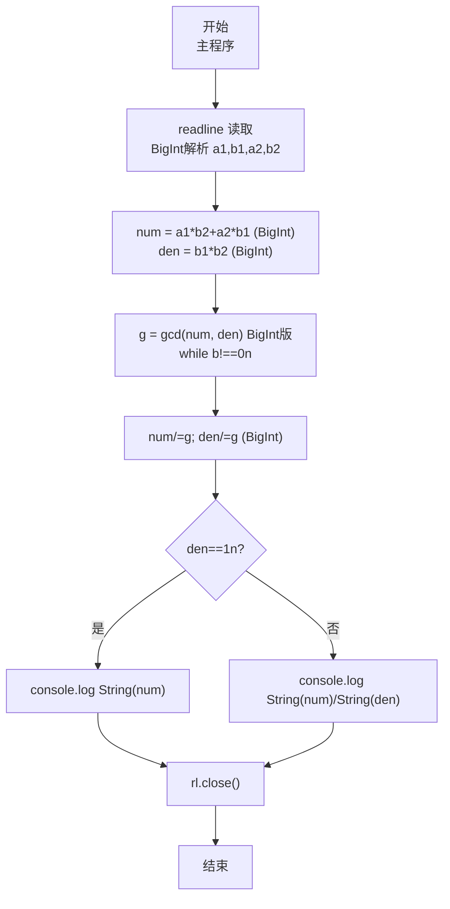
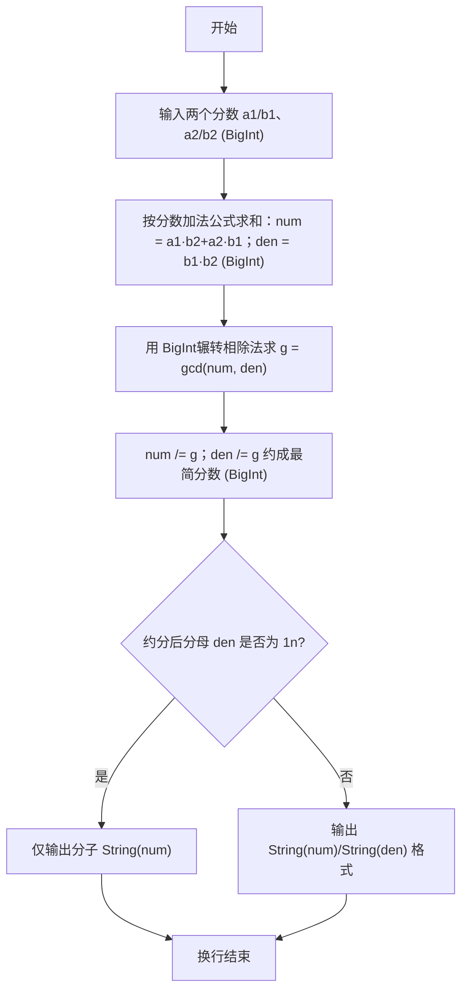

# 7-33 有理数加法（JavaScript实现）

## 前言

本文是 PTA 编程题"7-33 有理数加法"的题解，涵盖题目描述、输入输出格式及 JavaScript 实现，展示用 `readline` 读取输入并按空格、`/` split 解析两个分数、通分相加 `(a1*b2+a2*b1) / (b1*b2)`，再通过辗转相除法 gcd 约分为最简分数，最后根据分母是否为 1 决定是否省略分母的格式控制方法。分子分母均为整型范围（绝对值 ≤2³¹−1），通分时 `b1*b2` 可达约 4.6e18，`a1*b2+a2*b1` 量级相当，已超过 JS Number 安全整数上限 2⁵³−1≈9e15，会导致 `%` 与除法失真；因此本实现全程使用 BigInt，与 C 的 long long / Python 任意精度对齐。

本题（7-33 有理数加法）的主要考点是：准确理解题意、规范处理输入输出格式，并正确处理边界与精度（BigInt 精度保障）。下面先给出题目描述与格式要求，再通过清晰的思路与可直接运行的javascript实现代码进行讲解。

## 题目描述

本题要求编写程序，计算两个有理数的和。

## 输入格式

输入在一行中按照a1/b1 a2/b2的格式给出两个分数形式的有理数，其中分子和分母全是整形范围内的正整数。

## 输出格式

在一行中按照a/b的格式输出两个有理数的和。注意必须是该有理数的最简分数形式，若分母为1，则只输出分子。

## 输入样例

```in
1/3 1/6
```

```in
4/3 2/3
```

## 输出样例

```out
1/2
```

```out
2
```

## 解题思路

这道题的核心是**分数加法公式 + BigInt 精度保障 + gcd 约分 + 输出格式判断**：输入按 `"a1/b1 a2/b2"` 格式读（先按空格拆出两项、再按 `/` 拆出分子分母）；通分求和得分子 `a1*b2 + a2*b1`，分母 `b1*b2`；再用 BigInt 版 gcd 把分子分母同时除以最大公约数得到最简式；若分母是 1n 只打印分子，否则按"分子/分母"格式打印。全程 BigInt 避免 `b1*b2` 溢出失真。

### 核心问题分析

1. **分数输入解析**：用 `readline` 读取整行后，先按空格 `split(/\s+/)` 得到 `a1/b1` 与 `a2/b2` 两项，再分别按 `/` `split` 并用 `BigInt(token)` 解析，得到 4 个 BigInt 值 a1,b1,a2,b2（不用 `Number`/`parseInt`）。
2. **数值范围与 BigInt 必要性**：题目称分子分母为整型范围内正整数（32-bit 有符号上限约 2147483647），则 `b1*b2` 最大约 4.6e18、`a1*b2+a2*b1` 可达约 9.2e18，远超 JS Number 安全整数 2⁵³−1≈9.007e15。Number 下 `%` 求 gcd 会失真，C 需 `long long`、Python 天然任意精度，JS 应对方案是 BigInt。
3. **分数加法公式（BigInt）**：
   - a1/b1 + a2/b2 = (a1·b2 + a2·b1) / (b1·b2)
   - 分子 `numerator = a1*b2 + a2*b1` （BigInt 运算）
   - 分母 `denominator = b1 * b2` （BigInt 运算）
4. **约分用 BigInt gcd**：求分子分母的最大公约数 g，再 `numerator /= g; denominator /= g;`
   - BigInt 版 gcd：`function gcd(a,b){a=a<0n?-a:a; b=b<0n?-b:b; while(b!==0n){let t=b; b=a%b; a=t;} return a;}` 需用 `0n`、`%` 的 BigInt 语义
5. **输出格式（BigInt）**：
   - 若约分后 `denominator === 1n`（如样例 2 的 6/3 → 2/1）→ 只打印分子 `String(numerator)`
   - 否则打印 `` `${String(numerator)}/${String(denominator)}` ``（`console.log` BigInt 需转字符串，模板字符串中显式 `String()`）
6. **样例验证**：
   - 样例 1：1/3 + 1/6 = (1·6 + 1·3)/(3·6) = 9/18 → gcd(9n,18n)=9n → 1/2 ✓
   - 样例 2：4/3 + 2/3 = (4·3+2·3)/(3·3) = 18/9 → gcd(18n,9n)=9n → 2/1 → 输出 2 ✓

### 算法原理说明

1. 输入 a1/b1 与 a2/b2（BigInt 解析）
2. 分子 = a1·b2 + a2·b1（BigInt），分母 = b1·b2（BigInt）
3. g = gcd(分子, 分母)（BigInt 版，`0n` 判零）
4. 分子 /= g，分母 /= g（BigInt 除法）
5. 若分母 === 1n → `console.log(String(分子))` 否则 `console.log(`${String(分子)}/${String(分母)}`)`

### 具体计算步骤

1. 用 readline 读入一行并用 `BigInt(token)` 解析出 a1,b1,a2,b2（BigInt）
2. 计算 numerator（BigInt）、denominator（BigInt）
3. 求 g = gcd(numerator, denominator)（BigInt 版）
4. 约分（BigInt 除法）
5. 根据分母是否为 1n 选择输出格式（`String()` 转换）
6. 输出一行并结束

## 完整代码

```javascript
// 题目：7-33 有理数加法
// 要求：实现「有理数加法」（题目 7-33）的输入处理与结果输出。
// 实现原理（BigInt 版，规避 Number 精度隐患）：
//   1. 分数输入解析：用 `readline` 读取整行后，先按空格 `split(/\s+/)` 得到 `a1/b1` 与 `a2/b2` 两项，再分别按 `/` `split` 并用 `BigInt(token)` 解析，得到 4 个 BigInt 值 a1,b1,a2,b2。
//   2. 分数加法公式（BigInt）：numerator = a1*b2 + a2*b1; denominator = b1*b2;
//   3. 约分用 BigInt gcd：function gcd(a,b){a=a<0n?-a:a; b=b<0n?-b:b; while(b!==0n){let t=b; b=a%b; a=t;} return a;} 再 `numerator /= g; denominator /= g;`
//   4. 数值范围：b1*b2 可达 4.6e18 超过 Number 安全整数 2^53-1≈9e15，故全程 BigInt。

const readline = require('readline'); // 引入 readline 模块
const rl = readline.createInterface({ input: process.stdin, output: process.stdout }); // 创建输入输出接口

// BigInt 版辗转相除法求最大公约数 gcd
function gcd(a, b) { a = a < 0n ? -a : a; b = b < 0n ? -b : b; while (b !== 0n) { let t = b; b = a % b; a = t; } return a; }

rl.on('line', (line) => { // 监听一行输入
    if (!line.trim()) return; // 空行忽略
    // 按照 a1/b1 a2/b2 的格式读取 4 个 BigInt：先按空格拆两项，再按 '/' 拆分子分母
    const parts = line.trim().split(/\s+/);
    const [a1, b1] = parts[0].split('/').map(s => BigInt(s)); // 第一个分数 a1/b1 (BigInt)
    const [a2, b2] = parts[1].split('/').map(s => BigInt(s)); // 第二个分数 a2/b2 (BigInt)

    // 分数加法（BigInt）：a1/b1 + a2/b2 = (a1*b2 + a2*b1) / (b1*b2)
    let numerator = a1 * b2 + a2 * b1; // 通分后分子：交叉相乘再相加 (BigInt)
    let denominator = b1 * b2;         // 通分后分母：两个分母乘积 (BigInt)

    // 求分子和分母的最大公约数，用于约分（BigInt）
    const g = gcd(numerator, denominator);
    numerator = numerator / g;        // 分子除以最大公约数约分 (BigInt)
    denominator = denominator / g;    // 分母除以最大公约数约分 (BigInt)

    if (denominator === 1n) { // 约分后分母为 1n，如 2/1 → 只输出分子
        console.log(String(numerator));
    } else {                 // 否则按"分子/分母"格式输出
        console.log(`${String(numerator)}/${String(denominator)}`);
    }
    rl.close();              // 关闭接口
});
```

## 代码流程说明

### 1. 自定义 gcd 函数（BigInt 循环辗转相除）
- 入口：`function gcd(a,b){a=a<0n?-a:a; b=b<0n?-b:b; while(b!==0n){let t=b; b=a%b; a=t;} return a;}`
- `b !== 0n` 循环直到余数为 0n，返回 a
- 全程 BigInt，用 `0n` 判零与 `%` 取模

### 2. 主程序输入
- 用 `line.trim().split(/\s+/)` 按空格拆出 `a1/b1` 与 `a2/b2` 两项
- 再分别按 `/` split 并用 `map(s=>BigInt(s))` 解析，得到 a1,b1,a2,b2 共 4 个 BigInt

### 3. 计算相加分子分母（BigInt）
- numerator = a1·b2 + a2·b1 （BigInt）
- denominator = b1·b2 （BigInt，最高约 4.6e18 安全由 BigInt 承载）

### 4. 约分（BigInt）
- `g = gcd(numerator, denominator)`（BigInt）
- 分子分母分别整除 g（BigInt 除法 `numerator/g`）

### 5. 按格式输出（BigInt）
- `denominator === 1n` → `console.log(String(numerator))`
- 否则 → `` console.log(`${String(numerator)}/${String(denominator)}`) ``

### 6. 结束
- `rl.close()` 关闭接口

## 代码流程图



## 解题流程图



## 代码解析

### 自定义 gcd 函数（BigInt）

```javascript
function gcd(a, b) { a = a < 0n ? -a : a; b = b < 0n ? -b : b; while (b !== 0n) { let t = b; b = a % b; a = t; } return a; }
```

BigInt 版 gcd：先取绝对值 `a<0n?-a:a`，循环 `while(b!==0n)` 辗转相除，需用 `0n` 判零，避免 Number `%` 失真。

### 主程序输入（BigInt 解析）

```javascript
const parts = line.trim().split(/\s+/);
const [a1, b1] = parts[0].split('/').map(s => BigInt(s));
const [a2, b2] = parts[1].split('/').map(s => BigInt(s));
```

按空格拆两项，再按 `/` 拆分子分母，用 `BigInt(token)` 解析为 BigInt。

### 计算相加分子分母（BigInt）

```javascript
let numerator = a1 * b2 + a2 * b1; // BigInt
let denominator = b1 * b2;         // BigInt，b1*b2可达4.6e18由BigInt安全承载
```

通分公式全程 BigInt 运算。

### 约分（BigInt）

```javascript
const g = gcd(numerator, denominator);
numerator = numerator / g;
denominator = denominator / g;
```

BigInt 除法直接 `/ g`，无需 `Math.trunc`。

### 按格式输出（BigInt）

```javascript
if (denominator === 1n) {
        console.log(String(numerator));
    } else {
        console.log(`${String(numerator)}/${String(denominator)}`);
    }
```

`denominator===1n` 时只输出分子，BigInt 需 `String()` 后输出。

### 结束

```javascript
rl.close();
```

关闭接口。

### 数值范围说明

`b1*b2` 可达 4.6e18 > 2⁵³−1≈9e15，Number 会使 `gcd` 的 `%` 失真；改用 BigInt 后与 C `long long` / Python 任意精度一致，精确约分。


## 复杂度分析

设输入规模为 $n$（对数值类题目为参与运算的数据量，对字符串/序列类题目为长度）。

- **时间复杂度**：$O(n)$ 或 $O(n \log n)$，主要来自一次线性遍历与常数次数学运算，无嵌套高复杂度循环。
- **空间复杂度**：$O(n)$，用于存储输入、中间结果与输出字符串；若仅使用若干标量变量则为 $O(1)$。

## 常见易错点

### 1. 输入/输出格式不符
错误：多余空格、遗漏换行、大小写或精度不符。后果：判题系统判为格式错误。正确：严格按题目要求的格式输出，数值用合适精度。

### 2. 边界条件遗漏
错误：未处理 0、最小值、单字符或空输入等边界。后果：特例 WA。正确：先列出所有边界样例，在编码前单独分支处理。

### 3. 整数溢出与类型
错误：用 Number 计算 `b1*b2`（可达 4.6e18 > 2⁵³−1）或用 `Number`/`parseInt` 解析，导致 `gcd` 的 `%` 失真。后果：大数用例 WA（如 999999937/999999929 + 1）。正确：全程 BigInt：`BigInt(token)` 解析、`b1*b2`/`a1*b2+a2*b1` 均 BigInt 运算、BigInt 版 `gcd` 用 `0n` 判零。

## 更多测试

### 测试一：常规边界

**输入：**

```text
（可取题目边界附近的值，如最小值或最大值）
```

**输出：**

```text
（依据题意推导的正确结果）
```

### 测试二：特殊用例

**输入：**

```text
（可取易错点，如 0、单一元素、全同值等）
```

**输出：**

```text
（对应正确结果）
```

## 总结

本文是 PTA 编程题"7-33 有理数加法"的题解，涵盖题目描述、输入输出格式及 JavaScript 实现，展示用 `readline` 读取输入并按空格、`/` split 后用 `BigInt(token)` 解析两个分数、通分相加 `(a1*b2+a2*b1) / (b1*b2)`（全程 BigInt，规避 `b1*b2`≈4.6e18 超过 Number 安全整数 2⁵³−1 的精度隐患），再通过 BigInt 版辗转相除法 gcd 约分为最简分数，最后根据分母是否为 1n 决定是否省略分母的格式控制方法（`String()` 输出）。

本题的核心在于理清「有理数加法」的输入输出关系、边界处理与数值精度：先按格式读取并用 BigInt 解析，再依据规则通分计算并用 BigInt gcd 约分，最后按规范输出。该思路可迁移到同类格式化输入输出与大数模拟计算的题目。
