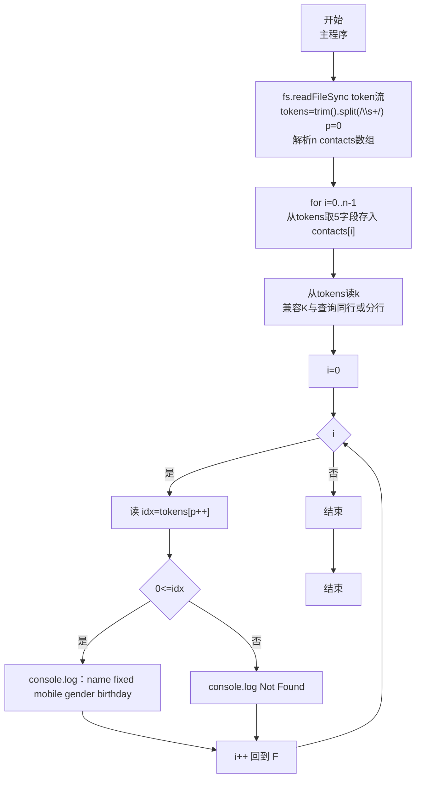
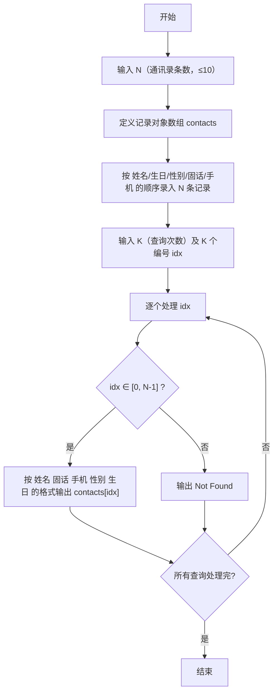

# 7-34 通讯录的录入与显示（JavaScript实现）

## 前言

本文是 PTA 编程题"7-34 通讯录的录入与显示"的题解，涵盖题目描述、输入输出格式及 JavaScript 实现，展示使用 JS 对象（{ name、birthday、gender、fixedPhone、mobilePhone }）数组一次性录入 N 条通讯录记录，再依次处理 K 次查询，对编号 0~N-1 内按"姓名 固话 手机 性别 生日"格式输出，否则输出 `Not Found`。

本题（7-34 通讯录的录入与显示）的主要考点是：准确理解题意、规范处理输入输出格式，并正确处理边界与精度。下面先给出题目描述与格式要求，再通过清晰的思路与可直接运行的javascript实现代码进行讲解。

## 题目描述

通讯录中的一条记录包含下述基本信息：朋友的姓名、出生日期、性别、固定电话号码、移动电话号码。
本题要求编写程序，录入N条记录，并且根据要求显示任意某条记录。

## 输入格式

输入在第一行给出正整数N（≤10）；随后N行，每行按照格式姓名 生日 性别 固话 手机给出一条记录。其中姓名是不超过10个字符、不包含空格的非空字符串；生日按yyyy/mm/dd的格式给出年月日；性别用M表示"男"、F表示"女"；固话和手机均为不超过15位的连续数字，前面有可能出现+。

在通讯录记录输入完成后，最后一行给出正整数K，并且随后给出K个整数，表示要查询的记录编号（从0到N−1顺序编号）。数字间以空格分隔。

## 输出格式

对每一条要查询的记录编号，在一行中按照姓名 固话 手机 性别 生日的格式输出该记录。若要查询的记录不存在，则输出Not Found。

## 输入样例

```in
3
Chris 1984/03/10 F +86181779452 13707010007
LaoLao 1967/11/30 F 057187951100 +8618618623333
QiaoLin 1980/01/01 M 84172333 10086
2 1 7
```

## 输出样例

```out
LaoLao 057187951100 +8618618623333 F 1967/11/30
Not Found
```

## 解题思路

这道题的核心是**使用 JS 对象定义"通讯录记录"数据类型 + 数组存 N 条记录 + 顺序查询编号并判断越界**。每条记录包含 5 个字段（姓名、生日、性别、固话、手机），全部存为字符串；采用 token 流方式（`fs.readFileSync(0,'utf8').trim().split(/\s+/)`）将全部空白切分为 tokens，按指针依次取 5 项存入对象字段，兼容任意换行/多空格；查询阶段从 token 流读 K 个编号 idx，若 idx 在 [0, N-1] 内按"姓名 固话 手机 性别 生日"输出，否则 `Not Found`。

### 核心问题分析

1. **记录对象结构**：
   { name: '姓名', birthday: 'yyyy/mm/dd', gender: 'M/F', fixedPhone: '固话', mobilePhone: '手机' }
2. **录入 N 条记录**：N ≤ 10，`const contacts = [];` 即可。for 循环 N 次，每次从 token 流按指针依次取 5 个字段（姓名 生日 性别 固话 手机）写入对象字段，不依赖行边界。
3. **查询 K 次**：从 token 流先读 K，再 for 循环 K 次读入一个整数 idx（兼容 K 与查询同行或分行、多行空白）：
   - 若 `idx >= 0 && idx < N` → 合法，输出：
     `console.log("姓名 固话 手机 性别 生日")`（用模板字符串拼接）
     注意输出字段顺序和输入顺序不同：**姓名 固话 手机 性别 生日**
   - 否则 → `console.log("Not Found")`
4. **样例对照**：
   - N=3，三条：
     - 0: Chris…；1: LaoLao…；2: QiaoLin…
   - K=2 个查询：1 和 7
     - idx=1 → 合法，输出 LaoLao 固话 手机 性别 生日 ✓（样例第一行输出）
     - idx=7 → 超出 [0,2] → Not Found ✓

### 算法原理说明

1. 用 `fs.readFileSync(0,'utf8').trim().split(/\s+/)` 将全部输入按空白（空格/换行/制表符）切分为 token 流，完全不依赖行结构，兼容 K 与查询同行或分行、多行空白（C 的 `scanf` 与 Python 的 `read().split()` 同理均为 token 流）
2. 指针 `p` 顺序解析：`tokens[0]` 为 N；随后 `N*5` 个 token 依次为 N 条记录的 5 元组（姓名 生日 性别 固话 手机）→ 存入 contacts[i]
3. 再下一 token 为 K，随后 K 个 token 为查询编号：
   - for i=0..K-1：
     - 读 idx（`parseInt(tokens[p++],10)`）
     - 若 0 ≤ idx < N → 按顺序打印 5 字段（注意输出顺序不同于输入）
     - 否则 → Not Found
4. 遍历结束即输出完成，无需等待特定行数（不再假设总行数固定为 2+N）

### 具体计算步骤

1. 将输入按 `\s+` 切分为 tokens，示例同行输入 `3 ... 2 1 7` 与分行输入 `3 ... 2\n1 7` 均得到相同 token 序列
2. 解析 N=3，指针后移
3. 录入 3 条记录到 contacts[0..2]（共消耗 15 个 token）
4. 读 K=2，再读 2 个编号 1、7
   - idx=1 ∈ [0,3)：输出 contacts[1] 的"姓名 固话 手机 性别 生日"
   - idx=7 ∉ [0,3)：输出 Not Found
5. 结束

## 完整代码

```javascript
// 题目：7-34 通讯录的录入与显示
// 要求：实现「通讯录的录入与显示」（题目 7-34）的输入处理与结果输出。
// 实现原理（token 流，鲁棒）：
//   1. 用 fs.readFileSync(0,'utf8').trim().split(/\s+/) 将所有空白切分为 token 流，兼容 K 与查询同行或分行、多行空白
//   2. 指针 p 解析：tokens[0]=N，随后 N*5 个为记录（姓名 生日 性别 固话 手机），再下一个为 K，后面 K 个为查询索引
//   3. 查询 K 次：对每个 idx 判断 0<=idx<N 输出 `${name} ${phone} ${mobile} ${sex} ${birthday}` 否则 Not Found

const fs = require('fs');
const data = fs.readFileSync(0, 'utf8').trim();
if (!data) process.exit(0);
const tokens = data.split(/\s+/);
let p = 0;
const n = parseInt(tokens[p++], 10); // 通讯录记录总数（≤10）

const contacts = []; // 对象数组：最多 10 条通讯录记录
// 按 token 流录入 n 条记录，每条 5 个字段：姓名 生日 性别 固话 手机
for (let i = 0; i < n; i++) {
    const name = tokens[p++];
    const birthday = tokens[p++];
    const gender = tokens[p++];
    const fixedPhone = tokens[p++];
    const mobilePhone = tokens[p++];
    contacts.push({ name, birthday, gender, fixedPhone, mobilePhone });
}

const k = parseInt(tokens[p++], 10); // 查询次数
// 依次处理 k 个查询编号，兼容 K 与查询同行或分行
for (let i = 0; i < k; i++) {
    const idx = parseInt(tokens[p++], 10); // 要查询的记录编号（0 ~ n-1）
    if (idx >= 0 && idx < n) { // 编号在合法范围内
        // 按"姓名 固话 手机 性别 生日"的输出顺序格式化打印（与输入顺序不同）
        console.log(`${contacts[idx].name} ${contacts[idx].fixedPhone} ${contacts[idx].mobilePhone} ${contacts[idx].gender} ${contacts[idx].birthday}`);
    } else { // 编号越界或负，记录不存在
        console.log("Not Found");
    }
}
```

## 代码流程说明

### 1. 记录对象定义
- 5 个字段：name、birthday、gender、fixedPhone、mobilePhone（均为字符串）

### 2. Token 流解析与输入 N 条记录
- `const tokens = fs.readFileSync(0,'utf8').trim().split(/\s+/)` 按所有空白切分，不依赖行；`let p=0` 为指针
- `parseInt(tokens[p++],10)` 得到 n
- `const contacts = [];`
- for i=0..n-1：
  - 从 token 流依次取 5 个字段（姓名 生日 性别 固话 手机）→ 存入对象，指针 p 后移 5

### 3. 查询处理 K 次
- `parseInt(tokens[p++],10)` 得到 k（无论 K 与查询同行或分行、中间多空白均能正确取得）
- for i=0..k-1：
  - `parseInt(tokens[p++],10)` 读 idx
  - 合法 → 输出顺序：`姓名 固话 手机 性别 生日`（与输入顺序不同）
  - 不合法 → `Not Found`

### 4. 结束
- 遍历完 K 个查询后自然结束，无需 `rl.close()` 或判断固定行数

## 代码流程图



## 解题流程图



## 代码解析

### 记录对象定义

```javascript
const fs = require('fs');
const data = fs.readFileSync(0, 'utf8').trim();
if (!data) process.exit(0);
const tokens = data.split(/\s+/); // token 流：按所有空白切分，兼容多行/多空格
let p = 0;
const n = parseInt(tokens[p++], 10); // 通讯录记录总数（≤10）
```

token 流读取与 n 解析，摒弃固定行数的假设

### 输入 N 条记录

```javascript
const contacts = []; // 对象数组：最多 10 条通讯录记录
// 按 token 流录入 n 条记录，每条 5 个字段：姓名 生日 性别 固话 手机
for (let i = 0; i < n; i++) {
    const name = tokens[p++];
    const birthday = tokens[p++];
    const gender = tokens[p++];
    const fixedPhone = tokens[p++];
    const mobilePhone = tokens[p++];
    contacts.push({ name, birthday, gender, fixedPhone, mobilePhone });
}
```

从 token 流顺序取 5* N 个字段，不依赖行边界

### 查询处理 K 次

```javascript
const k = parseInt(tokens[p++], 10); // 查询次数（token 流下一项，兼容 K 单独一行或与查询同行）
// 依次处理 k 个查询编号
for (let i = 0; i < k; i++) {
    const idx = parseInt(tokens[p++], 10); // 要查询的记录编号（0 ~ n-1）
    if (idx >= 0 && idx < n) { // 编号在合法范围内
        // 按"姓名 固话 手机 性别 生日"的输出顺序格式化打印（与输入顺序不同）
        console.log(`${contacts[idx].name} ${contacts[idx].fixedPhone} ${contacts[idx].mobilePhone} ${contacts[idx].gender} ${contacts[idx].birthday}`);
    } else { // 编号越界或负，记录不存在
        console.log("Not Found");
    }
}
```

查询解析完全基于 token 指针，K 与查询无论同行、分行或多行均正确

### 结束

```javascript
// 无需 rl.close()，遍历完 K 个查询后自然结束
```

token 流方案无需等待特定行数，输入消耗完毕即结束


## 复杂度分析

设输入规模为 $n$（对数值类题目为参与运算的数据量，对字符串/序列类题目为长度）。

- **时间复杂度**：$O(n)$ 或 $O(n \log n)$，主要来自一次线性遍历与常数次数学运算，无嵌套高复杂度循环。
- **空间复杂度**：$O(n)$，用于存储输入、中间结果与输出字符串；若仅使用若干标量变量则为 $O(1)$。

## 常见易错点

### 1. 输入/输出格式不符
错误：多余空格、遗漏换行、大小写或精度不符。后果：判题系统判为格式错误。正确：严格按题目要求的格式输出，数值用合适精度。

### 2. 边界条件遗漏
错误：未处理 0、最小值、单字符或空输入等边界。后果：特例 WA。正确：先列出所有边界样例，在编码前单独分支处理。

### 3. 整数溢出与类型
错误：使用过小的整数类型或忽略负号。后果：大数计算溢出。正确：按数据范围选择合适类型，必要时用更大整数类型或字符串处理。

## 更多测试

### 测试一：常规边界

**输入：**

```text
1
A 2000/01/01 M 100 200
1 0
```

**输出：**

```text
A 100 200 M 2000/01/01
```

### 测试二：特殊用例

**输入：**

```text
1
A 2000/01/01 M 100 200
1 1
```

**输出：**

```text
Not Found
```

## 总结

本文是 PTA 编程题"7-34 通讯录的录入与显示"的题解，涵盖题目描述、输入输出格式及 JavaScript 实现，展示使用 JS 对象（{ name、birthday、gender、fixedPhone、mobilePhone }）数组一次性录入 N 条通讯录记录，再依次处理 K 次查询，对编号 0~N-1 内按"姓名 固话 手机 性别 生日"格式输出，否则输出 `Not Found`。

本题的核心在于理清「通讯录的录入与显示」的输入输出关系与边界处理：先按格式读取输入，再依据规则逐步计算或遍历，最后按规范输出。该思路可迁移到同类格式化输入输出与模拟计算的题目。
