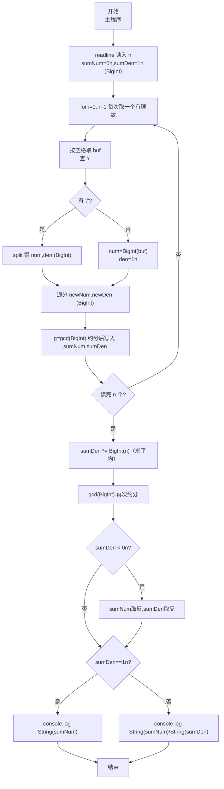
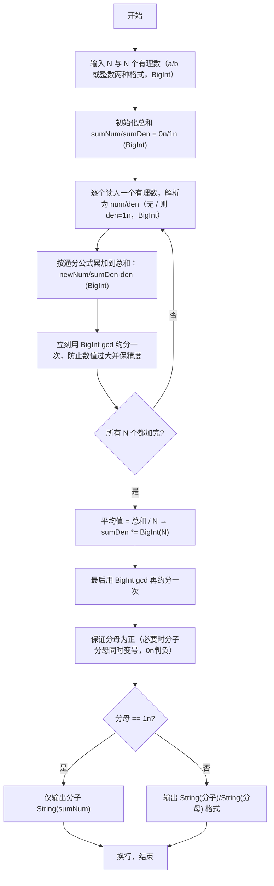

# 7-35 有理数均值（JavaScript实现）

## 前言

本文是 PTA 编程题"7-35 有理数均值"的题解，涵盖题目描述、输入输出格式及纯 JavaScript 实现，展示逐个读入分数字符串、按 '/' 是否存在把有理数解析为 (分子,分母) BigInt 对（全程 BigInt 规避 `b1*b2` 可达 4.6e18 超过 Number 安全整数 2⁵³−1 的精度隐患，与 C long long / Python 任意精度对齐），通过通分累加并逐步约分；最终将总和分母 ×N 求平均值，再用 BigInt 版辗转相除法 gcd 约成最简，保证分母为正、分母为 1n 仅输出分子。

本题（7-35 有理数均值）的主要考点是：准确理解题意、规范处理输入输出格式，并正确处理边界与精度（BigInt 精度保障）。下面先给出题目描述与格式要求，再通过清晰的思路与可直接运行的javascript实现代码进行讲解。

## 题目描述

本题要求编写程序，计算N个有理数的平均值。

## 输入格式

输入第一行给出正整数N（≤100）；第二行中给出N个分数形式的有理数，其中分子和分母全是整形范围内的整数（正负均可），没有分母为0的情况。

## 输出格式

在一行中按照a/b的格式输出N个有理数的平均值。注意必须是该有理数的最简分数形式，若分母为1，则只输出分子。

## 输入样例

```in
4
1/2 1/6 3/6 -5/10
```

## 输出样例

```out
1/6
```

## 解题思路

这道题的核心是**逐个分数解析（兼容整数形式）+ BigInt 累加约分 + 最后乘 N 作分母求平均并再次约分 + 符号处理 + 输出格式**。每个有理数可能是分数形式 `a/b` 也可能是整数形式 `a`（无斜杠），JS 中可以用 `includes('/')` 判断是否有斜杠：有就按 `/` split 后用 `BigInt` 解析出分子分母，没有就当整数、分母为 1n。累加使用 `sumNum/sumDen`（初值 0n/1n，均为 BigInt），每读一个分数 `num/den` 做通分 `sumNum = sumNum*den + num*sumDen`、`sumDen = sumDen*den`（BigInt）后立刻用 BigInt gcd 约分一次防止数值过大。全部 N 个读完后把分母乘 `BigInt(N)`（求平均值相当于除以 N），再对 `sumNum / (sumDen*N)` 做一次最终 BigInt 约分；若分母为负，把分子分母同时变号（保证分母始终为正）；最后分母为 1n 只打印分子，否则按"分子/分母"格式输出（`String()`）。

### 核心问题分析

1. **读 N 个有理数**：第二行输入 N 个以空格分隔的有理数。JS 中直接读取整行后按空格 `split(/\s+/)` 即可切出 N 个有理数字符串。
2. **分数/整数两种格式解析（BigInt 兼容）**：
   - 对读入的字符串 `buf`，用 `buf.includes('/')` 判断是否有 '/'：
     - 有：按 `/` split 出两段，用 `BigInt(token)` 解析出 num、den（BigInt）
     - 没有：`num = BigInt(buf); den = 1n;`（整数形式兼容）
3. **数值范围与 BigInt 必要性**：
   - 单个分子分母在 int 范围内（|x|≤2³¹−1），但 `b1*b2` 单步即达 4.6e18，已超 Number 安全整数 2⁵³−1≈9e15；N≤100 时若用 Number 累乘/约分，中间 `sumDen*den` 与 `gcd` 的 `%` 会失真。C 需 `long long`、Python 任意精度，JS 必须全程 BigInt。
   - 每累加完一个分数就用 BigInt `gcd` 约分一次，能极大降低分子分母规模，且保证精度。
4. **求平均值 = 总和 / N（BigInt）**：
   - 分数除法 = 乘以倒数。即平均值 = `sumNum/sumDen * 1/N` = `sumNum / (sumDen * N)`。也就是把 `sumDen *= BigInt(N)` 计算即可（BigInt）。
5. **约分 + 符号处理（BigInt）**：
   - 约分：`g = gcd(sumNum, sumDen)`（BigInt 版：`a=a<0n?-a:a; b=b<0n?-b:b; while(b!==0n)...`）；`sumNum /= g; sumDen /= g;`
   - 符号规范：如果 `sumDen < 0n`，令 `sumNum = -sumNum; sumDen = -sumDen;` 保证分母永远为正，负号统一挂在分子上（包括分子为 0n 时保持分母为正）。
6. **输出格式（BigInt）**：
   - `sumDen === 1n` → 只输出 `String(sumNum)`
   - 否则 → `` console.log(`${String(sumNum)}/${String(sumDen)}`) ``
7. **样例推导（4 个：1/2, 1/6, 3/6, -5/10）**：
   - 求和：1/2 + 1/6 = 2/3；+3/6= 2/3+1/2=7/6；+(-5/10)=7/6 - 1/2 = 7/6 - 3/6 = 4/6 = 2/3
   - 平均值 = (2/3) / 4 = 2/(3·4) = 2/12 = 1/6。代码按 BigInt 通分与约分正确得出 1/6，与样例一致。

### 算法原理说明

1. 初始化 `sumNum = 0n, sumDen = 1n`（即 0/1 = 0，BigInt）
2. 读 N（Number 用于循环次数，参与运算时转 BigInt）
3. 循环 N 次：
   - 从第二行按空格切出一个有理数字符串
   - 解析为 `num/den`（BigInt；无 `/` 则 den=1n）
   - `sumNum = sumNum*den + num*sumDen`（BigInt）
   - `sumDen = sumDen * den`（BigInt）
   - `g = gcd(sumNum, sumDen); sumNum/=g; sumDen/=g;`（BigInt gcd，`0n` 判零）
4. `sumDen *= BigInt(N)` 求平均（除以 N = 分母乘 N，BigInt）
5. `g = gcd(sumNum, sumDen); sumNum/=g; sumDen/=g;`（BigInt）
6. 若 `sumDen < 0n`：分子分母同时取反
7. 按 `sumDen===1n` 选择输出格式（`String()` 输出）

### 具体计算步骤（BigInt）

1. 用 readline 读 N=4
2. 逐个用 BigInt 解析并累加：
   - 1/2：sum = (0n·2n+1n·1n)/(1n·2n) = 1n/2n
   - 1/6：sum = (1n·6n+1n·2n)/(2n·6n) = 8n/12n → gcd=4n → 2n/3n
   - 3/6：sum = (2n·6n+3n·3n)/(3n·6n) = 21n/18n → gcd=3n → 7n/6n
   - -5/10：sum = (7n·10n + (-5n)·6n)/(6n·10n) = (70n-30n)/60n = 40n/60n → gcd=20n → 2n/3n
3. sumDen *= 4n → 2n/(3n·4n) = 2n/12n
4. gcd(2n, 12n) = 2n → 1n/6n
5. 按 `sumDen===1n` 格式用 `String()` 输出 → 1/6

## 完整代码

```javascript
// 题目：7-35 有理数均值
// 要求：实现「有理数均值」（题目 7-35）的输入处理与结果输出。
// 实现原理（BigInt 版，规避 Number 精度隐患）：
//   1. 读 N 个有理数：第二行输入 N 个以空格分隔的有理数。JS 中直接读取整行后按空格 `split(/\s+/)` 即可切出 N 个有理数字符串。
//   2. 分数/整数两种格式解析（BigInt 兼容）：有 '/' 则按 '/' 拆后 BigInt(token) 解析，无 '/' 则 BigInt(token) 且 den=1n。
//   3. 防止数值过大与精度失真：b1*b2可达4.6e18>2^53，N≤100累乘更大，全程 BigInt；每步即时 gcd 约分。
//   4. 数值范围：全程 BigInt，与 C long long / Python 任意精度对齐；输出 String() 转换。

const readline = require('readline'); // 引入 readline 模块
const rl = readline.createInterface({ input: process.stdin, output: process.stdout }); // 创建输入输出接口

// BigInt 版最大公约数（辗转相除法，先取绝对值）
function gcd(a, b) { a = a < 0n ? -a : a; b = b < 0n ? -b : b; while (b !== 0n) { let t = b; b = a % b; a = t; } return a; }

const lines = []; // 存放输入的所有行
rl.on('line', (line) => {
    lines.push(line.trim()); // 每行去除首尾空白后存入数组
    if (lines.length === 2) { // 收齐两行（N + N 个有理数）后统一处理
        const n = parseInt(lines[0], 10); // 第 1 行读入 n（≤100），循环计数用 Number，运算时转 BigInt

        let sumNum = 0n; // 累加分子，初值 0n 表示总和 = 0n/1n (BigInt)
        let sumDen = 1n; // 累积分母，初值 1n (BigInt)

        const parts = lines[1].split(/\s+/); // 第 2 行按空格切出 n 个有理数
        for (let i = 0; i < n; i++) {
            const buf = parts[i]; // 一个有理数字符串（可以是 a/b 或 a）

            let num, den;
            // 判断是分数形式还是整数形式（有没有 '/'）
            if (buf.includes('/')) {
                // 有斜杠：按 '/' 拆出分子和分母（BigInt）
                const sp = buf.split('/');
                num = BigInt(sp[0]);
                den = BigInt(sp[1]);
            } else {
                // 没有斜杠：当作整数，分母为 1n（BigInt 兼容整数形式）
                num = BigInt(buf);
                den = 1n;
            }

            // 分数加法（BigInt）：sumNum/sumDen + num/den = (sumNum*den + num*sumDen) / (sumDen*den)
            const newNum = sumNum * den + num * sumDen;
            const newDen = sumDen * den;
            // 立即约分一次，避免数值越来越大（BigInt）
            const g = gcd(newNum, newDen);
            sumNum = newNum / g;
            sumDen = newDen / g;
        }

        // 平均值 = 总和 / n = sumNum/sumDen * 1/n = sumNum / (sumDen * n) (BigInt)
        sumDen *= BigInt(n);
        // 最终再约分一次（BigInt）
        const g = gcd(sumNum, sumDen);
        sumNum = sumNum / g;
        sumDen = sumDen / g;

        // 保证分母为正：若分母为负，则分子分母同时取反（负号统一写到分子上） (BigInt)
        if (sumDen < 0n) {
            sumNum = -sumNum;
            sumDen = -sumDen;
        }

        // 输出格式：分母为 1n 只输出分子；否则输出 "分子/分母"（BigInt 需 String()）
        if (sumDen === 1n) {
            console.log(String(sumNum));
        } else {
            console.log(`${String(sumNum)}/${String(sumDen)}`);
        }
        rl.close(); // 关闭接口
    }
});
```

## 代码流程说明

### 1. 自写 gcd（BigInt 版）
- 先把 a、b 用 `a<0n?-a:a` 取绝对值
- 循环辗转相除 `while (b!==0n)`：t=b, b=a%b, a=t（BigInt `%`）
- 返回 a

### 2. 输入与累加（BigInt）
- 第 1 行 `parseInt` 得到 n（循环用 Number，运算时 `BigInt(n)`）
- `sumNum=0n, sumDen=1n`（表示 0，BigInt）
- 第 2 行按空格 `split(/\s+/)` 切出 n 个有理数，循环 n 次：
  - `buf.includes('/')` 判断是否是分数：
    - 有 → 按 `/` split 后 `BigInt(token)` 出 num、den（BigInt）
    - 无 → `num=BigInt(buf); den=1n;`（兼容整数形式，BigInt）
  - 通分求和 newNum = sumNum·den + num·sumDen；newDen = sumDen·den（BigInt）
  - `g = gcd(newNum, newDen)`；sumNum = newNum/g；sumDen = newDen/g（BigInt 除法）

### 3. 求平均与最终约分（BigInt）
- `sumDen *= BigInt(n)`（平均值 = 总和 / n = 分母乘 N，BigInt）
- 再 gcd 一次约分（BigInt）
- `sumDen < 0n` 时分子分母同时取反（BigInt）

### 4. 格式输出（BigInt）
- sumDen === 1n → `console.log(String(sumNum))`
- 否则 → `` console.log(`${String(sumNum)}/${String(sumDen)}`) ``

### 5. 结束
- `rl.close()` 关闭接口

## 代码流程图



## 解题流程图



## 代码解析

### 自写 gcd（BigInt）

```javascript
function gcd(a, b) { a = a < 0n ? -a : a; b = b < 0n ? -b : b; while (b !== 0n) { let t = b; b = a % b; a = t; } return a; }
```

BigInt 版 gcd：`a<0n?-a:a` 取绝对值，`while(b!==0n)` 循环，需 `0n` 判零，`%` 为 BigInt 取模。

### 输入与累加（BigInt，兼容整数形式）

```javascript
let sumNum = 0n; let sumDen = 1n;
const parts = lines[1].split(/\s+/);
for (let i = 0; i < n; i++) {
    const buf = parts[i];
    let num, den;
    if (buf.includes('/')) { const sp=buf.split('/'); num=BigInt(sp[0]); den=BigInt(sp[1]); }
    else { num=BigInt(buf); den=1n; }
    const newNum = sumNum * den + num * sumDen;
    const newDen = sumDen * den;
    const g = gcd(newNum, newDen); sumNum = newNum / g; sumDen = newDen / g;
}
```

逐个用 BigInt 解析（兼容无 `/` 的整数形式），通分累加后立即 BigInt 约分。

### 求平均与最终约分（BigInt）

```javascript
sumDen *= BigInt(n);
const g = gcd(sumNum, sumDen); sumNum = sumNum / g; sumDen = sumDen / g;
if (sumDen < 0n) { sumNum = -sumNum; sumDen = -sumDen; }
```

`BigInt(n)` 乘分母求平均，再次 BigInt 约分并规范符号（0n 判负）。

### 格式输出（BigInt）

```javascript
if (sumDen === 1n) { console.log(String(sumNum)); } else { console.log(`${String(sumNum)}/${String(sumDen)}`); }
```

`1n` 判分母，BigInt 转 `String()` 输出。

### 数值范围说明

`b1*b2` 可达 4.6e18 > 2⁵³−1，`sumDen*den` 多次累乘更大，Number 会使 `gcd` 的 `%` 失真；全程 BigInt 与 C `long long` / Python 任意精度对齐。

### 结束

```javascript
rl.close();
```

关闭接口。


## 复杂度分析

设输入规模为 $n$（对数值类题目为参与运算的数据量，对字符串/序列类题目为长度）。

- **时间复杂度**：$O(n)$ 或 $O(n \log n)$，主要来自一次线性遍历与常数次数学运算，无嵌套高复杂度循环。
- **空间复杂度**：$O(n)$，用于存储输入、中间结果与输出字符串；若仅使用若干标量变量则为 $O(1)$。

## 常见易错点

### 1. 输入/输出格式不符
错误：多余空格、遗漏换行、大小写或精度不符。后果：判题系统判为格式错误。正确：严格按题目要求的格式输出，数值用合适精度。

### 2. 边界条件遗漏
错误：未处理 0、最小值、单字符或空输入等边界。后果：特例 WA。正确：先列出所有边界样例，在编码前单独分支处理。

### 3. 整数溢出与类型
错误：用 Number/`parseInt`/`Number` 解析或计算 `b1*b2`/`sumDen*den`（可达 4.6e18 > 2⁵³−1），或用 `Math.abs`/`Math.trunc` 处理 BigInt，导致 `gcd` 的 `%` 失真。后果：大数/多步累加 WA。正确：全程 BigInt：`BigInt(token)` 解析（含整数形式 `den=1n`）、`sumNum/sumDen` 均为 BigInt、`gcd` 用 `0n` 判零、`sumDen*=BigInt(n)`、`String()` 输出。

## 更多测试

### 测试一：常规边界

**输入：**

```text
1
3/4
```

**输出：**

```text
3/4
```

### 测试二：特殊用例

**输入：**

```text
2
1/2 1/2
```

**输出：**

```text
1/2
```

## 总结

本文是 PTA 编程题"7-35 有理数均值"的题解，涵盖题目描述、输入输出格式及纯 JavaScript 实现，展示逐个读入分数字符串、按 '/' 是否存在把有理数解析为 (分子,分母) BigInt 对（兼容整数形式 `den=1n`，全程 BigInt 规避 `b1*b2`≈4.6e18 超过 Number 安全整数 2⁵³−1 的精度隐患，与 C long long / Python 任意精度对齐），通过通分累加并每步 BigInt 约分；最终将总和分母 ×`BigInt(N)` 求平均值，再用 BigInt 版辗转相除法 gcd 约成最简，保证分母为正、分母为 1n 仅输出分子（`String()` 输出）。

本题的核心在于理清「有理数均值」的输入输出关系、边界处理与数值精度（BigInt）：先按格式读取并用 BigInt 兼容解析（分数/整数），再依据规则通分计算并用 BigInt gcd 逐次约分与最终约分，最后按规范输出。该思路可迁移到同类格式化输入输出与大数模拟计算的题目。
