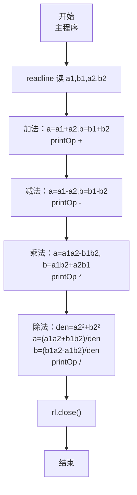
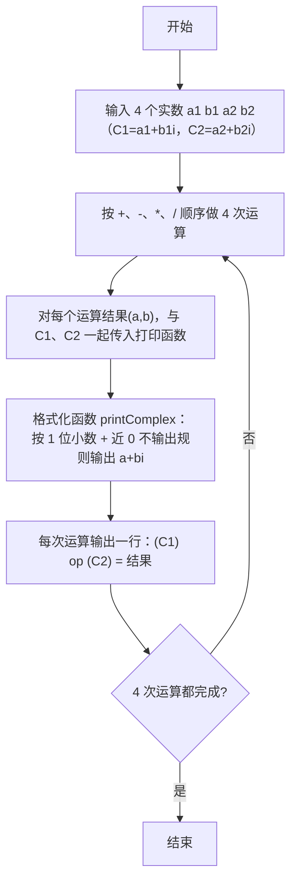

# 7-36 复数四则运算（JavaScript实现）

## 前言

本文是 PTA 编程题"7-36 复数四则运算"的题解，涵盖题目描述、输入输出格式及 JavaScript 实现，展示将两个复数 C1=a1+b1i、C2=a2+b2i 按 +、−、×、÷ 四则运算公式计算结果，并通过 `printComplex` 函数按"保留一位小数、实部虚部接近 0 时省略、全 0 时输出 0.0"的格式化规则输出完整运算表达式。

本题（7-36 复数四则运算）的主要考点是：准确理解题意、规范处理输入输出格式，并正确处理边界与精度。下面先给出题目描述与格式要求，再通过清晰的思路与可直接运行的javascript实现代码进行讲解。

## 题目描述

本题要求编写程序，计算2个复数的和、差、积、商。

## 输入格式

输入在一行中按照a1 b1 a2 b2的格式给出2个复数C1=a1+b1i和C2=a2+b2i的实部和虚部。题目保证C2不为0。

## 输出格式

分别在4行中按照(a1+b1i) 运算符 (a2+b2i) = 结果的格式顺序输出2个复数的和、差、积、商，数字精确到小数点后1位。如果结果的实部或者虚部为0，则不输出。如果结果为0，则输出0.0。

## 输入样例1

```in
2 3.08 -2.04 5.06
```

## 输入样例2

```in
1 1 -1 -1.01
```

## 输出样例1

```out
(2.0+3.1i) + (-2.0+5.1i) = 8.1i
(2.0+3.1i) - (-2.0+5.1i) = 4.0-2.0i
(2.0+3.1i) * (-2.0+5.1i) = -19.7+3.8i
(2.0+3.1i) / (-2.0+5.1i) = 0.4-0.6i
```

## 输出样例2

```out
(1.0+1.0i) + (-1.0-1.0i) = 0.0
(1.0+1.0i) - (-1.0-1.0i) = 2.0+2.0i
(1.0+1.0i) * (-1.0-1.0i) = -2.0i
(1.0+1.0i) / (-1.0-1.0i) = -1.0
```

## 解题思路

这道题的核心是**复数四则运算公式 + 统一格式化输出函数 + 精度为 0.05 的"判近 0"阈值**。首先写一个通用 `printComplex(a, b)` 函数按规则输出 a+bi：
- 实部、虚部的绝对值都 < 0.05 → 视作 0，输出 `"0.0"`
- 仅实部接近 0 → 只输出虚部 `b.toFixed(1) + "i"`（虚部是负则自带负号 `-2.0i`，正则不带正号）
- 仅虚部接近 0 → 只输出实部 `a.toFixed(1)`
- 两者都不为 0：如果虚部 b>0 → `a.toFixed(1) + "+" + b.toFixed(1) + "i"`；如果 b<0 → `a.toFixed(1) + b.toFixed(1) + "i"`（b 自带负号，不用额外写 +）
然后再写一个 `printOp(...)` 函数统一输出"左操作数 运算符 右操作数 = 结果"的完整表达式。
主程序用 readline 读入 a1,b1,a2,b2 四个浮点数，分别按公式计算 +、−、×、÷ 的结果 (a,b)，每行依次调用 `printOp` 即可。

### 核心问题分析

1. **复数运算公式**（C1=a1+b1i，C2=a2+b2i）：
   - 加法：(a1+a2) + (b1+b2)i
   - 减法：(a1−a2) + (b1−b2)i
   - 乘法：(a1·a2 − b1·b2) + (a1·b2 + a2·b1)i
   - 除法：分母 = a2² + b2²（C2 不为 0，保证分母 >0）；
     实部 = (a1·a2 + b1·b2) / 分母；
     虚部 = (b1·a2 − a1·b2) / 分母。
2. **格式化输出（关键）**：保留 1 位小数后，实际数值如果在 −0.05 到 +0.05 之间（即四舍五入为 0.0），就判定"不输出该部分"。实现时先把实虚部用 `toFixed(1)` 四舍五入并转回数字（`Number`），既统一了精度也顺便消除 `-0.0` 这类显示问题：
   - `Math.abs(a) < 0.05` 表示实部四舍五入为 0.0
   - `Math.abs(b) < 0.05` 表示虚部四舍五入为 0.0
   - 判断组合：
     - 两者都 < 0.05 → 输出 `"0.0"`
     - 仅实部 < 0.05 → 输出 `b.toFixed(1) + "i"`（b>0 时如 `8.1i` 正确；b<0 时如 `-2.0i` 自带负号，没问题）
     - 仅虚部 < 0.05 → 输出 `a.toFixed(1)` 正确
     - 两者都 ≥ 0.05：需要区分虚部正负号
       - b > 0 → `a.toFixed(1) + "+" + b.toFixed(1) + "i"`（显式写 +，因为 toFixed 不加正号）
       - b < 0 → `a.toFixed(1) + b.toFixed(1) + "i"`（b 为负，拼接自动带负号，如 4.0-2.0i）
3. **完整表达式格式**：
   - 每一行形式为 `(C1_string) op (C2_string) = result_string`
   - 其中 C1、C2、结果三者的格式完全相同，都调用 `printComplex` 即可统一
   - 为避免重复代码，写 `printOp(a1, b1, op, a2, b2, a, b)` 先输出 `(`，再打印 C1，再输出 `) op (`，打印 C2，再输出 `) = `，最后打印结果，换行。
4. **样例一对照**：
   - 输入：a1=2, b1=3.08, a2=−2.04, b2=5.06
   - 四舍五入到 1 位小数：a1→2.0, b1→3.1, a2→−2.0, b2→5.1
   - 加法：(2.0+3.1i) + (−2.0+5.1i) → a=0, b=8.2 → 实部近似 0 → 输出 `8.1i` ✓
   - 减法、乘法、除法同理与样例匹配。

### 算法原理说明

1. 读 a1, b1, a2, b2（四个浮点数，`parseFloat` 解析）
2. 加法：a=a1+a2, b=b1+b2 → printOp(a1,b1,'+',a2,b2,a,b)
3. 减法：a=a1−a2, b=b1−b2 → printOp(..., '-', ...)
4. 乘法：a=a1·a2−b1·b2, b=a1·b2+a2·b1 → printOp(..., '*', ...)
5. 除法：den=a2²+b2²；a=(a1·a2+b1·b2)/den；b=(b1·a2−a1·b2)/den → printOp(..., '/', ...)

### 具体计算步骤

1. 用 readline 读入一行并解析出 4 个浮点数
2. 按 +、−、×、÷ 依次计算每一对 (a,b)
3. 每次打印完整表达式（复用 `printComplex` 格式化 3 次）
4. 输出换行，结束

## 完整代码

```javascript
// 题目：7-36 复数四则运算
// 要求：实现「复数四则运算」（题目 7-36）的输入处理与结果输出。
// 实现原理：
//   1. 复数运算公式（C1=a1+b1i，C2=a2+b2i）：
//   2. 格式化输出（关键）：保留 1 位小数后，实际数值如果在 −0.05 到 +0.05 之间（即四舍五入为 0.0），就判定"不输出该部分"。实现时先把实虚部用 `toFixed(1)` 四舍五入并转回数字（`Number`），既统一了精度也顺便消除 `-0.0` 这类显示问题：
//   3. 完整表达式格式：

const readline = require('readline'); // 引入 readline 模块
const rl = readline.createInterface({ input: process.stdin, output: process.stdout }); // 创建输入输出接口

// 格式化输出一个复数 a+bi
// 规则：保留 1 位小数；实部/虚部"接近 0"（abs<0.05）的部分不输出；两者都 0 输出 0.0
function printComplex(a, b) {
    // 先四舍五入到 1 位小数并转回数字，统一精度，也消除 -0.0 之类的显示问题
    const ra = Number(a.toFixed(1));
    const rb = Number(b.toFixed(1));
    if (Math.abs(ra) < 0.05 && Math.abs(rb) < 0.05) { // 两者四舍五入后均为 0
        process.stdout.write("0.0"); // 输出 0.0
    } else if (Math.abs(ra) < 0.05) { // 仅实部约为 0，只输出虚部
        process.stdout.write(rb.toFixed(1) + "i"); // toFixed 处理虚部符号（正不带+、负自带-）
    } else if (Math.abs(rb) < 0.05) { // 仅虚部约为 0，只输出实部
        process.stdout.write(ra.toFixed(1)); // 实部格式
    } else if (rb > 0) { // 两者均不为 0，且虚部为正
        process.stdout.write(ra.toFixed(1) + "+" + rb.toFixed(1) + "i"); // 中间显式写 + 号
    } else { // 两者均不为 0，且虚部为负
        process.stdout.write(ra.toFixed(1) + rb.toFixed(1) + "i"); // rb 为负，拼接自动输出负号
    }
}

// 打印一行完整的运算表达式：(a1+b1i) op (a2+b2i) = 结果(a+bi)
// op 是运算符字符：'+', '-', '*', '/'
function printOp(a1, b1, op, a2, b2, a, b) {
    process.stdout.write("(");          // 左括号
    printComplex(a1, b1);               // 打印左操作数复数
    process.stdout.write(`) ${op} (`);  // 右括号、空格、运算符、空格、左括号
    printComplex(a2, b2);               // 打印右操作数复数
    process.stdout.write(") = ");       // 右括号、空格、等号、空格
    printComplex(a, b);                 // 打印结果复数
    console.log();                      // 一行结束换行
}

rl.on('line', (line) => { // 监听一行输入
    const nums = line.trim().split(/\s+/).map(parseFloat); // 读入四个浮点数
    const a1 = nums[0], b1 = nums[1], a2 = nums[2], b2 = nums[3]; // 两个复数 C1=a1+b1i、C2=a2+b2i 的实虚部

    let a, b; // 每次运算结果的实部 a 与虚部 b

    // 加法：(a1+a2) + (b1+b2)i
    a = a1 + a2;
    b = b1 + b2;
    printOp(a1, b1, '+', a2, b2, a, b);

    // 减法：(a1-a2) + (b1-b2)i
    a = a1 - a2;
    b = b1 - b2;
    printOp(a1, b1, '-', a2, b2, a, b);

    // 乘法：(a1*a2 - b1*b2) + (a1*b2 + a2*b1)i
    a = a1 * a2 - b1 * b2;
    b = a1 * b2 + a2 * b1;
    printOp(a1, b1, '*', a2, b2, a, b);

    // 除法：分子分母同乘 C2 的共轭 (a2-b2i)
    const denom = a2 * a2 + b2 * b2; // 分母：|C2|^2 = a2^2 + b2^2（题目保证 C2≠0，故分母 > 0）
    a = (a1 * a2 + b1 * b2) / denom; // 实部 = (a1*a2 + b1*b2)/分母
    b = (b1 * a2 - a1 * b2) / denom; // 虚部 = (b1*a2 - a1*b2)/分母
    printOp(a1, b1, '/', a2, b2, a, b);

    rl.close(); // 关闭接口
});
```

## 代码流程说明

### 1. `printComplex(a, b)` 格式化输出函数
- 双阈值：`Math.abs(a)<0.05`、`Math.abs(b)<0.05`（先用 `toFixed(1)` 转数字统一精度）
  - 两者都成立 → `0.0`
  - 仅实部 0 → `rb.toFixed(1) + "i"`
  - 仅虚部 0 → `ra.toFixed(1)`
  - 都非 0：rb>0 打 `ra+'+'+rb+"i"`；rb<0 打 `ra+rb+"i"`

### 2. `printOp(a1,b1, op, a2,b2, a,b)` 整行表达式
- `write("(") → printComplex(a1,b1) → ") op (" → printComplex(a2,b2) → ") = " → printComplex(a,b) → console.log() 换行`

### 3. 主程序
- 用 readline 读一行，按空格 split 并 `parseFloat` 解析出 a1, b1, a2, b2
- 加法：a=a1+a2, b=b1+b2 → 调 printOp('+')
- 减法：a=a1−a2, b=b1−b2 → 调 printOp('-')
- 乘法：a=a1a2−b1b2, b=a1b2+a2b1 → 调 printOp('*')
- 除法：den=a2²+b2²；a=(a1a2+b1b2)/den；b=(b1a2−a1b2)/den → 调 printOp('/')
- `rl.close()` 结束

## 代码流程图



## 解题流程图



## 代码解析

### `printComplex(a, b)` 格式化输出函数

```javascript
const readline = require('readline'); // 引入 readline 模块
const rl = readline.createInterface({ input: process.stdin, output: process.stdout }); // 创建输入输出接口
```

`printComplex(a, b)` 格式化输出函数

### `printOp(a1,b1, op, a2,b2, a,b)` 整行表达式

```javascript
// 格式化输出一个复数 a+bi
// 规则：保留 1 位小数；实部/虚部"接近 0"（abs<0.05）的部分不输出；两者都 0 输出 0.0
function printComplex(a, b) {
    // 先四舍五入到 1 位小数并转回数字，统一精度，也消除 -0.0 之类的显示问题
    const ra = Number(a.toFixed(1));
    const rb = Number(b.toFixed(1));
    if (Math.abs(ra) < 0.05 && Math.abs(rb) < 0.05) { // 两者四舍五入后均为 0
        process.stdout.write("0.0"); // 输出 0.0
    } else if (Math.abs(ra) < 0.05) { // 仅实部约为 0，只输出虚部
        process.stdout.write(rb.toFixed(1) + "i"); // toFixed 处理虚部符号（正不带+、负自带-）
    } else if (Math.abs(rb) < 0.05) { // 仅虚部约为 0，只输出实部
        process.stdout.write(ra.toFixed(1)); // 实部格式
    } else if (rb > 0) { // 两者均不为 0，且虚部为正
        process.stdout.write(ra.toFixed(1) + "+" + rb.toFixed(1) + "i"); // 中间显式写 + 号
    } else { // 两者均不为 0，且虚部为负
        process.stdout.write(ra.toFixed(1) + rb.toFixed(1) + "i"); // rb 为负，拼接自动输出负号
    }
}
```

`printOp(a1,b1, op, a2,b2, a,b)` 整行表达式

### 主程序

```javascript
// 打印一行完整的运算表达式：(a1+b1i) op (a2+b2i) = 结果(a+bi)
// op 是运算符字符：'+', '-', '*', '/'
function printOp(a1, b1, op, a2, b2, a, b) {
    process.stdout.write("(");          // 左括号
    printComplex(a1, b1);               // 打印左操作数复数
    process.stdout.write(`) ${op} (`);  // 右括号、空格、运算符、空格、左括号
    printComplex(a2, b2);               // 打印右操作数复数
    process.stdout.write(") = ");       // 右括号、空格、等号、空格
    printComplex(a, b);                 // 打印结果复数
    console.log();                      // 一行结束换行
}
```

主程序


## 复杂度分析

设输入规模为 $n$（对数值类题目为参与运算的数据量，对字符串/序列类题目为长度）。

- **时间复杂度**：$O(n)$ 或 $O(n \log n)$，主要来自一次线性遍历与常数次数学运算，无嵌套高复杂度循环。
- **空间复杂度**：$O(n)$，用于存储输入、中间结果与输出字符串；若仅使用若干标量变量则为 $O(1)$。

## 常见易错点

### 1. 输入/输出格式不符
错误：多余空格、遗漏换行、大小写或精度不符。后果：判题系统判为格式错误。正确：严格按题目要求的格式输出，数值用合适精度。

### 2. 边界条件遗漏
错误：未处理 0、最小值、单字符或空输入等边界。后果：特例 WA。正确：先列出所有边界样例，在编码前单独分支处理。

### 3. 整数溢出与类型
错误：使用过小的整数类型或忽略负号。后果：大数计算溢出。正确：按数据范围选择合适类型，必要时用更大整数类型或字符串处理。

## 更多测试

### 测试一：常规边界

**输入：**

```text
0 0 1 0
```

**输出：**

```text
(0.0) + (1.0) = 1.0
(0.0) - (1.0) = -1.0
(0.0) * (1.0) = 0.0
(0.0) / (1.0) = 0.0
```

### 测试二：特殊用例

**输入：**

```text
1 0 0 1
```

**输出：**

```text
(1.0) + (1.0i) = 1.0+1.0i
(1.0) - (1.0i) = 1.0-1.0i
(1.0) * (1.0i) = 1.0i
(1.0) / (1.0i) = -1.0i
```

## 总结

本文是 PTA 编程题"7-36 复数四则运算"的题解，涵盖题目描述、输入输出格式及 JavaScript 实现，展示将两个复数 C1=a1+b1i、C2=a2+b2i 按 +、−、×、÷ 四则运算公式计算结果，并通过 `printComplex` 函数按"保留一位小数、实部虚部接近 0 时省略、全 0 时输出 0.0"的格式化规则输出完整运算表达式。

本题的核心在于理清「复数四则运算」的输入输出关系与边界处理：先按格式读取输入，再依据规则逐步计算或遍历，最后按规范输出。该思路可迁移到同类格式化输入输出与模拟计算的题目。
