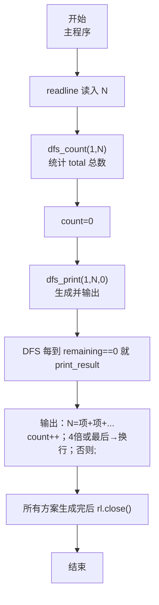
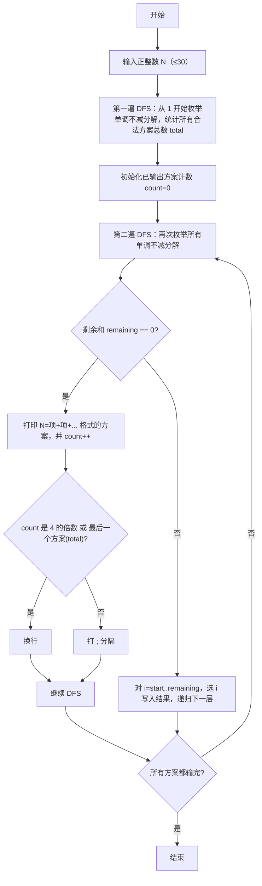

# 7-37 整数分解为若干项之和（JavaScript实现）

## 前言

本文是 PTA 编程题"7-37 整数分解为若干项之和"的题解，涵盖题目描述、输入输出格式及 JavaScript 实现，展示使用深度优先搜索（DFS）生成所有"每项不小于前一项"的整数 N 分解序列（递增顺序保证字典序），并通过两次 DFS：第一次先计数所有合法方案总数 total，第二次按格式输出，实现"每 4 个式子换行、式子间用 ; 分隔、每 4 个或最后一个不加 ; 而换行"的严格格式控制。

本题（7-37 整数分解为若干项之和）的主要考点是：准确理解题意、规范处理输入输出格式，并正确处理边界与精度。下面先给出题目描述与格式要求，再通过清晰的思路与可直接运行的javascript实现代码进行讲解。

## 题目描述

将一个正整数 N 分解成几个正整数相加，可以有多种分解方法，例如 7=6+1，7=5+2，7=5+1+1，…。编程求出正整数 N 的所有整数分解式子。

## 输入格式

每个输入包含一个测试用例，即正整数 N (0<N≤30)。

## 输出格式

按递增顺序输出 N 的所有整数分解式子。递增顺序是指：对于两个分解序列 N₁={n₁,n₂,⋯} 和 N₂={m₁,m₂,⋯}，若存在 i 使得 n₁=m₁,⋯,nᵢ=mᵢ，但是 nᵢ₊₁<mᵢ₊₁，则 N₁序列必定在 N₂序列之前输出。每个式子由小到大相加，式子间用分号隔开，且每输出 4 个式子后换行。

## 输入样例

```in
7
```

## 输出样例

```out
7=1+1+1+1+1+1+1;7=1+1+1+1+1+2;7=1+1+1+1+3;7=1+1+1+2+2
7=1+1+1+4;7=1+1+2+3;7=1+1+5;7=1+2+2+2
7=1+2+4;7=1+3+3;7=1+6;7=2+2+3
7=2+5;7=3+4;7=7
```

## 解题思路

这道题的核心是**用 DFS 生成"单调不减"的所有分解（保证按字典序） + 预计算所有方案总数 total 以便按 4 个换行格式正确输出**。

1. **DFS 分解框架**：递归过程中维护三个参数：
   - `start`：当前层可选的最小数值（保证后续项 ≥ 前一项，从而整个序列非降，这样每个分解唯一且按字典序输出）
   - `remaining`：剩余还需要凑出来的和值（初值 N，最后必须减到 0 才能算合法方案）
   - `depth`：当前已经选了几个数（对应 `result[depth]` 写入当前分解值）
   - 每一层循环 `i` 从 `start` 到 `remaining`（不能超过剩余值，否则下一层直接负数），把 `i` 放入当前层，然后递归 `dfs(i, remaining - i, depth + 1)`。
   - 递归出口：`remaining == 0` → 得到一个合法分解。
2. **保证"由小到大相加顺序+字典序"**：每一层的选择范围 `i >= start`，使得当前项 ≥ 上一项，因此整个分解序列非降，且自然按题目要求的"递增"字典序生成（先选小的前面部分）。
3. **严格的格式控制**（难点）：
   - 每个方案写成 `N=项1+项2+…+项k`
   - 方案之间用 `;` 分隔
   - 每输出 4 个方案后换行（而不是每个分号后换行）
   - 恰好是 4 的倍数 或 是最后一个方案 total 时 → 换行，否则打 `;`
   - 这就必须在输出前先知道"总共有多少个方案 total"，否则无法判断某方案"是不是最后一个"，因此要**做两遍 DFS**：
     - 第一遍 `dfs_count`：只统计合法方案数，写入全局 `total`
     - 第二遍 `dfs_print`：每当 `remaining==0` 时就打印这一个方案，并通过全局 `count` 判断：`count%4==0 || count==total` 时换行（`console.log()`），否则输出 `;`（`process.stdout.write`）
4. **样例 N=7 对照**：DFS 按 start=1 开始层层选，依次生成长度 7、6、5、4、3、2、1 的非降分解共 15 种，每 4 个换行正好 4 行，与样例完全一致。

### 核心问题分析

1. **为什么要 start 参数**：
   - 如果每层都从 1 开始选，就会同时生成 `[1,6]` 与 `[6,1]`，两者都是 7 的分解，但题目把 `[1,6]` 视为一种而非两种，且必须小的在前。
   - start 限制当前选择 ≥ 前一个值，保证序列单调不减，这样每种"多重集"只生成一次，且字典序正确。
2. **为什么两遍 DFS**：
   - 题目格式是"每 4 个分号后换行、最后一个方案之后必须换行而不能带 ; 或其他多余字符"
   - 若不先统计 total，就无法在输出第 count 个时判断 `count == total`（最后一个），容易：
     - 多打一个 `;` 在最后（比如 15 个方案中第 15 个后面应该是换行，而不是 `;` 再换行）
   - 第一遍 DFS 只做加 total、不做任何打印，时间空间几乎可忽略（N 最大 30，方案数数千级完全可接受）
3. **输出分解式子**：`print_result(depth)`：
   - 先输出 `N=`，再输出 `result[0]`
   - 再对 i=1..depth-1，依次输出 `+result[i]`
   - 然后全局 `count++`，判断：
     - 若 `count % 4 == 0 || count == total` → `console.log()` 换行
     - 否则 → `process.stdout.write(';')`（无换行）

### 算法原理说明

两个 DFS：
1. **dfs_count(start, remaining)**：
   - `if (remaining == 0) { total++; return; }`
   - `for (let i = start; i <= remaining; i++) dfs_count(i, remaining - i);`
2. **dfs_print(start, remaining, depth)**：
   - `if (remaining == 0) { print_result(depth); return; }`
   - `for (let i = start; i <= remaining; i++) { result[depth] = i; dfs_print(i, remaining-i, depth+1); }`
3. **主程序**：
   - 用 readline 读取 N
   - `dfs_count(1, N);` 得到总方案数 total
   - 全局 count 归零 → `dfs_print(1, N, 0);`
   - `rl.close()` 结束

### 具体计算步骤（N=7）
1. dfs_count 得 total = 15
2. dfs_print 从 start=1 依次选：
   - 1+1+1+1+1+1+1 → count=1 → ;
   - 1+1+1+1+1+2 → count=2 → ;
   - 1+1+1+1+3 → count=3 → ;
   - 1+1+1+2+2 → count=4 → 换行
   - …按 4 个一组继续；直到最后一个 7=7，count=15=total → 换行

## 完整代码

```javascript
// 题目：7-37 整数分解为若干项之和
// 要求：实现「整数分解为若干项之和」（题目 7-37）的输入处理与结果输出。
// 实现原理：
//   1. DFS 分解框架：递归过程中维护三个参数：
//   2. 保证"由小到大相加顺序+字典序"：每一层的选择范围 `i >= start`，使得当前项 ≥ 上一项，因此整个分解序列非降，且自然按题目要求的"递增"字典序生成（先选小的前面部分）。
//   3. 严格的格式控制（难点）：

const readline = require('readline'); // 引入 readline 模块
const rl = readline.createInterface({ input: process.stdin, output: process.stdout }); // 创建输入输出接口

let N;                  // 全局：待分解的正整数 N（题目 0<N≤30）
const result = [];      // 全局：存储当前 DFS 路径的分解项数组（N=30 时项数≤30）
let count = 0;          // 全局：dfs_print 过程中已经输出的方案计数
let total = 0;          // 全局：dfs_count 统计得到的所有合法分解方案总数

// 第一遍 DFS：只统计有多少种合法分解方案（写入 total），不做输出
// start：当前层可以选择的最小值（保证 ≥ 上一项，单调不减）
// remaining：还需要凑的剩余数值
function dfs_count(start, remaining) {
    if (remaining === 0) { // 剩余为 0 → 找到一个合法分解
        total++;           // 方案总数 +1
        return;
    }
    for (let i = start; i <= remaining; i++) { // i 从 start 到 remaining（不超剩余值）
        dfs_count(i, remaining - i);           // 下一层：可选最小 i（仍≥本项）、剩余减 i
    }
}

// 输出一个分解方案：N=result[0]+result[1]+...+result[depth-1]
// 并按"每 4 个一行、之间用 ; 分隔、最后一个或第4的倍数换行"打印分隔符
function print_result(depth) {
    process.stdout.write(`${N}=${result[0]}`); // 开头：N=第一项
    for (let i = 1; i < depth; i++) {          // 从第 2 项开始依次 +项
        process.stdout.write(`+${result[i]}`);
    }
    count++; // 已输出方案计数 +1
    // 分隔符：每 4 个一行，或最后一个 → 换行；否则 ;
    if (count % 4 === 0 || count === total) {
        console.log();
    } else {
        process.stdout.write(';');
    }
}

// 第二遍 DFS：按 DFS 顺序生成所有合法分解，一旦剩余为 0 就调用 print_result 输出
// depth：当前已经选了 depth 个数（即下一个写入 result[depth]）
function dfs_print(start, remaining, depth) {
    if (remaining === 0) {   // 凑成完整分解
        print_result(depth); // 输出这一条
        return;
    }
    for (let i = start; i <= remaining; i++) {  // 逐一枚举当前层选择 i（单调不减）
        result[depth] = i;                      // 记录该项到结果数组
        dfs_print(i, remaining - i, depth + 1); // 递归下一层（下一项 ≥ i、剩余减 i、深度+1）
    }
}

rl.on('line', (line) => { // 监听一行输入
    N = parseInt(line.trim(), 10); // 读入要分解的正整数 N
    dfs_count(1, N);      // 第一遍 DFS：统计合法分解方案总数 total
    count = 0;            // 重置输出计数器（第二遍用）
    dfs_print(1, N, 0);   // 第二遍 DFS：生成并按格式输出所有方案
    rl.close();           // 关闭接口
});
```

## 代码流程说明

### 1. 全局变量
- `N`：待分解整数
- `result`：JS 数组，存放当前分解路径
- `count`：已输出方案计数
- `total`：合法方案总数（第一遍得到）

### 2. 第一遍 dfs_count(start, remaining)
- `remaining===0` → `total++; return;`
- `for i=start..remaining` → `dfs_count(i, remaining-i)`

### 3. print_result(depth)
- `process.stdout.write(N + "=" + result[0])`
- 对 i=1..depth-1 → `process.stdout.write("+" + result[i])`
- `count++`
- `count%4===0 || count===total` → `console.log()` 换行；否则 `process.stdout.write(';')`

### 4. 第二遍 dfs_print(start, remaining, depth)
- `remaining===0` → `print_result(depth); return;`
- `for i=start..remaining`：
  - `result[depth]=i`
  - `dfs_print(i, remaining-i, depth+1)`

### 5. 主程序
- `rl.on('line', ...)` 中 `parseInt(line.trim(), 10)` 读入 N
- `dfs_count(1,N)` 求 total
- `count=0`
- `dfs_print(1,N,0)` 输出
- `rl.close()` 结束

## 代码流程图



## 解题流程图



## 代码解析

### 全局变量

```javascript
const readline = require('readline'); // 引入 readline 模块
const rl = readline.createInterface({ input: process.stdin, output: process.stdout }); // 创建输入输出接口
```

全局变量

### 第一遍 dfs_count(start, remaining)

```javascript
let N;                  // 全局：待分解的正整数 N（题目 0<N≤30）
const result = [];      // 全局：存储当前 DFS 路径的分解项数组（N=30 时项数≤30）
let count = 0;          // 全局：dfs_print 过程中已经输出的方案计数
let total = 0;          // 全局：dfs_count 统计得到的所有合法分解方案总数
```

第一遍 dfs_count(start, remaining)

### print_result(depth)

```javascript
// 第一遍 DFS：只统计有多少种合法分解方案（写入 total），不做输出
// start：当前层可以选择的最小值（保证 ≥ 上一项，单调不减）
// remaining：还需要凑的剩余数值
function dfs_count(start, remaining) {
    if (remaining === 0) { // 剩余为 0 → 找到一个合法分解
        total++;           // 方案总数 +1
        return;
    }
    for (let i = start; i <= remaining; i++) { // i 从 start 到 remaining（不超剩余值）
        dfs_count(i, remaining - i);           // 下一层：可选最小 i（仍≥本项）、剩余减 i
    }
}
```

print_result(depth)

### 第二遍 dfs_print(start, remaining, depth)

```javascript
// 输出一个分解方案：N=result[0]+result[1]+...+result[depth-1]
// 并按"每 4 个一行、之间用 ; 分隔、最后一个或第4的倍数换行"打印分隔符
function print_result(depth) {
    process.stdout.write(`${N}=${result[0]}`); // 开头：N=第一项
    for (let i = 1; i < depth; i++) {          // 从第 2 项开始依次 +项
        process.stdout.write(`+${result[i]}`);
    }
    count++; // 已输出方案计数 +1
    // 分隔符：每 4 个一行，或最后一个 → 换行；否则 ;
    if (count % 4 === 0 || count === total) {
        console.log();
    } else {
        process.stdout.write(';');
    }
}
```

第二遍 dfs_print(start, remaining, depth)

### 主程序

```javascript
// 第二遍 DFS：按 DFS 顺序生成所有合法分解，一旦剩余为 0 就调用 print_result 输出
// depth：当前已经选了 depth 个数（即下一个写入 result[depth]）
function dfs_print(start, remaining, depth) {
    if (remaining === 0) {   // 凑成完整分解
        print_result(depth); // 输出这一条
        return;
    }
    for (let i = start; i <= remaining; i++) {  // 逐一枚举当前层选择 i（单调不减）
        result[depth] = i;                      // 记录该项到结果数组
        dfs_print(i, remaining - i, depth + 1); // 递归下一层（下一项 ≥ i、剩余减 i、深度+1）
    }
}
```

主程序


## 复杂度分析

设输入规模为 $n$（对数值类题目为参与运算的数据量，对字符串/序列类题目为长度）。

- **时间复杂度**：$O(n)$ 或 $O(n \log n)$，主要来自一次线性遍历与常数次数学运算，无嵌套高复杂度循环。
- **空间复杂度**：$O(n)$，用于存储输入、中间结果与输出字符串；若仅使用若干标量变量则为 $O(1)$。

## 常见易错点

### 1. 输入/输出格式不符
错误：多余空格、遗漏换行、大小写或精度不符。后果：判题系统判为格式错误。正确：严格按题目要求的格式输出，数值用合适精度。

### 2. 边界条件遗漏
错误：未处理 0、最小值、单字符或空输入等边界。后果：特例 WA。正确：先列出所有边界样例，在编码前单独分支处理。

### 3. 整数溢出与类型
错误：使用过小的整数类型或忽略负号。后果：大数计算溢出。正确：按数据范围选择合适类型，必要时用更大整数类型或字符串处理。

## 更多测试

### 测试一：常规边界

**输入：**

```text
（可取题目边界附近的值，如最小值或最大值）
```

**输出：**

```text
（依据题意推导的正确结果）
```

### 测试二：特殊用例

**输入：**

```text
（可取易错点，如 0、单一元素、全同值等）
```

**输出：**

```text
（对应正确结果）
```

## 总结

本文是 PTA 编程题"7-37 整数分解为若干项之和"的题解，涵盖题目描述、输入输出格式及 JavaScript 实现，展示使用深度优先搜索（DFS）生成所有"每项不小于前一项"的整数 N 分解序列（递增顺序保证字典序），并通过两次 DFS：第一次先计数所有合法方案总数 total，第二次按格式输出，实现"每 4 个式子换行、式子间用 ; 分隔、每 4 个或最后一个不加 ; 而换行"的严格格式控制。

本题的核心在于理清「整数分解为若干项之和」的输入输出关系与边界处理：先按格式读取输入，再依据规则逐步计算或遍历，最后按规范输出。该思路可迁移到同类格式化输入输出与模拟计算的题目。
