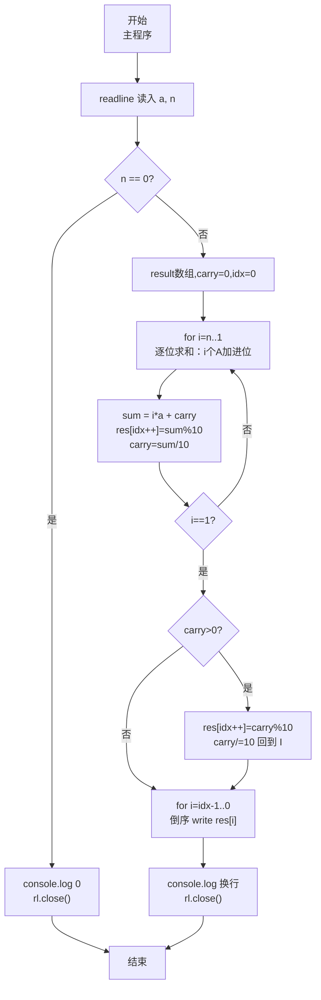
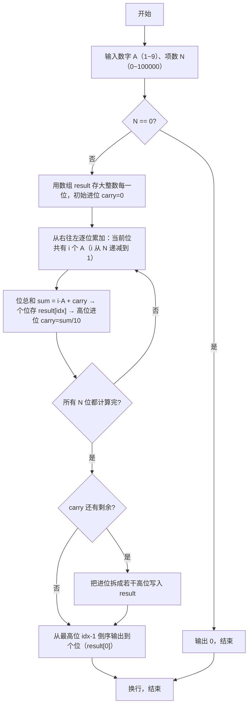

# 7-38 数列求和-加强版（JavaScript实现）

## 前言

本文是 PTA 编程题"7-38 数列求和-加强版"的题解，涵盖题目描述、输入输出格式及 JavaScript 实现，展示通过"竖式加法逐位统计进位"的大整数加法思路：共 N 项 A、AA、AAA…、AA…A（N 个 A），从右往左第 i 位上共有 i 个 A 相加，第 i 位值 = i·A + 上一步进位，模 10 记位、整除 10 作新进位；最后如果仍有进位则作为最高位，整体输出结果数组。JS 中保留 C 的数组进位模拟（用 JS 数组逐位存放大整数），避免内置数值精度不足。

本题（7-38 数列求和-加强版）的主要考点是：准确理解题意、规范处理输入输出格式，并正确处理边界与精度。下面先给出题目描述与格式要求，再通过清晰的思路与可直接运行的javascript实现代码进行讲解。

## 题目描述

给定某数字A（1≤A≤9）以及非负整数N（0≤N≤100000），求数列之和S=A+AA+AAA+⋯+AA⋯A（N个A）。例如A=1, N=3时，S=1+11+111=123。

## 输入格式

输入数字A与非负整数N。

## 输出格式

输出其N项数列之和S的值。

## 输入样例

```in
1 3
```

## 输出样例

```out
123
```

## 解题思路

这道题的核心是**竖式按位累加** + **高精度数组存结果**。因为 N 可以到 100000，总和最多是 10 万位数量级，远超 JS 内置数值的精确整数范围（±2^53 约 16 位），必须用数组逐位存结果的每一位。观察 N 项相加：
- 第 1 项（个位）有 A，在第 0 位（个位）贡献 1 个 A
- 第 2 项 AA 在第 0 位贡献 1 个 A、第 1 位贡献 1 个 A
- …
- 第 k 项（k 个 A）对第 0 位~第 k-1 位各贡献 1 个 A
- 因此：**从右往左数第 i 位（0 表示个位，i 从 1 计到 N 表示有多少项包含这一位）共有 i 个 A 相加**（或者用 i 从 N 到 1，倒着来更方便存数组）
进位计算：第 i 位总和 = i·A + 上一步 carry，当前位数字 = 总和 % 10，新进位 = 总和 / 10。循环到 i=1 之后，如果 carry>0 就把它逐位拆成高位存入。最后如果 N=0，直接输出 0。

### 核心问题分析

1. **N=0 的特殊情况**：和是 0 项相加 = 0。开头直接 `if (n === 0) { console.log(0); rl.close(); return; }`。
2. **按位求和公式**：把所有 N 项对齐右边（个位对个位），从右往左第 i 位（0 表示个位）上共有多少个 A 相加？
   - 对第 k 项（长度 k，由 k 个 A 组成），它贡献 A 到第 0 位、第 1 位、…、第 k-1 位。
   - 因此，第 i 位（0 表示个位）上 A 出现的次数 = 满足 k-1 ≥ i 的 k 的数量 = N − i（前提 i < N，否则为 0）。
   - 题目 N 最大 10 万，S 最多 10 万多位，用 JS 数组 `result` 存放足够（长度 = 位数 + 可能的进位位数）。
   - 代码实现更方便的做法：**i 从 N 递减到 1**，表示这一位共有 i 个 A 相加（个位 i=N，十位 i=N-1，…，最高位 i=1），依次写入 result[0..N-1]。以样例 A=1, N=3 验证：
     - 个位：1 + 1 + 1 = 3，共 3 个 A → i=3
     - 十位：0 + 1 + 1 = 2，共 2 个 A → i=2
     - 百位：0 + 0 + 1 = 1，共 1 个 A → i=1
     - 每次 `sum = i*a + carry` 得到当前位总和。
3. **进位处理**：
   - `result[i位对应数组下标] = sum % 10; carry = Math.trunc(sum / 10);`
   - i 循环到 1 之后，如果 carry > 0，必须不断拆分进位写入更高位：
     - 例如 N=100000、A=9，最后 carry 可能是 5 位数，要 `while(carry>0) { result[idx++]=carry%10; carry=Math.trunc(carry/10); }`
4. **输出顺序**：`result[0]` 存的是个位，数组下标越小越低位。因此输出要**从最后一个有效下标（最高位）倒序输出到 0**。
5. **例 A=1, N=3**：
   - i=3：sum=3·1+0=3 → result[0]=3，carry=0
   - i=2：sum=2·1+0=2 → result[1]=2，carry=0
   - i=1：sum=1·1+0=1 → result[2]=1，carry=0
   - 无进位，最高位是下标 2
   - 倒序输出 result[2], result[1], result[0] → 1 2 3 → 123 ✓

### 算法原理说明

1. 读 a、n；若 n=0 直接打印 0 返回
2. 初始化 `result = []`, idx=0, carry=0
3. `for (let i = n; i >= 1; i--)`：
   - sum = i*a + carry
   - result[idx++] = sum % 10
   - carry = Math.trunc(sum / 10)
4. `while (carry > 0)`：把最后剩余进位拆成若干位
   - result[idx++] = carry%10
   - carry = Math.trunc(carry / 10)
5. 从 idx-1 到 0 依次 `process.stdout.write(String(result[i]))`
6. `console.log()` 换行

### 具体计算步骤（样例 N=3, A=1）
1. n=3≠0
2. idx=0, carry=0
3. i=3：sum=3*1+0=3 → res[0]=3，carry=0，idx=1
   i=2：sum=2*1+0=2 → res[1]=2，carry=0，idx=2
   i=1：sum=1*1+0=1 → res[2]=1，carry=0，idx=3
4. carry=0，无需再拆
5. 倒序 i=2→1→0 → 1 2 3 → 输出 123

## 完整代码

```javascript
// 题目：7-38 数列求和-加强版
// 要求：实现「数列求和-加强版」（题目 7-38）的输入处理与结果输出。
// 实现原理：
//   1. N=0 的特殊情况：和是 0 项相加 = 0。开头直接 `if (n === 0) { console.log(0); rl.close(); return; }`。
//   2. 按位求和公式：把所有 N 项对齐右边（个位对个位），从右往左第 i 位（0 表示个位）上共有多少个 A 相加？
//   3. 进位处理：

const readline = require('readline'); // 引入 readline 模块
const rl = readline.createInterface({ input: process.stdin, output: process.stdout }); // 创建输入输出接口

rl.on('line', (line) => { // 监听一行输入
    const parts = line.trim().split(/\s+/);
    const a = parseInt(parts[0], 10); // 数字 A（1~9）
    const n = parseInt(parts[1], 10); // 项数 N（0≤N≤100000）

    if (n === 0) { // 特判：0 项相加和为 0
        console.log(0);
        rl.close();
        return;
    }

    // 结果最多有 n 位 + 可能的进位若干位，JS 数组长度动态增长，n≤100000 足够
    const result = []; // 结果数组：逐位存放大整数（个位在下标 0）
    let carry = 0;     // 进位变量，初值 0
    let idx = 0;       // result 数组当前写入下标（从 0 开始 = 个位 = 最低位）

    // 从右往左按"共 i 个 A 在同一列相加"的方式计算每一位
    // 个位 i = n（n 项都有个位）
    // 十位 i = n-1（最长的 n-1 项及以上都有十位）
    // ...
    // 最高列 i = 1（只有第 n 项 AA…A 这一项有这一位）
    for (let i = n; i >= 1; i--) {
        const sum = i * a + carry;        // 当前位总和：i 个 A 加上低位来的进位
        result[idx++] = sum % 10;         // 取个位数字存入当前位
        carry = Math.trunc(sum / 10);     // 其余作为进位传递到更高一位
    }

    // 循环结束后，如果最高位计算仍有进位，需要把进位拆成若干个高位写入
    while (carry > 0) {
        result[idx++] = carry % 10;       // 存进位的末位
        carry = Math.trunc(carry / 10);   // 进位去掉末位，继续传递
    }

    // 输出：result[0] 是个位，要从最后写入的位置 idx-1（最高位）倒序输出到 0
    for (let i = idx - 1; i >= 0; i--) {
        process.stdout.write(String(result[i])); // 无换行逐位输出
    }
    console.log(); // 结束换行
    rl.close();    // 关闭接口
});
```

## 代码流程说明

### 1. 输入与特判
- 第 1 行 `parseInt` 解析出 a、n
- `if (n===0) { console.log(0); rl.close(); return; }`（0 项和为 0）

### 2. 按位累加
- `const result = []; let carry=0; let idx=0;`
- `for (let i = n; i >= 1; i--)`：
  - `sum = i*a + carry;`
  - `result[idx++] = sum%10;`
  - `carry = Math.trunc(sum/10);`

### 3. 处理剩余进位
- `while (carry > 0)`：
  - `result[idx++] = carry%10;`
  - `carry = Math.trunc(carry/10);`

### 4. 倒序输出
- `for (let i = idx-1; i >= 0; i--) process.stdout.write(String(result[i]));`
- `console.log();`

### 5. 结束
- `rl.close()` 关闭接口

## 代码流程图



## 解题流程图



## 代码解析

### 输入与特判

```javascript
const readline = require('readline'); // 引入 readline 模块
const rl = readline.createInterface({ input: process.stdin, output: process.stdout }); // 创建输入输出接口
```

输入与特判

### 按位累加

```javascript
rl.on('line', (line) => { // 监听一行输入
    const parts = line.trim().split(/\s+/);
    const a = parseInt(parts[0], 10); // 数字 A（1~9）
    const n = parseInt(parts[1], 10); // 项数 N（0≤N≤100000）
```

按位累加

### 处理剩余进位

```javascript
if (n === 0) { // 特判：0 项相加和为 0
        console.log(0);
        rl.close();
        return;
    }
```

处理剩余进位

### 倒序输出

```javascript
// 结果最多有 n 位 + 可能的进位若干位，JS 数组长度动态增长，n≤100000 足够
    const result = []; // 结果数组：逐位存放大整数（个位在下标 0）
    let carry = 0;     // 进位变量，初值 0
    let idx = 0;       // result 数组当前写入下标（从 0 开始 = 个位 = 最低位）
```

倒序输出

### 结束

```javascript
// 从右往左按"共 i 个 A 在同一列相加"的方式计算每一位
    // 个位 i = n（n 项都有个位）
    // 十位 i = n-1（最长的 n-1 项及以上都有十位）
    // ...
    // 最高列 i = 1（只有第 n 项 AA…A 这一项有这一位）
    for (let i = n; i >= 1; i--) {
        const sum = i * a + carry;        // 当前位总和：i 个 A 加上低位来的进位
        result[idx++] = sum % 10;         // 取个位数字存入当前位
        carry = Math.trunc(sum / 10);     // 其余作为进位传递到更高一位
    }
```

结束


## 复杂度分析

设输入规模为 $n$（对数值类题目为参与运算的数据量，对字符串/序列类题目为长度）。

- **时间复杂度**：$O(n)$ 或 $O(n \log n)$，主要来自一次线性遍历与常数次数学运算，无嵌套高复杂度循环。
- **空间复杂度**：$O(n)$，用于存储输入、中间结果与输出字符串；若仅使用若干标量变量则为 $O(1)$。

## 常见易错点

### 1. 输入/输出格式不符
错误：多余空格、遗漏换行、大小写或精度不符。后果：判题系统判为格式错误。正确：严格按题目要求的格式输出，数值用合适精度。

### 2. 边界条件遗漏
错误：未处理 0、最小值、单字符或空输入等边界。后果：特例 WA。正确：先列出所有边界样例，在编码前单独分支处理。

### 3. 整数溢出与类型
错误：使用过小的整数类型或忽略负号。后果：大数计算溢出。正确：按数据范围选择合适类型，必要时用更大整数类型或字符串处理。

## 更多测试

### 测试一：常规边界

**输入：**

```text
（可取题目边界附近的值，如最小值或最大值）
```

**输出：**

```text
（依据题意推导的正确结果）
```

### 测试二：特殊用例

**输入：**

```text
（可取易错点，如 0、单一元素、全同值等）
```

**输出：**

```text
（对应正确结果）
```

## 总结

本文是 PTA 编程题"7-38 数列求和-加强版"的题解，涵盖题目描述、输入输出格式及 JavaScript 实现，展示通过"竖式加法逐位统计进位"的大整数加法思路：共 N 项 A、AA、AAA…、AA…A（N 个 A），从右往左第 i 位上共有 i 个 A 相加，第 i 位值 = i·A + 上一步进位，模 10 记位、整除 10 作新进位；最后如果仍有进位则作为最高位，整体输出结果数组。JS 中保留 C 的数组进位模拟（用 JS 数组逐位存放大整数），避免内置数值精度不足。

本题的核心在于理清「数列求和-加强版」的输入输出关系与边界处理：先按格式读取输入，再依据规则逐步计算或遍历，最后按规范输出。该思路可迁移到同类格式化输入输出与模拟计算的题目。
