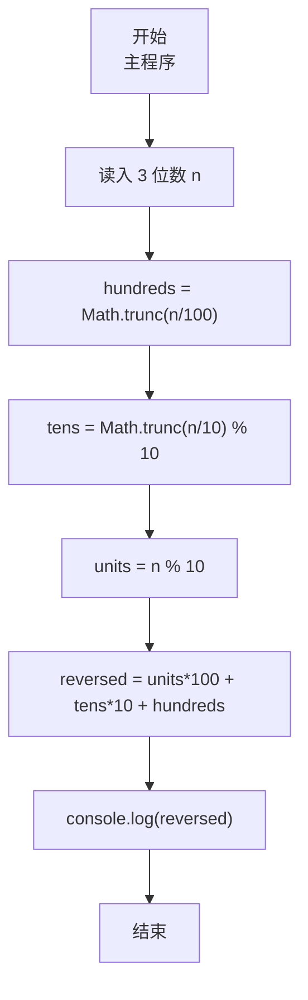
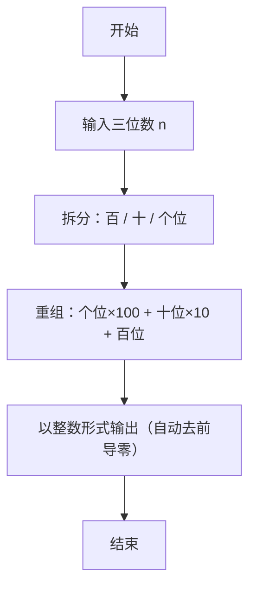

# 7-3 逆序的三位数（JavaScript实现）

## 前言

本文是 PTA 编程题“7-3 逆序的三位数”的题解，涵盖题目描述、输入输出格式及 JavaScript 实现，展示百位/十位/个位数字拆分与逆序重组，并自然消除前导零的方法。

本题（7-3 逆序的三位数）的主要考点是：准确理解题意、规范处理输入输出格式，并正确处理边界与精度。下面先给出题目描述与格式要求，再通过清晰的思路与可直接运行的javascript实现代码进行讲解。

## 题目描述

程序每次读入一个正3位数，然后输出按位逆序的数字。注意：当输入的数字含有结尾的0时，输出不应带有前导的0。比如输入700，输出应该是7。

## 输入格式

每个测试是一个3位的正整数。

## 输出格式

输出按位逆序的数。

## 输入样例

```in
123
```

## 输出样例

```out
321
```

## 解题思路

这道题的核心是**三位数的数位拆分 + 按位倒序重组**。

### 核心问题分析

1. **数位拆分**：一个 3 位整数 n：
   - 百位 = n / 100（整数除法）
   - 十位 = (n / 10) % 10
   - 个位 = n % 10
2. **逆序重组**：新数 = 个位×100 + 十位×10 + 百位。因为结果是数值，用 console.log 输出时自动不带前导零——完美符合"输出不应有前导 0"的要求。

### 算法原理说明

直接按公式拆分重组：
- hundreds = Math.trunc(n / 100)
- tens = Math.trunc(n / 10) % 10
- units = n % 10
- reversed = units*100 + tens*10 + hundreds
- console.log(reversed)

### 具体计算步骤

1. 读入 n（保证 3 位正整数）
2. hundreds = Math.trunc(n / 100)
3. tens = Math.trunc(n / 10) % 10
4. units = n % 10
5. reversed = units*100 + tens*10 + hundreds
6. console.log(reversed)

## 完整代码

```javascript
// 题目：7-3 逆序的三位数
// 要求：实现「逆序的三位数」（题目 7-3）的输入处理与结果输出。
// 实现原理：
//   1. 数位拆分：一个 3 位整数 n：
//   2. 逆序重组：新数 = 个位×100 + 十位×10 + 百位。因为结果是数值，用 console.log 输出时自动不带前导零——完美符合"输出不应有前导 0"的要求。
//   3. 读入 n（保证 3 位正整数）

const readline = require('readline'); // 引入 readline 模块
const rl = readline.createInterface({ input: process.stdin, output: process.stdout }); // 创建输入输出接口

rl.on('line', (line) => { // 监听一行输入
    const n = parseInt(line.trim(), 10); // 读入一个三位数

    const hundreds = Math.trunc(n / 100); // 提取百位数字
    const tens = Math.trunc(n / 10) % 10; // 提取十位数字
    const units = n % 10; // 提取个位数字
    const reversed = units * 100 + tens * 10 + hundreds; // 按位逆序组成新数

    console.log(reversed); // 输出逆序后的结果（数值输出自动不带前导零）

    rl.close(); // 关闭接口
});
```

## 代码流程说明

### 1. 变量声明 & 读取输入
- `n` 接收 3 位整数；用 readline 读取一行、parseInt 解析

### 2. 数位拆分
- hundreds = Math.trunc(n / 100)：仅保留百位
- tens = Math.trunc(n / 10) % 10：去掉个位后再取模得到十位
- units = n % 10：直接取个位

### 3. 逆序重组
- reversed = units*100 + tens*10 + hundreds：把"原个位"放到新百位，"原十位"保持十位，"原百位"放到新个位

### 4. 输出
- console.log(reversed)：数值输出自动去掉前导零，完美处理如 700→7 的情形

## 代码流程图



## 解题流程图



## 代码解析

### 变量声明 & 读取输入

```javascript
const readline = require('readline'); // 引入 readline 模块
const rl = readline.createInterface({ input: process.stdin, output: process.stdout }); // 创建输入输出接口
```

变量声明 & 读取输入

### 数位拆分

```javascript
rl.on('line', (line) => { // 监听一行输入
    const n = parseInt(line.trim(), 10); // 读入一个三位数
```

数位拆分

### 逆序重组

```javascript
const hundreds = Math.trunc(n / 100); // 提取百位数字
    const tens = Math.trunc(n / 10) % 10; // 提取十位数字
    const units = n % 10; // 提取个位数字
    const reversed = units * 100 + tens * 10 + hundreds; // 按位逆序组成新数
```

逆序重组

### 输出

```javascript
console.log(reversed); // 输出逆序后的结果（数值输出自动不带前导零）
```

输出


## 复杂度分析

设输入规模为 $n$（对数值类题目为参与运算的数据量，对字符串/序列类题目为长度）。

- **时间复杂度**：$O(n)$ 或 $O(n \log n)$，主要来自一次线性遍历与常数次数学运算，无嵌套高复杂度循环。
- **空间复杂度**：$O(n)$，用于存储输入、中间结果与输出字符串；若仅使用若干标量变量则为 $O(1)$。

## 常见易错点

### 1. 输入/输出格式不符
错误：多余空格、遗漏换行、大小写或精度不符。后果：判题系统判为格式错误。正确：严格按题目要求的格式输出，数值用合适精度。

### 2. 边界条件遗漏
错误：未处理 0、最小值、单字符或空输入等边界。后果：特例 WA。正确：先列出所有边界样例，在编码前单独分支处理。

### 3. 整数溢出与类型
错误：使用过小的整数类型或忽略负号。后果：大数计算溢出。正确：按数据范围选择合适类型，必要时用更大整数类型或字符串处理。

## 更多测试

### 测试一：常规边界

**输入：**

```text
100
```

**输出：**

```text
1
```

### 测试二：特殊用例

**输入：**

```text
907
```

**输出：**

```text
709
```

## 总结

本文是 PTA 编程题“7-3 逆序的三位数”的题解，涵盖题目描述、输入输出格式及 JavaScript 实现，展示百位/十位/个位数字拆分与逆序重组，并自然消除前导零的方法。

本题的核心在于理清「逆序的三位数」的输入输出关系与边界处理：先按格式读取输入，再依据规则逐步计算或遍历，最后按规范输出。该思路可迁移到同类格式化输入输出与模拟计算的题目。
