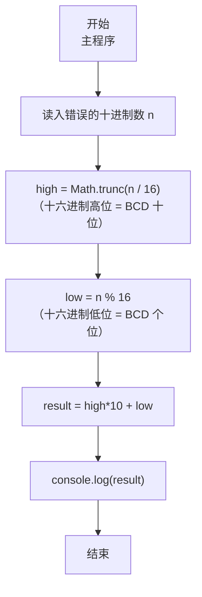
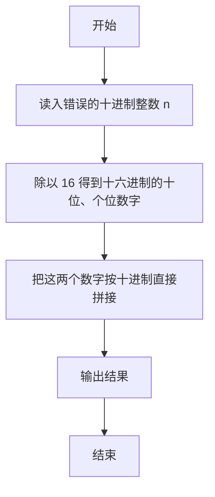

# 7-4 BCD解密（JavaScript实现）

## 前言

本文是 PTA 编程题“7-4 BCD 解密”的题解，涵盖题目描述、输入输出格式及 JavaScript 实现，展示把"被误当成二进制解析的十进制整数"还原回正确 BCD 表示的思路。

本题（7-4 BCD解密）的主要考点是：准确理解题意、规范处理输入输出格式，并正确处理边界与精度。下面先给出题目描述与格式要求，再通过清晰的思路与可直接运行的javascript实现代码进行讲解。

## 题目描述

BCD数是用一个字节来表达两位十进制的数，每四个比特表示一位。所以如果一个BCD数的十六进制是0x12，它表达的就是十进制的12。但是小明没学过BCD，把所有的BCD数都当作二进制数转换成十进制输出了。于是BCD的0x12被输出成了十进制的18了！

现在，你的程序要读入这个错误的十进制数，然后输出正确的十进制数。提示：你可以把18转换回0x12，然后再转换回12。

## 输入格式

输入在一行中给出一个[0, 153]范围内的正整数，保证能转换回有效的BCD数，也就是说这个整数转换成十六进制时不会出现A-F的数字。

## 输出格式

输出对应的十进制数。

## 输入样例

```in
18
```

## 输出样例

```out
12
```

## 解题思路

这道题的核心是**把"错误的十进制结果"重新当成"十六进制表示"去解析**，再把得到的两位（十位数、个位数）按十进制规则组合。

### 核心问题分析

以样例来说：
- 正确的 BCD 字节是 0x12（十六进制），它的含义是"十进制 12"
- 小明把 0x12 当成普通二进制整数解析：1×16+2 = 18，这就是输入值
- 解密操作反过来：输入 18（十进制）就是 0x12，把"十六进制的十位（高4位）=1，十六进制的个位（低4位）=2"直接当成十进制的十位数和个位数 → 12。

### 算法原理说明

利用 16 进制和 10 进制的类比：
- high_digit = Math.trunc(n / 16)：得到十六进制的高位（等价于 BCD 高 4 位）
- low_digit = n % 16：得到十六进制的低位（等价于 BCD 低 4 位）
- result = high_digit × 10 + low_digit（题目保证 high、low 都在 0~9）

### 具体计算步骤

1. 读入整数 n
2. high_digit = Math.trunc(n / 16)（取"十六进制的十位"）
3. low_digit = n % 16（取"十六进制的个位"）
4. result = high_digit * 10 + low_digit
5. console.log(result)

## 完整代码

```javascript
// 题目：7-4 BCD解密
// 要求：实现「BCD解密」（题目 7-4）的输入处理与结果输出。
// 实现原理：
//   1. 读入整数 n
//   2. high_digit = Math.trunc(n / 16)（取"十六进制的十位"）
//   3. low_digit = n % 16（取"十六进制的个位"）

const readline = require('readline'); // 引入 readline 模块
const rl = readline.createInterface({ input: process.stdin, output: process.stdout }); // 创建输入输出接口

rl.on('line', (line) => { // 监听一行输入
    const n = parseInt(line.trim(), 10); // 读入"错误的十进制数"

    // 分离十六进制的高4位（十位）和低4位（个位）
    const high_digit = Math.trunc(n / 16); // 获取十六进制高位（0-9）
    const low_digit = n % 16; // 获取十六进制低位（0-9）

    // 组合成正确的十进制数
    const result = high_digit * 10 + low_digit;

    console.log(result); // 输出正确的十进制数
    rl.close(); // 关闭接口
});
```

## 代码流程说明

### 1. 变量与输入
- `n`：存读入的"错误十进制数"；用 readline 读取、parseInt 解析

### 2. 拆分"十六进制的两位"
- high_digit = Math.trunc(n / 16)：除以 16 的商 = 十六进制高位数字（等价 BCD 的十位部分）
- low_digit = n % 16：除以 16 的余数 = 十六进制低位数字（等价 BCD 的个位部分）

### 3. 组合为正确十进制
- result = high_digit × 10 + low_digit：把十六进制的两位直接当成十进制的两位读取

### 4. 输出
- console.log(result)

## 代码流程图



## 解题流程图



## 代码解析

### 变量与输入

```javascript
const readline = require('readline'); // 引入 readline 模块
const rl = readline.createInterface({ input: process.stdin, output: process.stdout }); // 创建输入输出接口
```

变量与输入

### 拆分"十六进制的两位"

```javascript
rl.on('line', (line) => { // 监听一行输入
    const n = parseInt(line.trim(), 10); // 读入"错误的十进制数"
```

拆分"十六进制的两位"

### 组合为正确十进制

```javascript
// 分离十六进制的高4位（十位）和低4位（个位）
    const high_digit = Math.trunc(n / 16); // 获取十六进制高位（0-9）
    const low_digit = n % 16; // 获取十六进制低位（0-9）
```

组合为正确十进制

### 输出

```javascript
// 组合成正确的十进制数
    const result = high_digit * 10 + low_digit;
```

输出


## 复杂度分析

设输入规模为 $n$（对数值类题目为参与运算的数据量，对字符串/序列类题目为长度）。

- **时间复杂度**：$O(n)$ 或 $O(n \log n)$，主要来自一次线性遍历与常数次数学运算，无嵌套高复杂度循环。
- **空间复杂度**：$O(n)$，用于存储输入、中间结果与输出字符串；若仅使用若干标量变量则为 $O(1)$。

## 常见易错点

### 1. 输入/输出格式不符
错误：多余空格、遗漏换行、大小写或精度不符。后果：判题系统判为格式错误。正确：严格按题目要求的格式输出，数值用合适精度。

### 2. 边界条件遗漏
错误：未处理 0、最小值、单字符或空输入等边界。后果：特例 WA。正确：先列出所有边界样例，在编码前单独分支处理。

### 3. 整数溢出与类型
错误：使用过小的整数类型或忽略负号。后果：大数计算溢出。正确：按数据范围选择合适类型，必要时用更大整数类型或字符串处理。

## 更多测试

### 测试一：常规边界

**输入：**

```text
0
```

**输出：**

```text
0
```

### 测试二：特殊用例

**输入：**

```text
153
```

**输出：**

```text
99
```

## 总结

本文是 PTA 编程题“7-4 BCD 解密”的题解，涵盖题目描述、输入输出格式及 JavaScript 实现，展示把"被误当成二进制解析的十进制整数"还原回正确 BCD 表示的思路。

本题的核心在于理清「BCD解密」的输入输出关系与边界处理：先按格式读取输入，再依据规则逐步计算或遍历，最后按规范输出。该思路可迁移到同类格式化输入输出与模拟计算的题目。
