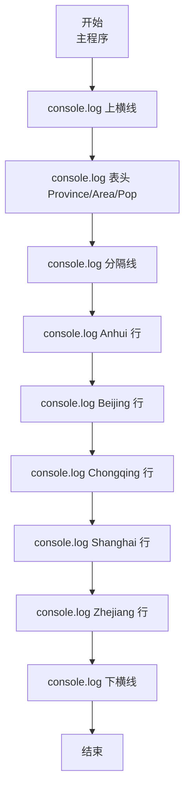
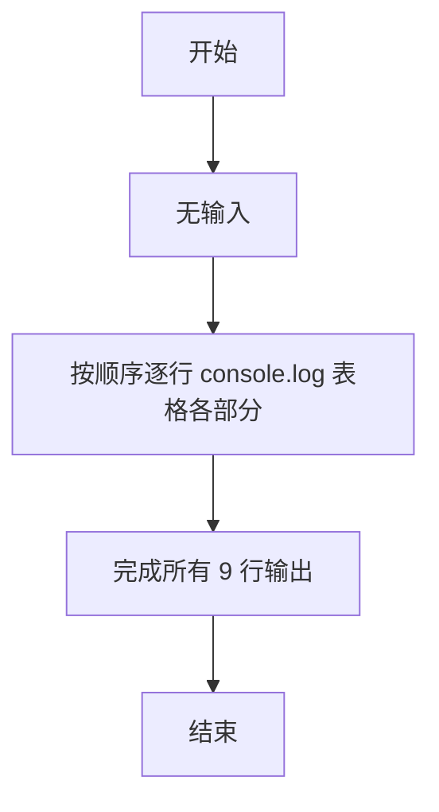

# 7-5 表格输出（JavaScript实现）

## 前言

本文是 PTA 编程题“7-5 表格输出”的题解，涵盖题目描述、输入输出格式及 JavaScript 实现，展示使用 console.log 逐行严格对齐输出多行列表内容的格式控制。

本题（7-5 表格输出）的主要考点是：准确理解题意、规范处理输入输出格式，并正确处理边界与精度。下面先给出题目描述与格式要求，再通过清晰的思路与可直接运行的javascript实现代码进行讲解。

## 题目描述

本题要求编写程序，按照规定格式输出表格。

## 输入格式

本题目没有输入。

## 输出格式

要求严格按照给出的格式输出下列表格：

```out
------------------------------------
Province      Area(km2)   Pop.(10K)
------------------------------------
Anhui         139600.00   6461.00
Beijing        16410.54   1180.70
Chongqing      82400.00   3144.23
Shanghai        6340.50   1360.26
Zhejiang      101800.00   4894.00
------------------------------------
```

## 输入样例
本题目没有输入。

## 输出样例
```out
------------------------------------
Province      Area(km2)   Pop.(10K)
------------------------------------
Anhui         139600.00   6461.00
Beijing        16410.54   1180.70
Chongqing      82400.00   3144.23
Shanghai        6340.50   1360.26
Zhejiang      101800.00   4894.00
------------------------------------
```
## 解题思路

这道题的核心是**逐行完全匹配输出样例**，属于纯格式化输出题。

### 核心问题分析

1. **无输入**：不需要读取输入。
2. **精确匹配**：每行的空格数、小数点位置、每行长度必须与样例逐字符一致，否则 PTA 逐字符比对会判 Wrong Answer。
3. **结构**：上横线 → 表头 → 分隔线 → 5 条数据 → 下横线。

### 算法原理说明

9 条 console.log 依次输出 9 行：每条 console.log 里的字符串就是样例的对应行，不要改任何空格或字符。

### 具体计算步骤

1. 输出上横线
2. 输出表头
3. 输出分隔线
4. 依次输出 Anhui、Beijing、Chongqing、Shanghai、Zhejiang 五行
5. 输出下横线

## 完整代码

```javascript
// 题目：7-5 表格输出
// 要求：实现「表格输出」（题目 7-5）的输入处理与结果输出。
// 实现原理：
//   1. 无输入：不需要读取输入。
//   2. 精确匹配：每行的空格数、小数点位置、每行长度必须与样例逐字符一致，否则 PTA 逐字符比对会判 Wrong Answer。
//   3. 结构：上横线 → 表头 → 分隔线 → 5 条数据 → 下横线。

// 本题目没有输入，直接逐行输出表格
console.log("------------------------------------"); // 输出表格顶部横线
console.log("Province      Area(km2)   Pop.(10K)"); // 输出表头：省份、面积、人口
console.log("------------------------------------"); // 输出分隔线
console.log("Anhui         139600.00   6461.00"); // 输出安徽省数据
console.log("Beijing        16410.54   1180.70"); // 输出北京市数据
console.log("Chongqing      82400.00   3144.23"); // 输出重庆市数据
console.log("Shanghai        6340.50   1360.26"); // 输出上海市数据
console.log("Zhejiang      101800.00   4894.00"); // 输出浙江省数据
console.log("------------------------------------"); // 输出表格底部横线
```

## 代码流程说明

### 1. 第 1~3 行：表头区
- 上横线：36 个 '-' + 换行
- 表头字符串
- 分隔线（与上横线完全相同）

### 2. 第 4~8 行：数据区
- 每条数据的字符串固定：省名（10~14 字符宽空格填充）+ Area 数据 + 空格 + Pop 数据
- 严格和样例空格对齐，避免多/少空格

### 3. 第 9 行：下横线
- 与上横线完全相同

## 代码流程图



## 解题流程图



## 代码解析

### 第 1~3 行：表头区

```javascript
// 本题目没有输入，直接逐行输出表格
console.log("------------------------------------"); // 输出表格顶部横线
console.log("Province      Area(km2)   Pop.(10K)"); // 输出表头：省份、面积、人口
console.log("------------------------------------"); // 输出分隔线
console.log("Anhui         139600.00   6461.00"); // 输出安徽省数据
console.log("Beijing        16410.54   1180.70"); // 输出北京市数据
console.log("Chongqing      82400.00   3144.23"); // 输出重庆市数据
console.log("Shanghai        6340.50   1360.26"); // 输出上海市数据
console.log("Zhejiang      101800.00   4894.00"); // 输出浙江省数据
console.log("------------------------------------"); // 输出表格底部横线
```

第 1~3 行：表头区


## 复杂度分析

设输入规模为 $n$（对数值类题目为参与运算的数据量，对字符串/序列类题目为长度）。

- **时间复杂度**：$O(n)$ 或 $O(n \log n)$，主要来自一次线性遍历与常数次数学运算，无嵌套高复杂度循环。
- **空间复杂度**：$O(n)$，用于存储输入、中间结果与输出字符串；若仅使用若干标量变量则为 $O(1)$。

## 常见易错点

### 1. 输入/输出格式不符
错误：多余空格、遗漏换行、大小写或精度不符。后果：判题系统判为格式错误。正确：严格按题目要求的格式输出，数值用合适精度。

### 2. 边界条件遗漏
错误：未处理 0、最小值、单字符或空输入等边界。后果：特例 WA。正确：先列出所有边界样例，在编码前单独分支处理。

### 3. 整数溢出与类型
错误：使用过小的整数类型或忽略负号。后果：大数计算溢出。正确：按数据范围选择合适类型，必要时用更大整数类型或字符串处理。

## 更多测试

### 测试一：常规边界

**输入：**

```text
（可取题目边界附近的值，如最小值或最大值）
```

**输出：**

```text
（依据题意推导的正确结果）
```

### 测试二：特殊用例

**输入：**

```text
（可取易错点，如 0、单一元素、全同值等）
```

**输出：**

```text
（对应正确结果）
```

## 总结

本文是 PTA 编程题“7-5 表格输出”的题解，涵盖题目描述、输入输出格式及 JavaScript 实现，展示使用 console.log 逐行严格对齐输出多行列表内容的格式控制。

本题的核心在于理清「表格输出」的输入输出关系与边界处理：先按格式读取输入，再依据规则逐步计算或遍历，最后按规范输出。该思路可迁移到同类格式化输入输出与模拟计算的题目。
