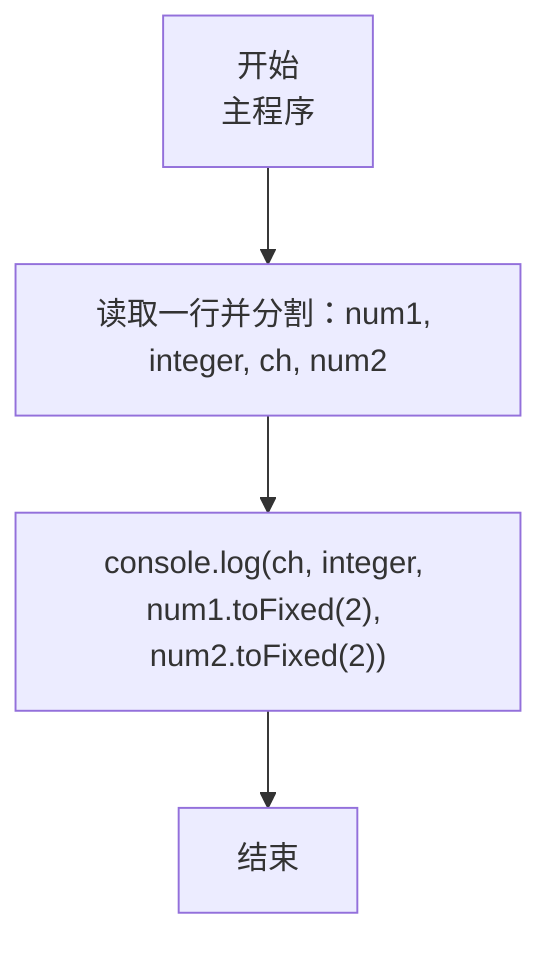
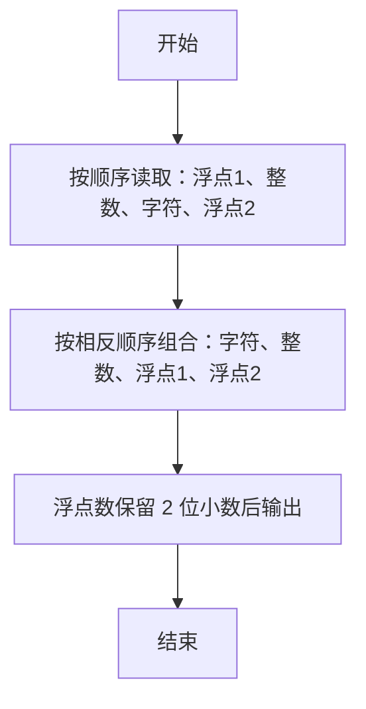

# 7-6 混合类型数据格式化输入（JavaScript实现）

## 前言

本文是 PTA 编程题“7-6 混合类型数据格式化输入”的题解，涵盖题目描述、输入输出格式及 JavaScript 实现，展示按格式读取不同类型数据、再按指定顺序与小数位输出的方法。

本题（7-6 混合类型数据格式化输入）的主要考点是：准确理解题意、规范处理输入输出格式，并正确处理边界与精度。下面先给出题目描述与格式要求，再通过清晰的思路与可直接运行的javascript实现代码进行讲解。

## 题目描述

本题要求编写程序，顺序读入浮点数1、整数、字符、浮点数2，再按照字符、整数、浮点数1、浮点数2的顺序输出。

## 输入格式

输入在一行中顺序给出浮点数1、整数、字符、浮点数2，其间以1个空格分隔。

## 输出格式

在一行中按照字符、整数、浮点数1、浮点数2的顺序输出，其中浮点数保留小数点后2位。

## 输入样例

```in
2.12 88 c 4.7
```

## 输出样例

```out
c 88 2.12 4.70
```

## 解题思路

这道题的核心是**按格式读取不同类型数据 + 按指定顺序与精度格式化输出**。

### 核心问题分析

1. **类型对应**：输入 4 个数据依次是 double、int、char、double → 分别用 parseFloat、parseInt 解析，字符就是分割后的字符串。
2. **按空格分割**：`split(/\s+/)` 按空格把一行拆成 4 个字符串，分隔空格被自然去掉，不存在 C 语言 scanf 对 %c 的空白陷阱。
3. **输出精度**：两个浮点数都用 toFixed(2) 强制保留两位小数（如 4.7 → 4.70）。

### 算法原理说明

顺序读入 → 换序输出：
- 读：num1 = parseFloat(第1段), integer = parseInt(第2段), ch = 第3段, num2 = parseFloat(第4段)
- 打：console.log(`${ch} ${integer} ${num1.toFixed(2)} ${num2.toFixed(2)}`)

### 具体计算步骤

1. 用 readline 读取一行，按空格分割成 4 个字符串
2. num1 = parseFloat(parts[0]), integer = parseInt(parts[1]), ch = parts[2], num2 = parseFloat(parts[3])
3. console.log(`${ch} ${integer} ${num1.toFixed(2)} ${num2.toFixed(2)}`)

## 完整代码

```javascript
// 题目：7-6 混合类型数据格式化输入
// 要求：实现「混合类型数据格式化输入」（题目 7-6）的输入处理与结果输出。
// 实现原理：
//   1. 类型对应：输入 4 个数据依次是 double、int、char、double → 分别用 parseFloat、parseInt 解析，字符就是分割后的字符串。
//   2. 按空格分割：`split(/\s+/)` 按空格把一行拆成 4 个字符串，分隔空格被自然去掉，不存在 C 语言 scanf 对 %c 的空白陷阱。
//   3. 输出精度：两个浮点数都用 toFixed(2) 强制保留两位小数（如 4.7 → 4.70）。

const readline = require('readline'); // 引入 readline 模块
const rl = readline.createInterface({ input: process.stdin, output: process.stdout }); // 创建输入输出接口

rl.on('line', (line) => { // 监听一行输入
    const parts = line.trim().split(/\s+/); // 按空格分割出浮点数1、整数、字符、浮点数2
    const num1 = parseFloat(parts[0]); // 浮点数1
    const integer = parseInt(parts[1], 10); // 整数
    const ch = parts[2]; // 字符
    const num2 = parseFloat(parts[3]); // 浮点数2

    // 按字符、整数、浮点数1、浮点数2的顺序输出，浮点数保留2位小数
    console.log(`${ch} ${integer} ${num1.toFixed(2)} ${num2.toFixed(2)}`);
    rl.close(); // 关闭接口
});
```

## 代码流程说明

### 1. 变量声明
- num1, num2：两个浮点数（parseFloat 解析）
- integer：整数（parseInt 解析）
- ch：字符（分割后的字符串）

### 2. 读取输入
- 用 readline 读取一行，split(/\s+/) 按空格分割，直接得到 4 个字符串，不存在 scanf 的 %c 空白问题。

### 3. 输出（换序 + 精度）
- 顺序改为 ch、integer、num1、num2
- num1.toFixed(2)、num2.toFixed(2) → 保留两位小数（不足补零）

## 代码流程图



## 解题流程图



## 代码解析

### 变量声明

```javascript
const readline = require('readline'); // 引入 readline 模块
const rl = readline.createInterface({ input: process.stdin, output: process.stdout }); // 创建输入输出接口
```

变量声明

### 读取输入

```javascript
rl.on('line', (line) => { // 监听一行输入
    const parts = line.trim().split(/\s+/); // 按空格分割出浮点数1、整数、字符、浮点数2
    const num1 = parseFloat(parts[0]); // 浮点数1
    const integer = parseInt(parts[1], 10); // 整数
    const ch = parts[2]; // 字符
    const num2 = parseFloat(parts[3]); // 浮点数2
```

读取输入

### 输出

```javascript
// 按字符、整数、浮点数1、浮点数2的顺序输出，浮点数保留2位小数
    console.log(`${ch} ${integer} ${num1.toFixed(2)} ${num2.toFixed(2)}`);
    rl.close(); // 关闭接口
});
```

输出（换序 + 精度）


## 复杂度分析

设输入规模为 $n$（对数值类题目为参与运算的数据量，对字符串/序列类题目为长度）。

- **时间复杂度**：$O(n)$ 或 $O(n \log n)$，主要来自一次线性遍历与常数次数学运算，无嵌套高复杂度循环。
- **空间复杂度**：$O(n)$，用于存储输入、中间结果与输出字符串；若仅使用若干标量变量则为 $O(1)$。

## 常见易错点

### 1. 输入/输出格式不符
错误：多余空格、遗漏换行、大小写或精度不符。后果：判题系统判为格式错误。正确：严格按题目要求的格式输出，数值用合适精度。

### 2. 边界条件遗漏
错误：未处理 0、最小值、单字符或空输入等边界。后果：特例 WA。正确：先列出所有边界样例，在编码前单独分支处理。

### 3. 整数溢出与类型
错误：使用过小的整数类型或忽略负号。后果：大数计算溢出。正确：按数据范围选择合适类型，必要时用更大整数类型或字符串处理。

## 更多测试

### 测试一：常规边界

**输入：**

```text
0 0 a 0
```

**输出：**

```text
a 0 0.00 0.00
```

### 测试二：特殊用例

**输入：**

```text
-3.5 -8 Z 12
```

**输出：**

```text
Z -8 -3.50 12.00
```

## 总结

本文是 PTA 编程题“7-6 混合类型数据格式化输入”的题解，涵盖题目描述、输入输出格式及 JavaScript 实现，展示按格式读取不同类型数据、再按指定顺序与小数位输出的方法。

本题的核心在于理清「混合类型数据格式化输入」的输入输出关系与边界处理：先按格式读取输入，再依据规则逐步计算或遍历，最后按规范输出。该思路可迁移到同类格式化输入输出与模拟计算的题目。
