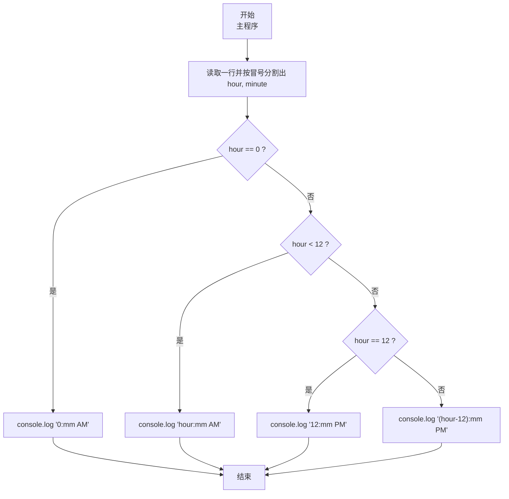
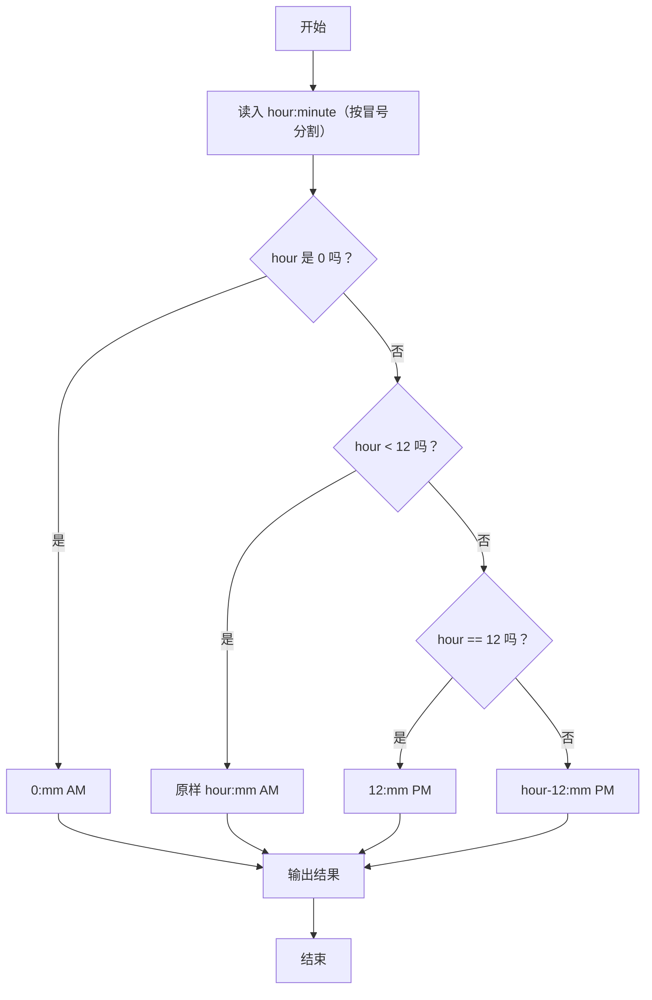

# 7-7 12-24小时制（JavaScript实现）

## 前言

本文是 PTA 编程题“7-7 12-24 小时制”的题解，涵盖题目描述、输入输出格式及 JavaScript 实现，展示带冒号分隔的时间读取与 24 小时制到 12 小时制加 AM/PM 的分支转换。

本题（7-7 12-24小时制）的主要考点是：准确理解题意、规范处理输入输出格式，并正确处理边界与精度。下面先给出题目描述与格式要求，再通过清晰的思路与可直接运行的javascript实现代码进行讲解。

## 题目描述

编写一个程序，要求用户输入24小时制的时间，然后显示12小时制的时间。

## 输入格式

输入在一行中给出带有中间的:符号（半角的冒号）的24小时制的时间，如12:34表示12点34分。当小时或分钟数小于10时，均没有前导的零，如5:6表示5点零6分。

提示：在scanf的格式字符串中加入:，让scanf来处理这个冒号。

## 输出格式

在一行中输出这个时间对应的12小时制的时间，数字部分格式与输入的相同，然后跟上空格，再跟上表示上午的字符串AM或表示下午的字符串PM。如5:6 PM表示下午5点零6分。注意，在英文的习惯中，中午12点被认为是下午，所以24小时制的12:00就是12小时制的12:0 PM；而0点被认为是第二天的时间，所以是0:0 AM。

## 输入样例

```in
21:11
```

## 输出样例

```out
9:11 PM
```

## 解题思路

这道题的核心是**按冒号拆分 24 小时制时间，并按小时范围分情况转换为 12 小时制 + AM/PM**。

### 核心问题分析

对应关系（按 24 制小时范围）：
- hour == 0 → 0:mm AM（如 0:30 AM）
- 1 <= hour <= 11 → hour:mm AM（如 5:6 AM）
- hour == 12 → 12:mm PM（中午 12 点归下午）
- 13 <= hour <= 23 → (hour-12):mm PM（如 21:11 → 9:11 PM）

### 算法原理说明

用 readline 读取一行后按冒号 `:` 分割，parseInt 解析出 hour 和 minute。然后按上面的 4 条分支分别 console.log 对应结果。

### 具体计算步骤

1. 读取一行，按冒号分割并 parseInt 解析出 hour、minute
2. 按 hour 分支：
   - hour==0 → `0:${minute} AM`
   - hour<12 → `${hour}:${minute} AM`
   - hour==12 → `12:${minute} PM`
   - 其它 → `${hour - 12}:${minute} PM`

## 完整代码

```javascript
// 题目：7-7 12-24小时制
// 要求：实现「12-24小时制」（题目 7-7）的输入处理与结果输出。
// 实现原理：
//   1. 读取一行，按冒号分割并 parseInt 解析出 hour、minute
//   2. 按 hour 分支：
//   3. 见下方代码与流程说明

const readline = require('readline'); // 引入 readline 模块
const rl = readline.createInterface({ input: process.stdin, output: process.stdout }); // 创建输入输出接口

rl.on('line', (line) => { // 监听一行输入
    // 用冒号分割读取小时和分钟
    const [hourStr, minuteStr] = line.trim().split(':');
    const hour = parseInt(hourStr, 10); // 小时
    const minute = parseInt(minuteStr, 10); // 分钟

    // 处理时间转换逻辑
    if (hour === 0) {
        console.log(`0:${minute} AM`);
    } else if (hour < 12) {
        console.log(`${hour}:${minute} AM`);
    } else if (hour === 12) {
        console.log(`12:${minute} PM`);
    } else { // hour 13-23
        console.log(`${hour - 12}:${minute} PM`);
    }

    rl.close(); // 关闭接口
});
```

## 代码流程说明

### 1. 读取输入（含冒号）
- 用 readline 读取一行，split(':') 按冒号分割，parseInt 解析出 hour、minute，不需要处理格式串。

### 2. 按 hour 值分 4 支输出
- **分支 1 hour==0** → 0:mm AM（凌晨零点）
- **分支 2 1≤hour≤11** → 原样 hour:mm AM（上午）
- **分支 3 hour==12** → 12:mm PM（正午归下午）
- **分支 4 13≤hour≤23** → (hour-12):mm PM（下午小时减 12）

## 代码流程图



## 解题流程图



## 代码解析

### 读取输入

```javascript
const readline = require('readline'); // 引入 readline 模块
const rl = readline.createInterface({ input: process.stdin, output: process.stdout }); // 创建输入输出接口
```

读取输入（含冒号）

### 按 hour 值分 4 支输出

```javascript
rl.on('line', (line) => { // 监听一行输入
    // 用冒号分割读取小时和分钟
    const [hourStr, minuteStr] = line.trim().split(':');
    const hour = parseInt(hourStr, 10); // 小时
    const minute = parseInt(minuteStr, 10); // 分钟
```

按 hour 值分 4 支输出


## 复杂度分析

设输入规模为 $n$（对数值类题目为参与运算的数据量，对字符串/序列类题目为长度）。

- **时间复杂度**：$O(n)$ 或 $O(n \log n)$，主要来自一次线性遍历与常数次数学运算，无嵌套高复杂度循环。
- **空间复杂度**：$O(n)$，用于存储输入、中间结果与输出字符串；若仅使用若干标量变量则为 $O(1)$。

## 常见易错点

### 1. 输入/输出格式不符
错误：多余空格、遗漏换行、大小写或精度不符。后果：判题系统判为格式错误。正确：严格按题目要求的格式输出，数值用合适精度。

### 2. 边界条件遗漏
错误：未处理 0、最小值、单字符或空输入等边界。后果：特例 WA。正确：先列出所有边界样例，在编码前单独分支处理。

### 3. 整数溢出与类型
错误：使用过小的整数类型或忽略负号。后果：大数计算溢出。正确：按数据范围选择合适类型，必要时用更大整数类型或字符串处理。

## 更多测试

### 测试一：常规边界

**输入：**

```text
0:0
```

**输出：**

```text
0:0 AM
```

### 测试二：特殊用例

**输入：**

```text
12:0
```

**输出：**

```text
12:0 PM
```

## 总结

本文是 PTA 编程题“7-7 12-24 小时制”的题解，涵盖题目描述、输入输出格式及 JavaScript 实现，展示带冒号分隔的时间读取与 24 小时制到 12 小时制加 AM/PM 的分支转换。

本题的核心在于理清「12-24小时制」的输入输出关系与边界处理：先按格式读取输入，再依据规则逐步计算或遍历，最后按规范输出。该思路可迁移到同类格式化输入输出与模拟计算的题目。
