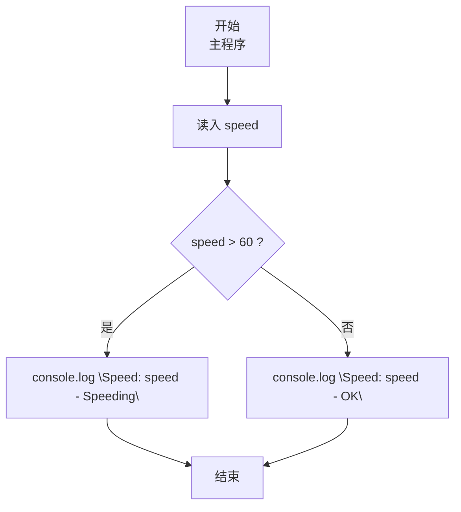
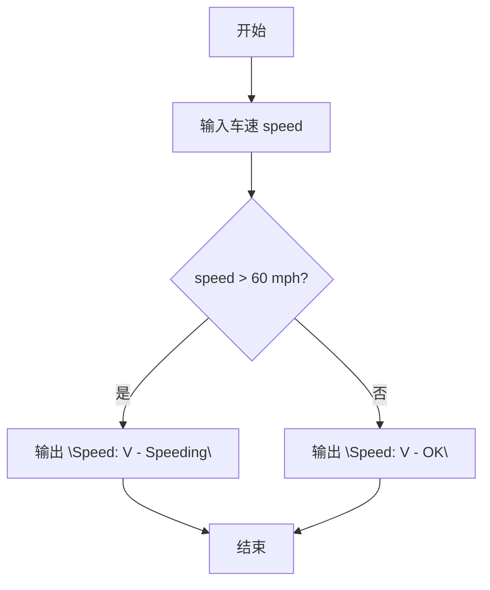

# 7-8 超速判断（JavaScript实现）

## 前言

本文是 PTA 编程题“7-8 超速判断”的题解，涵盖题目描述、输入输出格式及 JavaScript 实现，展示用简单 if-else 分支判断车速是否超过 60 mph 并按指定格式输出。

本题（7-8 超速判断）的主要考点是：准确理解题意、规范处理输入输出格式，并正确处理边界与精度。下面先给出题目描述与格式要求，再通过清晰的思路与可直接运行的javascript实现代码进行讲解。

## 题目描述

模拟交通警察的雷达测速仪。输入汽车速度，如果速度超出60 mph，则显示“Speeding”，否则显示“OK”。

## 输入格式

输入在一行中给出1个不超过500的非负整数，即雷达测到的车速。

## 输出格式

在一行中输出测速仪显示结果，格式为：Speed: V - S，其中V是车速，S或者是Speeding、或者是OK。

## 输入样例1

```in
40
```

## 输入样例2

```in
75
```

## 输出样例1

```out
Speed: 40 - OK
```

## 输出样例2

```out
Speed: 75 - Speeding
```

## 解题思路

这道题的核心是**单条件分支**：速度是否大于 60 mph。

### 核心问题分析

1. **判断条件**：speed > 60 属于超速（60 本身合法）。
2. **输出格式**：固定前缀 `Speed: ` + V + ` - ` + 状态字符串（OK / Speeding）。

### 算法原理说明

直接 if-else：
- if (speed > 60) → `Speed: ${speed} - Speeding`
- else → `Speed: ${speed} - OK`

### 具体计算步骤

1. 用 readline 读取、parseInt 解析 speed
2. speed > 60 ？
   - 是 → console.log Speeding 串
   - 否 → console.log OK 串

## 完整代码

```javascript
// 题目：7-8 超速判断
// 要求：实现「超速判断」（题目 7-8）的输入处理与结果输出。
// 实现原理：
//   1. 判断条件：speed > 60 属于超速（60 本身合法）。
//   2. 输出格式：固定前缀 `Speed: ` + V + ` - ` + 状态字符串（OK / Speeding）。
//   3. 用 readline 读取、parseInt 解析 speed

const readline = require('readline'); // 引入 readline 模块
const rl = readline.createInterface({ input: process.stdin, output: process.stdout }); // 创建输入输出接口

rl.on('line', (line) => { // 监听一行输入
    const speed = parseInt(line.trim(), 10); // 读入车速

    if (speed > 60) { // 如果车速超过60mph
        console.log(`Speed: ${speed} - Speeding`); // 输出超速提示
    } else { // 车速不超过60mph
        console.log(`Speed: ${speed} - OK`); // 输出正常提示
    }

    rl.close(); // 关闭接口
});
```

## 代码流程说明

### 1. 变量与输入
- `speed`；用 readline 读取一行、parseInt 解析非负整数车速。

### 2. 超速判定分支
- **speed > 60** → console.log(`Speed: ${speed} - Speeding`)
- **否则**（speed ≤ 60） → console.log(`Speed: ${speed} - OK`)
- 注意临界值 60 mph 属合法区间。

## 代码流程图



## 解题流程图



## 代码解析

### 变量与输入

```javascript
const readline = require('readline'); // 引入 readline 模块
const rl = readline.createInterface({ input: process.stdin, output: process.stdout }); // 创建输入输出接口
```

变量与输入

### 超速判定分支

```javascript
rl.on('line', (line) => { // 监听一行输入
    const speed = parseInt(line.trim(), 10); // 读入车速
```

超速判定分支


## 复杂度分析

设输入规模为 $n$（对数值类题目为参与运算的数据量，对字符串/序列类题目为长度）。

- **时间复杂度**：$O(n)$ 或 $O(n \log n)$，主要来自一次线性遍历与常数次数学运算，无嵌套高复杂度循环。
- **空间复杂度**：$O(n)$，用于存储输入、中间结果与输出字符串；若仅使用若干标量变量则为 $O(1)$。

## 常见易错点

### 1. 输入/输出格式不符
错误：多余空格、遗漏换行、大小写或精度不符。后果：判题系统判为格式错误。正确：严格按题目要求的格式输出，数值用合适精度。

### 2. 边界条件遗漏
错误：未处理 0、最小值、单字符或空输入等边界。后果：特例 WA。正确：先列出所有边界样例，在编码前单独分支处理。

### 3. 整数溢出与类型
错误：使用过小的整数类型或忽略负号。后果：大数计算溢出。正确：按数据范围选择合适类型，必要时用更大整数类型或字符串处理。

## 更多测试

### 测试一：常规边界

**输入：**

```text
60
```

**输出：**

```text
Speed: 60 - OK
```

### 测试二：特殊用例

**输入：**

```text
500
```

**输出：**

```text
Speed: 500 - Speeding
```

## 总结

本文是 PTA 编程题“7-8 超速判断”的题解，涵盖题目描述、输入输出格式及 JavaScript 实现，展示用简单 if-else 分支判断车速是否超过 60 mph 并按指定格式输出。

本题的核心在于理清「超速判断」的输入输出关系与边界处理：先按格式读取输入，再依据规则逐步计算或遍历，最后按规范输出。该思路可迁移到同类格式化输入输出与模拟计算的题目。
