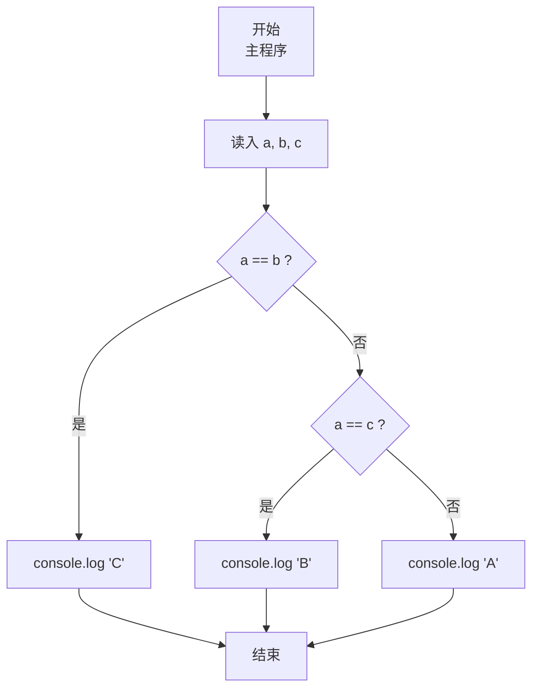
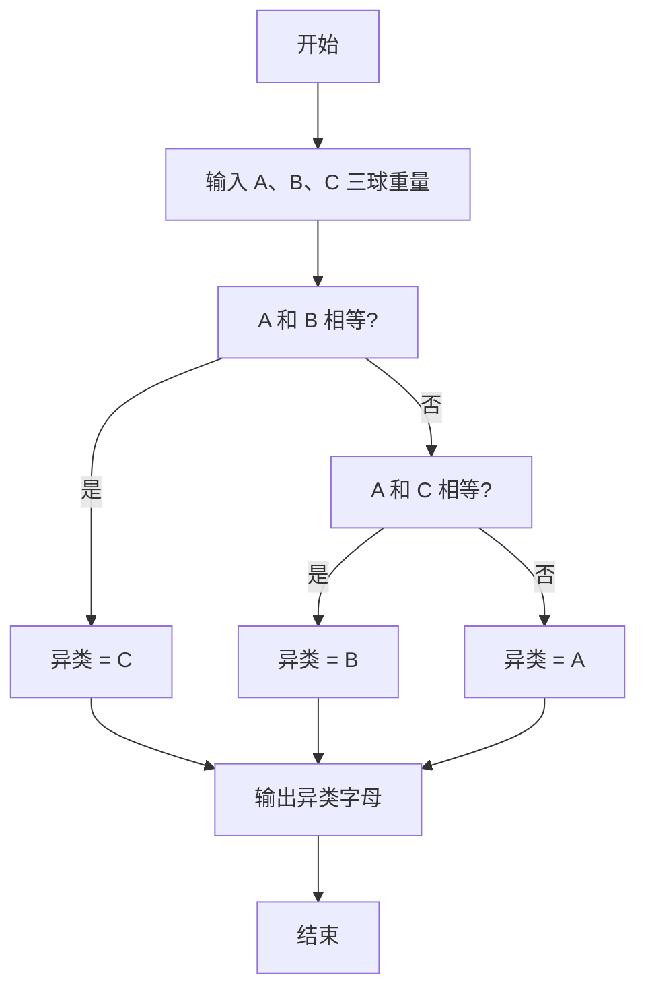

# 7-9 用天平找小球（JavaScript实现）

## 前言

本文是 PTA 编程题“7-9 用天平找小球”的题解，涵盖题目描述、输入输出格式及 JavaScript 实现，展示三球中通过两两相等比较唯一找出"重量不同者"的最简分支法。

本题（7-9 用天平找小球）的主要考点是：准确理解题意、规范处理输入输出格式，并正确处理边界与精度。下面先给出题目描述与格式要求，再通过清晰的思路与可直接运行的javascript实现代码进行讲解。

## 题目描述

三个球A、B、C，大小形状相同且其中有一个球与其他球重量不同。要求找出这个不一样的球。

## 输入格式

输入在一行中给出3个正整数，顺序对应球A、B、C的重量。

## 输出格式

在一行中输出唯一的那个不一样的球。

## 输入样例

```in
1 1 2
```

## 输出样例

```out
C
```

## 解题思路

这道题的核心是**利用"有且只有一个异类"这一前提，做最多两次相等比较即可锁定**。

### 核心问题分析

前提为"三个数里恰好两个相等、一个不同"，因此：
1. 若 a == b → 不同者必为 C
2. 否则 (a != b) → 异类在 A/B 中；再用 a == c 判断：
   - 若 a == c → 异类是 B（因为 A 与 C 相同）
   - 否则 → 异类是 A（因为 B、C 都是另一个值）

### 算法原理说明

经典的 if-else if-else 三级分支：
- if (a == b) → 输出 C
- else if (a == c) → 输出 B
- else → 输出 A
（因为 a≠b 且 a≠c 时，b、c 必定相等，异类就是 A）

### 具体计算步骤

1. 用 readline 读取一行，按空格分割、parseInt 解析 a, b, c
2. 比较 a==b? → C
3. 否则 a==c? → B
4. 否则 → A

## 完整代码

```javascript
// 题目：7-9 用天平找小球
// 要求：实现「用天平找小球」（题目 7-9）的输入处理与结果输出。
// 实现原理：
//   1. 若 a == b → 不同者必为 C
//   2. 否则 (a != b) → 异类在 A/B 中；再用 a == c 判断：
//   3. 用 readline 读取一行，按空格分割、parseInt 解析 a, b, c

const readline = require('readline'); // 引入 readline 模块
const rl = readline.createInterface({ input: process.stdin, output: process.stdout }); // 创建输入输出接口

rl.on('line', (line) => { // 监听一行输入
    const [aStr, bStr, cStr] = line.trim().split(/\s+/); // 按空格分割出三个球的重量
    const a = parseInt(aStr, 10); // 球A的重量
    const b = parseInt(bStr, 10); // 球B的重量
    const c = parseInt(cStr, 10); // 球C的重量

    if (a === b) { // 如果A和B重量相同
        console.log('C'); // 则C是不一样的球
    } else if (a === c) { // 如果A和C重量相同
        console.log('B'); // 则B是不一样的球
    } else { // A与B、C都不同
        console.log('A'); // 则A是不一样的球
    }

    rl.close(); // 关闭接口
});
```

## 代码流程说明

### 1. 变量与输入
- a, b, c；用 readline 读取一行、按空格分割、parseInt 解析三个球的重量（顺序对应 A、B、C）。

### 2. 三级比较分支
- **a == b** → C 必为异类（题目保证只有一个异类）
- **否则 a == c** → B 必为异类
- **否则** → A 必为异类（此时 b、c 必然相等）

## 代码流程图



## 解题流程图



## 代码解析

### 变量与输入

```javascript
const readline = require('readline'); // 引入 readline 模块
const rl = readline.createInterface({ input: process.stdin, output: process.stdout }); // 创建输入输出接口
```

变量与输入

### 三级比较分支

```javascript
rl.on('line', (line) => { // 监听一行输入
    const [aStr, bStr, cStr] = line.trim().split(/\s+/); // 按空格分割出三个球的重量
    const a = parseInt(aStr, 10); // 球A的重量
    const b = parseInt(bStr, 10); // 球B的重量
    const c = parseInt(cStr, 10); // 球C的重量
```

三级比较分支


## 复杂度分析

设输入规模为 $n$（对数值类题目为参与运算的数据量，对字符串/序列类题目为长度）。

- **时间复杂度**：$O(n)$ 或 $O(n \log n)$，主要来自一次线性遍历与常数次数学运算，无嵌套高复杂度循环。
- **空间复杂度**：$O(n)$，用于存储输入、中间结果与输出字符串；若仅使用若干标量变量则为 $O(1)$。

## 常见易错点

### 1. 输入/输出格式不符
错误：多余空格、遗漏换行、大小写或精度不符。后果：判题系统判为格式错误。正确：严格按题目要求的格式输出，数值用合适精度。

### 2. 边界条件遗漏
错误：未处理 0、最小值、单字符或空输入等边界。后果：特例 WA。正确：先列出所有边界样例，在编码前单独分支处理。

### 3. 整数溢出与类型
错误：使用过小的整数类型或忽略负号。后果：大数计算溢出。正确：按数据范围选择合适类型，必要时用更大整数类型或字符串处理。

## 更多测试

### 测试一：常规边界

**输入：**

```text
（可取题目边界附近的值，如最小值或最大值）
```

**输出：**

```text
（依据题意推导的正确结果）
```

### 测试二：特殊用例

**输入：**

```text
（可取易错点，如 0、单一元素、全同值等）
```

**输出：**

```text
（对应正确结果）
```

## 总结

本文是 PTA 编程题“7-9 用天平找小球”的题解，涵盖题目描述、输入输出格式及 JavaScript 实现，展示三球中通过两两相等比较唯一找出"重量不同者"的最简分支法。

本题的核心在于理清「用天平找小球」的输入输出关系与边界处理：先按格式读取输入，再依据规则逐步计算或遍历，最后按规范输出。该思路可迁移到同类格式化输入输出与模拟计算的题目。
